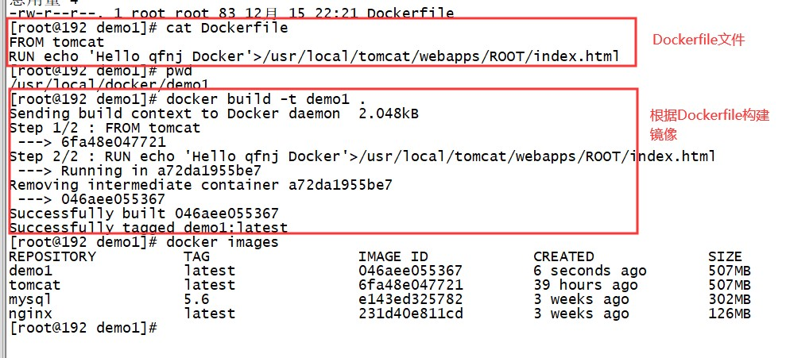

# Docker定制镜像

> 当我们从docker镜像仓库中下载的镜像不能满足我们的需求时，我们可以通过以下两种方式对镜像进行更改。
>
> 1. 从已经创建的容器中更新镜像，并且提交这个镜像
> 2. 使用 Dockerfile 指令来创建一个新的镜像

1. 对于开发人员，可以为开发团队提供一个完全一致的开发环境
2. 对于测试人员，可以直接拿开发时所构建的镜像测试。
3. 对于运维人员，在部署时，可以实现快速部署、移值。

## Dockerfile 定制镜像

镜像的定制实际上就是定制每一层所添加的配置、文件。**如果我们可以把每一层修改、安装、构建、操作的命令都写入一个脚本，用这个脚本来构建、定制镜像**，那么之前提及的无法重复的问题、镜像构建透明性的问题、体积的问题就都会解决。这个脚本就是 ***Dockerfile***。

Dockerfile 是一个文本文件，其内包含了一条条的指令(Instruction)，每一条指令构建一层，因此每一条指令的内容，就是描述该层应当如何构建。

## Dockerfile常用命令

### FROM

**指定基础镜像**

> 基础镜像不存在会在Docker Hub上拉去(一般会是文件的第一个指令) 使用格式：
> FROM <镜像>:[tag]
> FROM <镜像>@digest[校验码] 当前主机没有此镜像时，会自动去官网HUB下载

### MAINTAINER

**提供Dockerfile 制作者提供本人信息**

> [逐渐废弃] LABLE --替代MAINTANIER 具体使用： LABLE maintainer="作者信息"

使用格式

```Dockerfile
MAINTANIER "xuxiaomo <xuxiaomo@aliyun.com>"
LABEL maintainer="xuxiaomo@aliyun.com"
LABEL "com.example.vendor"="ACME Incorporated"
LABEL com.example.label-with-value="foo"
LABEL version="1.0"
LABEL description="This text illustrates \
that label-values can span multiple lines."
```

### ENV

> ENV指令可以用于为docker容器设置环境变量 ENV设置的环境变量，可以使用 `docker inspect` 命令来查看。同时还可以使用`docker run --env =`来修改环境变量。

```Dockerfile
具体用法：
ENV JAVA_HOME /usr/local/jdk
ENV JRE_HOME $JAVA_HOME/jre
ENV CLASSPATH $JAVA_HOME/lib/:$JRE_HOME/lib/
ENV PATH $PATH:$JAVA_HOME/bin/
```

### USER

> 用来切换运行属主身份的。Docker 默认是使用 root，但若不需要，建议切换使用者身分，毕竟 root 权限太大了，使用上有安全的风险。

### WORKDIR

**WORKDIR 用来切换工作目录的**

> Docker 默认的工作目录是/，只有 RUN 能执行 cd 命令切换目录，而且还只作用在当下下的 RUN，也就是说每一个 RUN 都是独立进行的。
>
> 如果想让其他指令在指定的目录下执行，就得靠 WORKDIR。WORKDIR 动作的目录改变是持久的，不用每个指令前都使用一次 WORKDIR。

```Dockerfile
WORKDIR /usr/local/tomcat/
```

### VOLUME

创建一个可以从本地主机或其他容器挂载的挂载点，一般用来存放数据库和需要保持的数据等

> 卷
>
> 只能定义docker管理的卷： VOLUME /data/mysql运行的时候会随机在宿主机的目录下生成一个卷目录！

### COPY

**把宿主机中的文件复制到镜像中去**

> 文件要在Dockerfile工作目录 src 原文件 --支持通配符 --通常相对路径 dest 目标路径
> --通常绝对路径

### ADD

**类似COPY命令**

> ADD 将文件从路径 复制添加到容器内部路径
>
>必须是想对于源文件夹的一个文件或目录，也可以是一个远程的url。
>是目标容器中的绝对路径。 所有的新文件和文件夹都会创建UID 和 GID。事实上如果 是一个远程文件URL，那么目标文件的权限将会是 600 。

### EXPOSE

**为容器打开指定要监听的端口以实现与外部通信**

> 使用格式： EXPOSE 80/tcp 23/udp
> 不加协议默认为tcp
> 使用-P选项可以暴露这里指定的端口！ 但是宿主的关联至这个端口的端口是随机的！

### RUN

RUN 指令是用来执行命令行命令的。由于命令行的强大能力，RUN 指令在定制镜像时是最常用的指令之一。其格式有两种：

- shell 格式：RUN <命令>，就像直接在命令行中输入的命令一样。刚才写的 Dockerfile 中的 RUN 指令就是这种格式。
- exec 格式：RUN ["可执行文件", "参数1", "参数2"]，这更像是函数调用中的格式。

> 使用格式： RUN RUN ["","",""]

`RUN` 就像 Shell 脚本一样可以执行命令，那么我们是否就可以像 Shell 脚本一样把每个命令对应一个 RUN 呢？比如这样：

```Dockerfile
RUN apt-get update
RUN apt-get install -y gcc libc6-dev make
RUN wget http://download.redis.io/releases/redis-4.0.1.tar.gz
RUN tar xzf redis-4.0.1.tar.gz
RUN cd redis-4.0.
```

Dockerfile 中每一个指令都会建立一层，RUN 也不例外。每一个 RUN 的行为，和刚才我们手工建立镜像的过程一样：新建立一层，在其上执行这些命令，执行结束后，commit 这一层的修改，构成新的镜像。 而上面的这种写法，创建了 多 层镜像。这是完全没有意义的，而且很多运行时不需要的东西，都被装进了镜像里，比如编译环境、更新的软件包等等。结果就是产生非常臃肿、非常多层的镜像，不仅仅增加了构建部署的时间，也很容易出错。 这是很多初
学 Docker 的人常犯的一个错误。

Union FS 是有最大层数限制的，比如 AUFS，曾经是最大不得超过 42 层，现在是不得超过 127 层。上面的 Dockerfile正确的写法应该是这样：

```Dockerfile
FROM centos

RUN apt-get update \
    && apt-get install -y gcc libc6-dev make \
    && wget http://download.redis.io/releases/redis-4.0.1.tar.gz \
    && tar xzf redis-4.0.1.tar.gz \
    && cd redis-4.0.
```

首先，之前所有的命令只有一个目的，就是编译、安装 redis 可执行文件。因此没有必要建立很多层，这只是一层的事情。因此，这里没有使用很多个 RUN 对一一对应不同的命令，而是仅仅使用一个 RUN 指令，并使用 && 将各个所
需命令串联起来。将之前的 7 层，简化为了 1 层。在撰写 Dockerfile 的时候，要经常提醒自己，这并不是在写 Shell脚本，而是在定义每一层该如何构建。 并且，这里为了格式化还进行了换行。Dockerfile 支持 Shell 类的行尾添加 \ 的命令换行方式，以及行首 # 进行注释的格式。良好的格式，比如换行、缩进、注释等，会让维护、排障更为容易，这是一个比较好的习惯。

## 案例 1

还以之前定制 tomcat镜像为例，这次我们使用 Dockerfile 来定制

需求：创建一个镜像（基于tomcat）里面要有一个index.html，并写入Hello xuxiaomo-nginx Docker

1. 在宿主机创建一空白目录

    ```sh
    mkdir -p /usr/local/docker/demo
    ```

2. 在该目录下，创建一文件Dockerfile

    ```sh
    vim Dockerfile
    ```

3. 其内容为

    ```Dockerfile
    FROM tomcat //指定tomcat最新版本镜像
    RUN echo 'Hello xuxiaomo-nginx Docker'>/usr/local/tomcat/webapps/ROOT/index.html
    ```

    **这个 Dockerfile 很简单，一共就两行。涉及到了两条指令，`FROM` 和 `RUN`。**
4. 构建镜像

    ```sh
    docker build -t demo.
    ```

5. 运行镜像所在容器

    ```sh
    docker run --rm --name demo1-8080 -p 8080:8080 -d demo
    ```

    访问浏览器即可成功该问

## 构建镜像Build

回到之前定制的 tomcat 镜像的 Dockerfile 来。现在我们明白了这个Dockerfile 的内容，那么让我们来构建这个镜像吧。

在 `Dockerfile` 文件所在目录执行：

```sh
docker build -t demo.
```



从命令的输出结果中，我们可以清晰的看到镜像的构建过程

`docker build` 命令进行镜像构建。其格式为：

```sh
docker build [选项] <上下文路径/URL/->
docker build -t demo1. //. 代表Dockerfile上下文路径
```

> - -t ：指定要创建的目标镜像名
> - . ：Dockerfile 文件所在目录，可以指定Dockerfile 的绝对路径

在这里我们指定了最终镜像的名称 `- t demo`，构建成功后，我们可以像之前运行 `tomcat` 那样来运行这个镜像，其结果会和 `tomcat` 一样。(如果有版本号名称：demo:01)

## 案例 2

案例：基于上一个镜像（基于tomcat）将ROOT内多余的文件都删除。只保留index.html

> WORKDIR 指定工作目录 的掌握和练习

1. 基于如上修改Dockerfile

    ```Dockerfile
    FROM tomcat //指定tomcat最新版本镜像
    WORKDIR /usr/local/tomcat/webapps/ROOT/ //切换到该目录下
    RUN rm -rf * //将当前目录的文件都删掉
    RUN echo 'Hello xuxiaomo-nginx Docker'>/usr/local/tomcat/webapps/ROOT/index.html
    ```

    WORKDIR 用来切换工作目录的。而不是用RUN。

2. 构建镜像

    ```sh
    docker build –t 镜像名. //Dockerfile上下文路径
    ```

3. 查看镜像列表docker images

    如果镜像名称有

4. 删除虚拟镜像

    ```sh
    docker image prune
    ```

## 案例 3

案例：基于上一个镜像（基于tomcat）外部复制一个文件(图片)，并复制到容器中并能访问

1. 基于如上修改Dockerfile

    ```Dockerfile
    FROM tomcat //指定tomcat最新版本镜像
    WORKDIR /usr/local/tomcat/webapps/ROOT/ //切换到该目录下
    RUN rm -rf * //将当前目录的文件都删掉
    COPY 1.png /usr/local/tomcat/webapps/ROOT/
    RUN echo 'Hello xuxiaomo-nginx Docker'>/usr/local/tomcat/webapps/ROOT/index.html
    ```

    WORKDIR 用来切换工作目录的。而不是用RUN。

2. 构建镜像

    ```sh
    docker build –t 镜像名. //Dockerfile上下文路径
    ```

    > COPY 格式：
    >
    > - COPY <源路径>... <目标路径>
    > - COPY ["<源路径1>",... "<目标路径>"]
    > 和 RUN 指令一样，也有两种格式，一种类似于命令行，一种类似于函数调用。
    > COPY 指令将从构建上下文目录中 <源路径> 的文件/目录复制到新的一层的镜像内的 <目标路径> 位置。比如：COPY xuxiaomo.png /usr/local/tomcat/webapps/ROOT/
    > <目标路径> 可以是容器内的绝对路径，也可以是相对于工作目录的相对路径（工作目录可以用 WORKDIR指令来指定）。目标路径不需要事先创建，如果目录不存在会在复制文件前先行创建缺失目录。
    > 此外，还需要注意一点，使用 COPY 指令，源文件的各种元数据都会保留。比如读、写、执行权限、文件变更时间等。这个特性对于镜像定制很有用。特别是构建相关文件都在使用 Git 进行管理的时候。

## 案例 4

实际开发中，利用Dockerfile 将一个war包生成镜像的Dockerfile:

1. docker下创建项目工程名称

    ```sh
    mkdir -p /usr/local/docker/xuxiaomo_exam
    cd /usr/local/docker/xuxiaomo_exam
    ```

2. 将桌面xuxiaomo_exam.zip复制到访目录下

    ```sh
    cp xuxiaomo_exam-1.0-SNAPSHOT.zip /usr/local/docker/xuxiaomo_exam/
    ```

3. 创建镜像文件Dockerfile
    

4. 构建镜像

    ```sh
    docker build -t xuxiaomo_exam.
    ```

5. 进入镜像内查看

    ```sh
    docker run -it xuxiaomo_exam bash
    ```

# Docker部署springboot项目

## 准备springboot jar项目

### Dockerfile

```Dockerfile
FROM java:
VOLUME /tmp
ADD exam-0.0.1-SNAPSHOT.jar exam.jar
EXPOSE 8080
ENTRYPOINT ["java","-Djava.security.egd=file:/dev/./urandom","-jar","/exam.jar"]
```

> FROM：表示基础镜像，即运行环境
>
> VOLUME /tmp创建/tmp目录并持久化到Docker数据文件夹，因为Spring Boot使用的内嵌Tomcat容器默认使用/tmp作为工作目录
>
> ADD：拷贝文件并且重命名(ADD exam-0.0.1-SNAPSHOT.jar exam.jar 将应用jar包复制到/exam.jar)
>
> EXPOSE：并不是真正的发布端口，这个只是容器部署人员与建立image的人员之间的交流，即建立image的人员告诉容器布署人员容器应该映射哪个端口给外界
>
> ENTRYPOINT：容器启动时运行的命令，相当于我们在命令行中输入java -jar xxxx.jar，为了缩短 Tomcat 的启动时间，添加java.security.egd的系统属性指向/dev/urandom作为 ENTRYPOINT

### 构建容器

```sh
docker build -t exam.
```

### 运行容器

```sh
docker run --rm -d --name 容器名称 -p 8080:8080 镜像名称
```

> 其中-d表示后台运行容器，这也就自然地解决的Spring Boot不支持后台运行应用程序的问题。
>
> -p 8080:8080表示将容器内部的 8080 端口映射到宿主机器的 8080 端口，这样就可以通过宿主机器直接访问应用。
>
> --name 给容器取一个容易记住的名字方便日后管理。

### 查看运行日志

```sh
docker logs -f --tail=100 容器名称
```
