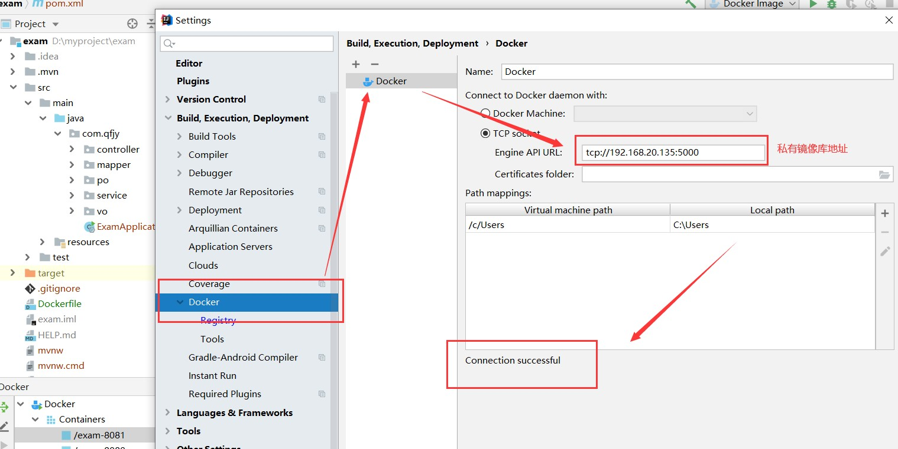
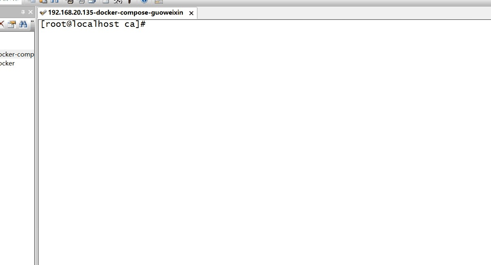
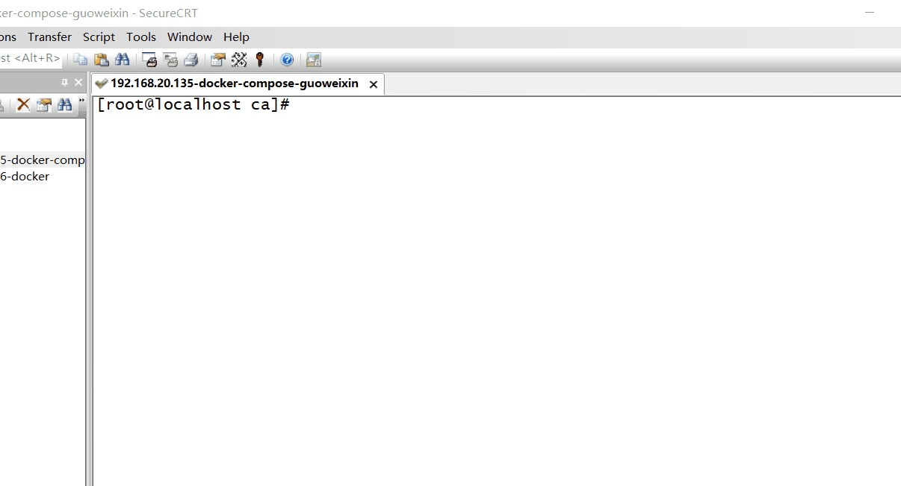
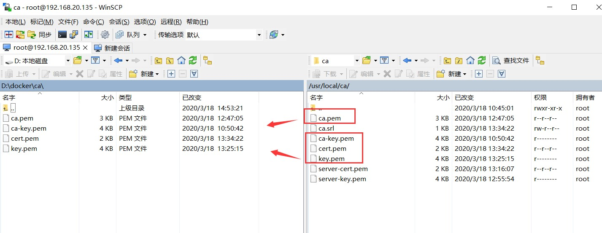
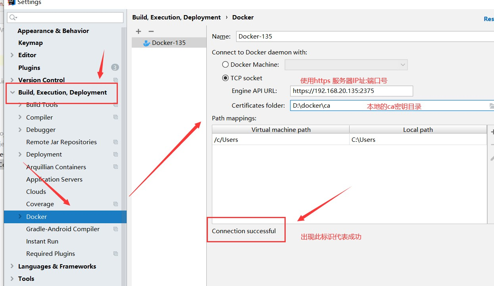

# 一、Idea集成docker实现镜像打包一键部署

## 1 、Docker开启远程访问

```sh
#修改该Docker服务文件
vi /lib/systemd/system/docker.service
#修改ExecStart这行
ExecStart=/usr/bin/dockerd - H tcp://0.0.0.0: 2375 - H unix:///var/run/docker.sock
```

> 将文件内的 ExecStart注释。 新增如上行
>
> #ExecStart=/usr/bin/dockerd -H fd:// --containerd=/run/containerd/containerd.sock ExecStart=/usr/bin/dockerd -H tcp://0.0.0.0:2375-H unix:///var/run/docker.sock

```sh
#重新加载配置文件
systemctl daemon-reload
#重启服务
systemctl restart docker.service
#查看端口是否开启
netstat - nlpt #如果找不到netstat命令，可进行安装。yum install net-tools
#直接curl看是否生效
curl http://127.0.0.1: 2375 /info
```

## 2 、IDEA安装Docker插件

> 打开Idea，从File->Settings->Plugins->Install JetBrains plugin进入插件安装界面
> 在搜索框中输入docker，可以看到Docker integration，点击右边的Install按钮进行安装
> 安装后重启Idea

## 3 、IDEA配置docker

配置docker，连接到远程docker服务

从File->Settings->Build,Execution,Deployment->Docker打开配置界面


**连接成功后，在IDEA工具中即可 操作Docker**


## 4 、docker-maven-plugin

传统过程中，打包、部署、等

而在持续集成过程中，项目工程一般使用 Maven 编译打包，然后生成镜像，通过镜像上线，能够大大提供上线效率，同时能够快速动态扩容，快速回滚，着实很方便。docker-maven-plugin 插件就是为了帮助我们在Maven工程中，通过**简单的配置，自动生成镜像并推送到仓库**中

### pom.xml

```xml
<properties>
<docker.image.prefix>xuxiaomo</docker.image.prefix>
</properties>

<build>
<plugins>
<plugin>
<groupId>org.springframework.boot</groupId>
<artifactId>spring-boot-maven-plugin</artifactId>
<version>1.0.0</version>
</plugin>

<plugin>
<groupId>com.spotify</groupId>
<artifactId>docker-maven-plugin</artifactId>
<version>1.0.0</version>

<configuration>
<!-- 镜像名称 xuxiaomo/exam-->
<imageName>${docker.image.prefix}/${project.artifactId}</imageName>
<!--指定标签-->
<imageTags>
<imageTag>latest</imageTag>
</imageTags>
<!-- 基础镜像jdk 1.8-->
<baseImage>java</baseImage>
<!-- 制作者提供本人信息 -->
<maintainer>xuxiaomo xuxiaomo@aliyun.com</maintainer>
<!--切换到/ROOT目录 -->
<workdir>/ROOT</workdir>
<cmd>["java", "-version"]</cmd>
<entryPoint>["java", "-jar", "${project.build.finalName}.jar"]</entryPoint>

<!-- 指定 Dockerfile 路径
<dockerDirectory>${project.basedir}/src/main/docker</dockerDirectory>
-->

<!--指定远程 docker api地址-->
<dockerHost>http://192.168.20.135:2375</dockerHost>

<!-- 这里是复制 jar 包到 docker 容器指定目录配置 -->
<resources>
<resource>
<targetPath>/ROOT</targetPath>
<!--用于指定需要复制的根目录，${project.build.directory}表示target目录-->
<directory>${project.build.directory}</directory>
<!--用于指定需要复制的文件。${project.build.finalName}.jar指的是打包后的jar
包文件。-->
<include>${project.build.finalName}.jar</include>
</resource>
</resources>
</configuration>

</plugin>

</plugins>
</build>
```

### Dockerfile

如上用docker-maven插件 自动生成如下文件

```Dockerfile
FROM java
MAINTAINER xuxiaomo <xuxiaomo@aliyun.com>
WORKDIR /ROOT
ADD /ROOT/qfnj-0.0.1-SNAPSHOT.jar /ROOT/
ENTRYPOINT ["java", "-jar", "qfnj-0.0.1-SNAPSHOT.jar"]
CMD ["java", "-version"]
```

## 5 、执行命令

对项目进行 打包。并构建镜像 到Docker 上

```sh
mvn clean package docker:build
```

## 6 、IDEA 操作Docker

## 7 、扩展配置

绑定Docker 命令到 Maven 各个阶段

> 我们可以绑定 Docker 命令到 Maven 各个阶段
>
> 我们可以把 Docker 分为 build、tag、push，然后分别绑定 Maven 的 package、deploy 阶段
>
> 我们只需要执行`mvn deploy`就可以完成整个 build、tag、push操作了，当我们执行`mvn build`就只完成 build、tag 操作

```xml
<executions>
<!--当执行mvn package 时，执行： mvn clean package docker:build -->
<execution>
<id>build-image</id>
<phase>package</phase>
<goals>
<goal>build</goal>
</goals>
</execution>
<!--当执行mvn package 时，会对镜像进行 标签设定-->
<execution>
<id>tag-image</id>
<phase>package</phase>
<goals>
<goal>tag</goal>
</goals>
<configuration>
<image>${docker.image.prefix}/${project.artifactId}:latest</image>
<newName>docker.io/${docker.image.prefix}/${project.artifactId}:${project.version}
</newName>
</configuration>
</execution>
<execution>
<id>push-image</id>
<phase>deploy</phase>
<goals>
<goal>push</goal>
</goals>
<configuration>
<imageName>docker.io/${docker.image.prefix}/${project.artifactId}:${project.version}
</imageName>
</configuration>
</execution>
</executions>
```

**完整pom.xml如下**

```xml
<properties>
<java.version>1.8</java.version>
<!-- 镜像 前缀姓名-->
<docker.image.prefix>xuxiaomo</docker.image.prefix>
</properties>
<dependencies>
<dependency>
<groupId>org.springframework.boot</groupId>
<artifactId>spring-boot-starter-web</artifactId>
</dependency>
.....................
</dependencies>

<build>
<plugins>
<plugin>
<groupId>org.springframework.boot</groupId>
<artifactId>spring-boot-maven-plugin</artifactId>
</plugin>

<plugin>
<groupId>com.spotify</groupId>
<artifactId>docker-maven-plugin</artifactId>
<version>1.0.0</version>

<configuration>
<!-- 镜像名称 xuxiaomo/exam-->
<imageName>${docker.image.prefix}/${project.artifactId}</imageName>
<!--指定标签-->
<imageTags>
<imageTag>latest</imageTag>
</imageTags>
<!-- 基础镜像jdk 1.8-->
<baseImage>java</baseImage>
<!-- 制作者提供本人信息 -->
<maintainer>xuxiaomo xuxiaomo@aliyun.com</maintainer>
<!--切换到/ROOT目录 -->
<workdir>/ROOT</workdir>
<cmd>["java", "-version"]</cmd>
<entryPoint>["java", "-jar", "${project.build.finalName}.jar"]</entryPoint>

<!-- 指定 Dockerfile 路径
<dockerDirectory>${project.basedir}/src/main/docker</dockerDirectory>
-->

<!--指定远程 docker api地址
此处未加CA加密认证。
-->
<dockerHost>http://192.168.20.135:2375</dockerHost>

<!-- 这里是复制 jar 包到 docker 容器指定目录配置 -->
<resources>
<resource>
<targetPath>/ROOT</targetPath>
<!--用于指定需要复制的根目录，${project.build.directory}表示target目录-->
<directory>${project.build.directory}</directory>
<!--用于指定需要复制的文件。${project.build.finalName}.jar指的是打包后的jar
包文件。-->
<include>${project.build.finalName}.jar</include>
</resource>
</resources>
</configuration>

<!--当执行mvn package 时，执行： mvn clean package docker:build -->
<executions>
<execution>
<id>build-image</id>
<phase>package</phase>
<goals>
<goal>build</goal>
</goals>
</execution>
</executions>

</plugin>

</plugins>
</build>
```

## 总结

当我们执行`mvn package`时，执行 build、tag 操作

当执行`mvn deploy`时，执行build、tag、push 操作

如果我们想跳过 docker 某个过程时，只需要

- `DskipDockerBuild` 跳过 build 镜像
- `DskipDockerTag` 跳过 tag 镜像
- `DskipDockerPush` 跳过 push 镜像
- `DskipDocker` 跳过整个阶段

例如：我们想执行 package 时，跳过 tag 过程，那么就需要`mvn package -DskipDockerTag`

# 二、Idea整合Docker CA加密认证

前面提到的配置是允许所有人都可以访问的，因为docker默认是root权限的，把 2375 端口暴露在外面，意味着别人随时都可以提取到你服务器的root权限，是很容易被黑客黑的，因此,docker官方推荐使用加密的tcp连接，以Https的方式与客户端建立连接

**官方示例Demo**

<https://docs.docker.com/engine/security/https/#create-a-ca-server-and-client-keys-with-openssl>

## Docker认证命令配置

### 1 创建ca文件夹，存放CA私钥和公钥

```sh
mkdir -p /usr/local/ca
cd /usr/local/ca/
```

### 2 生成CA私钥和公钥

在Docker守护进程的主机上，生成CA私钥和公钥

```sh
openssl genrsa -aes256 -out ca-key.pem 4096
```


### 3 依次输入密码、国家、省、市、组织名称、邮箱等

xuxiaomo cn nmg cf xuxiaomo-demo <1440023258@qq.com>

```sh
openssl req -new -x509 -days 365 -key ca-key.pem -sha256 -out ca.pem
```



> 现在已经有了CA，接下来创建一个服务器密钥和证书签名请求(CSR)。确保“公用名”与你用来连接到Docker的主机名匹配

### 4 生成server-key.pem

```sh
openssl genrsa -out server-key.pem 4096
```

### 5 CA来签署公钥

> 由于TLS连接可以通过IP地址和DNS名称进行，所以在创建证书时需要指定IP地址。例如，允许使用10.10.10和127.0.0.1进行连接
>
> $Host换成你自己服务器外网的IP或者域名

```sh
openssl req -subj "/CN=$HOST" -sha256 -new -key server-key.pem -out server.csr
比如
openssl req -subj "/CN=192.168.20.135" -sha256 -new -key server-key.pem -out server.csr
或
openssl req -subj "/CN=www.javaqf.com" -sha256 -new -key server-key.pem -out server.csr
```

```sh
本地是局域网：
openssl req -subj "/CN=192.168.20.135" -sha256 -new -key server-key.pem -out server.csr
```

### 6 配置白名单

> 1 允许指定ip可以连接到服务器的docker，可以配置ip，用逗号分隔开
>
> 2 因为已经是ssl连接，所以我推荐配置0.0.0.0,也就是所有ip都可以连接(但只有拥有证书的才可以连接成功)，这样配置好之后公司其他人也可以使用

```sh
如果填写的是ip地址 命令如下 echo subjectAltName = IP:$HOST,IP:0.0.0.0 >> extfile.cnf
如果填写的是域名 命令如下 echo subjectAltName = DNS:$HOST,IP:0.0.0.0 >> extfile.cnf
```

`上面的$Host依旧是你服务器外网的IP或者域名，请自行替换`

```sh
echo subjectAltName = IP:192.168.20.135,IP:0.0.0.0 >> extfile.cnf
```

### 7 执行命令

将Docker守护程序密钥的扩展使用属性设置为仅用于服务器身份验证

```sh
echo extendedKeyUsage = serverAuth >> extfile.cnf
```

### 8 生成签名证书

```sh
openssl x509 -req -days 365 -sha256 -in server.csr -CA ca.pem -CAkey ca-key.pem \
-CAcreateserial -out server-cert.pem -extfile extfile.cnf
```



### 9 生成客户端的key.pem

```sh
openssl genrsa -out key.pem 4096
```

```sh
openssl req -subj '/CN=client' -new -key key.pem -out client.csr
```

### 10 要使密钥适合客户端身份验证

创建扩展配置文件

```sh
echo extendedKeyUsage = clientAuth >> extfile.cnf
```

```sh
echo extendedKeyUsage = clientAuth > extfile-client.cnf
```

### 11 现在，生成签名证书

```sh
openssl x509 -req -days 365 -sha256 -in client.csr -CA ca.pem -CAkey ca-key.pem \
-CAcreateserial -out cert.pem -extfile extfile-client.cnf
```

生成cert.pem,需要输入前面设置的密码

### 12 删除不需要的文件，两个证书签名请求

生成cert.pem和server-cert之后。您可以安全地删除两个证书签名请求和扩展配置文件

```sh
rm -v client.csr server.csr extfile.cnf extfile-client.cnf
```

### 13 可修改权限

要保护您的密钥免受意外损坏，请删除其写入权限。要使它们只能被您读取，更改文件模式

```sh
chmod -v 0400 ca-key.pem key.pem server-key.pem
```

证书可以是对外可读的，删除写入权限以防止意外损坏

```sh
chmod -v 0444 ca.pem server-cert.pem cert.pem
```

### 14 归集服务器证书

```sh
cp server-*.pem /etc/docker/
cp ca.pem /etc/docker/
```

### 15 修改Docker配置

使Docker守护程序仅接受来自提供CA信任的证书的客户端的连接

```sh
vim /lib/systemd/system/docker.service

将
ExecStart=/usr/bin/dockerd
替换为：
ExecStart=/usr/bin/dockerd --tlsverify --tlscacert=/usr/local/ca/ca.pem --
tlscert=/usr/local/ca/server-cert.pem --tlskey=/usr/local/ca/server-key.pem -H tcp://0.0.0.0:2375 -
H unix:///var/run/docker.sock
```

### 16 重新加载daemon并重启docker

```sh
systemctl daemon-reload
```

```sh
systemctl restart docker
```

### 17 开放 2375 端口

```sh
/sbin/iptables -I INPUT -p tcp --dport 2375 -j ACCEPT
```

### 18 重启Docker

```sh
systemctl restart docker
```

## IDEA操作Docker

### 1 保存相关客户端的pem文件到本地



### 2 IDEA CA配置


