# CICD - 持续集成与持续交付

## 持续集成 CI

什么是持续集成？（CI：Continuous Integration）

> 软件开发中，集成是一个很可能发生未知错误的过程。持续集成是一种软件开发实践，希望团队中的成员频繁提交代码到代码仓库，且每次提交都能通过自动化测试进行验证，从而使问题尽早暴露和解决

持续集成的好处是什么？

> 持续集成可以使问题尽早暴露，从而也降低了解决问题的难度，正如老马所说，持续集成无法消除bug，但却能大大降低修复的难度和时间

## 持续交付 CD

什么是持续交付？（CD：Continuous Delivery）

> 持续交付是持续集成的扩展，指的是将通过自动化测试的软件部署到产品环境。持续交付的本质是把每个构建成功的应用更新交付给用户使用。在持续交付的世界里，我们对完成的定义不是测试完成，而是交付到客户手中。这里需要注意的是，CD代表持续交付（Continuous Delivery）而不是持续部署（Continuous Deploy），因为部署也包括部署到测试环境，而持续交付代表的是功能的上线，交付给用户使用

持续交付的好处是什么？

> 持续交付的好处在于快速获取用户反馈；适应市场变化和商业策略的变化。开发团队保证每次提交的修改都是可上线的修改，那么决定何时上线，上线哪部分功能则完全由产品业务团队决定
>
> 虽然持续交付有显著的优点，但也有不成立的时候，比如对于嵌入式系统的开发，往往需要软硬件的配合

# 基于Docker+Jenkins+Gitlab搭建持续集成环境

| 主机 | 服务 |
| --- | --- |
| server1 | GitLab (至少需要4G内存) 一般需要独立的服务器。下面教程用GitHub |
| server2 | Jenkins+Docker |

# 一、搭建GitLab服务器

gitlab是一款类似于github的源码管理平台，而且是开源的，一般公司的内部的代码处于保密都不会放到第三方平台上面，这时候就需要公司内部搭建源码管理平台，gitlab的功能堪称完整和强大也具备CI/CD的功能

## 一、指定目录文件

```sh
mkdir -p /opt/data/gitlab && cd /opt/data/gitlab
```

## 二、我们使用 Docker 来安装和运行 GitLab 中文版，`docker-compose.yml` 配置如下

```yml
version: '3'
services:
gitlab:
image: 'twang2218/gitlab-ce-zh:11.1.4' # gitlab/gitlab-ce:latest
restart: always
container_name: "gitlab"
#privileged: true #特权模式
hostname: 'gitlab'
environment:
TZ: 'Asia/Shanghai'
GITLAB_OMNIBUS_CONFIG: |
external_url 'http://192.168.20.139'
gitlab_rails['time_zone'] = 'Asia/Shanghai'
gitlab_rails['gitlab_shell_ssh_port'] = 58522
gitlab_rails['smtp_enable'] = true
ports:
- '80:80' #阿里云服务器端口改为 8086
- '443:443'
- '58522:22'
volumes:
- /opt/gitlab/config:/etc/gitlab
- /opt/gitlab/data:/var/opt/gitlab
- /opt/gitlab/logs:/var/log/gitlab
```

## 三、执行docker-compose命令进行安装

```sh
docker-compose up -d
```

## 四、查看输出的日志，需要等待几分钟就可以安装完成了

```sh
docker-compose logs -f
```

## 五 、启动页面并设置用户名密码

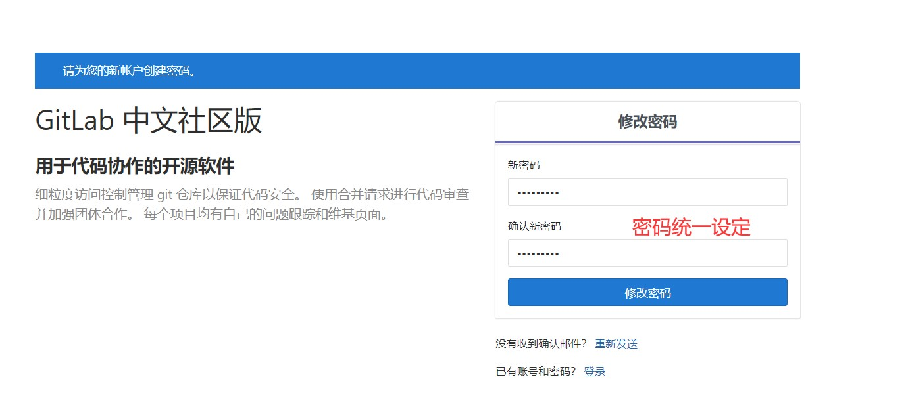
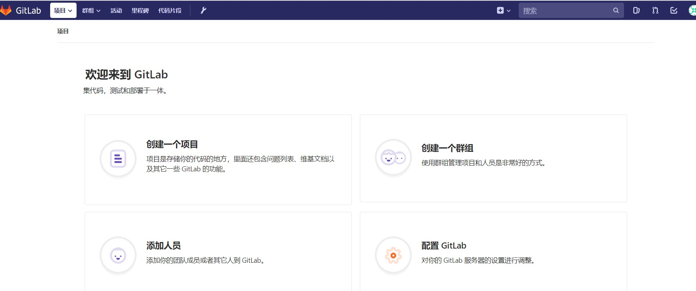

## GitLab应用

> GitLab的应用操作和GitHub的应用一样

### GitLab集成IDEA

首先打开IntelliJ IDEA，点击左上角菜单File，然后弹出的菜单中选择Settings

然后在左边的菜单中选择Plugins，这时候右边会有一个搜索框，输入gitlab,然后回车搜索

找到GitLab Project，点击install，这时候会有一个二次确认框，点击Accept，然后等待安装完成

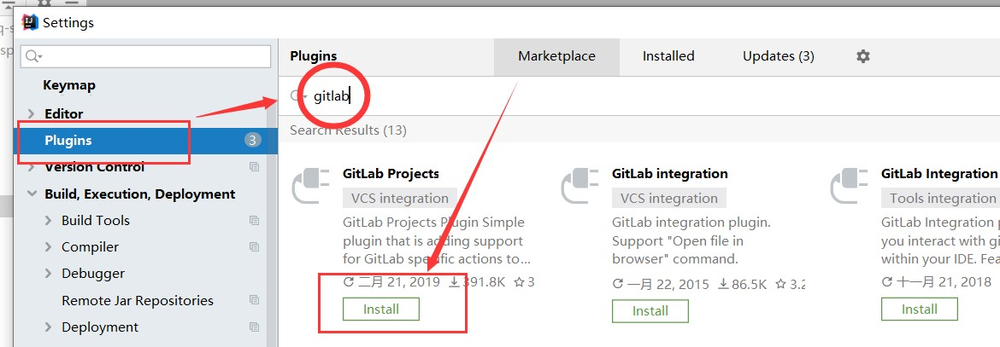

安装完成之后如下，点击Restart IDE，这时候也会有一个二次确认框，点击Restart，重启

### 配置GitLab

点击File => Settings => Version Control => GitLab

这里面主要配置GitLab Server Url和个人的私有访问token，如下

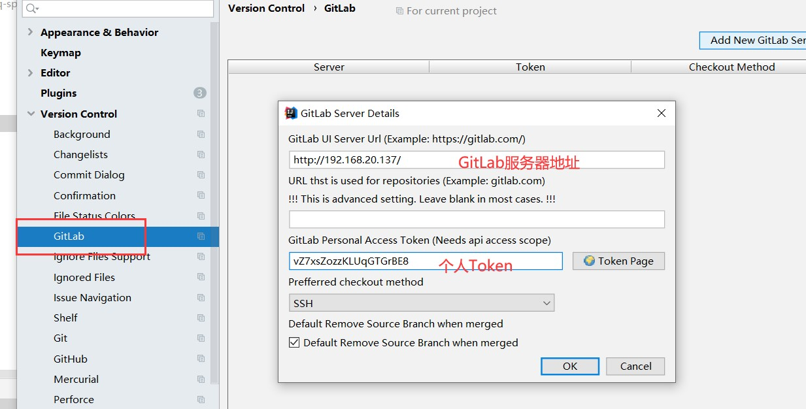

GitLab中获得的Token

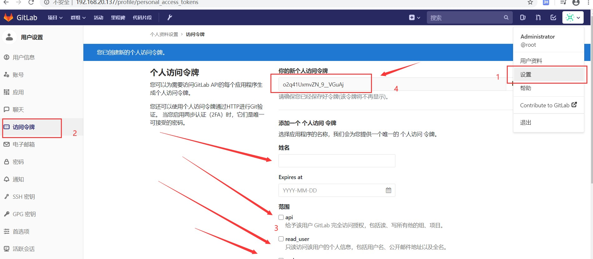

# 二、Jenkins安装

> Jenkins是一个开源软件项目，是基于Java开发的一种持续集成工具，用于监控持续重复的工作，旨在提供一个开放易用的软件平台，使软件的持续集成变成可能

官网

```markup
https://www.jenkins.io/zh/
```

## Docker 安装

```sh
# 1 安装
docker pull jenkins
# 2 运行
docker run -d -p 8002 :8080 -v ~/jenkins:/var/jenkins_home --name jenkins --restart=always jenkins
```

## Docker-compose 安装（此处安装）

```sh
#1 指定目录
mkdir -p /opt/docker_jenkins
```

```yml
#2 编写 docker-compose.yml
version: '3.0'
services:
jenkins:
image: jenkins/jenkins
restart: always
container_name: jenkins
ports:
- 8888:
- 50000:
volumes:
- ./data:/var/jenkins_home
```

```sh
#3 启动运行
docker-compose up -d
```

```sh
#4 查看日志
docker-compose logs -f
# 第一次启动，无法继续执行，原因是 data 没有权限
chmod 777 data
#重启
docker-compose restart #重启
#日志查看
docker-compose logs -f
```

## Jenkins运行

```markdown
http://192.168.20.135:8888/
```

### 自定义插件准备

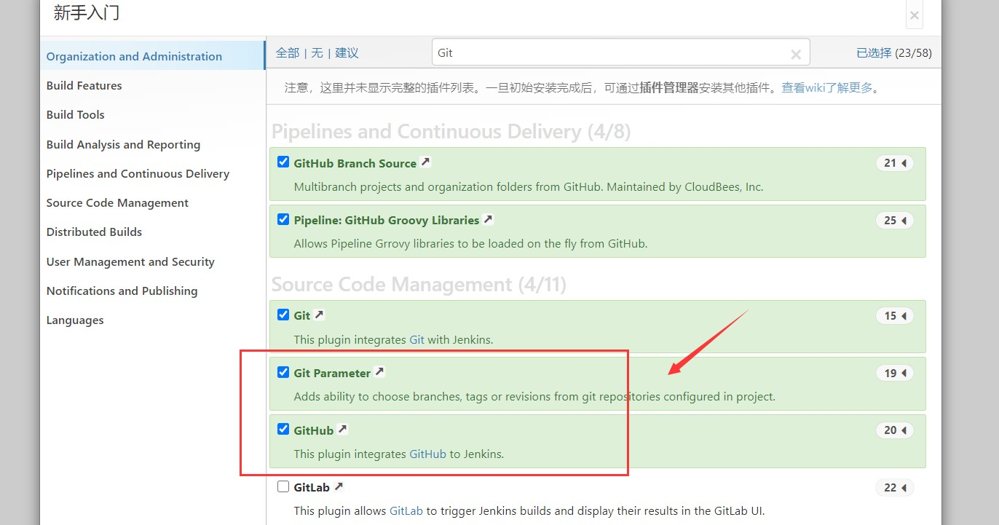

#### 安装 GitHub 插件

首先，需要连接 GitHub 有一个基本的插件要安装，可以在插件管理中搜索 GitHub，然后找到 GitHub 这个插件进行安装即可

#### 安装 Git Parameter

安装了 `GitHub` 插件就已经实现了连接 GitHub，虽然这个基本的插件本身也有选择分支的参数，但是分支参数没有限制，无法做到根据实际的分支和 Tag 名称去选择，所以最好另外安装一个可以支持选择分支和 Tag 的插件，这个支持分支的插件的名字是 `Git Parameter`，这个插件可以实现在拉取 GitHub 的代码的时候选择分支和 Tag 并通过参数的形式传入到拉取过程中

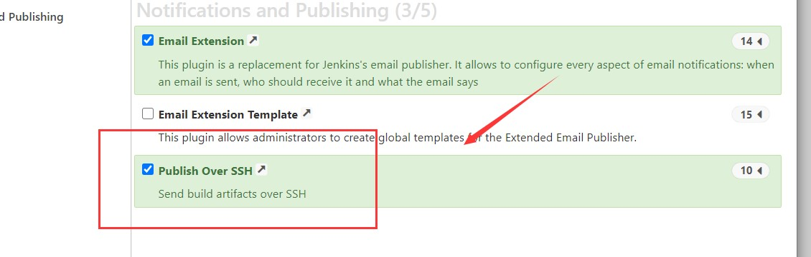

#### 安装Publis over SSH

Jenkins通过Publish over SSH插件实现远程部署（后续可以在如下进行安装）

```md
主界面——>系统管理——>管理插件——>可选插件——>右上角过滤框中输入“Publish over SSH”——>勾选安装
```

**等待漫头的安装...**

**指定用户名和密码**
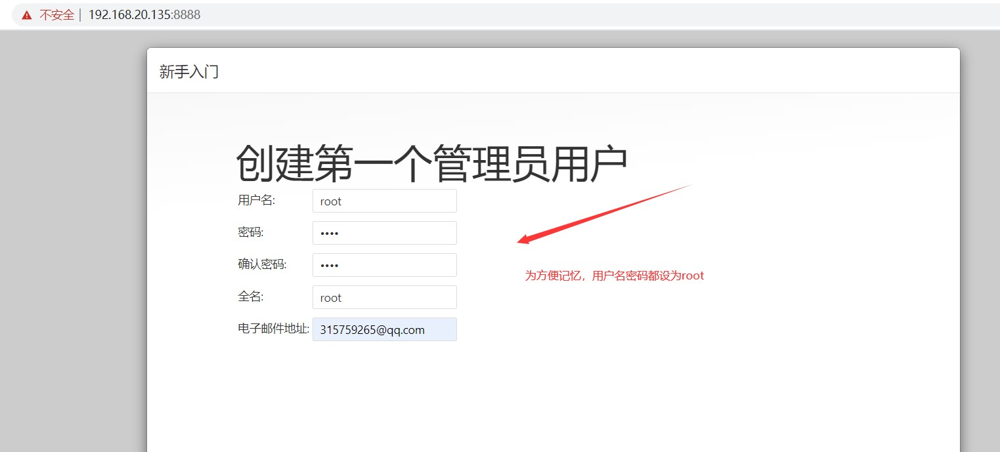

## 安装完成

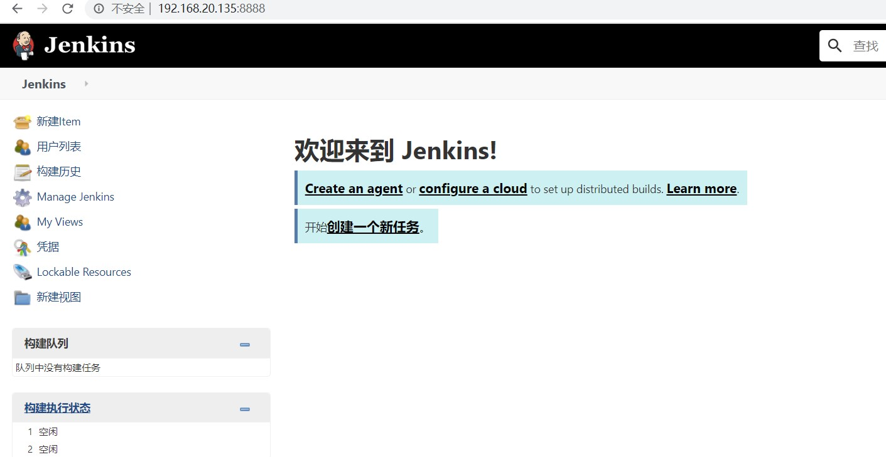

# 三、Jenkins连接GitLab服务器

> 为方便Jenkins拉取GitLab服务器的密码，需要 连接GitLab服务器

- Jenkins中点击 系统管理 -->全局配置
    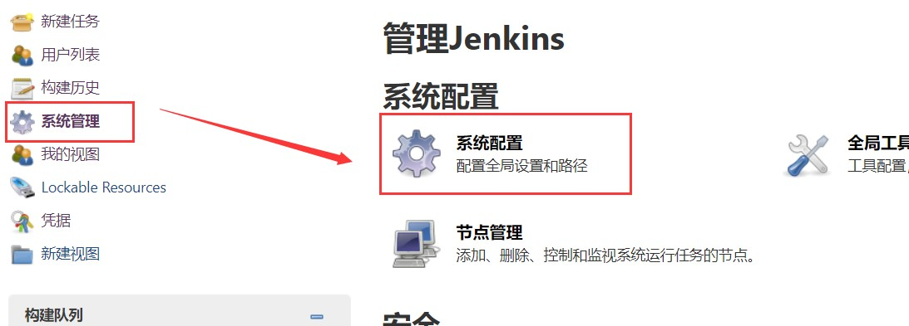

- 找到 Publish over SSH(如果没有，需要下载该插件)
    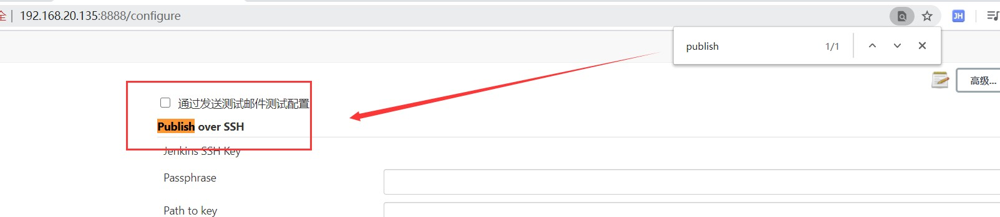
    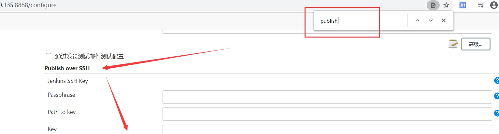
    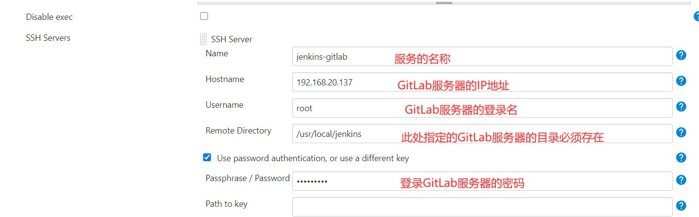
    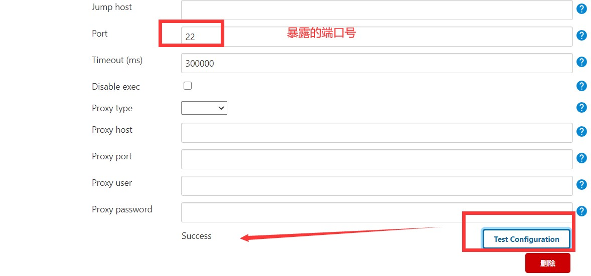

# 四、Jenkins免密钥登录GitLab

> 1 、登录Jenkins容器内部
>
> 2 、输入SSH生成密钥命令
>
> 3 、复制到GitLab配置项目

```sh
# 1 找到Jenkins 容器ID，并进入容器内容
docker ps
docker exec -it 容器ID bash
# 2输入SSH生成密钥命令 (如下图)
ssh-keygen -t rsa -C "1440023258@qq.com" #输入 3 次确定回车即可 邮箱随意
```

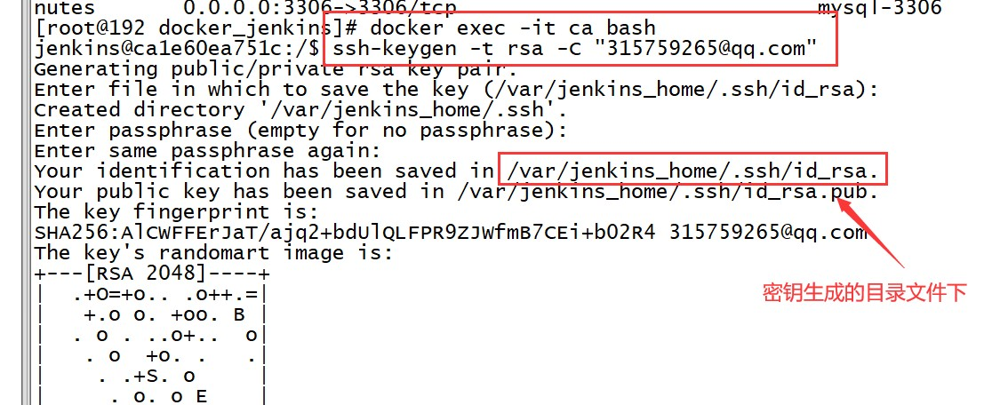

```sh
# 3 /var/jenkins_home 在安装时已和宿主机 /data目录完成映射。退出容器，找到宿主机对应目录
cd /opt/docker_jenkins/data #进入宿主机 /data目录

# 4 .ssh文件默认为隐藏文件，进入文件内部 (如下图)
ls -a
cd .ssh
ll
```

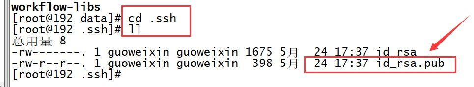

```sh
# 5 进入 id_rsa.pub 文件。将内容复制
cat id_rsa.pub
```

**打开GitLab主页服务器，进行密钥配置**

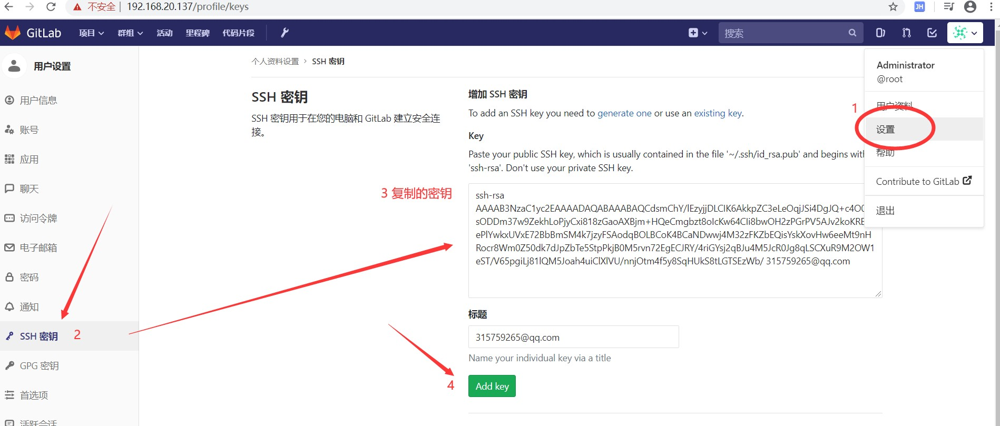

## 拉取GitLab项目

> 使用SSH名密钥连接时，首次需要手动确定操作

```sh
# 1、进入Jenkins容器内部
docker exec -it jenkins容器ID bash
# 2、执行 拉取 clone
git clone (gitlab ssh连接地址) //如果无权限，执行 3 操作
# 3、进入指定目录（操作)
cd /var/jenkins_home/
# 4、再次执行 git clone
git clone (gitlab ssh连接地址)
# 5、手动选择yes 即可完成首次需要确定操作
# 6、拉取完成后，可以直接删除。
rm -rf 文件夹名
```

# 五、Jenkins配置JDK和MAVEN

> Jenkins会从GitHub/GitLab 中拉取代码。会在Jenkins中进行打包等操作。此处需要JDK和MAVEN配置

## 安装文件准备

官网直接搜索下载即可

```sh
# 1 复制本地的 JDK和MAVEN 到Linux桌面。并移动 /opt/docker_jenkins/data目录下
mv jdk-8u141-linux-x64.tar.gz /opt/docker_jenkins/data
mv apache-maven-3.6.3-bin.tar.gz /opt/docker_jenkins/data
```

```sh
# 2 依次在该目录下完成解压
cd /opt/docker_jenkins/data
tar -zxvf apache-maven-3.6.3-bin.tar.gz
tar -zxvf jdk-8u141-linux-x64.tar.gz
```

## Jenkins中配置

### 1 、配置

系统配置 --> 局工具配置

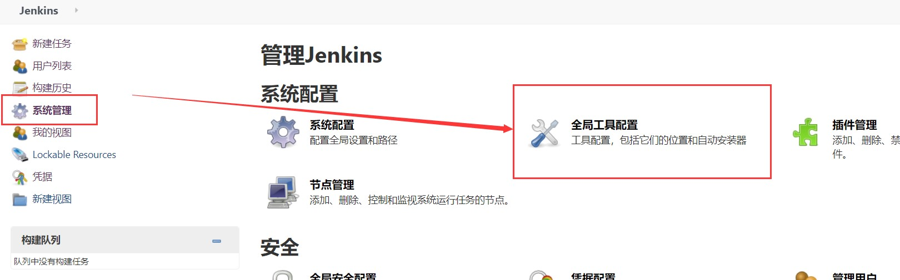

### 2 、配置JDK

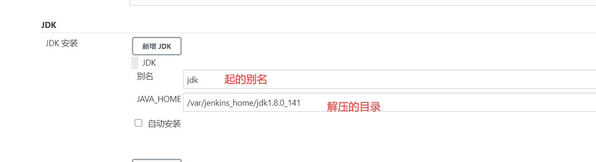

### 3 、配置MAVEN

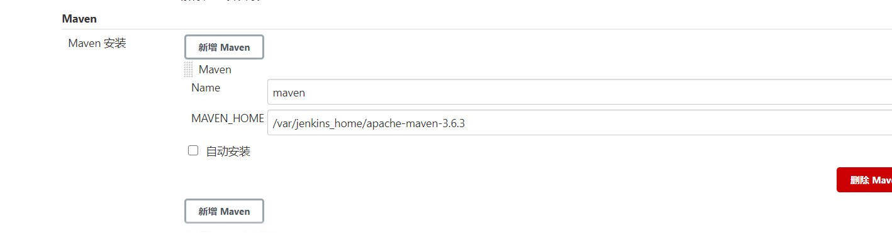

 **保存** 即可

# 六、测试

> 让Jenkins实行一个任务，拉取GitLab中的代码。并在Jenkins中 用Maven打成一个jar包

```md
1 、创建一个项目 推送到GitLab服务器
2 、Jenkins页面中创建任务（拉取GitLab代码)
3 、运行Maven命令，进行打包
```

## Jenkins创建任务

- Jenkins首页，新建任务
    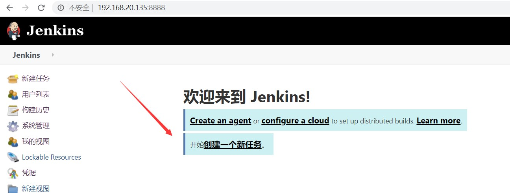

- 输入任务名称，（自由风格）。 点击确定
    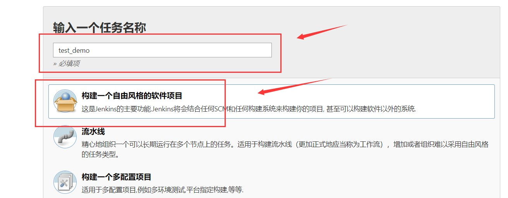

- 依次完成
    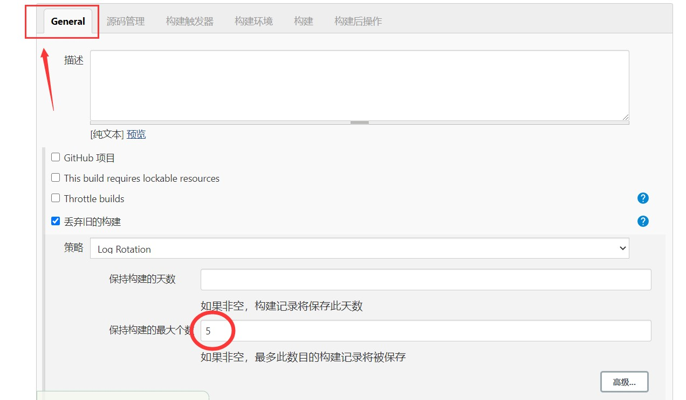

- 源码管理Git
    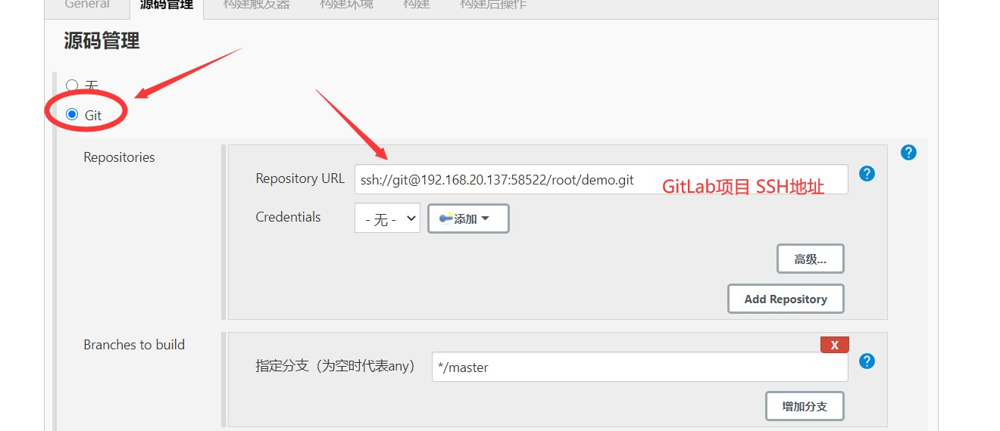

- 构建（选择Maven)
    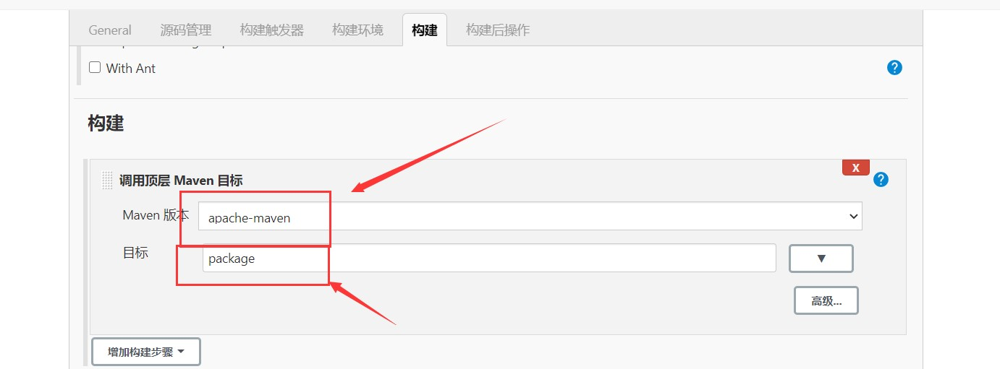

- 保存即可

## 执行任务

- 立即构建-->点击查看构建详情
    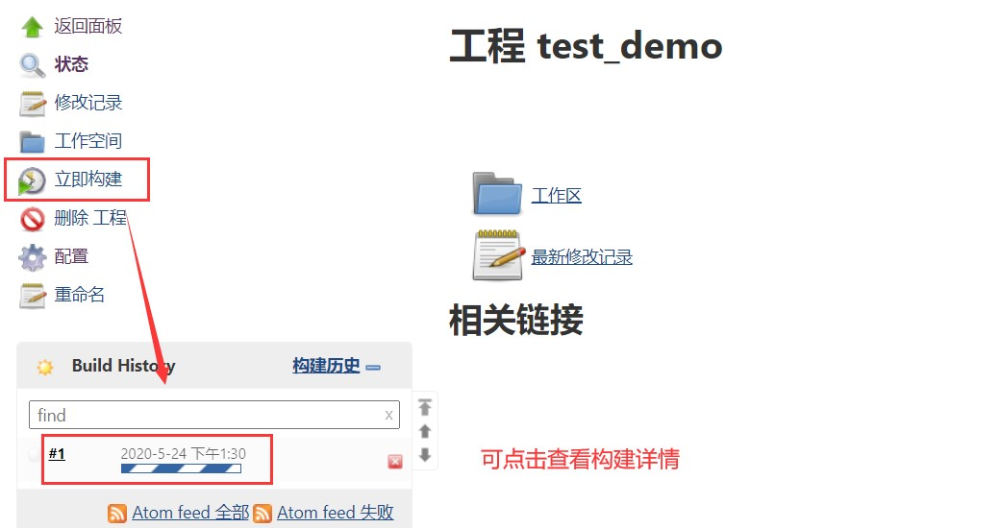

- 首次构建比较慢。控制台会输出 构建的全过程
    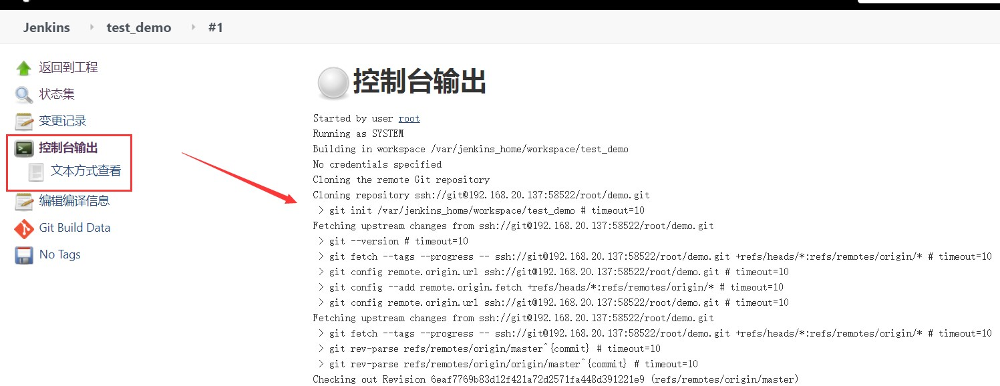

- 查看执行结果

    > 在构建 控制台日志最下方 可看到构建的 jar包目录地址。找进去查看是否 maven package成功

    ```sh
    #1、 进入 数据卷映射的目录位置
    cd /opt/docker_jenkins/data

    # 2、进入/workspace目录
    cd workspace

    # 3、在下方即可找到打好的 jar包
    ```

- IDEA中提交代码--》GitLab--》Jenkins运行任务--》完成镜像构建

    要用换行来表示依次的命令
    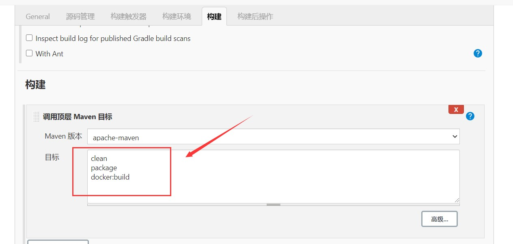

# 七、实战测试 持续交付和持续部署

135 是 Jenkins
137 是 GitLab
