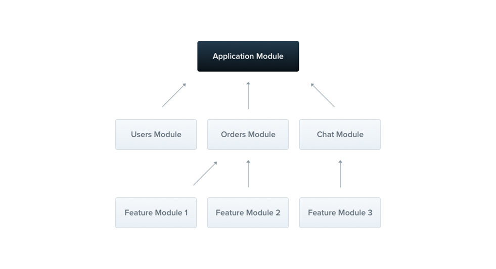
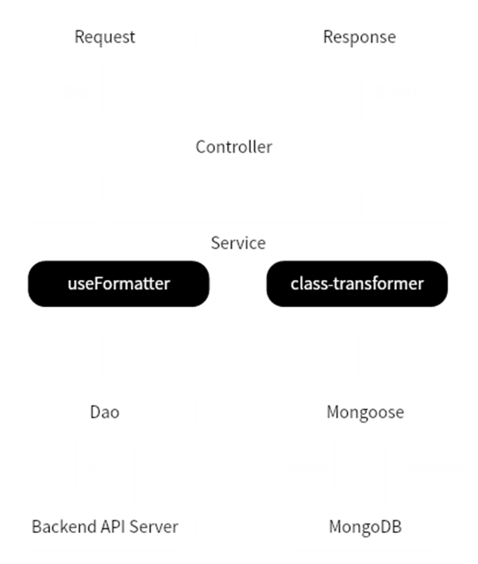

# Nestjs 简介

## 框架简介

- 介绍
  用于高效、可扩展的 Node.js 服务端应用程序的框架，使用渐进式 Javascript，结合了面向对象（OOP）、函数式编程（FP）、函数响应式编程（FRP）思想。
- 理念
  开箱即用，创建高度可测试、可扩展、松耦合且易于维护的应用程序。

> OOP：
> 使用 Class 作为主要代码组织单元，主要使用@Injectable 标记为可注入依赖项，通过依赖注入的方式实现控制反转，达到类之间的松耦合；
> 通过继承扩展基类来创建具体的子类实现更具体的功能，比如自定义异常可以继承标准 HTTPException 进行扩展；
>
> FP：
> 针对无依赖项的中间件，我们可以使用纯函数中间件实现；
>
> FRP：
> Controller 除了返回 Promise 对象，还可以返回 Observable 对象，其能力由 RxJS 库提供，可以监听事件或者数据源进行最终数据的返回；

## Nestjs vs Express、Fastify

- TypeScript 支持（Fastify 是原生支持 TS）
- 依赖注入，简化实例的创建与管理
- 模块化架构，按功能拆分模块，分界清晰
- 元数据反射，可以使用装饰器实现路由、守卫等定义，并且可以解析元数据中包含的信息
- 内置模块和功能，路由、HTTP 模块、异常处理等内置功能，更轻松的构建应用
- HTTP 服务器适配，低代价切换 express 与 fastify
- 可插拔插件系统，通过第三方与自定义插件，渐进式扩展应用

## 模块

- @Module 装饰器修饰的类；
- Nestjs 组织应用程序结构的基本单元；



> 每个应用程序至少有一个根模块，应当将模块作为组织代码的有效方式，最终程序将会包含多个模块，每个模块封装一组密切相关的功能。

```ts
// Module
@Module({
  controllers: [AController],
  providers: [AService],
  imports: [OtherModule],
  exports: [MyService, DemoModule],
})
export class DemoModule {}
```

> - providers：模块内可以被 nestjs 注入的提供者
> - controllers：模块控制器
> - imports：导入模块列表，可以使用导入模块中导出的提供者，如果一个模块被所有模块使用，那么可以@Global 装饰器标记为全局模块
> - exports：导出模块或者提供者，供外部模块使用

### Providers

通过@Injectable 装饰器修饰，可以在构造函数中声明注入；

```ts
// Module
@Injectable()
export class CatsService {
  private readonly cats: Cat[] = [];
  findAll(): Cat[] {
    return this.cats;
  }
}
```

```ts
// Module
@Controller("cats")
export class CatsController {
  constructor(private catsService: CatsService) {}
  @Get()
  async findAll(): Promise<Cat[]> {
    return this.catsService.findAll();
  }
}
```

## 基础概念

模块作为组织代码的基础单元，需要搭配 Nestjs 内置的功能组件来完成一个完整的 HTTP 请求，其中包括：

- 中间件（Middleware）
- 守卫（Guard）
- 拦截器（Interceptor）
- 管道（Pipe）
- 异常过滤器（ExceptionFilter）

### 中间件

#### 创建

路由处理程序之前调用，可以访问请求和响应对象，调用 next()将控制权交由下一个中间件。

```typescript
// Middleware
@Injectable()
export class LoggerMiddleware implements NestMiddleware {
  use(req: Request, res: Response, next: NextFunction) {
    console.log("Request...");
    next();
  }
}
```

#### 应用

- 包含中间件的模块必须实现 NestModule 接口；
- 通过 MiddlewareConsumer 控制中间件应用范围；

```typescript
// Middleware
@Module({
  imports: [CatsModule],
})
export class AppModule implements NestModule {
  configure(consumer: MiddlewareConsumer) {
    consumer.apply(LoggerMiddleware).forRoutes("cats");
  }
}
```

> 多个中间件配置可以通过 consumer 的多次调用进行配置，如果生效路由一致，也可以在 apply 方法中传递多个中间件
> 全局中间件可以在程序入口中使用 app.use 进行注册

#### 函数式中间件

逻辑简单，无成员、附加方法，无依赖项。

```ts
// Middleware
export function logger(req: Request, res: Response, next: NextFunction) {
  console.Log(`Request...`);
  next();
}
```

#### 使用场景

- 认证和授权：验证用户身份、角色、权限，针对特定路由进行访问控制；
- 日志记录：记录请求时间、IP 地址、用户信息等公共基础日志；
- 数据转换：比如 cookie 结构化数据转换等；

### 守卫

#### 创建

职责单一，负责授权

```ts
// Guard
@Injectable()
export class AuthGuard implements CanActivate {
  canActivate(
    context: ExecutionContext
  ): boolean | Promise<boolean> | Observable<boolean> {
    const request = context.switchToHttp().getRequest();
    return validateRequest(request);
  }
}
```

#### 应用

- 全局绑定

  ```typescript
  // Guard
  const app = await NestFactory.create(AppModule);
  app.useGlobalGuards(new RolesGuard());
  ```

- 控制器绑定

  ```typescript
  // Guard
  @Controller("cats")
  @UseGuards(RolesGuard)
  export class CatsController {}
  ```

- useGlobalGuards 绑定的全局守卫无法注入依赖；

  ```typescript
  // Guard
  @Module({
    providers: [provide: APP_GUARD, useClass: RolesGuard, ],
  })
  export class AppModule {}
  ```

  > useGlobalGuards 因为在模块上下文环境之外，无法完成依赖注入；
  > 通过在跟路由中配置 provider 的方式实现全局守卫的注册解决这个问题；
  >
  > 拦截器、管道、异常过滤器都可以通过这种方式解决全局注册问题；

#### 使用场景

中间件鉴权 vs 守卫鉴权
守卫中可以获取当前执行上下文，明确知道接下来需要执行的内容；

```typescript
// Guard
@Post()
@SetMetadata('roles', ['admin'])
async create(@Body() createCatDto: CreateCatDto) {
  this.catsService.create(createCatDto);
}
```

```typescript
// Guard
@Injectable()
export class RolesGuard implements CanActivate {
	constructor(private reflector: Reflector) {}
	canActivate(context: ExecutionContext) : boolean {
		const roles this.reflector.get < string[] > ('roles', context.getHandler());
		if (!roles) {
			return true;
		}
		const request context.switchToHttp().getRequest();
		const user request.user;
		return matchRoles(roles, user.roles);
	}
}
```

> 守卫可以通过执行上下文获取更为详细的信息，针对特定路由进行更为负责的鉴权逻辑；

### 拦截器

#### 创建

- 路由方法执行前/后绑定额外的逻辑；
- 转换函数返回结果；
- 扩展基本功能；

```typescript
// Interceptor
@Injectable()
export class LoggingInterceptor implements NestInterceptor {
  intercept(context: ExecutionContext, next: CallHandler): Observable<any> {
    console.Log("Before...");
    const now = Date.now();
    return next
      .handle()
      .pipe(tap(() => console.log(`After...${Date.now() - now}ms`)));
  }
}
```

#### 应用

- 全局绑定

  ```typescript
  // Interceptor
  const app = await NestFactory.create(AppModule);
  app.useGLobaLInterceptors(new LoggingInterceptor());
  ```

- 控制器绑定

  ```typescript
  // Interceptor
  @UseInterceptors(LoggingInterceptor)
  export class CatsController {}
  ```

> 拦截器全局绑定也会有无法注入依赖的问题与守卫处理方式相同；

#### 使用场景

- 路由处理时间；
- 响应数据统一处理；
- 异常映射；
- 缓存覆盖；

> 异常映射：根据不同的错误映射到不同的异常类型；
> 缓存覆盖：命中缓存之后，跳过路由逻辑，直接返回数据结果；

### 管道

#### 创建

- 转换：将输入数据转换为需要形式；
- 验证：校验输入数据是否有效；

```typescript
// Pipe
@Injectable()
export class ValidationPipe implements PipeTransform {
  transform(value: any, metadata: ArgumentMetadata) {
    return value;
  }
}
```

#### 转换管道

- ParseIntPipe
- ParseFloatPipe
- Parse\*Pipe

```typescript
// Pipe
@Get(':id')
async findone(@Param('id', ParseIntPipe) id: number) {
	return this.catsService.find0ne(id);
}
```

```json
// Pipe
{
  "statusCode": 400,
  "message": "Validation failed (numeric string is expected)",
  "error": "Bad Request"
}
```

#### 校验管道

- ValidationPipe：结合 class-validator、class-transformer 通过装饰器对 Class / DTO 进行校验。

```typescript
// Pipe
@Post()
create(@Body() createUserDto: CreateUserDto) {
	return 'This action adds a new user'
}
```

```typescript
Pipe;
export class CreateUserDto {
  @IsEmail()
  email: string;
  @IsNotEmpty()
  password: string;
}
```

#### 应用

- 全局注册，以便于所有传入 DTO 都需要进行校验；

  ```typescript
  // Pipe
  async function bootstrap() {
    const app = await NestFactory.create(AppModule);
    app.useGLobalPipes(new ValidationPipe());
    await app.listen(3000);
  }
  ```

- 路由注册，针对指定路由进行参数校验与转换；

  ```typescript
  // Pipe
  @Get()
  async findALL(
    @Query('activeOnLy', new DefaultValuePipe(false), ParseBooLPipe) activeonLy: boolean,
    @Query('page', new DefaultVaLuePipe(0), ParseIntPipe) page: number, ) {
    return this.catsService.findALL({
      activeonly,
      page
    });
  }
  ```

### 异常过滤器

#### 创建

- 负责程序中未处理异常捕获，返回用户友好响应；

  ```typescript
  // Exception
  @Catch(HttpException)
  export class HttpExceptionFilter implements ExceptionFilter {
    catch(exception: HttpException, host: ArgumentsHost) {
      const ctx = host.switchToHttp();
      const response = ctx.getResponse<Response>();
      const request = ctx.getRequest<Request>();
      const status = exception.getstatus();
      response.status(status).json({
        statusCode: status,
        timestamp: new Date().toISOString(),
        path: request.url,
      });
    }
  }
  ```

#### 自定义异常

- 内置异常
  - NotFoundException
  - UnauthorizedException
  - …
- 自定义异常
  ```typescript
  // Exception
  export class ForbiddenException extends HttpException {
    constructor() {
      super("Forbidden", HttpStatus.FORBIDDEN);
    }
  }
  ```

#### 应用

- 全局绑定

  ```typescript
  // Exception
  async function bootstrap() {
    const app = await NestFactory.create(AppModule);
    app.useGLobaLFilters(new HttpExceptionFilter());
    await app.listen(3000);
    bootstrap();
  }
  ```

- 局部绑定

  ```typescript
  // Exception
  @UseFilters(new HttpExceptionFilter())
  export class CatsController {}
  ```

## 请求生命周期

- 传入请求
- 全局中间件->模块中间件
- 全局守卫->控制器守卫->路由守卫
- 全局拦截器->控制器拦截器->路由拦截器
- 全局管道->控制器管道->路由管道->路由参数管道
- 控制器逻辑->Service->Dao
- 路由拦截器->控制器拦截器->全局拦截器
- 路由异常过滤器->控制器异常过滤器->全局异常过滤器
- 返回响应

## Fastify vs Express

- 更高的性能；
- 异步支持；
- 低内存低 CPU；
- 原生 Typescript 支持；

> Fasity 在设计时着重优化了性能方面，使用更为高效的路由匹配算法、更为快速的内置 JSON 解析器，内部全异步实现，所以具备更好的性能；
> 内置支持 async\await 异步处理，区别与 express 的回调方式，可以更高的组织代码和更为高效；
> Fasity 精简核心库具备更小的体积，优化了数据结构和算法降低内存的使用，基于事件驱动，减少阻塞从而提高 CPU 的利用率；

## 模块内部数据流转



### class-transformer

- Plain to Class
- 过滤属性
- 类型嵌套
- 设置别名
- 数据转换

### Features

- 请求数据校验
- 接口缓存
- 拦截器统一返回数据
- 异常映射分类
- ……
