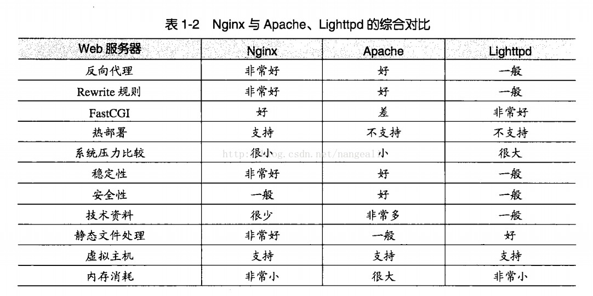
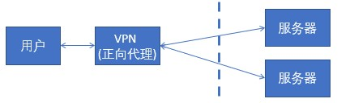
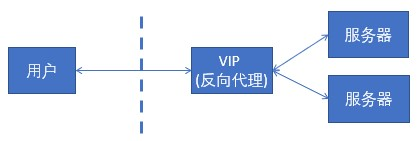
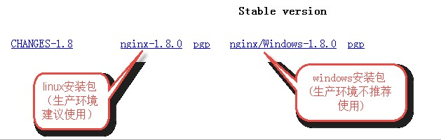
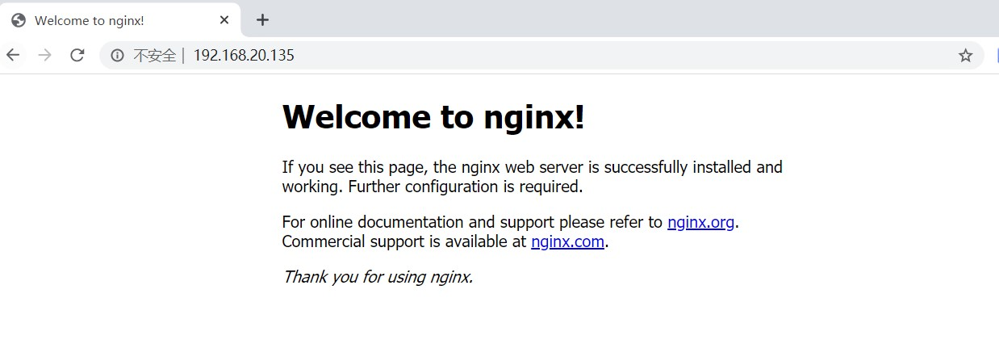
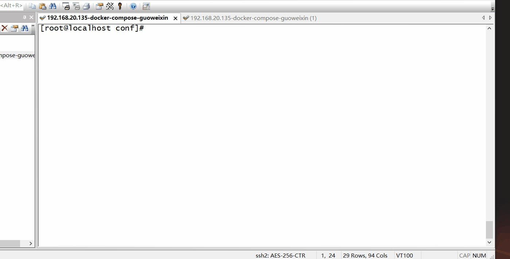
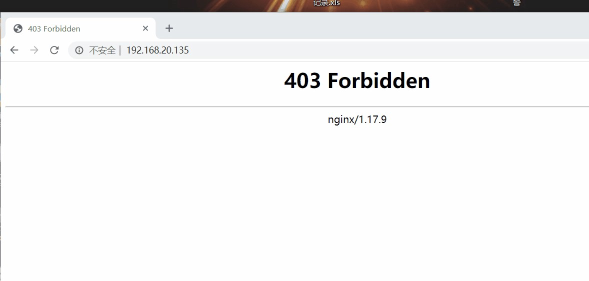
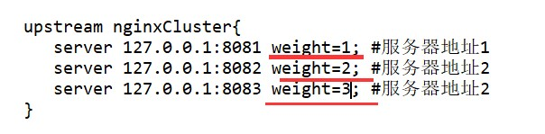
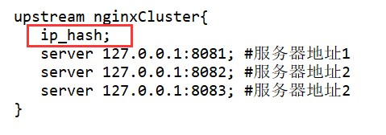
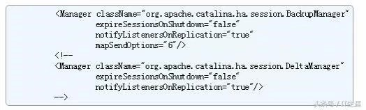

# Nginx

> Tomcat 产品---》中间件--》解决方案
> 软负载：Nginx
> 硬负载：F

采取 **是什么、为什么、怎么用** 的思维三部曲方式学习

## 一、什么是 Nginx

Nginx (engine x) 是一个高性能的 _HTTP_ 和*反向代理* web 服务器

Nginx 是一款*轻量级*的 _Web_ 服务器/*反向代理*服务器及*电子邮件*（IMAP/POP3）代理服务器，在 BSD-like 协议下发行。其特点是占有内存少，**并发**能力强，事实上 nginx 的并发能力确实在同类型的网页服务器中表现较好，中国大陆使用 nginx 网站用户有：**_百度_**、**_京东_**、**_新浪_**、**_网易_**、**_腾讯_**、**_淘宝_**等。



## 二、为什么使用 Nginx？

在传统的 Web 项目中，并发量小，用户使用的少。

所以在低并发的情况下，用户可以直接访问 tomcat 服务器，然后 tomcat 服务器返回消息给用户。

```
用户访问<-->Tomcat服务器
```

而在互联网项目下，因单个 tomcat 默认并发量有限制。如果请求量过大，会产生如下问题：

```
Tomcat8 默认配置的最大请求数是 150 ，也就是说同时支持 150 个并发，当然了，也可以将其改大。
当某个应用拥有 250 个以上并发的时候，应考虑应用服务器的集群。
具体能承载多少并发，需要看硬件的配置，CPU 越多性能越高，分配给 JVM 的内存越多性能也就越高，但也会加重 GC 的负担。
操作系统对于进程中的线程数有一定的限制：
Windows 每个进程中的线程数不允许超过 2000
Linux 每个进程中的线程数不允许超过 1000
(在 Java 中每开启一个线程需要耗用 1MB 的 JVM 内存空间用于作为线程栈之用。)

Tomcat的最大并发数是可以配置的，实际运用中，最大并发数与硬件性能和CPU数量都有很大关系的。
更好的硬件，更多的处理器都会使Tomcat支持更多的并发。
maxThreads="150" 最大并发数
minSpareThreads="10"///初始化时创建的线程数
maxSpareThreads="500"///一旦创建的线程超过这个值，Tomcat就会关闭不再需要的socket线程。
```

### 高并发（High Concurrency）

是互联网分布式系统架构设计中必须考虑的因素之一，

它通常是指，通过设计保证系统能够同时并行处理很多请求。

高并发相关常用的一些指标有响应时间（Response Time），吞吐量（Throughput），每秒查询率 QPS（Query Per Second），并发用户数等。

**响应时间**：系统对请求做出响应的时间。例如系统处理一个 HTTP 请求需要 200ms，这个 200ms 就是系统的响应时间。

**吞吐量**：单位时间内处理的请求数量。

**QPS**：每秒响应请求数。在互联网领域，这个指标和吞吐量区分的没有这么明显。

**并发用户数**：同时承载正常使用系统功能的用户数量。

### 高可用（High Availability）

通常来描述一个系统经过专门的设计，从而减少停工时间，而保持其服务的高度可用性。

(一直都能用 99.9999%)

### 高性能

是指服务响应时间快，（CPU/处理器/内存）特别是在高并发下响应时间不会急剧增加。

### Nginx 特点

- 高并发、高性能
- 可扩展性好
- 高可靠性
- 热部署
- BSD 许可证

## 三、简介

**Nginx (engine x)** 是一款轻量级的 Web 服务器 、反向代理服务器及电子邮件（IMAP/POP3）代理服务器。

### 反向代理

反向代理（Reverse Proxy）方式是指以代理服务器来接受 internet 上的连接请求，然后将请求转发给内部网络上的服务器，并将从服务器上得到的结果返回给 internet 上请求连接的客户端，此时代理服务器对外就表现为一个反向代理服务器。

### 正向代理

是一个位于客户端和原始服务器(origin server)之间的服务器，为了从原始服务器取得内容，客户端向代理发送一个请求并指定目标(原始服务器)，然后代理向原始服务器转交请求并将获得的内容返回给客户端。客户端才能使用正向代理。

### 正向代理和反向代理区别？

**正向代理，是在客户端的**。比如需要访问某些国外网站，我们可能需要购买 vpn。并且 **vpn 是在我们的用户浏览器端设置的**(并不是在远端的服务器设置)。浏览器先访问 vpn 地址，vpn 地址转发请求，并最后将请求结果原路返回来。



**反向代理是作用在服务器端的，是一个虚拟 ip(VIP)**。对于用户的一个请求，会转发到多个后端处理器中的一台来处理该具体请求。



## 四、Nginx 下载

官方网址： <http://nginx.org/>



```
├── conf 这是nginx所有配置文件的目录
│ ├── fastcgi.conf fastcgi 相关参数的配置文件
│ ├── fastcgi.conf.default fastcgi.conf 的原始备份
│ ├── fastcgi_params fastcgi的参数文件
│ ├── fastcgi_params.default
│ ├── koi-utf
│ ├── koi-win
│ ├── mime.types 媒体类型
│ ├── mime.types.default
│ ├── nginx.conf nginx默认的主配置文件
│ ├── nginx.conf.default
│ ├── scgi_params scgi 相关参数文件
│ ├── scgi_params.default
│ ├── uwsgi_params uwsgi相关参数文件
│ ├── uwsgi_params.default
│ └── win-utf

├── fastcgi_temp fastcgi临时数据目录

├── html 这是编译安装时nginx的默认站点目录，类似Apache的默认站点htdocs
│ ├── 50 x.html 错误页面优雅替代显示文件，例如：出现 502 错误时会调用此页面error_page 500 502 503 504 / 50 x.html
│ └── index.html 默认的首页文件，index.html\index.asp\index.jsp来做网站的首页文件

├── logs nginx默认的日志路径，包括错误日志及访问日志
│ ├── access.log nginx的默认访问日志文件，使用tail -f access.log,可以实时观看网站的用户访问情况信息
│ ├── error.log nginx的错误日志文件，如果nginx出现启动故障可以查看此文件
│ └── nginx.pid nginx的pid文件，nginx进程启动后，会把所有进程的ID号写到此文件

├── nginx-1.6.3 -> /application/nginx-1.6.
├── proxy_temp 临时目录
├── sbin 这是nginx命令的目录，如nginx的启动命令nginx
│ ├── nginx Nginx的启动命令nginx
│ └── nginx.old
├── scgi_temp 临时目录
└── uwsgi_temp 临时目录
```

## 五、Nginx 安装与使用

### Windows

#### 安装

> 1 、解压文件夹
>
> 2 、双击 nginx.exe ,一闪而过，nginx 启动成功了，通过访问：<http://localhost>
> (端口号默认 80)

#### 使用

nginx 的使用比较简单，就是几条命令

常用到的命令如下：

```bash
start nginx 启动nginx
nginx -s stop 快速关闭Nginx，可能不保存相关信息，并迅速终止web服务。
nginx -s quit 平稳关闭Nginx，保存相关信息，有安排的结束web服务。
nginx -s reload 因改变了Nginx相关配置，需要重新加载配置而重载。
nginx -s reopen 重新打开日志文件。
nginx -c filename 为 Nginx 指定一个配置文件，来代替缺省的。
nginx -t 不运行，而仅仅测试配置文件。nginx 将检查配置文件的语法的正确性，并尝试打开配置文件中所引用到的文件。
nginx -v 显示 nginx 的版本。
nginx -V 显示 nginx 的版本，编译器版本和配置参数
```

windows 下 需要带上 exe `./nginx.exe -s stop`

**提示**

如果不想每次都敲命令，可以在 nginx 安装目录下新添一个启动批处理文件 startup.bat，双击即可运行。内容如下

```bash
@echo off
rem 如果启动前已经启动nginx并记录下pid文件，会kill指定进程
nginx.exe - s stop

rem 测试配置文件语法正确性
nginx.exe - t - c conf/nginx.conf

rem 显示版本信息
nginx.exe - v

rem 按照指定配置去启动nginx
nginx.exe - c conf/nginx.conf
```

### Linux

#### 安装 Nginx 源

执行以下命令:

```sh
rpm -ivh http://nginx.org/packages/centos/7/noarch/RPMS/nginx-release-centos-7-0.el7.ngx.noarch.rpm
```

安装该 rpm 后，我们就能在/etc/yum.repos.d/ 目录中看到一个名为 nginx.repo 的文件

安装完 Nginx 源后，就可以正式安装 Nginx 了

```sh
yum install -y nginx
```

#### Nginx 默认目录

输入命令

```sh
whereis nginx
```

即可看到类似于如下的内容

```bash
nginx: /usr/sbin/nginx /usr/lib64/nginx /etc/nginx /usr/share/nginx
```

以下是 Nginx 的默认路径

```bash
( 1 ) Nginx配置路径：/etc/nginx/
( 2 ) PID目录：/var/run/[nginx.pid](https://www.centos.bz/tag/nginx-pid/)
( 3 ) 错误日志：/var/log/nginx/[error](https://www.centos.bz/tag/error/).log
( 4 ) 访问日志：/var/log/nginx/access.log
( 5 ) 默认站点目录：/usr/share/nginx/html
```

事实上，只需知道 Nginx 配置路径，其他路径均可在/etc/nginx/nginx.conf 以及/etc/nginx/conf.d/default.conf 中查询到

#### 常用命令

(1) 启动

```sh
nginx
```

(2) 测试 Nginx 配置是否正确

```sh
nginx -t
```

(3) 优雅重启

```sh
nginx -s reload
```

(4) 查看 nginx 的进程号

```sh
ps -ef |grep nginx
```

(5)nginx 服务停止

```sh
nginx -s stop
```

kill -9 pid 杀死进程

### Docker 安装

#### 基本安装

##### 拉取 Nginx 镜像

```sh
docker pull nginx:latest
```

##### 查看本地镜像列表（即可看到 nginx)

```sh
docker images
```

##### 运行容器

```sh
docker run --name nginx-test -p 80:80 -d nginx
```

> 参数说明
>
> - --name nginx-test：容器名称
> - -p 80:80： 端口进行映射，将本地 8080 端口映射到容器内部的 80 端口
> - -d nginx： 设置容器在在后台一直运行

##### 安装成功



#### 高级安装

> 为了更方便开发和配置，需要将 Docker 容器内的信息进行宿主机间的配置
> docker exec -it nginx-test bash 可通过如下命令进入容器内部

##### 创建目录

```sh
mkdir -p /usr/local/nginx
```

##### 依次在该目录下创建三个文件目录

```sh
#创建 www目录
mkdir -p /usr/local/nginx/html

#创建日志目录
mkdir -p /usr/local/nginx/logs

#创建配置文件目录
mkdir -p /usr/local/nginx/conf
```

##### 拷贝配置文件

```sh
docker cp 容器ID:/etc/nginx/nginx.conf /usr/local/nginx/conf
docker cp 容器ID:/etc/nginx/conf.d/ /usr/local/nginx/conf
```

##### 修改配置文件

> 将 usr/local/nginx/conf/nginx.conf 内容中的 include 默认路径改为当前路径



##### 重新创建/运行容器

```sh
docker run -d -p 80:80 --name nginx-test -v /usr/local/nginx/html:/usr/share/nginx/html -v
/usr/local/nginx/conf/nginx.conf:/etc/nginx/nginx.conf -v
/usr/local/nginx/conf/conf.d/default.conf:/etc/nginx/conf.d/default.conf -v
/usr/local/nginx/logs:/var/log/nginx nginx
```

##### 测试重新访问



### Docker-compose 安装

## 配置文件描述

### nginx.conf 配置文件描述

nginx/conf 目录下

```conf
#运行用户
user www-data;
#启动进程,通常设置成和cpu的数量相等
worker_processes  1;

#全局错误日志及PID文件
error_log /var/log/nginx/error.log;
pid /var/run/nginx.pid;

#工作模式及连接数上限
events {
use epoll; #epoll是多路复用IO(I/O Multiplexing)中的一种方式,但是仅用于linux2.6以上内
核,可以大大提高nginx的性能
worker_connections  1024 ;#单个后台worker process进程的最大并发链接数
# multi_accept on;
}

#设定http服务器，利用它的反向代理功能提供负载均衡支持
http {
#设定mime类型,类型由mime.type文件定义
include /etc/nginx/mime.types;
default_type application/octet-stream;
#设定日志格式
access_log /var/log/nginx/access.log;

#sendfile 指令指定 nginx 是否调用 sendfile 函数（zero copy 方式）来输出文件，对于普通应用，
#必须设为 on,如果用来进行下载等应用磁盘IO重负载应用，可设置为 off，以平衡磁盘与网络I/O处理速度，降低系统的
uptime.
sendfile on;
#tcp_nopush on;

#连接超时时间
#keepalive_timeout 0;
keepalive_timeout  65 ;
tcp_nodelay on;

#开启gzip压缩
gzip on;
gzip_disable "MSIE [1-6]\.(?!.*SV1)";

#设定请求缓冲
client_header_buffer_size  1 k;
large_client_header_buffers  4 4 k;

include /etc/nginx/conf.d/*.conf;
include /etc/nginx/sites-enabled/*;

# 设定负载均衡的服务器列表
upstream mysvr {

# weigth 参数表示权值，权值越高被分配到的几率越大 #本机上的 Squid 开启 3128 端口
server 192.168.8.1: 3128 weight= 5 ;
server 192.168.8.2: 80 weight= 1 ;
server 192.168.8.3: 80 weight= 6 ;
}

server { #监听 80 端口
listen 80 ; #定义使用www.javaqf.com访问
server_name [http://www.javaqf.com;](http://www.javaqf.com;)

# 设定本虚拟主机的访问日志
access_log logs/www.javaqf.com.access.log main;

# 默认请求
location / {
root /root; #定义服务器的默认网站根目录位置
index index.php index.html index.htm; #定义首页索引文件的名称

fastcgi_pass [http://www.javaqf.com;](http://www.javaqf.com;)
fastcgi_param SCRIPT_FILENAME $document_root/$fastcgi_script_name;
include /etc/nginx/fastcgi_params;
}

# 定义错误提示页面
error_page 500 502 503 504 / 50 x.html;
location = / 50 x.html {
root /root;
}

# 静态文件，nginx 自己处理
location ~ ^/(images|javascript|js|css|flash|media|static)/ {
root /var/www/virtual/htdocs; #过期 30 天，静态文件不怎么更新，过期可以设大一点，如果频繁更新，则可以设置得小一点。
expires 30d;
}

# PHP 脚本请求全部转发到 FastCGI 处理. 使用 FastCGI 默认配置.
location ~ \.php$ {
root /root;
fastcgi_pass 127.0.0.1: 9000 ;
fastcgi_index index.php;
fastcgi_param SCRIPT_FILENAME /home/www/www$fastcgi_script_name;
include fastcgi_params;
}
#设定查看 Nginx 状态的地址
location /NginxStatus {
stub_status on;
access_log on;
auth_basic "NginxStatus";
auth_basic_user_file conf/htpasswd;
}
#禁止访问 .htxxx 文件
location ~ /\.ht {
deny all;
}
}
}
```

#### 基本配置

**全局块配置**：配置影响 nginx 全局的指令。一般有运行 nginx 服务器的用户组，nginx 进程 pid 存放路径，日志存放路径，配置文件引入，允许生成 worker process 数等

```conf
#user nobody; #配置用户或者组，默认为nobody
worker_processes  1 ; #允许生成的进程数，默认为 1
#error_log logs/error.log; #制定日志路径，级别。这个设置可以放入全局块，
#http块，server块，级别以此为:debug|info|notice|warn|error|crit|alert|emerg
#error_log logs/error.log notice;
#error_log logs/error.log info;
#pid logs/nginx.pid; #指定nginx进程运行文件存放地址
```

#### events 块配置

**events 块**：配置影响 nginx 服务器或与用户的网络连接。有每个进程的最大连接数，选取哪种事件驱动模型处理连接请求，是否允许同时接受多个网路连接，开启多个网络连接序列化等

```conf
accept_mutex on; #设置网路连接序列化，防止惊群现象发生，默认为on
multi_accept on; #设置一个进程是否同时接受多个网络连接，默认为off
#use epoll; #事件驱动模型，select|poll|kqueue|epoll|resig|/dev/poll|eventport
worker_connections  1024 ; #最大连接数，默认为1024(早期是512)
```

**max_client**

nginx 作为 http 服务器的时候

```conf
max_clients = worker_processes * worker_connections

由HTTP客户端发起一个请求，创建一个到服务器指定端口（默认是 80 端口）的TCP连接。HTTP服务器则在那个端口监听客户端
的请求。一旦收到请求，服务器会向客户端返回一个状态，比如"HTTP/1.1 200 OK"，以及返回的内容，如请求的文件、错误消
息、或者其它信息。同一时刻nginx在处理客户端发送的http请求应该只是一个connection，由此可知理论上作为http web服务
器角色的nginx能够处理的最大连接数就是最大客户端连接数。
```

nginx 作为反向代理服务器的时候

```conf
max_clients = worker_processes * worker_connections/

如果作为反向代理，因为浏览器默认会开启 2 个连接到server，而且Nginx还会使用fds（file descriptor）从同一个连接池
建立连接到upstream后端。则最大连接数的计算公式需要除 4
```

#### http 块配置

可以嵌套多个 server，配置代理，缓存，日志定义等绝大多数功能和第三方模块的配置。如文件引入，mime-type 定义，日志自定义，是否使用 sendfile 传输文件，连接超时时间，单连接请求数等

```conf
#配置nginx支持哪些文件扩展名与文件类型映射表。在conf/mime.types查看支持哪些类型
include mime.types;
#默认文件类型(流)类型，支持很多文件、图片、js/css等
default_type application/octet-stream;

#自定义格式
log_format myFormat '$remote_addr–$remote_user [$time_local] $request $status $body_bytes_sent
$http_referer $http_user_agent $http_x_forwarded_for';

access_log log/access.log myFormat; #combined为日志格式的默认值
#优化参数 允许sendfile方式传输文件，开启高校效传输模式
sendfile on;
#tcp_nopush on; #防止网络阻塞

#keepalive_timeout 0;
keepalive_timeout  65 ; #长连接超时时间（单位秒）
# keepalive_requests 8192; --每个连接最大请求数
#gzip on; #开启gzip压缩
```

`短连接`

```
连接->传输数据->关闭连接
比如HTTP是无状态的的短链接，浏览器和服务器每进行一次HTTP操作，就建立一次连接，但任务结束就中断连接。
因为连接后接收了数据就断开了，所以每次数据接受处理不会有联系。 这也是HTTP协议无状态的原因之一。
```

`长连接`

```
连接->传输数据->保持连接 -> 传输数据-> ...........->直到一方关闭连接，多是客户端关闭连接。
长连接指建立SOCKET连接后不管是否使用都保持连接，但安全性较差。
```

`HTTP/1.0 默认使用短连接，HTTP/1.1 开始默认使用长连接`

#### server 块配置

配置虚拟主机的相关参数，一个 http 中可以有多个 server

```conf
#配置虚拟主机
server {
listen 80 ; #配置监听端口
server_name localhost; #配置服务器名

#charset koi8-r; #编码格式

#access_log logs/host.access.log main; //主机的访问日志（如没有，全局为准）
#默认的匹配/请求，当访问路径中有/，会被该location匹配处理
location / {
root html; #root是配置服务器的默认网站根目录位置，在nginx目录下html
index index.html index.htm;
}

#error_page 404 /404.html; #配置 404 页面

# redirect server error pages to the static page /50x.html
#
error_page 500 502 503 504 / 50 x.html; #配置50x页面
location = / 50 x.html { #精确匹配
root html;
}

#禁止(外网）访问 .htaccess文件
# deny access to .htaccess files, if Apache's document root
# concurs with nginx's one
#
#location ~ /\.ht {
# deny all;
#}
}
```

#### server2 块配置

和上方很类似，主要是配置另一个虚拟机信息

```conf
# another virtual host using mix of IP-, name-, and port-based configuration
#
#server {
# listen 8000;
# listen somename:8080;
# server_name somename alias another.alias;

# location / {
# root html;
# index index.html index.htm;
# }
#}
```

#### server3 块配置

配置 https 服务

```
HTTP：是互联网上应用最为广泛的一种网络协议，是一个客户端和服务器端请求和应答的标准（TCP），用于从WWW服务器传输超文本到本地浏览器的传输协议，它可以使浏览器更加高效，使网络传输减少。
```

```
HTTPS：是以安全为目标的HTTP通道，简单讲是HTTP的安全版，即HTTP下加入SSL层，HTTPS的安全基础是SSL，因此加密的详细内容就需要SSL。(加密)
```

```conf
# HTTPS server
#
#server {
# listen 443 ssl;

# server_name localhost;

# ssl_certificate cert.pem;
# ssl_certificate_key cert.key;

# ssl_session_cache shared:SSL:1m;
# ssl_session_timeout 5m;

# ssl_ciphers HIGH:!aNULL:!MD5;
# ssl_prefer_server_ciphers on;

# location / {
# root html;
# index index.html index.htm;
# }
#}
```

```
HTTP与HTTPS的区别:
1 、https协议需要到ca申请证书，一般免费证书较少，因而需要一定费用。
2 、http是超文本传输协议，信息是明文传输，https则是具有安全性的ssl加密传输协议。
3 、http和https使用的是完全不同的连接方式，用的端口也不一样，前者是 80 ，后者是 443 。
4 、http的连接很简单，是无状态的；HTTPS协议是由SSL+HTTP协议构建的可进行加密传输、身份认证的网络协议，比http协议安全。
```

```
HTTPS的优缺点:
优点：
1 、使用HTTPS协议可认证用户和服务器，确保数据发送到正确的客户机和服务器；
2 、HTTPS协议是由SSL+HTTP协议构建的可进行加密传输、身份认证的网络协议，要比http协议安全，可防止数据在传输过程中不被窃取、改变，确保数据的完整性。
3 、HTTPS是现行架构下最安全的解决方案，虽然不是绝对安全，但它大幅增加了中间人攻击的成本。
缺点：
1 、HTTPS协议握手阶段比较费时，会使页面的加载时间延长近50%，增加10%到20%的耗电；
2 、HTTPS连接缓存不如HTTP高效，会增加数据开销和功耗，甚至已有的安全措施也会因此而受到影响；
3 、SSL证书需要钱，功能越强大的证书费用越高，个人网站、小网站没有必要一般不会用。
4 、SSL证书通常需要绑定IP，不能在同一IP上绑定多个域名，IPv4资源不可能支撑这个消耗。
5 、HTTPS协议的加密范围也比较有限，在黑客攻击、拒绝服务攻击、服务器劫持等方面几乎起不到什么作用。最关键的，SSL证书的信用链体系并不安全，特别是在某些国家可以控制CA根证书的情况下，中间人攻击一样可行。
```

## 六、应用场景

### 需求 1: 静态资源

**静态配置文件处理**

由于 Nginx 性能很高，对于常用的静态资源，可直接交由 Nginx 进行访问处理

**示例**

```conf
location / {
root D:/nginx-tomcat/exam; # /opt/static/exam /usr/local/nginx/html/exam;
index index.html index.htm;
}
```

**Docker 示例**

```conf
location / {
root /usr/share/nginx/html/exam; #运行时部署数据卷-v。 外部完成映射。此处需要指定的是Docker内部的目
录
index index.html index.htm;
}
```

### 需求 2 ：反向代理

**让 nginx 进行转发，即所 谓的反向代理 访问 localhost 时转到 tomcat**

修改 nginx.conf 文件，查看 server 节点，相当于一个代理服务器，可以配置多个

```
listen：表示当前的代理服务器监听的端口，默认的是监听 80 端口。
server_name：表示服务名称。
location：表示匹配的路径，这时配置了/表示所有请求都被匹配到这里
root：里面配置了root这时表示当匹配这个请求的路径时，将会在这个文件夹内寻找相应的文件。
index：当没有指定主页时，默认会选择这个指定的文件，它可以有多个，并按顺序来加载，如果第一个不存在，则找第二个，依此类推
下面的error_page是代表错误的页面，
```

```conf
server {
listen 80 ;
server_name localhost;
#charset koi8-r;
#access_log logs/host.access.log main;
location / {
root html;
index index.html index.htm;
}
#error_page 404
```

**localhost 时转到 tomcat 时。修改两个地方**

```conf
server_name exam_xixiaomo;
location / {
proxy_pass http://127.0.0.1: 8080 ;
}
```

**proxy_pass**，它表示代理路径，相当于转发，而不像之前说的 root 必须指定一个文件夹

#### 需求 3: 动静分离

我们需要分文件类型来进行过滤，比如 jsp 直接给 tomcat 处理，因为 nginx 并不是 servlet 容器，没办法处理 JSP，而 html,js,css 这些不需要处理的，直接给 nginx 进行缓存即可

```
动态资源：如JSP由Tomcat或其它WEB服务器处理。
静态资源：如图片、css、js等由nginx服务器完成。
（动静分离充分利用各自的优势完成高性能访问）
```

让 JSP 页面直接给 tomcat，而 html,png 等一些图片和 JS 等直接给 nginx 进行缓存

```conf
location ~ \.jsp$ {
proxy_pass http://127.0.0.1:8080;
}

location ~ \.(html|js|css|images|png|gif)$ {
root D:/nginx-tomcat/apache-tomcat-8080/webapps/maven_exam;
}
```

```conf
~ .*\.(html|js|css|images|png|gif|jpg|jpeg|swf|ioc|rar|zip|txt|fiv|mid|doc|ppt|xls|mp3|wma)$
```

```
~ 表示正则匹配，后面的内容可以是正则表达式匹配
. 点表示任意字符 \*表示一个或多个字符
\. 是转移字符
|表示或
$表示结尾
整个配置代表括号晨面的后缀请求都由 nginx 处理。
```

**解决方案**

```conf
location ~ \.jsp$ {
proxy_pass http://127.0.0.1:8080;
}

location ~ \.(html|js|css|png|gif)$ {
root static/maven_exam; #此处在nginx 目录下创建该文件夹（存储静态资源访问）
}
```

同时，页面上方要进行 静态资源的变更：(以绝对路径方式进行访问)

```html
<script type="text/javascript" src="/js/jquery-3.1.1.js"></script>
<script src="/js/quiz.js"></script>
```

**结束：nginx 对 location 访问优先是以精确优先为原则，故将精确细的请求放在前面。这样可以完成基本的动静分离配置**

```conf
location ~ \.(html|js|css|png|gif)$ {
root D:/static; #可以是nginx 外部的文件
}
location /{
proxy_pass http://127.0.0.1:8080;
}
```

## 七、集群

### 集群

同一个业务，部署在多个服务器上

```
将一个应用程序，部署到多台服务器上面，然后在这些服务器的前面通过负载均衡服务器来择优选择哪一台服务器去执行；(保证高可用)
```

1. 进入 nginx-1.10.1conf 路径，修改配置文件 nginx.conf
   配置服务器组，在 http{}节点之间添加 upstream 配置。（注意不要写 localhost，不然访问速度会很慢）

   ```conf
   upstream nginxCluster{
   server 127.0.0.1:8080; #服务器 8080
   server 127.0.0.1:8081; #服务器 8081
   }
   ```

2. 在 location{}中，利用 proxy_pass 配置反向代理地址

   此处“http://”不能少，后面的地址要和第一步 upstream 定义的名称保持一致

   ```conf
   location /{
   proxy_pass http://nginxCluster;
   }
   ```

   注意

   - upstream 中的 server 元素必须要注意，不能加 http://，但 proxy_pass 中必须加

   - proxy_pass，它表示代理路径，相当于转发，而不像之前说的 root 必须指定一个文件夹

### 完整如下

```conf
upstream nginxCluster{
server 127.0.0.1:8080; #服务器 8080
server 127.0.0.1:8081; #服务器 .....
}

server {
listen 80;
server_name localhost;
#charset koi8-r;
#access_log logs/host.access.log main;
location ~ \.(html|js|css|png|gif)$ {
root D:/static; #可以是nginx 外部的文件
}
location /{
proxy_pass http://nginxCluster; #集群配置
}
```

## 八、Nginx 负载均衡策略

负载均衡是高可用网络基础架构的的一个关键组成部分，有了负载均衡，我们通常可以将我们的应用服务器部署多台，然后通过负载均衡将用户的请求分发到不同的服务器用来提高网站、应用、数据库或其他服务的性能以及可靠性

### 负载均衡

**将服务器接收到的请求按照规则分发的过程，称为负载均衡**

#### 1 、轮询（默认）

每个请求按时间顺序逐一分配到不同的后端服务器，如果后端服务器 down 掉，能自动剔除

##### 2 、指定轮询几率

weight 和访问比率成正比，用于后端服务器性能不均的情况默认选项，当 weight 不指定时，各服务器 weight 相同， (weight=1)



```
数字越大，表明请求到的机会越大
```

##### 3 、ip_hash

每个请求按访问 ip 的 hash 值分配，这样同一客户端连续的 Web 请求都会被分发到同一服务器进行处理，可以解决 session 的问题。当后台服务器宕机时，会自动跳转到其它服务器



```
基于weight的负载均衡和基于ip_hash的负载均衡可以组合在一起使用
```

##### 4 、url_hash（第三方）

```
url_hash是nginx的第三方模块，nginx本身不支持，需要打补丁
```

nginx 按访问 url 的 hash 结果来分配请求，使每个 url 定向到同一个后端服务器，后端服务器为缓存服务器、文件服务器、静态服务器时比较有效。缺点是当后端服务器宕机的时候，url_hash 不会自动跳转的其他缓存服务器，而是返回给用户一个 503 错误

##### 5 、fair（第三方）

按后端服务器的响应时间来分配请求，响应时间短的优先分配

## 九、集群/分布式环境下 session 处理策略

**集群是个物理形态，分布式是个工作方式**

- 分布式：一个业务分拆多个子业务，部署在不同的服务器上

- 集群：同一个业务，部署在多个服务器上

### 为什么要处理 session？

```
这个问题想必大多数朋友都知道，在搭建完集群或者分布式环境之后，如果不做任何处理的话，网站将频繁的出现用户未登录的现象。比
如：集群中有A、B两台服务器，用户第一次访问网站时，Nginx将用户请求分发到A服务器，这时A服务器给用户创建了一个Session，
当用户第二次访问网站时，假设Nginx将用户请求分发到了B服务器上，而这时B服务器并不存在用户的Session，所以就会出现用户未
登录的情况，这对用户来说是不可忍受的。
所以我们在搭建集群/分布式环境之后，必须考虑的一个问题就是用户访问产生的session如何处理，即session的共享机制
```

### 解决方案

**我们将处理 Session 的方式大致分为三种**

- Session 保持（也有人叫黏性 Session）、

- Session 复制

- Session 共享

#### Session 保持（或者叫黏性 Session）

Session 保持（会话保持）就是将用户锁定到某一个服务器上。比如上面说的例子，用户第一次请求时，负载均衡器（Nginx）将用户的请求分发到了 A 服务器上，如果负载均衡器（Nginx）设置了 Session 保持的话，那么用户以后的每次请求都会分发到 A 服务器上，相当于把用户和 A 服务器粘到了一块，这就是 Session 保持的原理。Session 保持方案在所有的负载均衡器都有对应的实现。而且这是在负载均衡这一层就可以解决 Session 问题

**_优点_**：非常简单，不需要对 session 做任何处理。
**_缺点_**： 1 、负责不均衡了：由于使用了 Session 保持，很显然就无法保证负载的均衡。 缺乏**容错性**：如果后端某台服务器宕机，那么这台服务器的 Session 丢失，被分配到这台服务请求的用户还是需要重新登录，所以没有彻底的解决问题

实现方式：以 Nginx 为例，在 upstream 模块配置 ip_hash 属性即可实现粘性 Session

```
容错性，是指软件检测应用程序所运行的软件或硬件中发生的错误并从错误中恢复的能力，通常可以从系统的可靠性、可用性、可测性等几个方面来衡量。
```

#### Session 复制

针对 Session 保持的容错性缺点，我们可以在所有服务器上都保存一份用户的 Session 信息。这种将每个服务器中的 Session 信息复制到其它服务器上的处理办法就称为会话复制。当任何一台服务器上的 session 发生改变时，该节点会把 session 的所有内容序列化，然后广播给所有其它节点，不管其他服务器需不需要 session，以此来保证 Session 同步

**优点**：可容错，各个服务器间的 Session 能够实时响应。
**缺点**：将 session 广播同步给成员，会对网络负荷造成一定压力

**实现方式：tomcat 本身已支持该功能**

tomcat 的会话复制分为两种

全局复制(DeltaManager)：复制会话中的变更信息到集群中的所有其他节点。 非全局复制（BackupManager）：它会把 Session 复制给一个指定的备份节点



#### Session 共享

SpringSession+Redis 方式实现
