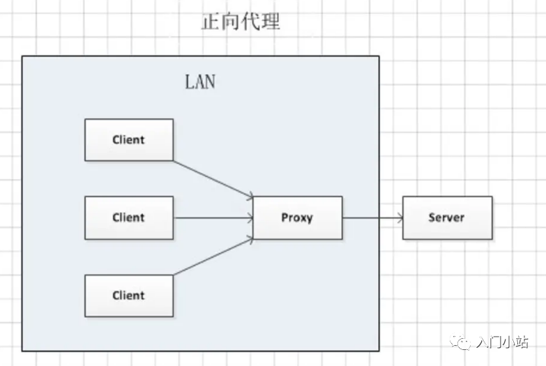

# Nginx

## 一、Nginx 简介

### 简介

> Nginx（“engine-x”）是一个轻量级、高性能的 HTTP 和反向代理服务器。

### 功能

- 反向代理
- 负载均衡

### 正向代理和反向代理

> 简单理解：客户端使用的代理为正向代理，服务端使用的代理为反向代理。
> 
> 概念：正向代理是位于客户端与目标服务器之间的中间服务器，客户端需要做特别设置；
> 用途：
> 突破访问限制；
> 提高访问速度（相同请求缓存）；
> 隐藏客户端真实信息；
> 
> 概念：反向代理服务器接收客户端的请求，将其分发至内部网络中的服务器。客户端无感知，不需要任何的设置。
> 用途：
> 负载均衡；
> 提高访问速度；
> 提供安全保障；
> 隐藏服务端真实信息；

### 负载均衡

概念：将请求进行分布式处理的策略；

```conf
upstream defaultServer {
server localhost:8087;
server localhost:8088;
server localhost:8089;
}

upstream weightServer {
server localhost:8087 weight=10;
server localhost:8088 weight=2;
server localhost:8089;
}

upstream ipHashServer {
ip_hash;
server localhost:8087;
server localhost:8088;
server localhost:8089;
}

location / {
root html;
index index.html index.htm;
proxy_pass http://defaultServer;
}
```

常见的负载均衡策略：
轮询：按请求时间逐一分配，默认策略；
权重：按照配置权重进行分配，权重越高被分配的可能性越大；
IP 哈希：按照请求 IP 进行 hash 计算，保障同一 IP 请求到相同服务；
用途：
分散流量，避免单点过载；
增强系统容错能力，自动剔除不健康服务；
增强可扩展性，随时增删服务器配置；
保持会话状态，比如 IP_HASH 策略可以保持用户与同一服务实例的连续通讯；
提供安全保护，作为真实服务的防火墙，过滤请求，防止 DDos 攻击；

### 逻辑能力

> 在基础能力之外，实现逻辑控制，则需要使用相关 Nginx 指令。
> 比如 if 语句实现逻辑分支：

```conf
location ~ ^/mcn { # 自动重定向 https
if ($http_x_forwarded_proto = http) {
         return 301 https://$server_name$request_uri;
 }
 try_files $uri $uri/ @mcnindex;
}
```

Nginx 本身指令存在限制：
if 语句不支持 else 逻辑分支
判断条件不支持与、或运算
不支持循环
不支持读取文件、数据库等
想要实现复杂的控制逻辑，则需要在 Nginx 本身之上进行扩展。

### 模块扩展

查看当前 Nginx 的配置参数

```shell
➜ ~ nginx -V
nginx version: nginx/1.19.7
built by clang 12.0.0 (clang-1200.0.32.29)
built with OpenSSL 1.1.1i 8 Dec 2020 (running with OpenSSL 1.1.1t 7 Feb 2023)
TLS SNI support enabled
configure arguments: --prefix=/usr/local/Cellar/nginx/1.19.7 --sbin-path=/usr/local/Cellar/nginx/1.19.7/bin/nginx --with-cc-opt='-I/usr/local/opt/pcre/include -I/usr/local/opt/openssl@1.1/include' --with-ld-opt='-L/usr/local/opt/pcre/lib -L/usr/local/opt/openssl@1.1/lib' --conf-path=/usr/local/etc/nginx/nginx.conf --pid-path=/usr/local/var/run/nginx.pid --lock-path=/usr/local/var/run/nginx.lock --http-client-body-temp-path=/usr/local/var/run/nginx/client_body_temp --http-proxy-temp-path=/usr/local/var/run/nginx/proxy_temp --http-fastcgi-temp-path=/usr/local/var/run/nginx/fastcgi_temp --http-uwsgi-temp-path=/usr/local/var/run/nginx/uwsgi_temp --http-scgi-temp-path=/usr/local/var/run/nginx/scgi_temp --http-log-path=/usr/local/var/log/nginx/access.log --error-log-path=/usr/local/var/log/nginx/error.log --with-compat --with-debug --with-http_addition_module --with-http_auth_request_module --with-http_dav_module --with-http_degradation_module --with-http_flv_module --with-http_gunzip_module --with-http_gzip_static_module --with-http_mp4_module --with-http_random_index_module --with-http_realip_module --with-http_secure_link_module --with-http_slice_module --with-http_ssl_module --with-http_stub_status_module --with-http_sub_module --with-http_v2_module --with-ipv6 --with-mail --with-mail_ssl_module --with-pcre --with-pcre-jit --with-stream --with-stream_realip_module --with-stream_ssl_module --with-stream_ssl_preread_module
```

Nginx 源码目录中 configure 用于配置参数，通过 --add-module 扩展 lua 支持，configure 可以根据当前系统生成对应的 Makefile 文件，其中包含了构建、安装 Nginx 的指令。通过--with-ld-opt 执行依赖库的搜索路径，比如 lua 模块是需要依赖于 LuaJIT。

```shell
./configure --prefix=/usr/local/Cellar/nginx/1.19.7 ...
--with-ld-opt="-Wl,-rpath,/path/to/luajit/lib"
--add-module=/opt/ngx_http_lua_module
make
make install
```

## 二、OpenResty

### 简介

> OpenResty(®) 是一个基于 Nginx 与 Lua 的高性能 Web 平台，其内部集成了大量精良的 Lua 库、第三方模块以及大多数的依赖项。用于方便地搭建能够处理超高并发、扩展性极高的动态 Web 应用、Web 服务和动态网关。
> ngx_http_lua_module 为 OpenResty 的核心模块，所以如果需要通过 lua 扩展 Nginx 能力，可以使用 OpenResty 进行支持；

### 常用组件

echo-nginx-module：向客户端输出信息，用于开发与测试场景验证；
lua-resty-redis-library：连接 redis 数据库，另外也有对应组件支持 Memcached、MySQL 等其他数据库；
headers-more-nginx-module：添加、删除、更改，请求头与响应头信息；
