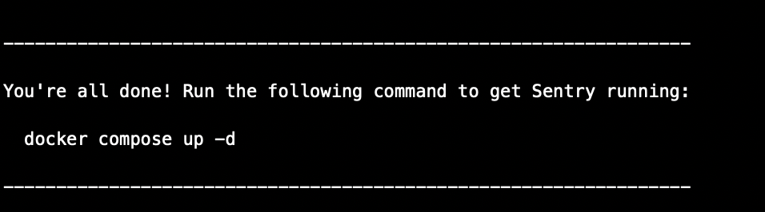
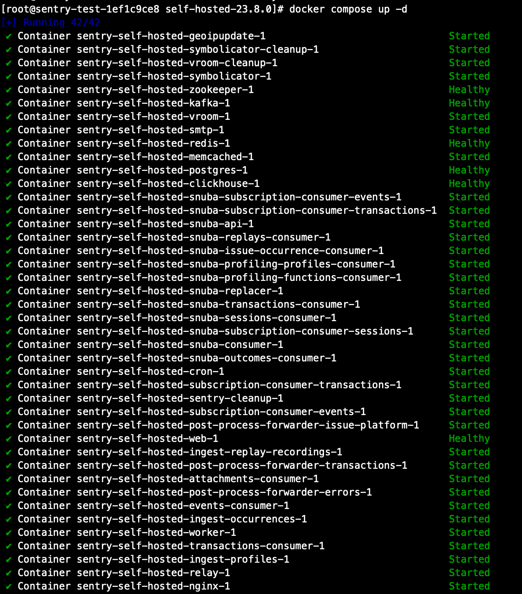
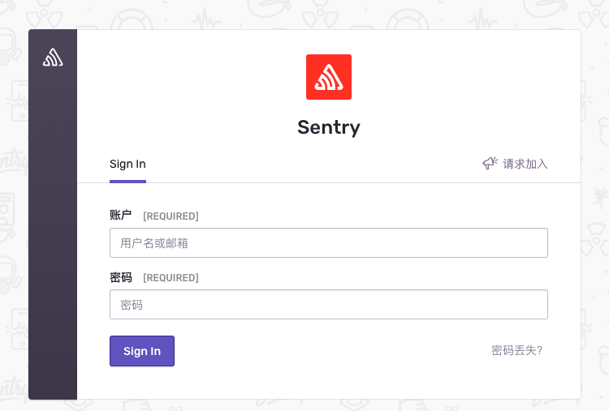
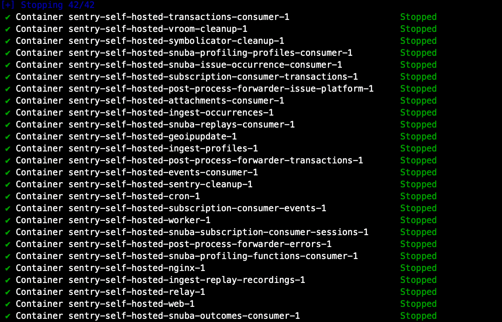
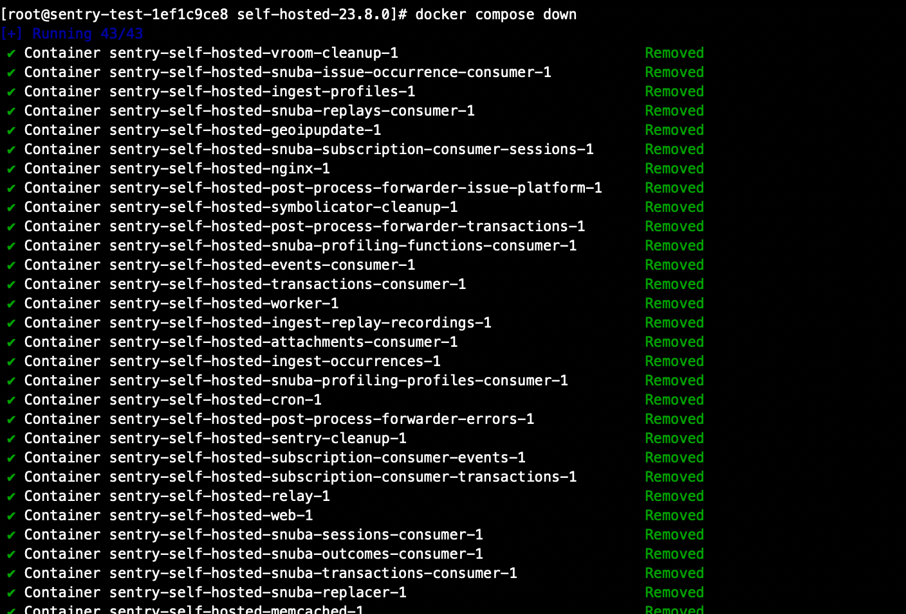
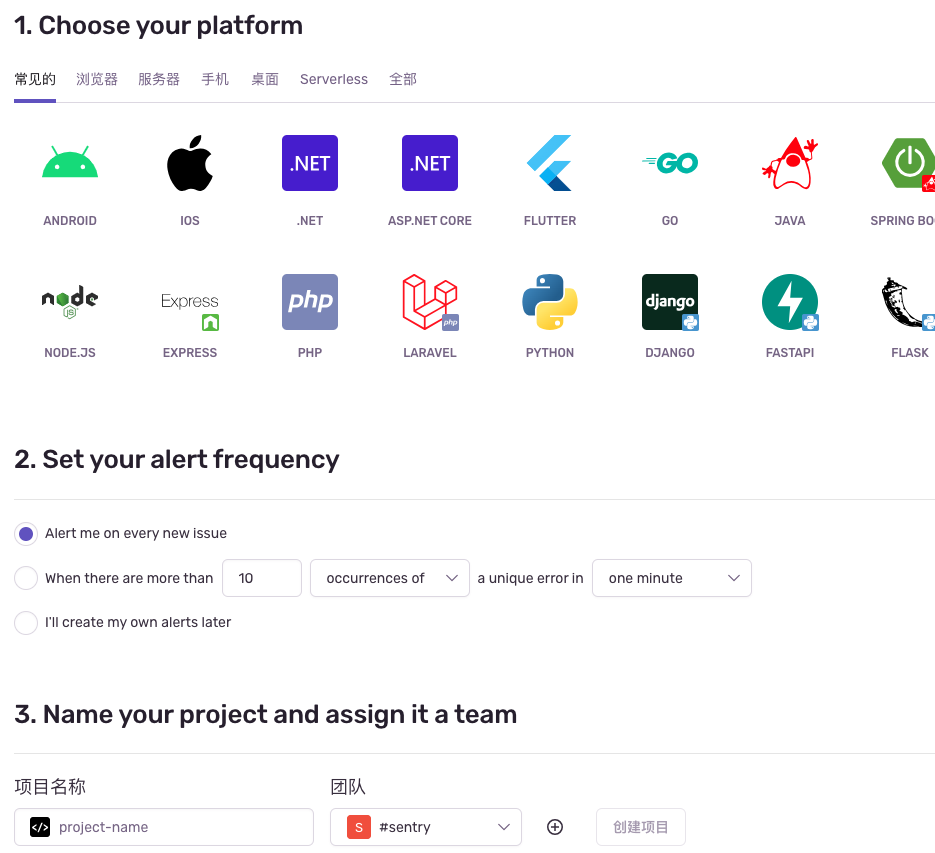
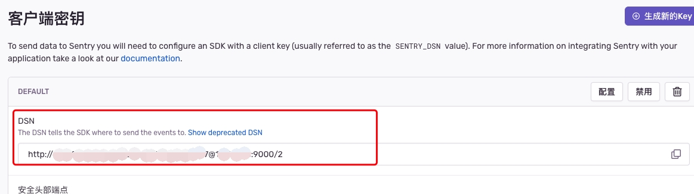

# 1. Sentry 监控框架

## 一、框架比较

|                                        | 是否免费                                       | 功能支持                             | 本地部署 | Browser JS | Node JS | Github Star    |
| -------------------------------------- | ---------------------------------------------- | ------------------------------------ | -------- | ---------- | ------- | -------------- |
| [Sentry](https://sentry.io/welcome/)   | 免费                                           | 错误监控<br/>性能分析<br/>回话重播   | ✅       | ✅         | ✅      | 34.9K          |
| [Cat](https://github.com/dianping/cat) | 免费                                           | 性能指标<br/>错误追踪                | ✅       |            | ✅      | 18K            |
| [Bugsnag](https://www.bugsnag.com/)    | 基础功能免费                                   | 用户监控<br/>错误监控<br/>稳定性管理 | ✅       | ✅         | ✅      | bugsnag-js 795 |
| [Rollbar](https://rollbar.com/)        | 每月 5000 事件、数据保留 30 天免费，基于云服务 | 错误检测、追踪、定位                 | ❎       | ✅         | ✅      | rollbar.js 550 |
| [Prometheus](https://prometheus.io/)   | 免费                                           | 指标监控预报警                       | ✅       | ❎         | ✅      | 49.6K          |

## 二、Sentry 功能列表

### 1）错误监控

- 错误收集，包含用户 UA，sourcemap 源码上下文
- 错误链路追踪，包含用户操作事件，发送请求
- 应用稳定性监控，包含用户、会话统计，故障率

### 2）会话重播

播放错误前后步骤

- 深度调试，包含步骤控制台输出、网络请求、DOM 节点

### 3）性能监控

- 性能监控指标
  - 服务器
  - 连续数据库查询，比如没有指定返回字段、没有查询条件
  - 慢速数据库查询
  - N + 1 查询，循环中调用数据库
  - 浏览器
  - 连续 HTTP 请求，一组顺序执行的 HTTP 加载序列
  - 大型 HTTP 请求负载
  - 大型阻塞渲染资源，比如过大的 JS 或 CSS 加载
  - N + 1 API 调用，如针对列表中每一项发送 HTTP 请求
  - 未压缩资源
- 全站追踪，前后端统一 Trace 追踪视图
- 提供性能问题上下文

### 4）性能分析

- 针对产生性能瓶颈的代码进行追踪记录
- 优化资源消耗，堆栈调用火焰图，定位 UI 卡顿代码
- 提供关键性能问题执行上下文信息

### 5）代码测试覆盖监测

- 结合 Codecov 跟踪未经测试代码

### 6）集成

- Github
  - 错误发布跟踪，提供错误关联的代码提交信息，包含更改文件、更改人
  - 错误关联 issue
- Grafana + Prometheus
  - 通过 Prometheus 采集的性能指标与 Sentry 统计信息整合，在 Grafana 仪表盘中进行可视化展示

## 三、本地化部署

### 1）机器要求

- Docker 19.03.6+
- Compose 2.0.1+
- 4 CPU Cores
- 8 GB RAM
- 20 GB Free Disk Space

[官方引导程序](https://github.com/getsentry/self-hosted#self-hosted-monitoring)

### 2）环境准备

1、安装 Python3 版本，Sentry 默认使用 Python3 版本；

```bash
yum install python3
```

2、安装 Docker；

```bash
# 安装 yum-utils 提供的 yum-config-manager 工具
yum install -y yum-utils
# 添加 docker 官方社区版本 repo
yum-config-manager --add-repo https://download.docker.com/linux/centos/docker-ce.repo
# 安装 docker
yum install docker-ce docker-ce-cli containerd.io docker-buildx-plugin
```

3、安装 docker-compose-plugin；

```bash
yum install docker-compose-plugin
```

4、安装 lrzsz 工具，用于上传 Sentry 安装包；

```bash
yum install -y lrzsz
```

### 3）Sentry 安装

1、上传安装包；
<https://github.com/getsentry/self-hosted/releases> 下载最新安装包

```bash
# 创建文件夹
mkdir /data/sentry
cd /data/sentry

# 上传安装包
# 解压
unzip self-hosted-23.8.0.zip
```

2、执行安装程序；

```bash
cd self-hosted-23.8.0
./install.sh
```

出现如下提示，则为安装成功


3、启动 Sentry；

```bash
# 在 sentry 根目录执行，-d 表示后台运行服务
docker compose up -d
```

所有容器变为 Started 或者 Healthy 则为成功启动

访问 机器 IP:9000 端口，会出现登录页面


4、停止 Sentry 服务；

```bash
# stop 仅仅停止服务，不会删除容器
docker compose stop
```



```bash
# down 命令停止服务并删除容器
docker compose down
```



## 四、服务对接

### 1）Node 中间层对接

1、创建项目；

登录 Sentry 管理后台， 选择对应的接入平台， 创建项目；


创建项目之后会生成唯一的 DSN 地址，用于初始化；

2、安装依赖；

```bash
pnpm add @sentry/node --save-dev
```

3、初始化 Sentry；

```js
import * as Sentry from '@sentry/node';

Sentry.init({
// 第一步创建项目生成的 dsn 地址
dsn: process.env.SENTRY_DSN,

    // 采样率，0~1，性能统计的 Transaction 投递占比
    // 测试设置为1，可以接收到每一次投递，生产环境可以适当降低
    tracesSampleRate: tracesSampleRate: process.env.NODE_ENV === 'production' ? 0.2 : 1.0,,

    // 集成配置
    integrations: [
      // 可以使用 autoDiscoverNodePerformanceMonitoringIntegrations 添加 node 服务对应的框架集成，但是因为文件IO操作读取信息，速度很慢，所以推荐手动根据对应系统进行手动配置, 只开启 Http 和 Mongo
      // 开启HTTP请求的分布式追踪
      new Sentry.Integrations.Http({
          tracing: {
              shouldCreateSpanForRequest: (url) => url.startsWith('/api'),
          }
      }),
      // mongo集成
      new Sentry.Integrations.Mongo({
        useMongoose: true,
      }),
    ],

});

app.use(Sentry.Handlers.tracingHandler());
```

安装 `@sentry/node` 依赖，并在项目入口 `main.ts` 中初始化项目，初始化应在创建 `app` 之后尽量靠前的位置；

4、错误投递；

http-exception.filter.ts

```ts
import * as Sentry from "@sentry/node";

@Catch(HttpException)
export class HttpExceptionFilter implements ExceptionFilter {
  private readonly logger: AppLogger = new AppLogger(HttpExceptionFilter.name, {
    timestamp: false,
  });

  catch(exception: HttpException, host: ArgumentsHost) {
    const ctx = host.switchToHttp();
    const response = ctx.getResponse<FastifyReply>();
    const request = ctx.getRequest<FastifyRequest>();
    const status = exception.getStatus();
    const exceptionMessage: any = exception.message;

    const responseJSON: ErrorJSONResponse = {
      code: exceptionMessage.code || RESPONSE.CODES.ERROR,
      msg: exceptionMessage.message || RESPONSE.MESSAGES.ERROR,
      data: null,
      ts: new Date().toISOString(),
      path: request.url,
    };

    if (process.env.NODE_ENV !== "production") {
      responseJSON.stack = exception.stack;
    }

    const user: User = request.raw["user"];
    // 设置 Sentry 作用域，仅仅只在本地投递中生效
    if (request.url.startsWith("/api")) {
      const user: User = request.raw["user"];
      Sentry.withScope((scope: Sentry.Scope) => {
        scope.setTag("exception-source", "http-exception-filter");
        user &&
          scope.setUser({
            id: user.id,
            email: user.email,
          });
        Sentry.captureException(exception);
      });
    }

    this.logger.error(`[exception: ${exception}]`);

    response.status(status).send(responseJSON);
  }
}
```

需要投递的错误信息分为如下几种：
1、运行时异常信息，初始化之后 Sentry 会自动进行投递；
2、非 200 请求，需要在 HttpExceptionFilter 中进行手动投递；
3、请求第三方接口返回非 A00000 请求，需要在对应 dao 中进行手动投递；
4、业务逻辑异常，不满足指定数据结构或者业务逻辑，需要手动投递；

5、性能统计；

sentry.http.interceptor.ts

```ts
@Injectable({ scope: Scope.REQUEST })
export class SentryHttpInterceptor implements NestInterceptor {
  intercept(
    context: ExecutionContext,
    next: CallHandler<any>
  ): Observable<any> | Promise<Observable<any>> {
    const req = context.switchToHttp().getRequest<FastifyRequest>();
    const { routerMethod, routerPath, hostname, raw, url } = req;
    const user = raw["user"];
    let transaction: Sentry.Span;

    if (!isHeartbeat) {
      const transaction = Sentry.getActiveTransaction();
      if (transaction) {
        // 默认按照访问请求真实路径，这里需要聚拢
        transaction.setName(`${routerMethod} ${routerPath}`);
      }
    }

    return next.handle().pipe(
      map((data) => {
        Sentry.withScope((scope: Sentry.Scope) => {
          // 性能事件中用户信息投递
          scope.setUser({
            id: user.id,
            email: user.email,
          });

          span.setStatus("ok");
          span.finish();

          // 请求状态
          transaction.setHttpStatus(HttpStatus.OK);

          // 附加接口返回code和msg信息
          transaction.setData("code", data.code);
          transaction.setData("msg", data.msg);
          transaction.finish();
        });
        return data;
      })
    );
  }
}
```

性能统计主要包含：
1、API 请求耗时，Sentry 未提供 Nestjs 框架的接入，需要通过拦截器的方式自行投递；
2、业务耗时，包含总耗时与分步耗时，针对关键业务进行统计；

### 2）Vue3 前端工程对接

1、创建项目；
参考 node 接入

2、安装依赖；

```bash
pnpm add @sentry/vue --save
```

3、Sentry 初始化；

main.ts

```ts
// ...
const app = createApp(App).use(store).use(router).use(MUI).use(logger);
const environment = import.meta.env.VITE_APP_NODE_ENV;
const isProduction = environment === "production";

Sentry.init({
  app,
  dsn: "http://获取的dsn@ip:9000/3",
  integrations: [
    new Sentry.BrowserTracing({
      // 路由性能投递
      routingInstrumentation: Sentry.vueRouterInstrumentation(router),
    }),
    // 会话回放集成
    new Sentry.Replay(),
  ],
  tracesSampleRate: isProduction ? 0.2 : 1.0,
  // trace 生效规则
  tracePropagationTargets: [/^\/api/],
  replaysSessionSampleRate: 0.1,
  replaysOnErrorSampleRate: 1.0,
  environment,
});

// ...
```

项目为多模块项目，所以不同模块的入口文件都需要进行初始化

4、更新用户信息；

src/common/stores/userStore.ts

```ts
// ...
actions: {
updateUser(user: User) {
this.user = user
window.myHawkeye &&
window.myHawkeye.updateSettings({
userInfo: `${this.userId}_${this.userName}`,
})
Sentry.setUser({
id: user.id || user.uid || '',
name: user.name,
email: user.email,
})
},
}
// ...
```

路由用户登录守卫通过后更新用户信息，此时需要设置 Sentry 用户信息，之后进行的投递都会携带相关用户信息；

5、请求异常错误投递；

src/common/utils/useRequest.ts

```ts
// ...
request.interceptors.response.use(
(response: AxiosResponse) => {
const isSuccess = response.data.code === 'A00000'
if (!isSuccess) {
// ...
Sentry.withScope((scope: Sentry.Scope) => {
// 设置标签标明错误来源
scope.setTag('exception-source', 'request')

        const error = new Error(
          `Cannot ${response.config.method?.toLocaleUpperCase()} ${
            response.config.url
          } with ${response.data.code}`,
        )

                // 投递错误信息，添加相应内容作为附加内容
        Sentry.captureException(error, {
          extra: response.data,
        })
      })

      throw new Error(
        `${errorPrefix}：${
          response.data?.message || response.data?.msg || '接口请求失败'
        }`,
      )
    }
    return response

},
// ...
```

6、上传 sourcemap 文件；
手动安装
(1) 安装 sentry vite 插件；

```bash
pnpm add @sentry/vite-plugin --save-dev
```

(2) 添加 Sentry Vite 配置；

vite.config.ts

```js
// ...
plugins: [
  // Vue3 单文件组件支持
  vue(),
  sentryVitePlugin({
    debug: true,
    org: "sentry",
    // 设置上传项目
    project: "project-name",
    // 鉴权 Token，设置 > 组织 > Custom Integrations 通过创建自定义集成获取
    authToken: "鉴权token",
    // Sentry 服务地址
    url: "http://ip:port/",
    // 对应版本
    release: {
      name: "1.0.0",
    },
  }),
  // ...
];
```

自动安装

```bash
npx @sentry/wizard@latest -i sourcemaps
```

打包构建时，生成的 js 文件中会嵌入 debug_id，在错误投递时会发送给 Sentry，Sentry 会通过该 ID 进行源文件与 sourcemap 文件的关联，展示具体错误的代码信息

### 3）分布式追踪

1、前端工程开启追踪；
main.ts

```ts
// ...
Sentry.init({
  app,
  dsn: "http://dsn@ip:9000/3",
  integrations: [
    new Sentry.BrowserTracing({
      // 路由性能投递
      routingInstrumentation: Sentry.vueRouterInstrumentation(router),
    }),
    new Sentry.Replay(),
  ],
  // ...
  // trace 生效规则
  tracePropagationTargets: [/^\/api/],
  // ...
});
// ...
```

(1) 前端入口文件需要添加 Sentry.BrowserTracing 集成即开启了追踪功能；
(2) tracePropagationTargets 字段针对页面发起的请求进行过滤，只有满足条件的请求才会在请求头中携带 sentry-trace 和 baggage 自定义头信息，需要保证该请求头在不同系统中进行流转，才能完成分布式追踪；

2、BFF 开启追踪；

src/main.ts

```ts
// ...
Sentry.init({
  // ...
  integrations: [
    new Sentry.Integrations.Http({ tracing: true }),
    new Sentry.Integrations.Mongo({
      useMongoose: true,
    }),
  ],
});
// ...
app.use(Sentry.Handlers.tracingHandler());
// ...
```

(1) 添加 HTTP 集成，并且开启 tracing；
(2)添加 tracingHandler 中间件，为每个请求创建 trace；

src/core/interceptors/sentry.http.interceptor.ts

```ts
// ...
@Injectable({ scope: Scope.REQUEST })
export class SentryHttpInterceptor implements NestInterceptor {
  intercept(
    context: ExecutionContext,
    next: CallHandler<any>
  ): Observable<any> | Promise<Observable<any>> {
    const req = context.switchToHttp().getRequest<FastifyRequest>();
    const { routerMethod, routerPath, raw } = req;
    const user = raw["user"];
    const isHeartbeat = routerPath === "/";
    let transaction: Sentry.Span;

    if (!isHeartbeat) {
      const transaction = Sentry.getActiveTransaction();
      if (transaction) {
        // 默认按照访问请求真实路径，这里需要聚拢
        transaction.setName(`${routerMethod} ${routerPath}`);
      }
    }

    return next.handle().pipe(
      map((data) => {
        if (!isHeartbeat && transaction) {
          Sentry.withScope((scope: Sentry.Scope) => {
            // 性能事件中用户信息投递
            scope.setUser({
              id: user.id,
              email: user.email,
            });
            transaction.setHttpStatus(HttpStatus.OK);
            // 附加接口返回code和msg信息
            transaction.setData("code", data.code);
            transaction.setData("msg", data.msg);
            transaction.finish();
          });
        }
        return data;
      })
    );
  }
}
// ...
```

(1)sentry 拦截器中， tracingHandler 创建 trace 后生成的 transaction 需要更改其 name 字段，保证按照理由规则进行投递，而不是真实路由，否则针对包含动态参数的路由不同的参数会投递至不同的统计中；
(2)在路由请求处理完成之后，添加用户信息并将事务置为完成状态，Sentry 会自动进行投递；

这样针对相同的 traceID 就可以看到从页面到服务不同的耗时，针对页面 traceID 是不会发生改变的；

## 五、报警通知

### 1）报警类型

问题警报（ Issue alerts）：发生问题并满足指定条件
指标警报（ Metric alerts）：指标到达指定阈值时

### 2）警报创建

暂不介绍

### 3）通知设置

通知包含几个部分：

- 报警：项目中设置的报警；
- 工作流：可以在问题详情中通过铃铛图标开启订阅、参与问题提交、被分配问题等，当问题状态发生流转，会接收到通知；
- 部署通知：代码新版本上线时接收通知，需要继承对应的代码管理平台；
- 配额通知：当错误、事务等配额达到阈值时进行通知；

以上通知都可以在用户设置中的通知选项中进行设置；

### 4）邮件服务配置

登录 Sentry 服务所在虚机进行操作；

1、更新 config.yml 文件；
2、更新 sentry.conf.py 配置；
更新 SENTRY_MAIL_HOST 环境变量配置
3、重启服务；

```bash
docker compose restart
```

4、查看当前邮箱配置，发送测试邮件；
可以点击左上角头像，选择管理，在 Mail 导航中查看当前邮箱配置是否生效，并且可以发送测试邮件；

### 5）飞书机器人配置

1、创建开发者应用；
<https://open.feishu.cn/app/>
创建企业自建应用；

2、开启应用机器人能力；
在权限控制中开启机器人如下权限：
获取群组信息
获取与发送单聊、群组消息

3、对接飞书机器人 Sentry 连接器；
<https://www.feishu.cn/hc/zh-CN/articles/443035335996-sentry-%E8%BF%9E%E6%8E%A5%E5%99%A8>
开启 Sentry 项目的 WebHooks 功能，在报警需要推送时向机器人的 hook 地址发送请求；

4、创建机器人发送消息指令；
<https://www.feishu.cn/hc/zh-CN/articles/348229340087-%E9%80%9A%E8%BF%87%E9%A3%9E%E4%B9%A6%E6%9C%BA%E5%99%A8%E4%BA%BA%E5%8F%91%E6%B6%88%E6%81%AF>
创建消息发送指令，选择已经创建的机器人应用，发送给创建人或者机器人所在群组；

5、针对群组发送消息；
机器人只能向自己或者所在群组发送消息，在群设置中的群机器人中选择添加机器人；
目前通过 Sentry 连接器的形式，不能实现多个用户的群发，目前群发只能通过对接飞书 OpenAPI 通过接口实现；

### 6）飞书分业务报警

Sentry 连接器存在的问题：Sentry 项目开启项目的 Webhooks 功能之后，当有 issue 创建，就会向该 url 推动数据，从而产生系统级别的报警。开发人员只关心系统相关模块，导致报警内容不具备针对性，导致报警内容被忽略；
解决方案：通过内置集成对接不同飞书机器人指令的方式按照业务模块进行报警；

1、创建 Webhook 触发器指令；
<https://www.feishu.cn/hc/zh-CN/articles/807992406756-webhook-%E8%A7%A6%E5%8F%91%E5%99%A8>
按照文档中的步骤创建 webhook 触发器指令，可以获取触发器对应的 webhook 地址，用于 Sentry 内置集成对接；

2、创建 Sentry 内置集成；
在 Sentry 设置->集成中，创建内部集成：
填入第一步中获取的 webhook 地址，开启 alert rule action，以便能够在报警规则中使用该内置集成发送错误信息；

3、创建业务告警规则；
创建告警规则，在满足业务告警条件时，通过该内部集成向飞书发送通知；

4、设置机器人接收信息 Json;
设置机器人接收 JSON 格式，以便编辑告警信息内容；JSON 内容可以来自于发送测试信息或者在 Sentry 文档中查看；

5、在 webhook 的下一步通过飞书机器人发送消息；
通过解析 Json 字段配置发送消息格式；

## 六、版本管理

### 1）仓库集成（Gitlab）

1、安装 Gitlab 集成；
设置 > 组织 > 集成 > Gitlab 点击安装

2、在 Gitlab 创建应用；
Gitlab 用户设置 Applications Tab 下，按照第一步进行应用的创建，获取 ApplicationID 和 Secret；

3、连接 Sentry 到 Gitlab 应用；
填写 Gitlab 地址，组路径，应用 ID 和密钥来自于第二步创建；
提交之后，在打开的确认框中点击允许授权；

4、添加需要追踪的仓库地址；

5、开启 Sentry 的 organizations:integrations-stacktrace-link 功能；
修改 Sentry 的配置文件
/data/sentry/self-hosted-23.8.0/sentry/sentry.conf.py
开启 integrations-stacktrace-link Flag 后才能进行源码映射；

6、重启服务；

```bash
docker compose restart
```

7、配置代码映射；
为不同的项目配置不同的仓库源代码映射，只有通过第 5 步，才会出现 Code Mappings 的选项卡；
需要保证错误栈 root 与源码 root 保持一致，这样才能定位到 gitlab 中源码位置；
当错误中可以正确跳转源码地址时，则配置成功；

8、更改代码入口和 Vite 配置，添加 release 相关配置；

main.ts

```ts
Sentry.init({
  app,
  dsn: "http://dsn@ip:9000/3",
  integrations: [
    new Sentry.BrowserTracing({
      routingInstrumentation: Sentry.vueRouterInstrumentation(router),
    }),
    new Sentry.Replay(),
  ],
  // trackComponents: true,
  tracesSampleRate: isProduction ? 0.2 : 1.0,
  // trace 生效规则
  tracePropagationTargets: [/^\/api/],
  replaysSessionSampleRate: 0.1,
  replaysOnErrorSampleRate: 1.0,
  environment,
  release: `${config.name}@${config.version}${isProduction ? "" : "-test"}`,
});
```

vite.config.ts

```ts
sentryVitePlugin({
  debug: true,
  org: "sentry",
  project: "project-name",
  authToken: "token",
  url: "http://ip:9000/",
  release: {
    name: `${process.env.npm_package_name}@${process.env.npm_package_version}`,
    setCommits: {
      auto: true,
    },
  },
});
```

9、验证；
错误详情中会显示可疑提交以及相关提交人；

### 2）自动发布管理（Jenkins）

问题：

1. 通过 vite 插件可以上传构建产物和 sourcemap 文件，并且通过 release 相关字段的设置创建对应的版本，命名方式采用 package_name@package_version，这样为了区分不同版本则需要每次手动修改 package.json 中的文件，才能区分错误究竟是哪个版本产生；
2. Vite 插件配置时并不能确定当前的构建环境，因为 test1~test6 是在构建步骤中通过环境变量进行指定，所以上传的文件会相互覆盖，如果直接取用环境变量，代码与配置分离也不容易进行维护；

解决：

1. 通过版本管理工具进行管理的项目，Sentry 推荐使用 commit id 来作为版本标识；
2. 通过 Sentry Cli 可以在发布时进行环境的指定；
   1、创建 Jenkins 内部集成；
   创建内部集成，并开通发布管理员权限与组织读取权限；
   点击保存后，生成令牌；

   2、在 QCD 的环境变量中添加凭证；
   由于没有权限在构建 Jenkins 添加全局凭证，我们可以通过在 QCD 构建中添加环境变量的方式进行设置；

   3、修改 QCD 构建命令；
   源文件上传、发布管理需要用到 Sentry Cli，通过官方提供的 curl 方式安装一直提示超时，我们也可以通过 npm 安装的方式，指定对应的镜像地址；

   4、修改入口文件注入版本与环境信息；
   在入口 html 文件 head 添加如下代码，将 Sentry 部署的环境与版本信息绑定在 windows 变量中，在构建时 Vite 的 vite-plugin-html 插件会将其中的 EJS 变量替换成系统环境变量，用于 Sentry SDK 的初始化；

   ```html
   <script type="text/javascript">
     window.SENTRY_ENVIRONMENT = "<%- process.env.SENTRY_ENVIRONMENT %>";
     window.SENTRY_RELEASE = "<%- process.env.SENTRY_RELEASE %>";
   </script>
   ```

   5、修改 SDK 初始化版本与环境信息；
   修改初始化代码，

   ```ts
   Sentry.init({
     // ...
     environment: window.SENTRY_ENVIRONMENT,
     release: window.SENTRY_RELEASE,
   });
   ```

   6、补充；
   使用 npm 镜像安装的方式依然可能存在访问超时的情况，目前的做法是下载 sentry cli 执行文件存放在项目中，目前使用的是 2.21.2 版本，存放在项目 scripts/sentry-cli，目前配置如下：

   ```yml
   # copy sentry cli 执行文件到 bin 目录下，该目录已经添加到$PATH 环境变量
   cp ./scripts/sentry-cli /usr/local/bin/

   # 为 sentry-cli 增加可执行权限
   chmod +x /usr/local/bin/sentry-cli

   export SENTRY_URL=http://10.71.13.6:9000/
   export SENTRY_ORG=sentry
   export SENTRY_PROJECT=tianji-admin-fe
   export SENTRY_ENVIRONMENT=${BUILD_ENV}
   export SENTRY_RELEASE=$(sentry-cli releases propose-version)

   # 可以在全局进行使用
   sentry-cli releases new -p $SENTRY_PROJECT $SENTRY_RELEASE

   npm install
   npm run build:${BUILD_ENV}

   sentry-cli sourcemaps inject ./dist
   sentry-cli releases set-commits $SENTRY_RELEASE --auto
   sentry-cli releases files $SENTRY_RELEASE upload-sourcemaps ./dist
   sentry-cli releases finalize $SENTRY_RELEASE
   sentry-cli releases deploys $SENTRY_RELEASE new -e $SENTRY_ENVIRONMENT

   sh ./scripts/nginx-config.sh ${BUILD_ENV}
   sh ./scripts/docker-ci.sh ${BUILD_ENV}
   ```

## 七、发现

针对已经投递的事件进行查询，并且针对创建的查询进行保存，并且可以选择将其创建为 dashboard 中展示的 widget；
预构建查询：Sentry 预构建的查询，不能删除；
查询保存：发现页面输入的查询过滤条件，可以保存为一个查询 card，会出现在 Saved Queres 列表中；
查询结果：点击进入查询卡，可以针对查询结果进行排序、列展示动态调整、导出结果，也可以将该查询设置为默认查询，进入发现页面直接展示该查询结果；

## 八、用户注册

1、打开主页，选择注册；
2、请求加入组织，等待管理员审批；
3、设置语言、时区、24 时；
