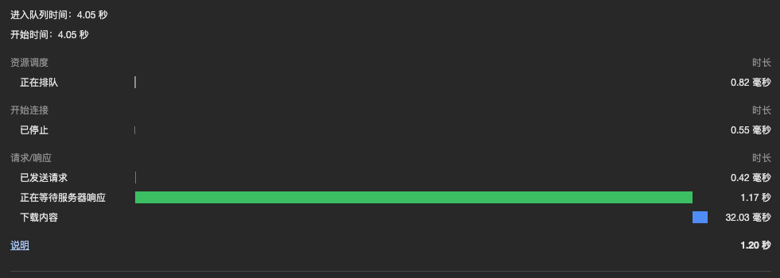
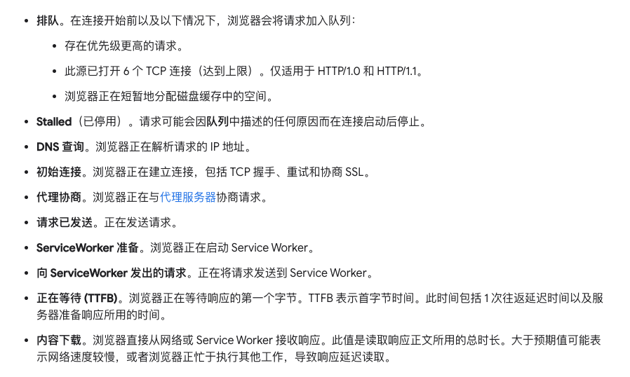

# 前端性能优化

## 1. 写在前面

> 随着系统的不断迭代，前端性能相关问题逐步凸显出来，项目也来到了新的阶段，对性能方面的诉求也逐渐提高，需要对性能问题进行逐步优化解决。

### 1.1 性能优化很重要

性能优化对于前端来讲还是很重要的，只是在一些情况下，都让步给了功能迭代，对前端工程师来讲很多时候并没有给予相应的重视。而这种情况相比于端上的前端工程师，后台系统或 ToB 系统的前端工程师更为严重。可能对于 PC 访问的后台系统来说，让用户等几秒貌似并不是很严重的问题（我们理所当然这么想）。
但从 To C 业务的经验，比如加载速度差距 100ms 都可能带来 10%的流量损失，其实性能问题还是很重要，谁又会乐意在屏幕前干等几秒才看到页面呢？

### 1.2 怎么入手？

那么又该怎么入手去做相关优化呢？想想页面渲染的过程：

1. 网络请求静态资源
2. 页面 Dom 树绘制
3. Cssom 树绘制
4. 渲染树绘制

那么相应的可能也从这几方面入手：

1. 网络请求耗时
2. 资源加载
3. 缓存的使用
4. 代码本身（css，js，html）
5. Dom 操作优化
6. 等等

回顾下雅虎 35 条军规

相关分析指标：
First Paint 首次绘制（FP）
First contentful paint 首次内容绘制 (FCP)
Largest contentful paint 最大内容绘制 (LCP)
First input delay 首次输入延迟 (FID)
Time to Interactive 可交互时间 (TTI)
Total blocking time 总阻塞时间 (TBT)
Cumulative layout shift 累积布局偏移 (CLS)

补充：

- FP (First Paint):
  FP 指的是浏览器首次绘制的时刻，这包括任何用户可以看到的变化，如背景色、边框颜色等的变化。它标志着浏览器渲染管道首次开始处理和呈现像素到屏幕上的点。这个指标是非常基本的，因为有时候首次绘制可能只是一个加载的背景，对用户来说并没有实际内容。
- FCP (First Contentful Paint):
  FCP 是指浏览器首次绘制来自 DOM 的内容。这些内容包括文本、图片、SVG 等，反映了用户能够看到页面上真正有意义的信息。FCP 提供了更接近用户真实体验的指标，因为它关注的是页面的可见内容而不仅仅是任何类型的渲染。用户能较早地看到页面内容通常会有更好的体验。
  FCP 是 FP 之后的一个阶段，通常 FP 发生之后，很快就会发生 FCP，但这两者之间的时间差距可以反映出页面加载的性能。如果 FP 和 FCP 之间的时间差很长，说明在首次绘制和显示实际内容之间有显著的延迟，这可能是由于 JavaScript 执行延迟、样式计算延迟等原因造成的。因此，从性能优化的角度来看，我们不仅要关注令 FP 尽可能早发生，还要让 FCP 紧随其后，以提供更流畅的用户体验。

## 2. 分析工具

### 2.1 浏览器控制台

DOMContentLoaded：DOM 树构建时间
Load：页面加载完毕时间
Finish：所有请求发送到响应完成时间
Shift+cmd+p 调出控制台扩展工具，可以解锁更多工具。

请求瀑布流：

### 2.2 Performance

打开浏览器控制台查看

### 2.3 Lighthouse

此次不展开讲解。

### 2.4 资源打包分析

webpack- bundle- analyzer
在代码进行相关配置。

## 3. 如何做性能优化

从页面表现上，前端性能主要体现在时间维度上，也就是最常见页面加载慢；交互卡顿；画面卡顿等等。针对当前业务来讲，页面平均加载时间都在 2-3s，可交互时间会更长，整体来讲是不合格的。

### 3.1 减少耗时

那从时间维度的角度来看，可以通过上面的分析工具逐步排查具体哪个流程耗时较多。页面的渲染过程，大家应该比较清楚，大概分为几个步骤：

1. 请求资源
2. 解析和渲染 html
3. 加载到相关 js 时会停止渲染并执行脚本
4. 触发交互，页面进行响应，可能还会进行上述流程

### 3.2 网络请求优化

从网络请求的角度，大致可以从以下几点进行优化：

1. 网络链路（包括 DNS 查询，CND 节点部署，缓存）
2. 资源加载（数量，大小，加载方式）
   网络链路上，对于天玑业务，主要还是从请求缓存，页面缓存，后端缓存几个方面考虑。DNS 和 C DN 层面，就目前的系统情况，没有太多优化空间。
   另外从网络请求并发数，目前已经对接口和静态资源域名进行了区分，还可以考虑使用 HTTP2.0 多路复用的能力。
   资源加载方面，首先要从请求数量入手，目前天玑系统的请求数量过多，影响加载速度。另外某些请求的耗时过大，可以考虑调整加载顺序，使用预加载，懒加载等方式进行优化。

综上可以考虑以下几种方案：

1. 优化 vite 打包方式减少请求，降低加载资源的大小
2. 第三方较大的包考虑预加载或者懒加载方式
3. 调整加载顺序，保证页面首屏渲染时间
4. 优化相关缓存
5. 图片优化
6. tree-shaking 等

### 3.3 渲染阶段优化

页面渲染流程 Dom 树构建，Cssom 树构建，页面绘制，js 运行相关逻辑，并重新调整节点并渲染。
渲染阶段又可以分为首屏渲染阶段和后续渲染（二次交互触发）
首屏渲染优化考虑两个指标减少白屏时间，缩短可交互时间。
可以考虑如下方面入手优化；

1. 页面节点精简
2. Css 相关优化
3. js 相关函数及逻辑优化，减少渲染阻碍时间
4. 按需加载，预加载，懒加载
5. 避免回流和重绘
6. Dom 操作优化

### 3.4 参考资料

<https://juejin.cn/post/7063754993072865287>
<https://juejin.cn/post/6911472693405548557?searchId=202402251354184632B32F507137BB0E80>
