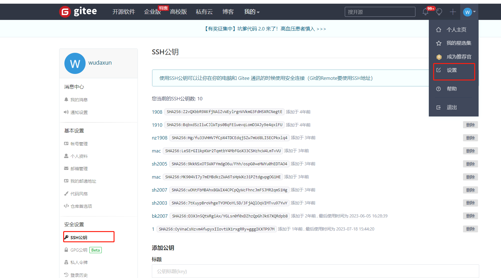
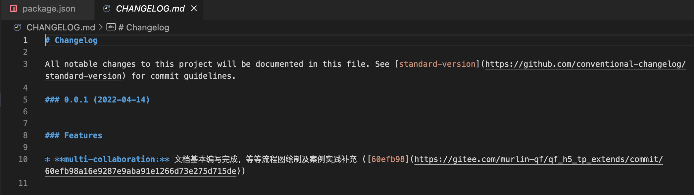

# 多人协作与分支管理（GIT）

在企业开发中多人协助和版本管理是贯穿整个程序员开发工作中不可或缺的部分。

在这里我们会来了解 版本管理的部分概念思想以及多人协作和分支管理的具体方式。

## 版本管理回顾

在企业中开发项目的时候, 项目代码在时间的基准上也需要根据功能或者时间点来对项目做出切片管理, 方便随时进行 "魔法操作", 即**版本管理**.


在项目开发的周期中, 每一次有意义的代码编写都应该以**commit**的方式来进行保存, 而完成某个特定的里程碑的时候, 又需要用一个一个**Tag**来进行更为特殊的标记。

这样就可以在项目的历史版本中根据commit或者tag来精准的找到某一个时间点的代码进行 **回退** 或者 **检出**。

`git commit -m  ''`

> 日常开发中commit应该是一个一个小功能小模块的提交, 而Tag往往代表版本的release

> commit的编写往往应该符合某种规范 (git commitizen)
>
> feat(main_page):完成了首页的开发...


## 分支管理回顾

项目开发过程中，因为可能会在同期同时开发多个功能，所以我们可以通过创建不同的分支来承载不同的开发需求，而这个方式也是没有一个特别固定的要求的。

比如可以根据时间来创建分支（someone_22-09-17），也可以根据需求来创建分支（Feat_main-page_wdx）

通过分支的合并处理可以将准备好的某些部分的代码整合到一起。

> 分支创建的策略和命名的方式也应该按照某种约定：Feature、Hotfix等

## ssh配置

* 打开 git 命令窗口

* 配置用户名（填自己的姓名）

  ```
  git config --global user.name “wangzezhen”
  ```

* 配置用户邮箱（填自己的邮箱）

 ```
  git config --global user.email “olvoq22@163.com”
 ```

* 生成公钥、秘钥（填自己的邮箱，执行后需要按几次 enter 直到结束）

```
ssh-keygen -t rsa -C “olvoq22@163.com”
```

* 打开生成公钥的文件夹

  windows:
  C:\Users%username%.ssh
  比如我的文件地址是 C:\Users\86188\.ssh

  * 复制公钥文件内容，公钥文件名
    id_rsa.pub
  * 登录git仓库，
  * 
  * 

​	输入密码验证即可，后期就可以使用 

## 多人协作

### 平台及仓库

在项目开发多人协作的过程中，往往需要在某一个特定的平台上进行远端仓库的管理。

市场上此类平台有很多：Github、Gitlab、Gitee等等。

平台会提供全套的仓库及版本管理方案，公司也会选择适合的平台来使用，各个平台的操作使用也是大同小异，下面都以Gitee为：

* 公司在Gitee上可以根据需要创建多个项目（体现为某些仓库），研发会根据分工加入到不同的仓库中进行开发。

* 仓库所有人可以给开发人员分配不同的身份：所有人、管理员、开发者等，每种不同的身份也对应有不同的权限。

* 仓库所有人也可以建立分支权限来保护分支，比如master分支只能由所有人来进行合并等操作。

> 新建组织、新建仓库、邀请成员等操作
>
> > * 创建组织-邀请组织成员
> >
> > * 创建仓库(选择组织)（javascript - node - mit，勾选readme.md）- 添加组织成员
> > * 本地克隆项目
> > * 打开项目，执行npm init -y
> > * 修改版本号 0.0.1
> > 
> >```sh
> > $ cnpm install -g commitizen cz-conventional-changelog
> > $ echo '{ "path": "cz-conventional-changelog" }' > ~/.czrc
> > # 主要, 全局模式下, 需要 ~/.czrc 配置文件, 为 commitizen 指定 Adapter.
> > $ cnpm install -D commitizen cz-conventional-changelog
> > # 
> > ```
> > 
> >* package.json中配置:
> > 
> >```
> > "scripts": {
> >     ...,
> >     "commit": "git-cz",
> > },
> >  "config": {
> >     "commitizen": {
> >       "path": "node_modules/cz-conventional-changelog"
> >     }
> >   }
> > ```
> > 
> >> 如果全局安装过 commitizen, 那么在对应的项目中执行 `git cz` or `npm run commit` 都可以.
> > 
> >* standard-version
> > 
> >```sh
> > $ cnpm i -g standard-version
> > $ cnpm i -D standard-version
> > ```
> > 
> >* Package.json配置
> > 
> >```
> > "scripts": {
> >     "release": "standard-version"
> >   }
> > ```
> > 
> >```
> > $ git add .
> > $ git cz
> > $ git push origin master
> > ```
> > 
> >* 发布版本
> > 
> >```
> > $ cnpm run release -- --release-as v0.0.2
> > $ git push --follow-tags origin master
> > ```
> > 
> >


### 环境与CICD

公司的往往会根据不同的使用场景来划分环境：
*  PROD (production):用户观看
*  UAT (user-acceptance-test)：用户接受度测试环境
*  TEST？
*  DEV (development)

DEV环境一般为自测环境，前后端同学将初步开发完成的代码分别up到各种仓库的DEV分支后，通过编译部署，就可以在DEV环境上run起来以便测试。

DEV中多个模块功能测试完成后，就可以将dev分支的代码Merge到UAT分支，编译部署后在UAT环境提供给产品经理验收或者进行公司内部的演示；当然也可以会在DEV -> UAT之间加入TEST环境由软测人员进行更为严格的测试。

当UAT中积攒的成熟功能准备发版的时候，就可以在uat中打出对应版本的Tag，然后将其Merge到Master分支，此时就可以将最新版本的代码部署到线上环境中了。


远端仓库中分支对应环境以及他们之间的关系我们就搞明白了，但是编译部署的过程是什么样的呢？

> 创建我们的分支
>
> uat 
>
> dev
>
> master设置为保护分支

Gitee中其实可以配置Continuous Integration (*CI*) / Continuous Delivery (*CD*)（持续集成/持续交付）来实现（Jenkins），即在merge或者push动作执行之后，平台可以通过提前设置好的配置来执行某些命令，对于前端来说，往往是：

1. 拉取对应分支的代码
2. 执行打包命令（如：npm run build）
3. 将打包后的代码文件传输到Web服务器部署的机器上解压并替换
4. 重新启动Web服务器


>  当然也可以配置一些Webhooks来监听这些merge和push的动作来实现一些特殊功能，比如部署成功后进行钉钉通知等等。


这样环境和CI/CD的流程我们就清楚了，master、uat、test？、dev分支的关系及对应的PROD、UAT、TEST？、DEV环境也明白了。

### 协作部分

分支策略指的就是研发团队的成员在开发项目的过程中创建分支与管理分支的方式，目前流行的有：

* GitFlow
* GithubFlow
* GitLabFlow

而GithubFlow及GitLabFlow更像是GitFlow的简易版本。


#### 实际应用

假设我们的项目现在已经构建好了，此时master上的Tag为 0.0.2，并且决定开发上线1.0版本，版本功能要求有首页，商品列表页，商品详情页；

此时通过激烈的讨论，定下研发周期为2个月，包含产品设计产出PRD(产品原型图  https://www.axureshop.com/)、设计师产出高精度设计图、研发人员进行研发测试的时间。

当PRD和设计图持续产出的过程中，我们就可以开始开发代码了，现在准备交给 A小组关于首页和详情页的开发。

> 此时master、uat、dev分支都必须是相同的，为了保证这一点，一般会再次将master代码分别merge到uat和dev上。----- 提交pr/mr

> 研发过程中对工作任务全局管控，需要使用专业的工具来辅助，例如[JIRA](https://www.atlassian.com/zh/software/jira)或禅道、Tower、Worklite等。
>
> 设计图现在比较流行[Figma](https://www.figma.com/)

#### 场景1 分支准备

根据开发需求，组长 大勋 做出计划并划分任务分配给对应的组员。

相关功能开发的组员会从dev上拉取一个新的Feature分支来进行功能代码的开发。

比如针对详情创建了Feature_detail分支；daxun和 wangzezhen 负责详情页的开发

远程创建了 Feature_detail 分支以及 Feature_detail_daxun Feature_detail_wangzezhen


> 此时Feature_detail分支将存放及管理详情页的代码。

为了避免混乱，daxun和wangzezhen根据Feature_detail各自创建了Feature_detail_daxun和Feature_detail_wangzezhen分支；

虽然首页只有daxun一个人开发，但他是个有原则的人，为了避免之后其他人员来参加开发时出问题，所以daxun也根据Feature_main创建了Feature_main_daxun分支。


##### 场景2 Feature分支合并

其他人克隆项目


daxun和wangzezhen开发页面的时候，完成部分代码后，需要分别将其提交到对应的远端分支（Feature_detail_daxun&Feature_detail_wangzezhen），然后在平台上通过提交一个MR来合并到Feature_detail上。

同样的事情也会发生在其他的Feature分支，如daxun负责的Feature_main分支。


> MR的合并的时候，需要相关的负责人来进行Code Review后再确认合并。

#### 场景3 冲突的产生与解决

在detail页面开发的过程中，可能会出现这样的情况，leijing在自己的Feature_detail_leijing分支中将utils.js的部分内容进行了编写：

```js
const a = 1; 
```

然后本地代码提交到远端后合并到了远端的Feature_detail。

daxun也在自己本地的Feature_detail_daxun分支对utils.js文件编写后提交到远端的Feature_detail_daxun分支：

```js
const a = 2;
```

在daxun尝试将Feature_detail_daxun分支Merge到Feature_detail的时候，冲突诞生了。


其实在这个过程中，daxun忽略了一个事情：

在准备将自己分支的代码合并到远端公共分支的时候，应该先在本地pull下该远端分支后，本地尝试merge一次，有冲突解决冲突后再提交代码到远端后提交MR。

当Feature_main和Feature_detail的功能开发完成准备up到DEV测试环境的时候，需要将这两个分支的代码合并到dev分支上，此时也可能会出现上述的问题，所以需要Seven和Taro在本地尝试merge dev后再进行。


> 往往在某个成员准备将自己分支的代码合并到远端公共分支的时候，应该主动告知其他组员自己的动作，提醒其他组员及时pull公共分支到本地进行同步。

> 解决冲突的人，往往是最后一个提交代码的人~


#### 场景4 提交测试

 各个Feature分支在不断的合并到Dev分支的过程就是项目开发的过程，某些功能开发完成后就需要提交MR到对应的Test或者UAT分支以便测试。

测试人员（软测或产品）测试后提交测试报告反馈到研发后，研发会进行调整，然后再次执行上面所说的流程进行测试。

#### 场景5 发版上线

经过两个月的研发和测试，项目终于准备发布1.0版本，Seven，Taro和Dejia都已经做好了加班的准备。

前端Leader在确认UAT环境（对应uat分支）的代码无误可以发版后，需要做的事情有：

* 生成changelog
* 更改版本号
* 提交Release
* 打1.0.0Tag
* 合并到master分支准备上线

> 上面的步骤可以利用standard-version工具来快速完成

```
$ cnpm run release -- --release-as v0.0.2
$ git push --follow-tags origin uat
```


#### 场景5 线上Bug修复与维护

上线之后出现的优化或者功能增加、调整，产品经理考量后会放在需求池中，排期后进行下次开发，攒够一波就搞1.1.0依次更新，当更新较多且项目整体变动较大的时候会进行迭代，即开发2.0.0。

上线出现的Bug需要及时修复，此时再走一遍之前的开发流程很明显不太敏捷，此时应该采取热修复的方式来处理，即Hotfix。

例如，实习生Dejia写了一个Bug在线上被发现了，此时就应该马上从master分支拉出一个Hotfix_xxx分支修复问题，然后进行与发版一样的动作。

此时，master的Tag为1.0.1，注意修复后也要及时将该Hotfix分支合并到dev分支中来。


### 总结

多人协作的开发遵循GitFlow后会变得很有条理，一定要记得遵守规则，还有就是**实时同步**。

> 实时同步是指，远端的公共分支与自己本地的分支尽可能要保持一致，当远端该类分支有更新后，本地的分支应该都要pull一下，自己当前的开发分支也应该merge一下本地已经同步过的公共分支，保证代码一致。

# 拓展

```
场景一：如果想将代码恢复到之前某个提交的版本，且那个版本之后提交的版本都不要了，就可以使用 git rest

原理： git reset的作用是修改HEAD的位置，即将HEAD指向的位置改变为之前存在的某个版本

操作：

1. 查看版本号：git log，也可以上代码托管网页上查看history，找到需要回滚的目标版本号

2. 使用“git reset --hard 目标版本号”命令将版本回退

3. 使用“git push -f”提交更改，此时如果用“git push”会报错，因为我们本地库HEAD指向的版本比远程库的要旧，用“git push -f”强制推上去。

场景二：如果我们想撤销之前的某一版本，但是又想保留该目标版本后面的版本，记录下这整个版本变动流程，就可以用这种方法。

原理：我们commit了三个版本（版本一、版本二、 版本三），突然发现版本二不行（如：有bug），想要撤销版本二，但又不想影响撤销版本三的提交，就可以用 git revert 命令来反做版本二，生成新的版本四，这个版本四里会保留版本三的东西，但撤销了版本二的东西。

操作：

1. 查看版本号：git log，也可以上代码托管网页上查看history，找到需要撤销的目标版本号

2. 使用“git revert -n 版本号”反做，并使用“git commit -m 版本名”提交：
（1）反做，使用“git revert -n 版本号”命令。

注意： 这里可能会出现冲突，那么需要手动修改冲突的文件。而且要git add 文件名。
（2）提交，使用“git commit -m 版本名”

3. 使用“git push”推上远程库：
```

```
我们在使用git命令的时候，有时候误输入命令，导致需要回退到之前的状态。现在针对这种情况做一个汇总：
1. Git add回退
git status 先看一下add中的文件，确定已经添加的文件。
git reset HEAD 如果后面什么都不跟的话，就是add已添加的全部撤销。
git reset HEAD xxx.cpp 只撤销所列出的文件。

2. Git commit回退
git reset --soft HEAD^
这样就成功的撤销了你的commit。注意，仅仅是撤回commit操作，您写的代码仍然保留。

HEAD^的意思是上一个版本，也可以写成HEAD~1，如果你进行了2次commit，想都撤回，可以使用HEAD~2
--mixed 不删除工作空间改动代码，撤销commit，并且撤销git add . 操作，这个为默认参数,git reset --mixed HEAD^ 和 git reset HEAD^ 效果是一样的。
--soft  不删除工作空间改动代码，撤销commit，不撤销git add .
--hard 删除工作空间改动代码，撤销commit，撤销git add .

顺便说一下，如果commit注释写错了，只是想改一下注释，只需要：
git commit --amend

3. Git review回退
git checkout [分支名] 切换到需要回退的分支
git log 查看提交记录
git reset --hard 代码回退
git reset --hard [commit id] 复制最近提交的上一条提交记录的commit id
git review 重新提交修改

4. Git rebase回退
git reflog 先查看本地提交操作编号。
找到提交前的项目编号，例如4c173eb HEAD@{3}: commit: scan ，执行：git reset --hard 4c173eb

5. Git cherry-pick回退
git cherry-pick --abort.
```


# 附录


## commitizen

#### 全局安装

```shell
npm install -g commitizen cz-conventional-changelog
echo '{ "path": "cz-conventional-changelog" }' > ~/.czrc
```

主要, 全局模式下, 需要 ~/.czrc 配置文件, 为 commitizen 指定 Adapter.

#### 项目级安装

```shell
npm install -D commitizen cz-conventional-changelog
```

package.json中配置:

```json
"script": {
    ...,
    "commit": "git-cz",
},
 "config": {
    "commitizen": {
      "path": "node_modules/cz-conventional-changelog"
    }
  }
```

如果全局安装过 commitizen, 那么在对应的项目中执行 git cz or npm run commit 都可以.


### standard-version

#### 1.全局安装

```shell
npm i -g standard-version
```

#### 2、根目录添加`package.json`文件

```json
{
  "scripts": {
    "release": "standard-version"
  }
}
```

#### 3、发布版本

```npm
npm run release -- --release-as v1.0.0
```

运行后，会自动生成一个提交并打上对应的`tag`





## 思考

1. 为什么使用 Git。
2. 什么是版本管理。
3. 怎么使用Git。
4. 环境与平台。
5. 分支管理策略 GitFlow。
6. 分支合并
7. 冲突的产生条件与解决方式以及如何避免
8. 发版流程
9. 线上Bug与Hotfix。


what why how
