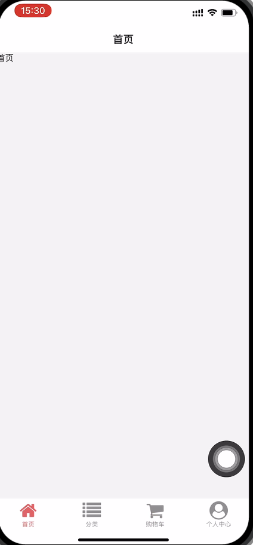
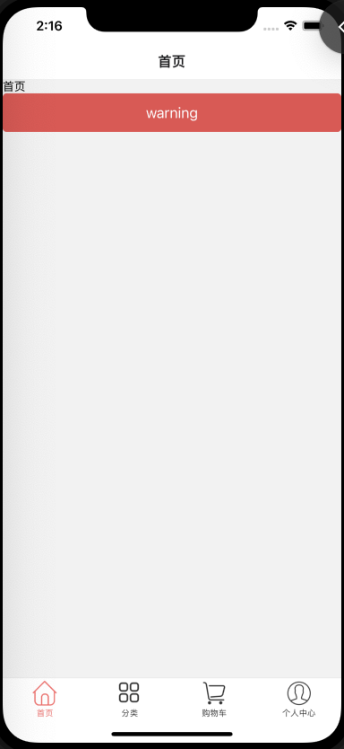

# 1前言

> 本小册是《许墨大前端小册》系列之 React Native 部分。内容包含RN基础和项目实战两个部分。通过本小册，可以系统学习 RN 基础知识和在项目中的应用。
>
> https://www.react-native.cn/
>
> https://docs.expo.dev/versions/v47.0.0/sdk/device/

# 2起步
本节将帮助您安装和构建第一个 React Native 应用程序。如果您已经安装了 React Native，那么可以跳过本教程。

如果你是移动开发新手，最简单的入门方法是使用Expo CLI。Expo是一套围绕React Native构建的工具，虽然它有很多功能，最基础的功能是它可以让你在几分钟内编写一个React Native应用程序。你只需要Node.js的最新版本和一个手机或模拟器。如果您想在安装任何工具之前直接在web浏览器中试用React Native，可以试用[Snack](https://snack.expo.io/ Snack)。

如果您已经熟悉移动开发，那么可能需要使用React Native CLI。它需要Xcode或Android Studio才能启动。如果你已经安装了其中一个工具，您应该能够在几分钟内启动并运行。如果没有安装，您应该花大约一个小时来安装和配置它们。

## 2.1使用 Expo CLI
假设已安装 Node.js 12 LTS或更高版本，则可以使用npm安装Expo CLI命令行实用程序：

```
npm install -g expo-cli
```

然后运行以下命令，创建一个名为“rn-basic”本地项目：

```
expo init rn-basic

cd rn-basic
npm start # 也可以使用命令: expo start
```

此时会启动一个开发服务器。


**如果你不希望安装脚手架，可以通过 npx 创建项目**

```
npx expo init rn-basic
```


## 2.2运行 React Native 应用程序
在iOS或Android手机上安装[Expo](https://docs.expo.io/versions/v36.0.0/get-started/installation/ Expo)客户端应用程序，并连接到与计算机相同的无线网络（Wifi热点）。在Android上，使用Expo应用程序从终端扫描二维码以打开项目。在iOS上，按照屏幕上的说明（一般为使用相机扫描）获取链接。

```
cd rn-basic
yarn start

 Press a │ open Android
› Press i │ open iOS simulator
› Press w │ open web

› Press r │ reload app
› Press m │ toggle menu
› Press d │ show developer tools
› shift+d │ toggle auto opening developer tools on startup (enabled)
```

下载真机测试工具： https://expo.dev/tools

**前提条件是手机和电脑处于同一个局域网**

运行项目生成一个二维码，andorid手机直接使用软件的扫一扫功能，扫描二维码即可

ios使用 照相机应用程序 扫描二维码，注意手机端的提示信息，直接点击打开即可

### 修改你的程序
现在你已经成功运行了应用程序，让我们修改一下代码试试。在文本编辑器中打开 App.js 并编辑一些行。保存更改后，应用程序会自动重新加载。

# 3基础知识
React Native 与 React类似，但它使用原生(native)组件而不是基于浏览器(web)组件作为构建块。因此，要了解 React Native 应用程序的基本结构，您需要了解一些基本的 React 概念，如JSX、组件、状态和属性。如果你已经了解 React，那么你仍然需要学习一些 React Native 特定的东西，比如 原生(Native) 组件。本教程面向所有人群，无论你是否有 React 经验。

## Hello World
编程界的老习惯，先来个 Hello World 尝尝鲜：

```jsx
// App.js
import { StatusBar } from 'expo-status-bar';
// 行内元素 Text
// 块级元素 View
// 文本不可以直接使用,需要使用Text包裹
import { StyleSheet, Text, View } from 'react-native';

export default function App() {
  return (
    <View style={styles.container}>
      <Text >hello world</Text>
      <StatusBar style="auto" />
    </View>
  );
}

//  StyleSheet.create 创建组件内的样式
// rn中默认的布局是 弹性盒布局,不需要写 display: 'flex'
// 且rn中的默认的flex布局为垂直方向上的弹性盒布局
const styles = StyleSheet.create({
  container: {
    flex: 1,
    backgroundColor: '#fff',
    // alignItems: 'center',
    // justifyContent: 'center',
  },
});

```

如果你感到好奇，这不就是React程序吗？是的，可以直接在web模拟器中运行这段代码。也可以将其粘贴到App.tsx文件中，以便在本地计算机上创建真正的原生应用程序。

> rn中不要使用class作为样式处理

## 奇葩的语法

这里的一些内容看来可能不像 JavaScript。别慌。这就是未来。

首先，ES2015（也称为ES6）是对JavaScript的一系列改进，ECMAScript 现在是官方标准的一部分，但还没有得到所有浏览器的支持。React Native ships 支持 ES2015，因此你可以使用这些内容而不必担心兼容性。上述示例中的import、from、class 和 extends 都是ES2015的特性。如果你不熟悉ES2015，你也可以通过阅读本教程中的示例代码来了解它。

在这个代码示例中，另一个不寻常的事情是`<View><Text>Hello world！</Text></View>`。这是JSX——一种在JavaScript中嵌入XML的语法。许多框架使用一种专门的模板语言，允许您在标记语言中嵌入代码。在React中，没有使用模板。JSX允许您在代码中编写标记语言。它看起来像web上的HTML，但这里使用的是React组件，而不是像`<div>` 或 `<span>`这样的 HTML 标签。在本例中，<Text>是一个内置组件，它显示一些文本，类似于`<div>`或`<span>`。

## 组件
这段代码定义了HelloWorld App，这是一个新组件。当你在构建一个 React 本地应用程序时，你将大量地生成新组件。你在屏幕上看到的任何东西都是某种组件。

# 4Props
大多数组件在创建时都可以使用不同的参数进行自定义。这些创建参数称为props，是properties的缩写。
例如，一个基本的React Native 组件 Image。创建图像时，可以使用名为source的属性来控制它显示的图像。

https://www.react-native.cn/docs/image

用于显示多种不同类型图片的 React 组件，包括网络图片、静态资源、临时的本地图片、以及本地磁盘上的图片（如相册）等。

```js
import { StatusBar } from 'expo-status-bar';
import { StyleSheet, Text, View, Image } from 'react-native';

export default function App() {
  return (
    <View style={styles.container}>
      <Text >访问本地资源图片 - require - 需要设置图片的宽高</Text>
      <Image style={ styles.img1 } source={ require('./assets/icon.png') } />
      <Text>访问网络资源</Text> 
      <Image style={ styles.img2 } source={{ uri: 'https://www.react-native.cn/img/header_logo.svg' }} />
      <Text>base64格式图片</Text> 
      <Image style={ styles.img2 } source={{ uri: 'data:image/png;base64,iVBORw0KGgoAAAANSUhEUgAAADMAAAAzCAYAAAA6oTAqAAAAEXRFWHRTb2Z0d2FyZQBwbmdjcnVzaEB1SfMAAABQSURBVGje7dSxCQBACARB+2/ab8BEeQNhFi6WSYzYLYudDQYGBgYGBgYGBgYGBgYGBgZmcvDqYGBgmhivGQYGBgYGBgYGBgYGBgYGBgbmQw+P/eMrC5UTVAAAAABJRU5ErkJggg=='}} />
      <StatusBar style="auto" />
    </View>
  );
}

const styles = StyleSheet.create({
  container: {
    flex: 1,
    backgroundColor: '#fff',
    paddingTop: 20
  },
  img1: {
    width: '100%',
    minHeight: 200
  },
  img2: {
    width: 100,
    minHeight: 100
  }
});

```

注意将变量嵌入到JSX中。您可以将任何JavaScript表达式放在JSX中的大括号中。
你自己的组件也可以使用 props。这允许你创建一个在应用程序中的许多不同位置使用的组件，每个组件的属性可以略有不同，获取值可以在渲染函数中引用This.props。

`View` 常用作其他组件的容器，来帮助控制布局和样式。

仅仅使用 `props` 和基础的`Text`、`Image` 以及 `View`组件，你就已经足以编写各式各样的 UI 组件了。要学习如何动态修改你的界面，那就需要进一步学习 State（状态）的概念。

涉及了 父子组件的传值，有必要**校验父组件给子组件的传值问题**

// vue 数据类型。设置默认值 必传项 自定义验证器

// react 自react15.5版本开始，从react中分离出了一个 prop-types 模块

> 本案例中使用ts作为脚本，不需要使用 `prop-types`模块

# 5.State

我们使用两种数据来控制一个组件：props 和 state。props是在父组件中指定，而且一经指定，在被指定的组件的生命周期中则不再改变。对于需要改变的数据，我们需要使用state。

一般来说，你需要在class中声明一个state对象，然后在需要修改时调用setState方法 --- `以前`

假如我们需要制作一段不停闪烁的文字。文字内容本身在组件创建时就已经指定好了，所以文字内容应该是一个prop。而文字的显示或隐藏的状态（快速的显隐切换就产生了闪烁的效果）则是随着时间变化的，因此这一状态应该写到state中。

```jsx
import { StatusBar } from 'expo-status-bar'
import { useEffect, useState } from 'react'
import { StyleSheet, View, Text } from 'react-native'

const styles = StyleSheet.create({
  container: {
    flex: 1,
    backgroundColor: '#fff'
  },
  myText: {
    fontSize: 30
  }
})
const getColor = () => {
  const color = `rgba(${100 + Math.random()* 155} , 
    ${100 + Math.random()* 155},
    ${100 + Math.random()* 155},
    0.6)`
  return color
}
const Child = (props) => {
  return (
    <Text style={{...styles.myText, color: getColor()} }>{ props.title }</Text>
  )
}

export default function App () {
  const [show, setShow] = useState(false)
  useEffect(() => {
    const timer = setInterval(() => {
      setShow(!show)
    }, 500)
    return () => {
      clearInterval(timer)
    }
  }, [show])
  return (
    <View>

      { show ? <Child title="1111"/> : null }
      { show ? <Child title="2222"/> : null }
      { show ? <Child title="3333"/> : null }
    </View>
  )
}
```


实际开发中，我们一般不会在定时器函数（setInterval、setTimeout 等）中来操作 state。典型的场景是在接收到服务器返回的新数据，或者在用户输入数据之后。你也可以使用一些“状态容器”比如`Redux`来统一管理数据流。

每次调用setState时，App 都会重新执行 render 方法重新渲染。这里我们使用定时器来不停调用setState，于是组件就会随着时间变化不停地重新渲染。

State 的工作原理和 React.js 完全一致，所以对于处理 state 的一些更深入的细节，你可以参阅React.Component API。

# 6样式
在 React Native 中，你并不需要学习什么特殊的语法来定义样式。我们仍然是使用 JavaScript 来写样式。所有的核心组件都接受名为 style 的属性。这些样式名基本上是遵循了 web 上的 CSS 的命名，只是按照 JS 的语法要求使用了驼峰命名法，例如将 background-color 改为 backgroundColor。

style属性可以是一个普通的 JavaScript 对象。这是最简单的用法，因而在示例代码中很常见。你还可以传入一个数组——在数组中位置居后的样式对象比居前的优先级更高，这样你可以间接实现样式的继承。

实际开发中组件的样式会越来越复杂，我们建议使用 `StyleSheet.create` 来集中定义组件的样式。比如像下面这样：

```js
// 同上述案例
```

# 7宽度(Width) 和 高度(Height)

组件的高度和宽度决定了其在屏幕上显示的尺寸。

## 指定宽高

最简单的给组件设定尺寸的方式就是在样式中指定固定的 `width` 和 `height`。React Native 中的尺寸都是无单位的，表示的是与设备像素密度无关的逻辑像素点。

```js
import React, { Component } from 'react'
import { View } from 'react-native'

export default class App extends Component {
  render() {
    return (
      <View>
        <View style={{width: 50, height: 50, backgroundColor: 'powderblue'}} />
        <View style={{width: 100, height: 100, backgroundColor: 'skyblue'}} />
        <View style={{width: 150, height: 150, backgroundColor: 'steelblue'}} />
      </View>
    )
  }
}
```

这样给组件设置尺寸也是一种常见的模式，比如要求在不同尺寸的屏幕上都显示成一样的大小。

## 弹性（Flex）宽高

在组件样式中使用flex可以使其在可利用的空间中动态地扩张或收缩。一般而言我们会使用flex:1来指定某个组件扩张以撑满所有剩余的空间。如果有多个并列的子组件使用了flex:1，则这些子组件会平分父容器中剩余的空间。如果这些并列的子组件的flex值不一样，则谁的值更大，谁占据剩余空间的比例就更大（即占据剩余空间的比等于并列组件间flex值的比）。

> 组件能够撑满剩余空间的前提是其父容器的尺寸不为零。如果父容器既没有固定的width和height，也没有设定flex，则父容器的尺寸为零。其子组件如果使用了flex，也是无法显示的。

```js
import React, { Component } from 'react'
import { View } from 'react-native'

export default class App extends Component {
  render() {
    return (
      // 试试去掉父 View 中的`flex: 1`。
      // 则父View不再具有尺寸，因此子组件也无法再撑开。
      // 然后再用`height: 300` 来代替父 View 的 `flex: 1` 试试看？
      <View style={{flex: 1}}>
        <View style={{flex: 1, backgroundColor: 'powderblue'}} />
        <View style={{flex: 2, backgroundColor: 'skyblue'}} />
        <View style={{flex: 3, backgroundColor: 'steelblue'}} />
      </View>
    )
  }
}
```


# 8使用 flexbox 布局

我们在 React Native 中使用 flexbox 规则来指定某个组件的子元素的布局。Flexbox 可以在不同屏幕尺寸上提供一致的布局结构。

一般来说，使用 `flexDirection`、`alignItems` 和 `justifyContent` 三个样式属性就已经能满足大多数布局需求。

> React Native 中的 Flexbox 的工作原理和 web 上的 CSS 基本一致，当然也存在少许差异。首先是默认值不同：flexDirection的默认值是column而不是row，而flex也只能指定一个数字值。

## Flex

flex 属性决定元素在主轴上如何填满可用区域。整个区域会根据每个元素设置的flex属性值被分割成多个部分。

在下面的例子中，在设置了 `flex: 1` 的容器view中，有红色，黄色和绿色三个子 `view`。红色 `view` 设置了 `flex: 1`，黄色 `view` 设置了 `flex: 2`，绿色 `view` 设置了 `flex: 3`。`1+2+3 = 6`，这意味着红色 `view` 占据整个区域的 `1/6`，黄色 `view` 占据整个区域的 `2/6`，绿色 `view` 占据整个区域的`3/6`。

## Flex Direction

在组件的 style 中指定 `flexDirection` 可以决定布局的主轴。子元素是应该沿着水平轴 (row) 方向排列，还是沿着竖直轴 (column) 方向排列呢？默认值是竖直轴 (column) 方向。

```js
import React, { Component } from 'react'
import { View } from 'react-native'

export default class FlexDirectionBasics extends Component {
  render() {
    return (
      // 尝试把`flexDirection`改为`column`看看
      <View style={{flex: 1, flexDirection: 'row'}}>
        <View style={{width: 50, height: 50, backgroundColor: 'powderblue'}} />
        <View style={{width: 50, height: 50, backgroundColor: 'skyblue'}} />
        <View style={{width: 50, height: 50, backgroundColor: 'steelblue'}} />
      </View>
    )
  }
}
```

## Layout Direction

布局方向指定层次结构中的子项和文本的布局方向。布局方向也会影响边起点和终点所指的对象。默认情况下，React Native布局使用LTR布局方向。在这种模式下，开始是指左边，结束是指右边。

* LTR（默认值）文本和子级，并从左到右排列。应用的边距和填充元素的开头应用于左侧。

* 从右到左排列的RTL文本和子项。应用的边距和填充元素的开头应用于右侧。

## Justify Content
在组件的 style 中指定 justifyContent 可以决定其子元素沿着主轴的排列方式。子元素是应该靠近主轴的起始端还是末尾段分布呢？亦或应该均匀分布？对应的这些可选项有：flex-start、center、flex-end、space-around、space-between 以及 space-evenly。

```js
import React, { Component } from 'react'
import { View } from 'react-native'

export default class JustifyContentBasics extends Component {
  render() {
    return (
      // 尝试把`justifyContent`改为`center`看看
      // 尝试把`flexDirection`改为`row`看看
      <View style={{
        flex: 1,
        flexDirection: 'column',
        justifyContent: 'space-between',
      }}>
        <View style={{width: 50, height: 50, backgroundColor: 'powderblue'}} />
        <View style={{width: 50, height: 50, backgroundColor: 'skyblue'}} />
        <View style={{width: 50, height: 50, backgroundColor: 'steelblue'}} />
      </View>
    )
  }
}
```

# 9使用长列表

React Native 提供了几个适用于展示长列表数据的组件，一般而言我们会选用FlatList或是SectionList。

FlatList组件用于显示一个垂直的滚动列表，其中的元素之间结构近似而仅数据不同。

FlatList更适于长列表数据，且元素个数可以增删。和ScrollView不同的是，FlatList并不立即渲染所有元素，而是优先渲染屏幕上可见的元素。

FlatList组件必须的两个属性是data和renderItem。data是列表的数据源，而renderItem则从数据源中逐个解析数据，然后返回一个设定好格式的组件来渲染。

下面的例子创建了一个简单的FlatList，并预设了一些模拟数据。首先是初始化FlatList所需的data，其中的每一项（行）数据之后都在renderItem中被渲染成了Text组件，最后构成整个FlatList。

**实现上拉加载下拉刷新返回顶部**

```js
import { useEffect, useRef, useState } from 'react'
import { StyleSheet, View, Text, TouchableOpacity, SafeAreaView, FlatList, StatusBar, Image } from 'react-native'

const styles = StyleSheet.create({
  container: {
    flex: 1,
    // backgroundColor: '#f66'
  },
  item: {
    paddingBottom: 10,
    flexDirection: 'row',
    width: '100%',
    borderBottomWidth: 1,
    borderBottomColor: '#ccc',
    marginBottom: 10
  },
  backTop: {
    position: 'absolute',
    // width: 100,
    right: 16,
    bottom: 106,
    zIndex: 100,
  },
  backTopText: {
    fontSize: 32
  }
})


export default function App () {
  const [proList, setProList] = useState([])
  const [count, setCount] = useState(2)
  const [refreshing, setRefreshing] = useState(false)

  useEffect(() => {
    fetch('http://121.89.205.189:3000/api/pro/list')
      .then(res => res.json())
      .then(res => {
        setProList(res.data)
      })
  }, [])

  const renderItem = ({item}) => {
    return (
      <View style={ styles.item }>
        <Image source={{ uri: item.img1 }} style={{ width:90, height: 90}} />
        <Text>{ item.proname }</Text>
      </View>
    )
  }

  const onLoad = () => {
    console.log('666', count)
    fetch('http://121.89.205.189:3000/api/pro/list?count=' + count)
      .then(res => res.json())
      .then(res => {
        console.log(res.data)
        const arr = [...proList, ...res.data]
        setProList(arr)
        setCount(count + 1)
        
      })
  }
  const onRefresh = () => {
    setRefreshing(true)
    fetch('http://121.89.205.189:3000/api/pro/list')
      .then(res => res.json())
      .then(res => {
        setProList(res.data)
        setRefreshing(false)
        setCount(2)
      })
  }
  const FlatListRef = useRef()
  const backTop = () => {
    console.log('返回顶部')
    FlatListRef.current.scrollToIndex({ index: 0 })
  }
  return (
    <SafeAreaView style={ styles.container }>
      <FlatList
        ref = { FlatListRef }
        data={proList}
        onEndReached = { onLoad }
        refreshing = { refreshing }
        onRefresh = { onRefresh }
        renderItem={renderItem}
        keyExtractor={item => item.proid}
        ListHeaderComponent = {
          <View>
            <View style={{ height: 180, backgroundColor: '#f66'}}>
              <Text>轮播图</Text>
            </View>
            <View style={{ height: 100, backgroundColor: '#efefef'}}>
              <Text>nav</Text>
            </View>
          </View>
        }
      />
      <View style={ styles.backTop }>
        <TouchableOpacity
          style={styles.button}
          onPress={ backTop }
        >
          <Text style = { styles.backTopText }>↑</Text>
        </TouchableOpacity>
      </View>
      <StatusBar style="auto"/>
    </SafeAreaView>
  )
}
```


如果要渲染的是一组需要分组的数据，也许还带有分组标签的，那么SectionList将是个不错的选择。

> city.json http://121.89.205.189:3000/city/city.json
>
> sortCity.json http://121.89.205.189:3000/api/city/sortCity

```js
import { useEffect, useRef, useState } from 'react'
import { StyleSheet, View, Text, TouchableOpacity, SafeAreaView, SectionList, StatusBar, Image } from 'react-native'

const styles = StyleSheet.create({
  container: {
    flex: 1,
    // backgroundColor: '#f66'
  }
})


export default function App () {
  const [cityList, setCityList] = useState([])
  const [letterList, setLetterList] = useState([])
  useEffect(() => {
    fetch('http://121.89.205.189:3000/api/city/sortCity')
      .then(res => res.json())
      .then((res) => {
        // console.log(res.data)
        setCityList(JSON.parse(res.data))
        const arr = []
        JSON.parse(res.data).forEach(item => {
          arr.push(item.letter)
        })
        setLetterList(arr)
      })
  }, [])

  const sectionListRef = useRef()
  const renderItem = ({ item }) => {
    // return (
    //   <Text key ={ item.cityId } style={{
    //     // height: 32,
    //     // lineHeight: 32,
    //     // paddingLeft: 10
    //   }}>{ item.name }</Text>
    // )
    return (
      <View style={{ paddingLeft: 12, height: 30, borderBottomColor: '#ccc', borderBottomWidth: 1, borderStyle: 'solid' }}>
        <Text style={{ lineHeight: 30 }}>{ item.name }</Text>
      </View>
    )
  }
  return (
    <SafeAreaView style={ styles.container }>
      <SectionList
        ref = { sectionListRef }
        sections={cityList}
        keyExtractor={(item, index) => item.cityId}
        renderItem={ renderItem }
        // onScrollToIndexFailed={({ index }) => {
        //   sectionListRef.current.scrollToIndex(index)
        // }}
        renderSectionHeader={({ section: { letter } }) => (
          <Text style={{ backgroundColor: '#efefef', fontSize: 24}}>{letter}</Text>
        )}
      />
      <View style={{
        position: 'absolute',
        right: 10,
        top: 120
      }}>
        {/* <Text>1</Text> */}
        { 
          letterList && letterList.map((item, index) => {
            
            return (
              <TouchableOpacity
                onPress={() => {
                  console.log(1111, index)
                  // const index = letterList.findIndex(item => item === item)
                  sectionListRef.current.scrollToLocation({
                    sectionIndex: index,
                    itemIndex: 0,
                    viewPosition: 0
                  })
                }}
                >
                <Text key={ item } style={{ fontSize: 18 }}>{ item }</Text>
              </TouchableOpacity>
            )
          })
        }
      </View>
      <StatusBar style="auto"/>
    </SafeAreaView>
  )
}
```

# 10网络

https://www.react-native.cn/docs/network

很多移动应用都需要从远程地址中获取数据或资源。你可能需要给某个 REST API 发起 POST 请求以提交用户数据，又或者可能仅仅需要从某个服务器上获取一些静态内容——以下就是你会用到的东西。

## 使用 Fetch

React Native 提供了和 web 标准一致的 [Fetch API](https://developer.mozilla.org/en-US/docs/Web/API/Fetch_API Fetch API)，用于满足开发者访问网络的需求。如果你之前使用过XMLHttpRequest(即俗称的 ajax)或是其他的网络 API，那么 Fetch 用起来将会相当容易上手。这篇文档只会列出 Fetch 的基本用法，并不会讲述太多细节，你可以使用你喜欢的搜索引擎去搜索fetch api关键字以了解更多信息。

### 发起请求
要从任意地址获取内容的话，只需简单地将网址作为参数传递给 fetch 方法即可（fetch 这个词本身也就是获取的意思）

```
fetch('https://mywebsite.com/mydata.json');
```

Fetch 还有可选的第二个参数，可以用来定制 HTTP 请求一些参数。你可以指定 header 参数，或是指定使用 POST 方法，又或是提交数据等等：

```js
fetch('https://mywebsite.com/endpoint/', {
  method: 'POST',
  headers: {
    Accept: 'application/json',
    'Content-Type': 'application/json',
  },
  body: JSON.stringify({
    firstParam: 'yourValue',
    secondParam: 'yourOtherValue',
  }),
})
```

提交数据的格式关键取决于 headers 中的Content-Type。Content-Type有很多种，对应 body 的格式也有区别。到底应该采用什么样的Content-Type取决于服务器端，所以请和服务器端的开发人员沟通确定清楚。常用的'Content-Type'除了上面的'application/json'，还有传统的网页表单形式，示例如下：

```js
fetch('https://mywebsite.com/endpoint/', {
  method: 'POST',
  headers: {
    'Content-Type': 'application/x-www-form-urlencoded',
  },
  body: 'key1=value1&key2=value2',
})
```

可以参考Fetch 请求文档来查看所有可用的参数。

> 注意：使用 Chrome 调试目前无法观测到 React Native 中的网络请求，你可以使用第三方的react-native-debugger来进行观测。

### 处理服务器的响应数据
上面的例子演示了如何发起请求。很多情况下，你还需要处理服务器回复的数据。

网络请求天然是一种异步操作。Fetch 方法会返回一个Promise，这种模式可以简化异步风格的代码：

```js
function getMoviesFromApiAsync() {
  return fetch('https://facebook.github.io/react-native/movies.json')
    .then((response) => response.json())
    .then((responseJson) => {
      return responseJson.movies;
    })
    .catch((error) => {
      console.error(error);
    });
}
```

你也可以在 React Native 应用中使用 ES2017 标准中的async/await 语法：

```js
// 注意这个方法前面有async关键字
async function getMoviesFromApi() {
  try {
    // 注意这里的await语句，其所在的函数必须有async关键字声明
    let response = await fetch(
      'https://facebook.github.io/react-native/movies.json',
    );
    let responseJson = await response.json();
    return responseJson.movies;
  } catch (error) {
    console.error(error);
  }
}
```

别忘了 catch 住fetch可能抛出的异常，否则出错时你可能看不到任何提示。

```js
import React from 'react';
import { FlatList, ActivityIndicator, Text, View  } from 'react-native';

export default class FetchExample extends React.Component {

  constructor(props){
    super(props);
    this.state ={ isLoading: true}
  }

  componentDidMount(){
    return fetch('https://facebook.github.io/react-native/movies.json')
      .then((response) => response.json())
      .then((responseJson) => {
        this.setState({
          isLoading: false,
          dataSource: responseJson.movies,
        }, function(){

        });

      })
      .catch((error) =>{
        console.error(error);
      })
  }

  render(){
    if(this.state.isLoading){
      return(
        <View style={{flex: 1, padding: 20}}>
          <ActivityIndicator/>
        </View>
      )
    }

    return(
      <View style={{flex: 1, paddingTop:20}}>
        <FlatList
          data={this.state.dataSource}
          renderItem={({item}) => <Text>{item.title}, {item.releaseYear}</Text>}
          keyExtractor={(item, index) => item.id}
        />
      </View>
    )
  }
}
```
> 默认情况下，iOS 会阻止所有 http 的请求，以督促开发者使用 https。如果你仍然需要使用 http 协议，那么首先需要添加一个 App Transport Security 的例外

> 从 Android9 开始，也会默认阻止 http 请求

## 使用其他的网络库

React Native 中已经内置了XMLHttpRequest API(也就是俗称的 ajax)。一些基于 XMLHttpRequest 封装的第三方库也可以使用，例如frisbee或是axios等。但注意不能使用 jQuery，因为 jQuery 中还使用了很多浏览器中才有而 RN 中没有的东西（所以也不是所有 web 中的 ajax 库都可以直接使用）。

```js
const request = new XMLHttpRequest();
request.onreadystatechange = (e) => {
  if (request.readyState !== 4) {
    return
  }

  if (request.status === 200) {
    console.log('success', request.responseText);
  } else {
    console.warn('error')
  }
};

request.open('GET', 'https://mywebsite.com/endpoint/')
request.send()
```

axios 用例：

```js
import React, { Component } from 'react'
import { Text, View } from 'react-native'
import axios from 'axios'

export default class App extends Component {
  async componentDidMount() {
    let result = await axios({
      url: 'https://m.lagou.com/listmore.json?pageNo=2&pageSize=15'
    })

    console.log(result)
  }

  render() {
    return (
      <View>
        <Text> textInComponent </Text>
      </View>
    )
  }
}
```

> 需要注意的是，安全机制与网页环境有所不同：在应用中你可以访问任何网站，没有跨域的限制。

## WebSocket 支持

https://socket.io/

https://socket.io/get-started/chat

React Native 还支持WebSocket，这种协议可以在单个 TCP 连接上提供全双工的通信信道。

```js
import React, { Component } from 'react';
import { View, Text, TouchableOpacity } from 'react-native';

const ws = new WebSocket('ws://localhost:8081');

ws.onopen = () => {
  // connection opened
  ws.send('something'); // send a message
}

ws.onmessage = (e) => {
  // a message was received
  console.log(e.data);
}

ws.onerror = (e) => {
  // an error occurred
  console.log(e.message);
}

ws.onclose = (e) => {
  // connection closed
  console.log(e.code, e.reason);
}
export default class App extends Component {
  constructor(props) {
    super(props);
    this.state = {
    };
  }

  render() {
    return (
      <View style={{
        flex: 1,
        justifyContent: 'center',
        alignItems: 'center'
      }}>
        <TouchableOpacity
          onPress = { () => {
            console.log('6666')
            ws.send('1212121122222')
          }}
        >
          <Text> 发送数据 1111</Text>
        </TouchableOpacity>
      </View>
    );
  }
}

```

websocket 服务端：

```js
// wsserver.js
const WebSocket = require('ws')
const ws = new WebSocket.Server({ port: 8081 })

let clients = {}
let clientName = 0

ws.on('connection', (client) => {
  client.name = ++clientName
  clients[client.name] = client

  client.on('message', (msg) => {
    broadcast(client, msg)
  })

  client.on('close', () => {
    delete clients[client.name]
    console.log(client.name + ' 离开了~')
  })
})

function broadcast(client, msg) {
  for (var key in clients) {
    clients[key].send(client.name + ' 说：' + msg)
  }
}
```

# 11事件处理

https://www.react-native.cn/docs/handling-touches

button onPress

TouchableOpacity onPress

```jsx
import React from 'react'
import {
  View,
  Text, 
  TouchableHighlight, 
  TouchableOpacity, 
  TouchableNativeFeedback, 
  TouchableWithoutFeedback, 
  SafeAreaView,
  StatusBar,
  Button,
  StyleSheet
} from 'react-native'

export default function App () {
  // 按钮点击事件使用 onPress
  const testHandler = () => {
    console.log('按钮点击事件')
  }
  // TouchableHighlight 点击事件
  const TouchableHighlightHander = () => {
    console.log('TouchableHighlight')
  }

  const TouchableOpacityHandler = () => {
    console.log('TouchableOpacity')
  }

  const _onPressButton = () => {
    console.log('_onPressButton')
  }
  return (
    <SafeAreaView>
      <StatusBar />
      {/* Button组件 */}
      <Button
        title = "按钮的点击事件"
        onPress = { testHandler }
        color = "#f66" // ios 字体颜色  android 背景的颜色（字体为白色）
      ></Button>
      {/* TouchableHighlight */}
      <TouchableHighlight
        underlayColor = '#fff'
        onPress = { TouchableHighlightHander }
      >
        <View style = { [ styles.btn, styles.THLBtn] }>
          <Text>TouchableHighlight</Text>
        </View>
      </TouchableHighlight>
      {/* TouchableOpacity */}
      <TouchableOpacity 
        onPress = { TouchableOpacityHandler  }
        activeOpacity = {0.5}
      >
        <View style = { [ styles.btn, styles.TOBtn] }>
          <Text>TouchableOpacity</Text>
        </View>
      </TouchableOpacity>
      <TouchableNativeFeedback
        onPress={_onPressButton}
        background={Platform.OS === 'android' ? TouchableNativeFeedback.SelectableBackground() : ''}>
        <View style={styles.button}>
          <Text style={styles.buttonText}>TouchableNativeFeedback</Text>
        </View>
      </TouchableNativeFeedback>
    </SafeAreaView>
  )
}

const styles = StyleSheet.create({
  btn: {
    width: '96%',
    height: 44,
    marginLeft: '2%',
    marginRight: '2%',
    justifyContent: 'center',
    alignItems: 'center',
  },
  THLBtn: {
    borderStyle: 'solid',
    borderWidth: 1,
    borderColor: '#f55',
  },
  TOBtn: {
    borderStyle: 'solid',
    borderWidth: 1,
    borderColor: '#00f'
  },
  button: {
    marginBottom: 30,
    width: 260,
    alignItems: 'center',
    backgroundColor: '#2196F3'
  },
  buttonText: {
    textAlign: 'center',
    padding: 20,
    color: 'white'
  }
})
```

# 12.KeyboardAvoidingView

```js
import React from 'react';
import { View, KeyboardAvoidingView, TextInput, StyleSheet, Text, Platform, TouchableWithoutFeedback, Button, Keyboard  } from 'react-native';

const KeyboardAvoidingComponent = () => {
  return (
    <KeyboardAvoidingView
      behavior={Platform.OS == "ios" ? "padding" : "height"}
      style={styles.container}
    >
      <TouchableWithoutFeedback onPress={Keyboard.dismiss}>
        <View style={styles.inner}>
          <Text style={styles.header}>Header</Text>
          <TextInput placeholder="Username" style={styles.textInput} />
          <View style={styles.btnContainer}>
            <Button title="Submit" onPress={() => null} />
          </View>
        </View>
      </TouchableWithoutFeedback>
    </KeyboardAvoidingView>
  );
};

const styles = StyleSheet.create({
  container: {
    flex: 1
  },
  inner: {
    padding: 24,
    flex: 1,
    justifyContent: "space-around"
  },
  header: {
    fontSize: 36,
    marginBottom: 48
  },
  textInput: {
    height: 40,
    borderColor: "#000000",
    borderBottomWidth: 1,
    marginBottom: 36
  },
  btnContainer: {
    backgroundColor: "white",
    marginTop: 12
  }
});

export default KeyboardAvoidingComponent;
```

# 13.ScrollView

```js
import React from 'react';
import { StyleSheet, View, Text, SafeAreaView, ScrollView,   } from 'react-native';

const App = () => {
  return (
    <SafeAreaView>
      <ScrollView horizontal>
        <View style={ styles.item }>
          <Text>产品1</Text>
        </View>
        <View style={ styles.item }>
          <Text>产品2</Text>
        </View>
        <View style={ styles.item }>
          <Text>产品3</Text>
        </View>
        <View style={ styles.item }>
          <Text>产品4</Text>
        </View>
        <View style={ styles.item }>
          <Text>产品5</Text>
        </View>
        <View style={ styles.item }>
          <Text>产品6</Text>
        </View>
        <View style={ styles.item }>
          <Text>产品7</Text>
        </View>
      </ScrollView>
    </SafeAreaView>
  );
};

const styles = StyleSheet.create({
  item: {
    width: 100,
    height: 100,
    backgroundColor: '#f66',
    marginRight: 5
  }
});

export default App;
```


# 14搭建项目环境

本项目是应用 ReactNative，TypeScript，Mobx等技术开发的一个“嗨购”的项目，基本的环境搭建，大家参照本文基础部分。

```
npx expo init rn-pro
```

然后选择 blank (TypeScript)：

```
? Choose a template: 
  ----- Managed workflow -----
  blank                 a minimal app as clean as an empty canvas 
  blank (TypeScript)    same as blank but with TypeScript configuration 
❯ tabs (TypeScript)     several example screens and tabs using react-navigation 
```

启动项目：

```
cd rn-pro
yarn start
```
## 14.1 构建基本页面

### 14.1.1 设置类型注解

```ts
// rn-pro/types.ts
/**
 * Learn more about using TypeScript with React Navigation:
 * https://reactnavigation.org/docs/typescript/
 */

import { BottomTabScreenProps } from '@react-navigation/bottom-tabs';
import { CompositeScreenProps, NavigatorScreenParams } from '@react-navigation/native';
import { NativeStackScreenProps } from '@react-navigation/native-stack';

declare global {
  namespace ReactNavigation {
    interface RootParamList extends RootStackParamList {}
  }
}

export type RootStackParamList = {
  Root: NavigatorScreenParams<RootTabParamList> | undefined;
  Modal: undefined;
  NotFound: undefined;
};

export type RootStackScreenProps<Screen extends keyof RootStackParamList> = NativeStackScreenProps<
  RootStackParamList,
  Screen
>;

export type RootTabParamList = { // +++++++++++++++++++++++++++
  Home: undefined;
  Kind: undefined;
  Cart: undefined;
  User: undefined;
};

export type RootTabScreenProps<Screen extends keyof RootTabParamList> = CompositeScreenProps<
  BottomTabScreenProps<RootTabParamList, Screen>,
  NativeStackScreenProps<RootStackParamList>
>;

```


### 14.1.2 构建首页面

```tsx
// screens/Home.tsx
import { StyleSheet, View, Text } from 'react-native';

export default function Home() {
  return (
    <View style={styles.container}>
      <Text>首页</Text>
    </View>
  );
}

const styles = StyleSheet.create({
  container: {
    flex: 1
  }
});

```

### 14.1.3 构建分类页

```tsx
// screens/Kind.tsx
import { StyleSheet, View, Text } from 'react-native';

export default function Kind() {
  return (
    <View style={styles.container}>
      <Text>分类</Text>
    </View>
  );
}

const styles = StyleSheet.create({
  container: {
    flex: 1
  }
});

```

### 14.1.4 构建购物车页

```tsx
// screens/Cart.tsx
import { StyleSheet, View, Text } from 'react-native';

export default function Cart() {
  return (
    <View style={styles.container}>
      <Text>购物车</Text>
    </View>
  );
}

const styles = StyleSheet.create({
  container: {
    flex: 1
  }
});

```

### 14.1.5 构建个人中心页

```tsx
// screens/User.tsx
import { StyleSheet, View, Text } from 'react-native';

export default function User() {
  return (
    <View style={styles.container}>
      <Text>个人中心</Text>
    </View>
  );
}

const styles = StyleSheet.create({
  container: {
    flex: 1
  }
});

```

## 14.2 构建底部选项卡切换

### 14.2.1 基本选项卡

```tsx
// navigation/index.tsx
/**
 * If you are not familiar with React Navigation, refer to the "Fundamentals" guide:
 * https://reactnavigation.org/docs/getting-started
 *
 */
import { FontAwesome } from '@expo/vector-icons';
import { createBottomTabNavigator } from '@react-navigation/bottom-tabs';
import { NavigationContainer, DefaultTheme, DarkTheme } from '@react-navigation/native';
import { createNativeStackNavigator } from '@react-navigation/native-stack';
import * as React from 'react';
import { ColorSchemeName, Pressable } from 'react-native';

import Colors from '../constants/Colors';
import useColorScheme from '../hooks/useColorScheme';
import ModalScreen from '../screens/ModalScreen';
import NotFoundScreen from '../screens/NotFoundScreen';
// import TabOneScreen from '../screens/TabOneScreen';
// import TabTwoScreen from '../screens/TabTwoScreen';
// import Detail from '../screens/Detail'

import Home from '../screens/Home'//+++++
import Kind from '../screens/Kind'//+++++
import Cart from '../screens/Cart'//+++++
import User from '../screens/User'//+++++

import { RootStackParamList, RootTabParamList, RootTabScreenProps } from '../types';
import LinkingConfiguration from './LinkingConfiguration';

export default function Navigation({ colorScheme }: { colorScheme: ColorSchemeName }) {
  return (
    <NavigationContainer
      linking={LinkingConfiguration}
      theme={colorScheme === 'dark' ? DarkTheme : DefaultTheme}
    >
      <RootNavigator />
    </NavigationContainer>
  );
}

/**
 * A root stack navigator is often used for displaying modals on top of all other content.
 * https://reactnavigation.org/docs/modal
 */
const Stack = createNativeStackNavigator<RootStackParamList>();

function RootNavigator() {
  return (
    <Stack.Navigator>
      <Stack.Screen name="Root" component={BottomTabNavigator} options={{ headerShown: false }} />
      {/* <Stack.Screen name="Detail" component={Detail} options={{ headerShown: false }} /> */}
      <Stack.Screen name="NotFound" component={NotFoundScreen} options={{ title: '404页面!' }} />
      <Stack.Group screenOptions={{ presentation: 'modal' }}>
        <Stack.Screen name="Modal" component={ModalScreen} />
      </Stack.Group>
    </Stack.Navigator>
  );
}

/**
 * A bottom tab navigator displays tab buttons on the bottom of the display to switch screens.
 * https://reactnavigation.org/docs/bottom-tab-navigator
 */
const BottomTab = createBottomTabNavigator<RootTabParamList>();

function BottomTabNavigator() { // ++++++++
  const colorScheme = useColorScheme();

  return (
    <BottomTab.Navigator
      initialRouteName="user"
      screenOptions={{
        tabBarActiveTintColor: Colors[colorScheme].tint,
      }}>
      <BottomTab.Screen
        name="Home"
        component = { Home }
        options={{
          title: '首页',
          tabBarIcon: ({ color }) => <TabBarIcon name="home" color={color} />,
        }}
      >
      </BottomTab.Screen>
      
      <BottomTab.Screen
        name="Kind"
        component = { Kind }
        options={{
          title: '分类',
          tabBarIcon: ({ color }) => <TabBarIcon name="list" color={color} />,
        }}
      >
      </BottomTab.Screen>
      <BottomTab.Screen
        name="Cart"
        component = { Cart }
        options={{
          title: '购物车',
          tabBarIcon: ({ color }) => <TabBarIcon name="shopping-cart" color={color} />,
        }}
      >
      </BottomTab.Screen>
      <BottomTab.Screen
        name="User"
        component = { User }
        options={{
          title: '个人中心',
          tabBarIcon: ({ color }) => <TabBarIcon name="user-circle" color={color} />,
        }}
      >
      </BottomTab.Screen>
      {/* <BottomTab.Screen
        name="TabOne"
        component={TabOneScreen}
        options={({ navigation }: RootTabScreenProps<'TabOne'>) => ({
          title: 'Tab One',
          tabBarIcon: ({ color }) => <TabBarIcon name="code" color={color} />,
          headerRight: () => (
            <Pressable
              onPress={() => navigation.navigate('Modal')}
              style={({ pressed }) => ({
                opacity: pressed ? 0.5 : 1,
              })}>
              <FontAwesome
                name="info-circle"
                size={25}
                color={Colors[colorScheme].text}
                style={{ marginRight: 15 }}
              />
            </Pressable>
          ),
        })}
      />
      <BottomTab.Screen
        name="TabTwo"
        component={TabTwoScreen}
        options={{
          title: 'Tab Two',
          tabBarIcon: ({ color }) => <TabBarIcon name="code" color={color} />,
        }}
      /> */}
      
    </BottomTab.Navigator>
  );
}

/**
 * You can explore the built-in icon families and icons on the web at https://icons.expo.fyi/
 */
function TabBarIcon(props: {
  name: React.ComponentProps<typeof FontAwesome>['name'];
  color: string;
}) {
  return <FontAwesome size={30} style={{ marginBottom: -3 }} {...props} />;
}

```



## 14.3 封装数据请求

```sh
$ yarn add axios -S
```

```tsx
// utils/request.ts
import axios from 'axios'

const ins = axios.create({
  baseURL: 'http://121.89.205.189:3000/api'
})

ins.interceptors.request.use(config => {
  return config
}, err => Promise.reject(err))

ins.interceptors.response.use(response => {
  return response
}, err => Promise.reject(err))

export default ins

```

```ts
// api/home.ts
import request from '../utils/request'

export function getBannerList() {
  return request.get('/banner/list')
}

export function getProList(params?: { count?: number, limitNum?: number}) {
  return request.get('/pro/list', { params })
}
```

## 14.4 使用第三方组件库

http://rn.mobile.ant.design/index-cn

```sh
$ yarn add @ant-design/react-native
```

```sh
$ yarn add babel-plugin-import
```

```js
// rn-pro/babel.config.js
module.exports = function(api) {
  api.cache(true);
  return {
    presets: ['babel-preset-expo'],
    "plugins": [
      ["import", { libraryName: "@ant-design/react-native" }] // 与 Web 平台的区别是不需要设置 style
    ]
  };
};

```

> 1.如果报错说模块找不到，那么执行命令`npx react-native start --reset-cache` (这个终端不要关掉)

测试组件库

```tsx
// screens/Home.tsx
import { StyleSheet, View, Text } from 'react-native';
import { Button } from '@ant-design/react-native'
export default function Home() {
  return (
    <View style={styles.container}>
      <Text>首页</Text>
      <Button type="warning">warning</Button>
    </View>
  );
}

const styles = StyleSheet.create({
  container: {
    flex: 1
  }
});

```




## 14.5 构建首页面

### 14.5.1 自定义头部

https://reactnavigation.org/docs/bottom-tab-navigator#header-related-options

```tsx
// navigation/index.tsx
/**
 * If you are not familiar with React Navigation, refer to the "Fundamentals" guide:
 * https://reactnavigation.org/docs/getting-started
 *
 */
import { FontAwesome } from '@expo/vector-icons';
import { createBottomTabNavigator } from '@react-navigation/bottom-tabs';
import { NavigationContainer, DefaultTheme, DarkTheme } from '@react-navigation/native';
import { createNativeStackNavigator } from '@react-navigation/native-stack';
import * as React from 'react';
import { ColorSchemeName, Pressable, Text, View } from 'react-native';

import Colors from '../constants/Colors';
import useColorScheme from '../hooks/useColorScheme';
import ModalScreen from '../screens/ModalScreen';
import NotFoundScreen from '../screens/NotFoundScreen';
// import TabOneScreen from '../screens/TabOneScreen';
// import TabTwoScreen from '../screens/TabTwoScreen';
// import Detail from '../screens/Detail'

import Home from '../screens/Home'
import Kind from '../screens/Kind'
import Cart from '../screens/Cart'
import User from '../screens/User'

import { RootStackParamList, RootTabParamList, RootTabScreenProps } from '../types';
import LinkingConfiguration from './LinkingConfiguration';

export default function Navigation({ colorScheme }: { colorScheme: ColorSchemeName }) {
  return (
    <NavigationContainer
      linking={LinkingConfiguration}
      theme={colorScheme === 'dark' ? DarkTheme : DefaultTheme}
    >
      <RootNavigator />
    </NavigationContainer>
  );
}

/**
 * A root stack navigator is often used for displaying modals on top of all other content.
 * https://reactnavigation.org/docs/modal
 */
const Stack = createNativeStackNavigator<RootStackParamList>();

function RootNavigator() {
  return (
    <Stack.Navigator>
      <Stack.Screen name="Root" component={BottomTabNavigator} options={{ headerShown: false }} />
      {/* <Stack.Screen name="Detail" component={Detail} options={{ headerShown: false }} /> */}
      <Stack.Screen name="NotFound" component={NotFoundScreen} options={{ title: '404页面!' }} />
      <Stack.Group screenOptions={{ presentation: 'modal' }}>
        <Stack.Screen name="Modal" component={ModalScreen} />
      </Stack.Group>
    </Stack.Navigator>
  );
}

/**
 * A bottom tab navigator displays tab buttons on the bottom of the display to switch screens.
 * https://reactnavigation.org/docs/bottom-tab-navigator
 */
const BottomTab = createBottomTabNavigator<RootTabParamList>();

function BottomTabNavigator() {
  const colorScheme = useColorScheme();

  return (
    <BottomTab.Navigator
      initialRouteName="user"
      screenOptions={{
        tabBarActiveTintColor: Colors[colorScheme].tint,
      }}>
      <BottomTab.Screen
        name="Home"
        component = { Home }
        options={{
          title: '首页',
          tabBarIcon: ({ color }) => <TabBarIcon name="home" color={color} />,
          headerLeft: () =>{ return <Text style={{ fontSize: 14, paddingLeft: 8 }}>北京</Text>},
          headerTitle: () =>{ return (
            <View style={{ padding: 8, minWidth: 270,  backgroundColor:'#efefef'}}>
              <Text style={{ lineHeight: 20 }}>香奈儿香水</Text>
            </View>
          )},
          headerRight: () =>{ return <Text style={{ fontSize: 14, paddingRight: 8 }}>登录</Text>},
        }}
      >
      </BottomTab.Screen>
      
      <BottomTab.Screen
        name="Kind"
        component = { Kind }
        options={{
          title: '分类',
          tabBarIcon: ({ color }) => <TabBarIcon name="list" color={color} />,
        }}
      >
      </BottomTab.Screen>
      <BottomTab.Screen
        name="Cart"
        component = { Cart }
        options={{
          title: '购物车',
          tabBarIcon: ({ color }) => <TabBarIcon name="shopping-cart" color={color} />,
        }}
      >
      </BottomTab.Screen>
      <BottomTab.Screen
        name="User"
        component = { User }
        options={{
          title: '个人中心',
          tabBarIcon: ({ color }) => <TabBarIcon name="user-circle" color={color} />,
        }}
      >
      </BottomTab.Screen>
      {/* <BottomTab.Screen
        name="TabOne"
        component={TabOneScreen}
        options={({ navigation }: RootTabScreenProps<'TabOne'>) => ({
          title: 'Tab One',
          tabBarIcon: ({ color }) => <TabBarIcon name="code" color={color} />,
          headerRight: () => (
            <Pressable
              onPress={() => navigation.navigate('Modal')}
              style={({ pressed }) => ({
                opacity: pressed ? 0.5 : 1,
              })}>
              <FontAwesome
                name="info-circle"
                size={25}
                color={Colors[colorScheme].text}
                style={{ marginRight: 15 }}
              />
            </Pressable>
          ),
        })}
      />
      <BottomTab.Screen
        name="TabTwo"
        component={TabTwoScreen}
        options={{
          title: 'Tab Two',
          tabBarIcon: ({ color }) => <TabBarIcon name="code" color={color} />,
        }}
      /> */}
      
    </BottomTab.Navigator>
  );
}

/**
 * You can explore the built-in icon families and icons on the web at https://icons.expo.fyi/
 */
function TabBarIcon(props: {
  name: React.ComponentProps<typeof FontAwesome>['name'];
  color: string;
}) {
  return <FontAwesome size={30} style={{ marginBottom: -3 }} {...props} />;
}

```

## 14.5.2 其余部分

```ts
// rn-pro/screens/type.d.ts
export interface IBannerItem {
  alt: string
  bannerid: string
  flag: boolean
  img: string
  link: string
}
export interface INavItem {
  navid: number
  title: string
  imgurl: string
}
export interface IPro {
  banners: string[]
  brand: string
  category: string
  desc: string
  discount: number
  img1: string
  img2: string
  img3: string
  img4: string
  isrecommend: number
  issale: number
  isseckill: number
  originprice: number
  proid: string
  proname: string
  sales: number
  stock: number
}
```

```tsx
// screens/Home.tsx
import { useEffect, useState } from 'react';
import { StyleSheet, ScrollView, View, Text, Image } from 'react-native';
import { getBannerList, getProList } from '../api/home';
import { Button, Carousel, List  } from '@ant-design/react-native'

interface IBanner {
  bannerid: string
  alt: string
  link: string
  img: string
}
interface IPro {
  proid: string
  proname: string
  originprice: number
  img1: string
}
export default function Home() {

  const [bannerList, setBannerList] = useState<IBanner[]>([])
  const [proList, setProList] = useState<IPro[]>([])

  useEffect(() => {
    getBannerList().then(res => setBannerList(res.data.data))
    getProList().then(res => setProList(res.data.data))
  }, [])

  return (
    <ScrollView style={styles.container}>
      <Carousel 
        autoplay
        infinite
        style={{ height: 180, width: '100%'}}>
          {
            bannerList.map(item => {
              return <Image style={{ height: 180, width: '100%'}} key={item.bannerid} source={{ uri: item.img }} />
            })
          }
      </Carousel>
      {
        proList.map(item => {
          return (
            <List.Item style={{ height: 100 }} wrap={ true } multipleLine = { true } key = { item.proid } thumb={ item.img1 }>
              { item.proname }
            </List.Item>
          )
        })
      }
      
    </ScrollView>
  );
}

const styles = StyleSheet.create({
  container: {
    flex: 1
  }
});

```

上拉加载下拉刷新返回顶部

```tsx
// screens/Home.tsx
import { useEffect, useRef, useState } from 'react';
import { StyleSheet, ScrollView, View, Text, Image, FlatList, TouchableOpacity } from 'react-native';
import { getBannerList, getProList } from '../api/home';
import { Button, Carousel, List } from '@ant-design/react-native'

interface IBanner {
  bannerid: string
  alt: string
  link: string
  img: string
}
interface IPro {
  proid: string
  proname: string
  originprice: number
  img1: string
}
export default function Home() {

  const [bannerList, setBannerList] = useState<IBanner[]>([])
  const [proList, setProList] = useState<IPro[]>([])
  const [count, setCount] = useState(2)
  const [refreshing, setRefreshing] = useState(false)

  useEffect(() => {
    getBannerList().then(res => setBannerList(res.data.data))
    getProList().then(res => setProList(res.data.data))
  }, [])
  const FlatListRef = useRef<any>()

  const onLoad = () => {
    console.log('666', count)
    fetch('http://121.89.205.189:3000/api/pro/list?count=' + count)
      .then(res => res.json())
      .then(res => {
        console.log(res.data)
        const arr = [...proList, ...res.data]
        setProList(arr)
        setCount(count + 1)

      })
  }
  const onRefresh = () => {
    setRefreshing(true)
    fetch('http://121.89.205.189:3000/api/pro/list')
      .then(res => res.json())
      .then(res => {
        setProList(res.data)
        setRefreshing(false)
        setCount(2)
      })
  }
  const backTop = () => {
    console.log('返回顶部')
    FlatListRef.current.scrollToOffset({ offset: 0 })
  }
  const renderItem = ({ item }: { item: IPro }) => {
    return (
      <View style={styles.item}>
        <Image source={{ uri: item.img1 }} style={{ width: 90, height: 90 }} />
        <Text>{item.proname}</Text>
      </View>
    )
  }
  return (
    <View style={styles.container}>
      <FlatList
        ref={FlatListRef}
        data={proList}
        onEndReached={onLoad}
        refreshing={refreshing}
        onRefresh={onRefresh}
        renderItem={renderItem}
        keyExtractor={item => item.proid}
        ListHeaderComponent={
          <Carousel
            autoplay
            infinite
            style={{ height: 180, width: '100%' }}>
            {
              bannerList.map(item => {
                return <Image style={{ height: 180, width: '100%' }} key={item.bannerid} source={{ uri: item.img }} />
              })
            }
          </Carousel>
        }
      />


      <View style={styles.backTop}>
        <TouchableOpacity
          onPress={backTop}
        >
          <Text style={styles.backTopText}>↑</Text>
        </TouchableOpacity>
      </View>

    </View>
  );
}

const styles = StyleSheet.create({
  container: {
    flex: 1
  },
  item: {
    paddingBottom: 10,
    flexDirection: 'row',
    width: '100%',
    borderBottomWidth: 1,
    borderBottomColor: '#ccc',
    marginBottom: 10
  },
  backTop: {
    position: 'absolute',
    // width: 100,
    right: 16,
    bottom: 16,
    zIndex: 100,
  },
  backTopText: {
    fontSize: 32
  }
});

```


## 14.6 点击列表进入产品详情

### 14.6.1 添加类型注解

```ts
// rn-pro/types.ts
/**
 * Learn more about using TypeScript with React Navigation:
 * https://reactnavigation.org/docs/typescript/
 */

import { BottomTabScreenProps } from '@react-navigation/bottom-tabs';
import { CompositeScreenProps, NavigatorScreenParams } from '@react-navigation/native';
import { NativeStackScreenProps } from '@react-navigation/native-stack';

declare global {
  namespace ReactNavigation {
    interface RootParamList extends RootStackParamList {}
  }
}

export type RootStackParamList = {
  Root: NavigatorScreenParams<RootTabParamList> | undefined;
  Modal: undefined;
  NotFound: undefined;
  Detail: undefined; // ++++++
};

export type RootStackScreenProps<Screen extends keyof RootStackParamList> = NativeStackScreenProps<
  RootStackParamList,
  Screen
>;

export type RootTabParamList = {
  Home: undefined;
  Kind: undefined;
  Cart: undefined;
  User: undefined;
};

export type RootTabScreenProps<Screen extends keyof RootTabParamList> = CompositeScreenProps<
  BottomTabScreenProps<RootTabParamList, Screen>,
  NativeStackScreenProps<RootStackParamList>
>;

```

### 14.6.2 创建详情页面

```tsx
// screens/Detail.tsx
import { StyleSheet, Text, View } from 'react-native';

export default function TabOneScreen() {
  return (
    <View style={styles.container}>
      <Text style={styles.title}>详情</Text>
    </View>
  );
}

const styles = StyleSheet.create({
  container: {
    flex: 1,
  },
  title: {
    fontSize: 20,
    fontWeight: 'bold',
  }
});

```

### 14.6.3 创建详情路由

```tsx
// navigation/index.tsx
/**
 * If you are not familiar with React Navigation, refer to the "Fundamentals" guide:
 * https://reactnavigation.org/docs/getting-started
 *
 */
import { FontAwesome } from '@expo/vector-icons';
import { createBottomTabNavigator } from '@react-navigation/bottom-tabs';
import { NavigationContainer, DefaultTheme, DarkTheme } from '@react-navigation/native';
import { createNativeStackNavigator } from '@react-navigation/native-stack';
import * as React from 'react';
import { ColorSchemeName, Pressable, Text, View } from 'react-native';

import Colors from '../constants/Colors';
import useColorScheme from '../hooks/useColorScheme';
import ModalScreen from '../screens/ModalScreen';
import NotFoundScreen from '../screens/NotFoundScreen';
// import TabOneScreen from '../screens/TabOneScreen';
// import TabTwoScreen from '../screens/TabTwoScreen';


import Home from '../screens/Home'
import Kind from '../screens/Kind'
import Cart from '../screens/Cart'
import User from '../screens/User'
import Detail from '../screens/Detail' // +++++

import { RootStackParamList, RootTabParamList, RootTabScreenProps } from '../types';
import LinkingConfiguration from './LinkingConfiguration';

export default function Navigation({ colorScheme }: { colorScheme: ColorSchemeName }) {
  return (
    <NavigationContainer
      linking={LinkingConfiguration}
      theme={colorScheme === 'dark' ? DarkTheme : DefaultTheme}
    >
      <RootNavigator />
    </NavigationContainer>
  );
}

/**
 * A root stack navigator is often used for displaying modals on top of all other content.
 * https://reactnavigation.org/docs/modal
 */
const Stack = createNativeStackNavigator<RootStackParamList>();

function RootNavigator() {
  return (
    <Stack.Navigator>
      <Stack.Screen name="Root" component={BottomTabNavigator} options={{ headerShown: false }} />
      { 
        // +++++
      }
      <Stack.Screen name="Detail" component={Detail} options={{ title: '详情页面' }} />
      <Stack.Screen name="NotFound" component={NotFoundScreen} options={{ title: '404页面!' }} />
      <Stack.Group screenOptions={{ presentation: 'modal' }}>
        <Stack.Screen name="Modal" component={ModalScreen} />
      </Stack.Group>
    </Stack.Navigator>
  );
}

/**
 * A bottom tab navigator displays tab buttons on the bottom of the display to switch screens.
 * https://reactnavigation.org/docs/bottom-tab-navigator
 */
const BottomTab = createBottomTabNavigator<RootTabParamList>();

function BottomTabNavigator() {
  const colorScheme = useColorScheme();

  return (
    <BottomTab.Navigator
      initialRouteName="User"
      screenOptions={{
        tabBarActiveTintColor: Colors[colorScheme].tint,
      }}>
      <BottomTab.Screen
        name="Home"
        component = { Home }
        options={{
          title: '首页',
          tabBarIcon: ({ color }) => <TabBarIcon name="home" color={color} />,
          headerLeft: () =>{ return <Text style={{ fontSize: 14, paddingLeft: 8 }}>北京</Text>},
          headerTitle: () =>{ return (
            <View style={{ padding: 8, minWidth: 270,  backgroundColor:'#efefef'}}>
              <Text style={{ lineHeight: 20 }}>香奈儿香水</Text>
            </View>
          )},
          headerRight: () =>{ return <Text style={{ fontSize: 14, paddingRight: 8 }}>登录</Text>},
        }}
      >
      </BottomTab.Screen>
      
      <BottomTab.Screen
        name="Kind"
        component = { Kind }
        options={{
          title: '分类',
          tabBarIcon: ({ color }) => <TabBarIcon name="list" color={color} />,
        }}
      >
      </BottomTab.Screen>
      <BottomTab.Screen
        name="Cart"
        component = { Cart }
        options={{
          title: '购物车',
          tabBarIcon: ({ color }) => <TabBarIcon name="shopping-cart" color={color} />,
        }}
      >
      </BottomTab.Screen>
      <BottomTab.Screen
        name="User"
        component = { User }
        options={{
          title: '个人中心',
          tabBarIcon: ({ color }) => <TabBarIcon name="user-circle" color={color} />,
        }}
      >
      </BottomTab.Screen>
      {/* <BottomTab.Screen
        name="TabOne"
        component={TabOneScreen}
        options={({ navigation }: RootTabScreenProps<'TabOne'>) => ({
          title: 'Tab One',
          tabBarIcon: ({ color }) => <TabBarIcon name="code" color={color} />,
          headerRight: () => (
            <Pressable
              onPress={() => navigation.navigate('Modal')}
              style={({ pressed }) => ({
                opacity: pressed ? 0.5 : 1,
              })}>
              <FontAwesome
                name="info-circle"
                size={25}
                color={Colors[colorScheme].text}
                style={{ marginRight: 15 }}
              />
            </Pressable>
          ),
        })}
      />
      <BottomTab.Screen
        name="TabTwo"
        component={TabTwoScreen}
        options={{
          title: 'Tab Two',
          tabBarIcon: ({ color }) => <TabBarIcon name="code" color={color} />,
        }}
      /> */}
      
    </BottomTab.Navigator>
  );
}

/**
 * You can explore the built-in icon families and icons on the web at https://icons.expo.fyi/
 */
function TabBarIcon(props: {
  name: React.ComponentProps<typeof FontAwesome>['name'];
  color: string;
}) {
  return <FontAwesome size={30} style={{ marginBottom: -3 }} {...props} />;
}

```

### 14.6.4 点击列表进入详情

```tsx
// screens/Home.tsx
import { useEffect, useRef, useState } from 'react';
import { StyleSheet, ScrollView, View, Text, Image, FlatList, TouchableOpacity } from 'react-native';
import { getBannerList, getProList } from '../api/home';
import { Button, Carousel, List } from '@ant-design/react-native'

interface IBanner {
  bannerid: string
  alt: string
  link: string
  img: string
}
interface IPro {
  proid: string
  proname: string
  originprice: number
  img1: string
}
export default function Home({ navigation }) {  // ++++++++++

  const [bannerList, setBannerList] = useState<IBanner[]>([])
  const [proList, setProList] = useState<IPro[]>([])
  const [count, setCount] = useState(2)
  const [refreshing, setRefreshing] = useState(false)

  useEffect(() => {
    getBannerList().then(res => setBannerList(res.data.data))
    getProList().then(res => setProList(res.data.data))
  }, [])
  const FlatListRef = useRef<any>()

  const onLoad = () => {
    console.log('666', count)
    fetch('http://121.89.205.189:3000/api/pro/list?count=' + count)
      .then(res => res.json())
      .then(res => {
        console.log(res.data)
        const arr = [...proList, ...res.data]
        setProList(arr)
        setCount(count + 1)

      })
  }
  const onRefresh = () => {
    setRefreshing(true)
    fetch('http://121.89.205.189:3000/api/pro/list')
      .then(res => res.json())
      .then(res => {
        setProList(res.data)
        setRefreshing(false)
        setCount(2)
      })
  }
  const backTop = () => {
    console.log('返回顶部')
    FlatListRef.current.scrollToOffset({ offset: 0 })
  }
  const renderItem = ({ item }: { item: IPro }) => {
    // ++++++++++
    return (
      <TouchableOpacity
        onPress={() => {
          navigation.navigate('Detail', { proid: item.proid })
        }}>
        <View style={styles.item}>
          <Image source={{ uri: item.img1 }} style={{ width: 90, height: 90 }} />
          <Text>{item.proname}</Text>
        </View>
      </TouchableOpacity>
     
    )
  }
  return (
    <View style={styles.container}>
      <FlatList
        ref={FlatListRef}
        data={proList}
        onEndReached={onLoad}
        refreshing={refreshing}
        onRefresh={onRefresh}
        renderItem={renderItem}
        keyExtractor={item => item.proid}
        ListHeaderComponent={
          <Carousel
            autoplay
            infinite
            style={{ height: 180, width: '100%' }}>
            {
              bannerList.map(item => {
                return <Image style={{ height: 180, width: '100%' }} key={item.bannerid} source={{ uri: item.img }} />
              })
            }
          </Carousel>
        }
      />


      <View style={styles.backTop}>
        <TouchableOpacity
          onPress={backTop}
        >
          <Text style={styles.backTopText}>↑</Text>
        </TouchableOpacity>
      </View>

    </View>
  );
}

const styles = StyleSheet.create({
  container: {
    flex: 1
  },
  item: {
    paddingBottom: 10,
    flexDirection: 'row',
    width: '100%',
    borderBottomWidth: 1,
    borderBottomColor: '#ccc',
    marginBottom: 10
  },
  backTop: {
    position: 'absolute',
    // width: 100,
    right: 16,
    bottom: 16,
    zIndex: 100,
  },
  backTopText: {
    fontSize: 32
  }
});

```

### 14.6.5 详情页面获取参数

```tsx
// screens/Detail.tsx
import { useEffect, useState } from 'react';
import { StyleSheet, Text, View } from 'react-native';

export default function TabOneScreen({ navigation, route}: any) {
  console.log(route)
  const [proid, setProid] = useState<string>('')

  useEffect(() => {
    setProid(route.params.proid)
  }, [])
  return (
    <View style={styles.container}>
      <Text style={styles.title}>详情 - { proid }</Text>
    </View>
  );
}

const styles = StyleSheet.create({
  container: {
    flex: 1,
  },
  title: {
    fontSize: 20,
    fontWeight: 'bold',
  }
});

```

### 14.6.6 请求详情的数据并且渲染

```ts
// api/detail.ts
import request from '../utils/request'

export function getProDetail(proid: string) {
  return request.get('/pro/detail/' + proid)
}

```


```tsx
// screens/Detail.tsx
import { useEffect, useState } from 'react';
import { StyleSheet, Text, View, Image, TouchableOpacity } from 'react-native';
import { getProDetail } from '../api/detail';
import { Button, Carousel, List } from '@ant-design/react-native'

export default function TabOneScreen({ navigation, route}: any) {
  console.log(route)
  const [proid, setProid] = useState<string>('')
  const [banners, setBanners] = useState<string[]>([])
  const [proname, setProname] = useState<string>('')
  const [originprice, setOriginprice] = useState<number>(0)

  const [show, setShow] = useState<boolean>(false)

  useEffect(() => {
    setProid(route.params.proid)
    getProDetail(route.params.proid).then(res => {
      console.log('proname', res.data.data.proname)
      console.log('originprice', res.data.data.originprice)
      // const bannerArr = [
      //   "https://img12.360buyimg.com/n1/s450x450_jfs/t1/59022/28/10293/141808/5d78088fEf6e7862d/68836f52ffaaad96.jpg",
      //   "https://img12.360buyimg.com/n1/s450x450_jfs/t1/45954/33/10562/97168/5d780893Eaec0fe47/ee567a1dea515d38.jpg",
      //   "https://img12.360buyimg.com/n1/s450x450_jfs/t1/80220/18/9892/163090/5d78089cEda2f9674/da3b18358e68cfca.jpg",
      //   "https://img12.360buyimg.com/n1/s450x450_jfs/t1/61588/10/9949/164377/5d7808a1E6c3615dd/7c45f7039b9cbae8.jpg"]
      const bannerArr = res.data.data.banners[0].split(',')
      setBanners(bannerArr)
      setProname(res.data.data.proname)
      setOriginprice(res.data.data.originprice)

    })
  }, [])
  return (
    <View style={styles.container}>
      {/* <Text style={styles.title}>详情 - { proid }</Text> */}
      
      <Carousel
          autoplay
          infinite
          style={{ height: 180, width: '100%' }}>
          {
            banners.map(item => {
              return <TouchableOpacity key={item} onPress={() => { 
                console.log('999')
                setShow(true)
              }}>
                <Image style={{ height: 360, width: '100%' }}  source={{ uri: item }} />
              </TouchableOpacity>
            })
          }
        </Carousel>
        <Text style={styles.title}>{ proname } </Text>
        <Text style={styles.title}>￥{ originprice } </Text>
        <View style={ styles.bottom }>
          <Text style={ styles.one }>客服</Text>
          <Text  style={ styles.two }>收藏</Text>
          <Button style={ styles.three }>加入购物车</Button>
          <Button style={ styles.four }>立即购买</Button>
        </View>

        {
          show ? 
            <View style={ styles.showImageBox }>
              <TouchableOpacity
                onPress={() => { setShow(false)}}
              ><Text style={{ color: '#fff'}}>关闭</Text></TouchableOpacity>
              <Carousel
                autoplay
                infinite
                style={{ height: 360, width: '100%' }}>
                {
                  banners.map(item => {
                    return (<Image style={{ height: 360, width: '100%' }} key={item}  source={{ uri: item }} />
                    )
                    
                  })
                }
              </Carousel>

            </View> : null
        }
    </View>
  );
}

const styles = StyleSheet.create({
  container: {
    flex: 1,
  },
  title: {
    fontSize: 20,
    fontWeight: 'bold',
  },
  bottom: {
    flexDirection: 'row',
    position: 'absolute',
    bottom: 24,
    height: 48,
    width: '100%',
    // backgroundColor: '#f66'
  },
  one: {
    flex: 1,
    justifyContent: 'center',
    alignItems: 'center',
    lineHeight: 48
  }, 
  two: {
    flex: 1,
    textAlign: 'center',
    lineHeight: 48
  },
  three: {
    flex: 3,
    justifyContent: 'center',
    alignItems: 'center'
  },
  four: {
    flex: 2,
    justifyContent: 'center',
    alignItems: 'center'
  },
  showImageBox: {
    position: 'absolute',
    top: 0,
    bottom: 0,
    left: 0,
    right: 0,
    zIndex: 999,
    backgroundColor:'rgba(0,0,0,1)',
    justifyContent: 'center'
  }
});

```

## 14.7 本地存储

https://docs.expo.dev/versions/latest/sdk/async-storage/

https://react-native-async-storage.github.io/async-storage/docs/usage/

https://react-native-async-storage.github.io/async-storage/docs/api

```
$ yarn add @react-native-async-storage/async-storage
```

```ts
import AsyncStorage from '@react-native-async-storage/async-storage';
AsyncStorage.setItem('key', value)

AsyncStorage.getItem('key')

AsyncStorage.removeItem('key')

AsyncStorage.clear()
```

```tsx
// screens/User.tsx
import { StyleSheet, View, Text } from 'react-native';
import AsyncStorage from '@react-native-async-storage/async-storage';
import { Button } from '@ant-design/react-native';
import { useEffect, useState } from 'react';
export default function User() {
  

  const [loginState, setLoginState] = useState(false)
  
  const storeData = async (value: any) => {
    try {
      await AsyncStorage.setItem('my-key', value);
    } catch (e) {
      // saving error
    }
  };
  const getData = async () => {
    try {
      const value = await AsyncStorage.getItem('my-key');
      console.log('222', value)
      setLoginState(value === 'true')
      
    } catch (e) {
      // error reading value
    }
  };
  
  return (
    <View style={styles.container}>
      <Text>个人中心</Text>
      <Button onPress={() => getData()}>获取数据</Button>
      <Button onPress={() => AsyncStorage.clear()}>移除</Button>
      {
        loginState ? <Text> 欢迎</Text>: <Button onPress={() => storeData('true')}>登录</Button>
      }
    </View>
  );
}

const styles = StyleSheet.create({
  container: {
    flex: 1
  }
});

```

## 14.8 状态管理器

```
$ yarn add mobx mobx-react -S
```

```ts
// store/modules/user.ts
import { makeAutoObservable } from 'mobx'
class UserStore {
  
  loginState = false // 状态
  
  constructor () {
    makeAutoObservable(this)

    this.changeLoginState = this.changeLoginState.bind(this)
  }

  changeLoginState () { // 修改状态
    this.loginState = !this.loginState
  }
}

export default UserStore
```

```ts
// store/modules/count.ts
import { makeAutoObservable } from 'mobx'

class CountStore {
  count = 10

  constructor () {
    makeAutoObservable(this)
    this.add = this.add.bind(this)
    this.addParams = this.addParams.bind(this)
  }

  add () {
    this.count += 10
  }

  addParams (num: number) {
    this.count += num
  }
}

export default CountStore
```

```ts
// store/index.ts
import UserStore from "./modules/user"
import CountStore from "./modules/count"

class Store {
  user: UserStore
  count: any
  constructor () {
    this.user = new UserStore()
    this.count = new CountStore()
  }
}

export default new Store()
```

```ts
// App.tsx
import { StatusBar } from 'expo-status-bar';
import { SafeAreaProvider } from 'react-native-safe-area-context';

import useCachedResources from './hooks/useCachedResources';
import useColorScheme from './hooks/useColorScheme';
import Navigation from './navigation';
import { Provider } from 'mobx-react' // ++++
import store from './store' // ++++
export default function App() {
  // 是否加载完成
  const isLoadingComplete = useCachedResources();
  // ？主题？
  const colorScheme = useColorScheme();

  if (!isLoadingComplete) {
    return null;
  } else {
    return (
      <SafeAreaProvider>
        {
          // ++++
        }
        <Provider store={ store }>
          <Navigation colorScheme={colorScheme} />
        </Provider>
        <StatusBar />
      </SafeAreaProvider>
    );
  }
}

```

```tsx
// screens/Kind.tsx
import { inject, observer } from 'mobx-react';
import { StyleSheet, View, Text, Button } from 'react-native';

function Kind(props: any) {
  console.log(props)
  return (
    <View style={styles.container}>
      <Text>分类 - { props.store.count.count }</Text>
      <Button title="登录" onPress={() => {
        props.store.user.changeLoginState()
      }} />
    </View>
  );
}
export default inject('store')(observer(Kind))
const styles = StyleSheet.create({
  container: {
    flex: 1
  }
});

```

```tsx
// screens/Cart.tsx
import { Button } from '@ant-design/react-native';
import { inject, observer } from 'mobx-react';
import { StyleSheet, View, Text } from 'react-native';

function Cart({ store }) {
  return (
    <View style={styles.container}>
      <Text>购物车 - { String(store.user.loginState) }</Text>
      <Button onPress={() => {
        store.count.add()
      }}>加10</Button>
      <Button onPress={() => {
        store.count.addParams(20)
      }}>加参数20</Button>
    </View>
  );
}
export default inject('store')(observer(Cart))
const styles = StyleSheet.create({
  container: {
    flex: 1
  }
});

```


## 14.9 如何调用系统的功能-拍照

```tsx
// screens/Camera.tsx
import type { FC } from 'react';
import { Button, View } from 'react-native';

interface CameraProps {}

const Camera: FC<CameraProps> = () => {
  return (
    <View>
      <Button title="拍照"/>
    </View>
  );
}

export default Camera;

```

```tsx
// navigation/index.tsx
/**
 * If you are not familiar with React Navigation, refer to the "Fundamentals" guide:
 * https://reactnavigation.org/docs/getting-started
 *
 */
import { FontAwesome } from '@expo/vector-icons';
import { createBottomTabNavigator } from '@react-navigation/bottom-tabs';
import { NavigationContainer, DefaultTheme, DarkTheme } from '@react-navigation/native';
import { createNativeStackNavigator } from '@react-navigation/native-stack';
import * as React from 'react';
import { ColorSchemeName, Pressable, Text, View } from 'react-native';

import Colors from '../constants/Colors';
import useColorScheme from '../hooks/useColorScheme';
import ModalScreen from '../screens/ModalScreen';
import NotFoundScreen from '../screens/NotFoundScreen';
// import TabOneScreen from '../screens/TabOneScreen';
// import TabTwoScreen from '../screens/TabTwoScreen';


import Home from '../screens/Home'
import Kind from '../screens/Kind'
import Cart from '../screens/Cart'
import User from '../screens/User'
import Detail from '../screens/Detail'
import Camera from '../screens/Camera'

import { RootStackParamList, RootTabParamList, RootTabScreenProps } from '../types';
import LinkingConfiguration from './LinkingConfiguration';

export default function Navigation({ colorScheme }: { colorScheme: ColorSchemeName }) {
  return (
    <NavigationContainer
      linking={LinkingConfiguration}
      theme={colorScheme === 'dark' ? DarkTheme : DefaultTheme}
    >
      <RootNavigator />
    </NavigationContainer>
  );
}

/**
 * A root stack navigator is often used for displaying modals on top of all other content.
 * https://reactnavigation.org/docs/modal
 */
const Stack = createNativeStackNavigator<RootStackParamList>();

function RootNavigator() {
  return (
    <Stack.Navigator>
      <Stack.Screen name="Root" component={BottomTabNavigator} options={{ headerShown: false }} />
      <Stack.Screen name="Detail" component={Detail} options={{ title: '详情页面' }} />
      <Stack.Screen name="Camera" component={Camera} options={{ title: '拍照' }} />
      <Stack.Screen name="NotFound" component={NotFoundScreen} options={{ title: '404页面!' }} />
      <Stack.Group screenOptions={{ presentation: 'modal' }}>
        <Stack.Screen name="Modal" component={ModalScreen} />
      </Stack.Group>
    </Stack.Navigator>
  );
}

/**
 * A bottom tab navigator displays tab buttons on the bottom of the display to switch screens.
 * https://reactnavigation.org/docs/bottom-tab-navigator
 */
const BottomTab = createBottomTabNavigator<RootTabParamList>();

function BottomTabNavigator() {
  const colorScheme = useColorScheme();

  return (
    <BottomTab.Navigator
      initialRouteName="User"
      screenOptions={{
        tabBarActiveTintColor: Colors[colorScheme].tint,
      }}>
      <BottomTab.Screen
        name="Home"
        component = { Home }
        options={{
          title: '首页',
          tabBarIcon: ({ color }) => <TabBarIcon name="home" color={color} />,
          headerLeft: () =>{ return <Text style={{ fontSize: 14, paddingLeft: 8 }}>北京</Text>},
          headerTitle: () =>{ return (
            <View style={{ padding: 8, minWidth: 270,  backgroundColor:'#efefef'}}>
              <Text style={{ lineHeight: 20 }}>香奈儿香水</Text>
            </View>
          )},
          headerRight: () =>{ return <Text style={{ fontSize: 14, paddingRight: 8 }}>登录</Text>},
        }}
      >
      </BottomTab.Screen>
      
      <BottomTab.Screen
        name="Kind"
        component = { Kind }
        options={{
          title: '分类',
          tabBarIcon: ({ color }) => <TabBarIcon name="list" color={color} />,
        }}
      >
      </BottomTab.Screen>
      <BottomTab.Screen
        name="Cart"
        component = { Cart }
        options={{
          title: '购物车',
          tabBarIcon: ({ color }) => <TabBarIcon name="shopping-cart" color={color} />,
        }}
      >
      </BottomTab.Screen>
      <BottomTab.Screen
        name="User"
        component = { User }
        options={{
          title: '个人中心',
          tabBarIcon: ({ color }) => <TabBarIcon name="user-circle" color={color} />,
        }}
      >
      </BottomTab.Screen>
      {/* <BottomTab.Screen
        name="TabOne"
        component={TabOneScreen}
        options={({ navigation }: RootTabScreenProps<'TabOne'>) => ({
          title: 'Tab One',
          tabBarIcon: ({ color }) => <TabBarIcon name="code" color={color} />,
          headerRight: () => (
            <Pressable
              onPress={() => navigation.navigate('Modal')}
              style={({ pressed }) => ({
                opacity: pressed ? 0.5 : 1,
              })}>
              <FontAwesome
                name="info-circle"
                size={25}
                color={Colors[colorScheme].text}
                style={{ marginRight: 15 }}
              />
            </Pressable>
          ),
        })}
      />
      <BottomTab.Screen
        name="TabTwo"
        component={TabTwoScreen}
        options={{
          title: 'Tab Two',
          tabBarIcon: ({ color }) => <TabBarIcon name="code" color={color} />,
        }}
      /> */}
      
    </BottomTab.Navigator>
  );
}

/**
 * You can explore the built-in icon families and icons on the web at https://icons.expo.fyi/
 */
function TabBarIcon(props: {
  name: React.ComponentProps<typeof FontAwesome>['name'];
  color: string;
}) {
  return <FontAwesome size={30} style={{ marginBottom: -3 }} {...props} />;
}

```

```tsx
// screens/User.tsx
import { StyleSheet, View, Text, Button as MyButton } from 'react-native';
import AsyncStorage from '@react-native-async-storage/async-storage';
import { Button } from '@ant-design/react-native';
import { useEffect, useState } from 'react';
export default function User({ navigation }: any) {
  

  const [loginState, setLoginState] = useState(false)
  
  const storeData = async (value: any) => {
    try {
      await AsyncStorage.setItem('my-key', value);
    } catch (e) {
      // saving error
    }
  };
  const getData = async () => {
    try {
      const value = await AsyncStorage.getItem('my-key');
      console.log('222', value)
      setLoginState(value === 'true')
      
    } catch (e) {
      // error reading value
    }
  };
  
  return (
    <View style={styles.container}>
      <Text>个人中心</Text>
      <Button onPress={() => getData()}>获取数据</Button>
      <Button onPress={() => AsyncStorage.clear()}>移除</Button>
      {
        loginState ? <Text> 欢迎</Text>: <Button onPress={() => storeData('true')}>登录</Button>
      }
      <MyButton title="去拍照" onPress = { () => {
        navigation.navigate('Camera')
      }}/>
    </View>
  );
}

const styles = StyleSheet.create({
  container: {
    flex: 1
  }
});

```


```tsx
// screens/Camera.tsx
import { useState, type FC , useRef} from 'react';
import { Camera, CameraType } from 'expo-camera';
import { StyleSheet, Button, View, TouchableOpacity, Text, Image } from 'react-native';

interface CameraProps {}

const CameraCom = ({ navigation }: any) => {
  const cameraRef = useRef<any>()
  const [url, setUrl] = useState('https://www.baidu.com/img/PCtm_d9c8750bed0b3c7d089fa7d55720d6cf.png')
  const [type, setType] = useState(CameraType.back);
  const [num, setNum] = useState(0);
  const [permission, requestPermission] = Camera.useCameraPermissions();

  const toggleCameraType = () => {
    setType(current => (current === CameraType.back ? CameraType.front : CameraType.back));
  }
  return (
    <View style={styles.container}>
      <Camera ref={ cameraRef } style={styles.camera} type={type} zoom={num}>
        <View style={styles.buttonContainer}>
          <TouchableOpacity style={styles.button} onPress={toggleCameraType}>
            <Text style={styles.text}>翻转</Text>
          </TouchableOpacity>
          <View style={ styles.scaleBtn }>
            <Button title='放大' onPress={ () => {
              setNum(num < 1 ? num + 0.1 : 1)
            }}></Button>
            <Button title='缩小' onPress={ () => {
              setNum(num > 0 ? num - 0.1 : 0)
            }}></Button>
          </View>
          <TouchableOpacity
            onPress={ () => {
              cameraRef.current.takePictureAsync().then(res => {
                console.log(res)
                setUrl(res.uri)
                // navigation.goBack()
              })
            }}
          >
            <View style={ styles.photo }>
            </View>
          </TouchableOpacity>
        </View>
      </Camera>
      <Image source={{ uri: url}} style={{ width: 100, height: 100 }}/>
    </View>
  );
}

const styles = StyleSheet.create({
  container: {
    flex: 1
  },
  camera: {
    // flex: 1,
    height: 600,
    justifyContent: 'space-between'
  },
  buttonContainer: {},
  button: {},
  scaleBtn: {
    position: 'absolute',
    top:470,
    right: 10,
    width: 60,
    height: 60,
    borderRadius: 50
  },
  text: {
    position: 'absolute',
    top: 550,
    left: 10,
    width: 60,
    height: 60,
    borderRadius: 50
  },
  photo: {
    position: 'absolute',
    top: 520,
    left: 180,
    width: 60,
    height: 60,
    backgroundColor: '#f66',
    borderRadius: 50
  }
});

export default CameraCom;

```

> 可以新增一个页面为照相机页面，个人中心点击拍照之后跳转到 照相机页面进行拍照


# 15项目发布

本项目发布利用expo发布功能，详细可参考 [构建独立的应用程序](https://docs.expo.io/versions/v36.0.0/distribution/building-standalone-apps/)

## 安装 Expo CLI

此步骤已经完成。

## 配置 app.json

```json
{
  "expo": {
    "name": "嗨购",
    "slug": "rn-basic-tabs",
    "version": "1.0.0",
    "orientation": "portrait",
    "icon": "./assets/images/icon.png",
    "scheme": "myapp",
    "userInterfaceStyle": "automatic",
    "splash": {
      "image": "./assets/images/splash.png",
      "resizeMode": "contain",
      "backgroundColor": "#ffffff"
    },
    "updates": {
      "fallbackToCacheTimeout": 0
    },
    "assetBundlePatterns": [
      "**/*"
    ],
    "ios": {
      "bundleIdentifier": "cn.qianfeng.rn", 
      "buildNumber": "1.0.0",
      "supportsTablet": true
    },
    "android": {
      "package": "cn.qianfeng.rn",
      "versionCode": 1,
      "adaptiveIcon": {
        "foregroundImage": "./assets/images/adaptive-icon.png",
        "backgroundColor": "#ffffff"
      }
    },
    "web": {
      "favicon": "./assets/images/favicon.png"
    },
    "plugins": [
      [
        "expo-camera",
        {
          "cameraPermission": "Allow $(PRODUCT_NAME) to access your camera."
        }
      ]
    ]

  }
}

```

## 开始Build

https://docs.expo.dev/submit/classic-builds/

```
$ cnpm install -g eas-cli
$ eas submit -p android 
```

## build 过程监测

输入以上命令后，会在控制台看到下边信息：

```
Build started, it may take a few minutes to complete.
You can check the queue length at https://expo.dev/turtle-status

You can monitor the build at

 https://expo.dev/accounts/wuxunxun/projects/rn-pro/builds/7f65e137-e263-4ca4-897c-e903a728af32

Waiting for build to complete.
You can press Ctrl+C to exit. It won't cancel the build, you'll be able to monitor it at the printed URL.
✔ Build finished.

Successfully built standalone app: https://expo.dev/artifacts/83fb3bde-b819-4af9-8185-f64788f1d3d5
```
可以通过访问  https://expo.dev/artifacts/83fb3bde-b819-4af9-8185-f64788f1d3d5 来监控build过程。

build 成功后，点击 “Download” 按钮即可下载打完的APP安装包了。

> 注：iOS 需要有开发者账号，没有账号的同学建议运行 `expo build:android`进行试验


