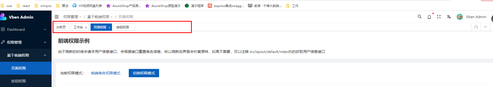
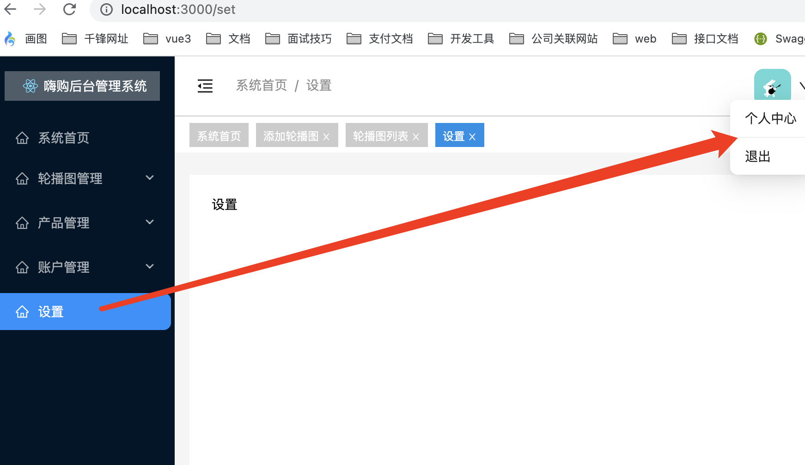
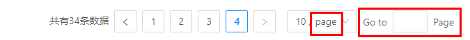
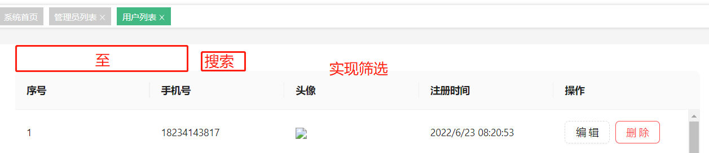
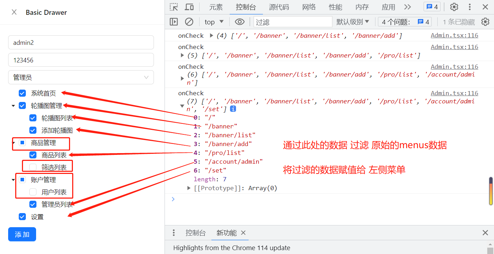

旧：https://www.html.cn/create-react-app/

新：https://create-react-app.bootcss.com/

# 1.创建项目

```sh
# 现在
npx create-react-app react-admin-app --template typescript
```

**熟悉目录结构**

```
- react-admin-app
	-node_modules
	-public
	-src
		App.css
		App.test.tsx App.tsx的测试文件  npm run test 查看测试结果
		App.tsx
		index.css
		index.tsx react应用程序的入口文件
		logo.svg 
		react-app-env.d.ts // 声明文件 // 指令声明对包的依赖关系
		reportWebVitals.ts // 测试性能
		seupTests.ts // 使用jest做为测试工具
	.gitignore
	package-lock.json
	package.json
	README.md
	tsconfig.json
```

> *.d.ts 代表ts的声明文件

# 2.改造目录结构

```
src
	api
	components
	layout
	store
	router
	utils
	views
	App.tsx
	index.tsx
	logo.svg
	react-app-env.d.ts
	reportWebVitals.ts 
  seupTests.ts 
```

```tsx
// src/index.tsx
import React from 'react';
import ReactDOM from 'react-dom/client';

import App from './App';
import reportWebVitals from './reportWebVitals';

const root = ReactDOM.createRoot(
  document.getElementById('root') as HTMLDivElement
);
root.render(
  <React.StrictMode>
    <App />
  </React.StrictMode>
);

reportWebVitals();

```

```tsx
// src/App.tsx
import React, { FC } from 'react';

interface IAppProps {
}

const App: FC<IAppProps> = (props) => {
  return (
    <>App</>
  )
}

export default App
```

# 3.安装一些必须的模块

## 3.1 配置预处理器

两种方式：

* 抽离配置文件配置预处理器
* 不抽离配置文件craco进行预处理器配置

> 本项目推荐使用第二种方式

```sh
$ cnpm i @craco/craco @types/node -D
```

https://www.npmjs.com/package/@craco/craco

### 3.1.1 配置别名@

项目根目录创建 `craco.config.js`，代码如下：

```ts
// craco.config.js
const path = require('path')
module.exports = {
  webpack: {
    alias: {
      '@': path.resolve(__dirname, 'src')
    }
  }
}
```

为了使 TS 文件引入时的别名路径能够正常解析，需要配置 `tsconifg.json`，在 `compilerOptions`选项里添加 path 等属性。为了防止配置被覆盖，需要单独创建一个文件 `tsconfig.path.json`，添加以下代码

```json
// tsconfig.path.json
{
  "compilerOptions": {
    "baseUrl": ".",
    "paths": {
      "@/*": ["./src/*"]
    },
    "types": [
      "node"
    ]
  }
}
```

在 `tsconifg.json` 引入配置文件：

```json
// tsconfig.json
{
  "compilerOptions": {
    "target": "es5",
    "lib": [
      "dom",
      "dom.iterable",
      "esnext"
    ],
    "allowJs": true,
    "skipLibCheck": true,
    "esModuleInterop": true,
    "allowSyntheticDefaultImports": true,
    "strict": true,
    "forceConsistentCasingInFileNames": true,
    "noFallthroughCasesInSwitch": true,
    "module": "esnext",
    "moduleResolution": "node",
    "resolveJsonModule": true,
    "isolatedModules": true,
    "noEmit": true,
    "jsx": "react-jsx"
  },
  "extends": "./tsconfig.path.json", // ++++++++++
  "include": [
    "src"
  ]
}
```

修改 `package.json` 如下：

```json
"scripts": {
  "start": "craco start",
  "build": "craco build",
  "test": "craco test"
},
```

```sh
$ npm run start
```

## 3.2安装状态管理器

根据项目需求 任选其一即可

```sh
$ cnpm i redux -S
$ cnpm i redux react-redux -S
$ cnpm i redux react-redux redux-thunk -S
$ cnpm i redux react-redux redux-saga -S
$ cnpm i mobx mobx-react -S
```

>  本项目不采用之前的状态管理模式，使用 rtk 技术
>
>  ```
>  cnpm i @reduxjs/toolkit redux react-redux -S
>  ```

## 3.3 路由

2021年11月4日 发布了 react-router-dom的v6.0.0版本：https://reactrouter.com/

如需使用v5版本：https://v5.reactrouter.com/web/guides/quick-start `cnpm i react-router-dom@5 -S`

> 本项目采用 V6版本

```
cnpm i react-router-dom -S
```

## 3.4 数据验证

> 思考，有没有必要安装 prop-types ?

```
cnpm i prop-types -S
```

> 本项目其实没有必要安装，因为所有的数据都是基于ts，而ts需要指定类型注解

## 3.5数据请求

```
cnpm i axios -S
```

> 以前版本中 cnpm i @types/axios -S
>
> Ts 中 @types/* 为声明文件

## 3.6ui库

官网地址：https://ant.design/index-cn 5.6.2

国内官方镜像地址：https://ant-design.antgroup.com/index-cn

国内gitee镜像地址：https://ant-design.gitee.io/index-cn

```
cnpm i antd @ant-design/icons -S
```

`src/index.tsx`

```tsx
// src/index.tsx
import React from 'react';
import ReactDOM from 'react-dom/client';

import { ConfigProvider } from 'antd'; // +++++++++++++++++++++
import zhCN from 'antd/locale/zh_CN';// +++++++++++++++++++++
import 'antd/dist/reset.css';// +++++++++++++++++++++

import App from '@/App';
import reportWebVitals from './reportWebVitals';

const root = ReactDOM.createRoot(document.getElementById('root') as HTMLDivElement)

root.render(
  <React.StrictMode>
    <ConfigProvider locale={zhCN}>
      <App />
    </ConfigProvider>
  </React.StrictMode>
);

reportWebVitals();

```

测试组件库

```tsx
// src/App.tsx
import type { FC } from 'react';
import { Button } from 'antd'

interface AppProps {}

const App: FC<AppProps> = (props) => {
  return (
    <>
     App
     <Button type="primary">
        Primary
      </Button>
    </>
  );
}

export default App;


```

> 浏览器查看发现测试通过

### 3.6.1 自定义主题

https://ant-design.antgroup.com/docs/react/use-in-typescript-cn

antd 内建了深色主题和紧凑主题，你可以参照 [使用暗色主题和紧凑主题](https://ant-design.antgroup.com/docs/react/customize-theme-cn#使用暗色主题和紧凑主题) 进行接入。

可以定制的变量列表如下：

```scss
@primary-color: #1890ff; // 全局主色
@link-color: #1890ff; // 链接色
@success-color: #52c41a; // 成功色
@warning-color: #faad14; // 警告色
@error-color: #f5222d; // 错误色
@font-size-base: 14px; // 主字号
@heading-color: rgba(0, 0, 0, 0.85); // 标题色
@text-color: rgba(0, 0, 0, 0.65); // 主文本色
@text-color-secondary: rgba(0, 0, 0, 0.45); // 次文本色
@disabled-color: rgba(0, 0, 0, 0.25); // 失效色
@border-radius-base: 2px; // 组件/浮层圆角
@border-color-base: #d9d9d9; // 边框色
@box-shadow-base: 0 3px 6px -4px rgba(0, 0, 0, 0.12), 0 6px 16px 0 rgba(0, 0, 0, 0.08),
  0 9px 28px 8px rgba(0, 0, 0, 0.05); // 浮层阴影
```

```js
// src/index.tsx
import React from 'react';
import ReactDOM from 'react-dom/client';

import { ConfigProvider } from 'antd';
import zhCN from 'antd/locale/zh_CN';
import 'antd/dist/reset.css';

import App from '@/App';
import reportWebVitals from './reportWebVitals';

const root = ReactDOM.createRoot(document.getElementById('root') as HTMLDivElement)

root.render(
  <React.StrictMode>
    <ConfigProvider 
      locale={zhCN}
      theme={{ // ++++++++++++++++++++
        token: {
          // colorPrimary: '#ff6666',
        }
      }}
    >
      <App />
    </ConfigProvider>
  </React.StrictMode>
);

reportWebVitals();

```

## 3.7 其他第三方工具包 - 看需求

https://www.lodashjs.com/

Lodash 工具包，项目必装，它提供了很多使用的函数

```
$ cnpm i lodash -S
$ cnpm i @types/lodash -D
```

```js
import _ from 'lodash'

var users = [
  { 'user': 'barney',  'active': false },
  { 'user': 'fred',    'active': false },
  { 'user': 'pebbles', 'active': true }
];

console.log(_.findIndex(users, (item) => item.user === 'pebbles'))
console.log(users.findIndex((item) => item.user === 'pebbles'))
```


# 4.创建主布局文件

预览模板：https://pro.ant.design/zh-CN/

> src/layout/Index.tsx 作为后台管理系统的主页面布局(包含左侧的菜单栏，顶部，底部等)

https://ant-design.gitee.io/components/layout-cn/#components-layout-demo-custom-trigger

> 不要照着代码敲，直接复制即可，给 Layout 组件添加 id为`admin-app`

```tsx
// src/layout/Index.tsx 主界面布局
import React, { useState } from 'react';
import {
  MenuFoldOutlined,
  MenuUnfoldOutlined,
  UploadOutlined,
  UserOutlined,
  VideoCameraOutlined,
} from '@ant-design/icons';
import { Layout, Menu, Button, theme } from 'antd';

const { Header, Sider, Content } = Layout;

const App: React.FC = () => {
  const [collapsed, setCollapsed] = useState(false);
  const {
    token: { colorBgContainer },
  } = theme.useToken();

  return (
    <Layout id='admin-app'>
      <Sider trigger={null} collapsible collapsed={collapsed}>
        <div className="demo-logo-vertical" />
        <Menu
          theme="dark"
          mode="inline"
          defaultSelectedKeys={['1']}
          items={[
            {
              key: '1',
              icon: <UserOutlined />,
              label: 'nav 1',
            },
            {
              key: '2',
              icon: <VideoCameraOutlined />,
              label: 'nav 2',
            },
            {
              key: '3',
              icon: <UploadOutlined />,
              label: 'nav 3',
            },
          ]}
        />
      </Sider>
      <Layout>
        <Header style={{ padding: 0, background: colorBgContainer }}>
          <Button
            type="text"
            icon={collapsed ? <MenuUnfoldOutlined /> : <MenuFoldOutlined />}
            onClick={() => setCollapsed(!collapsed)}
            style={{
              fontSize: '16px',
              width: 64,
              height: 64,
            }}
          />
        </Header>
        <Content
          style={{
            margin: '24px 16px',
            padding: 24,
            minHeight: 280,
            background: colorBgContainer,
          }}
        >
          Content
        </Content>
      </Layout>
    </Layout>
  );
};

export default App;
```

> 主组件引入 主界面的布局文件

```tsx
// src/App.tsx
import type { FC } from 'react';

import BaseLayout from '@/layout/Index'

import './App.css'

interface AppProps {}

const App: FC<AppProps> = (props) => {
  return (
    <>
     <BaseLayout />
    </>
  );
}

export default App;


```

> 查看浏览器，预览运行结果

添加logo以及标题

```jsx
// src/layout/Index.tsx 主界面布局
import React, { useState } from 'react';
import {
  MenuFoldOutlined,
  MenuUnfoldOutlined,
  UploadOutlined,
  UserOutlined,
  VideoCameraOutlined,
} from '@ant-design/icons';
import { Layout, Menu, Button, theme } from 'antd';

import logo from './../logo.svg' // +++++++++

const { Header, Sider, Content } = Layout;

const App: React.FC = () => {
  const [collapsed, setCollapsed] = useState(false);
  const {
    token: { colorBgContainer },
  } = theme.useToken();

  return (
    <Layout id='admin-app'>
      <Sider trigger={null} collapsible collapsed={collapsed}>
        { 
        	// 添加logo
        }
        <div className="demo-logo-vertical" >
          
          <span className='logoTitle'>嗨购管理平台</span>
        </div>
        <Menu
          theme="dark"
          mode="inline"
          defaultSelectedKeys={['1']}
          items={[
            {
              key: '1',
              icon: <UserOutlined />,
              label: 'nav 1',
            },
            {
              key: '2',
              icon: <VideoCameraOutlined />,
              label: 'nav 2',
            },
            {
              key: '3',
              icon: <UploadOutlined />,
              label: 'nav 3',
            },
          ]}
        />
      </Sider>
      <Layout>
        <Header style={{ padding: 0, background: colorBgContainer }}>
          <Button
            type="text"
            icon={collapsed ? <MenuUnfoldOutlined /> : <MenuFoldOutlined />}
            onClick={() => setCollapsed(!collapsed)}
            style={{
              fontSize: '16px',
              width: 64,
              height: 64,
            }}
          />
        </Header>
        <Content
          style={{
            margin: '24px 16px',
            padding: 24,
            minHeight: 280,
            background: colorBgContainer,
          }}
        >
          Content
        </Content>
      </Layout>
    </Layout>
  );
};

export default App;
```


> 发现页面并不是全屏。审查元素设置 root以及 components-layout-demo-custom-trigger 高度为 100%

```css
/* src/App.css */
#root, #admin-app {
  height: 100%;
}

.demo-logo-vertical {
  height: 32px;
  background: rgba(255,255,255,.3);
  margin: 16px;
  display: flex;
  align-items: center;
  justify-content: center;
}

.demo-logo-vertical .logoImg {
  width: 30px;
  height: 30px;
}

.demo-logo-vertical .logoTitle {
  font-size: 18px;
  font-weight: bold;
  color: #fff;
}
```

# 5.拆分主界面

> 先拆分左侧的菜单栏组件

```tsx
// src/layout/components/SiderBar.tsx
import { useState } from 'react';
import type { FC } from 'react';
import { Menu } from 'antd';
import {
  UploadOutlined,
  UserOutlined,
  VideoCameraOutlined
} from '@ant-design/icons';
import { Layout } from 'antd';

import logo from '@/logo.svg'
interface SideBarProps {}

const { Sider } = Layout;

const SideBar: FC<SideBarProps> = () => {
  const [collapsed] = useState(false);
  return (
    <Sider trigger={null} collapsible collapsed={collapsed}>
      <div className="demo-logo-vertical" >
        
        <span className='logoTitle'>嗨购管理平台</span>
      </div>
      <Menu
        theme="dark"
        mode="inline"
        defaultSelectedKeys={['1']}
        items={[
          {
            key: '1',
            icon: <UserOutlined />,
            label: 'nav 1',
          },
          {
            key: '2',
            icon: <VideoCameraOutlined />,
            label: 'nav 2',
          },
          {
            key: '3',
            icon: <UploadOutlined />,
            label: 'nav 3',
          },
        ]}
      />
    </Sider>
  );
}

export default SideBar;

```

```tsx
// src/layout/components/AppHeader.tsx
import type { FC } from 'react';
import { useState } from 'react';
import { Layout, Button } from 'antd';
import {
  MenuFoldOutlined,
  MenuUnfoldOutlined
} from '@ant-design/icons';
interface AppHeaderProps {}
const { Header } = Layout;
const AppHeader: FC<AppHeaderProps> = () => {
  const [collapsed, setCollapsed] = useState(false);
  return (
    <Header style={{ padding: 0, background: '#fff' }}>
      <Button
        type="text"
        icon={collapsed ? <MenuUnfoldOutlined /> : <MenuFoldOutlined />}
        onClick={() => setCollapsed(!collapsed)}
        style={{
          fontSize: '16px',
          width: 64,
          height: 64,
        }}
      />
    </Header>
  );
}

export default AppHeader;

```

```tsx
// src/layout/components/AppMain.tsx
import type { FC } from 'react';
import { Layout } from 'antd';
interface AppMainProps {}

const { Content } = Layout;
const AppMain: FC<AppMainProps> = () => {
  return (
    <Content
        style={{
          margin: '24px 16px',
          padding: 24,
          minHeight: 280,
          background: '#fff',
        }}
      >
        Content
      </Content>
  );
}

export default AppMain;

```

整和组件资源

```ts
// src/layout/components/index.ts
// import SiderBar from "./SiderBar";
// import AppHeader from "./AppHeader";
// import AppMain from './AppMain'
// export { SiderBar, AppHeader, AppMain }

export { default as SiderBar } from './SiderBar'
export { default as AppHeader } from './AppHeader'
export { default as AppMain } from './AppMain'
```

```tsx
// src/layout/Index.tsx 主界面布局
import React from 'react';

import { Layout } from 'antd';

import { SiderBar, AppHeader, AppMain } from '@/layout/components/'

const App: React.FC = () => {

  return (
    <Layout id='admin-app'>
      <SiderBar />
      <Layout>
        <AppHeader />
        <AppMain />
      </Layout>
    </Layout>
  );
};

export default App;
```

> 此时点击头部的控制器，发现只有头部组件的 图标在切换，但是并没有影响左侧菜单的收缩
>
> 建议使用状态管理器管理控制的这个状态

# 6.使用rtk来管理状态

http://cn.redux.js.org/

参考链接：http://cn.redux.js.org/tutorials/typescript-quick-start

## 6.1 定义State和Dispatch类型

```ts
// src/store/index.ts
import { configureStore } from '@reduxjs/toolkit'

const store =  configureStore({
  reducer: {

  }
})
// js环境下不需要
// 定义根 State 暴露出去
export type RootState = ReturnType<typeof store.getState>
// 定义 Dispatch 类型
export type AppDispatch = typeof store.dispatch

export default store
```

> 构建app的模块用于管理 头部和 左侧菜单的共同的状态

## 6.2 定义 Hooks 类型

虽然可以将`RootState`and`AppDispatch`类型导入到每个组件中，但**最好创建`useDispatch`and `useSelector`hooks 的类型化版本以在您的应用程序中使用**。

```ts
// src/store/hooks.ts
import { TypedUseSelectorHook, useDispatch, useSelector } from 'react-redux'
import type { RootState, AppDispatch } from './index' // ++++

// 在整个应用程序中使用，而不是简单的 `useDispatch` 和 `useSelector`
export const useAppDispatch: () => AppDispatch = useDispatch
export const useAppSelector: TypedUseSelectorHook<RootState> = useSelector
```

## 6.3 应用程序中使用

> 创建状态管理

```ts
// src/store/modules/app.ts
import { createSlice } from '@reduxjs/toolkit'

const appSlice = createSlice({
  name: 'app',
  initialState: {
    collapsed: false
  },
  reducers: {
    changeCollapsed (state, action) {
      state.collapsed = action.payload
    }
  }
})

export const { changeCollapsed } = appSlice.actions

export default  appSlice.reducer
```

## 6.4 整合reducer

```ts
// src/store/index.ts
import { configureStore } from '@reduxjs/toolkit'
import app from './modules/app'
const store =  configureStore({
  reducer: {
    app
  }
})
// js环境下不需要
// 定义根 State 暴露出去
export type RootState = ReturnType<typeof store.getState>
// 定义 Dispatch 类型
export type AppDispatch = typeof store.dispatch

export default store
```

## 6.5 入口文件配置状态管理器

```tsx
// src/index.tsx
import React from 'react';
import ReactDOM from 'react-dom/client';

import { ConfigProvider } from 'antd';
import zhCN from 'antd/locale/zh_CN';
import 'antd/dist/reset.css';

import { Provider } from 'react-redux'
import store from './store'

import App from '@/App';
import reportWebVitals from './reportWebVitals';

const root = ReactDOM.createRoot(document.getElementById('root') as HTMLDivElement)

root.render(
  <React.StrictMode>
    <ConfigProvider 
      locale={zhCN}
      theme={{
        token: {
          // colorPrimary: '#ff6666',
        }
      }}
    >
      <Provider store = { store }>
        <App />
      </Provider>
    </ConfigProvider>
  </React.StrictMode>
);

reportWebVitals();

```

## 6.6 左侧菜单栏使用状态管理器

```tsx
// src/layout/components/SiderBar.tsx
import type { FC } from 'react';
import { Menu } from 'antd';
import {
  UploadOutlined,
  UserOutlined,
  VideoCameraOutlined
} from '@ant-design/icons';
import { Layout } from 'antd';

import logo from '@/logo.svg'
import { useAppSelector } from '@/store/hooks';
interface SideBarProps {}

const { Sider } = Layout;

const SideBar: FC<SideBarProps> = () => {
  // const [collapsed] = useState(false);
  const collapsed = useAppSelector(state => state.app.collapsed)
  return (
    <Sider trigger={null} collapsible collapsed={collapsed}>
      <div className="demo-logo-vertical" >
        
        <span className='logoTitle'>嗨购管理平台</span>
      </div>
      <Menu
        theme="dark"
        mode="inline"
        defaultSelectedKeys={['1']}
        items={[
          {
            key: '1',
            icon: <UserOutlined />,
            label: 'nav 1',
          },
          {
            key: '2',
            icon: <VideoCameraOutlined />,
            label: 'nav 2',
          },
          {
            key: '3',
            icon: <UploadOutlined />,
            label: 'nav 3',
          },
        ]}
      />
    </Sider>
  );
}

export default SideBar;

```

## 6.7 头部组件使用状态管理器

```tsx
// src/layout/components/AppHeader.tsx
import type { FC } from 'react';

import { Layout, Button } from 'antd';
import { MenuFoldOutlined, MenuUnfoldOutlined } from '@ant-design/icons';

import { useAppDispatch, useAppSelector } from '@/store/hooks';
import { changeCollapsed } from '@/store/modules/app'

interface AppHeaderProps {}

const { Header } = Layout;

const AppHeader: FC<AppHeaderProps> = () => {
  // const [collapsed, setCollapsed] = useState(false);
  const collapsed = useAppSelector(state => state.app.collapsed)
  const dispatch = useAppDispatch()
  return (
    <Header style={{ padding: 0, background: '#fff' }}>
      <Button
        type="text"
        icon={collapsed ? <MenuUnfoldOutlined /> : <MenuFoldOutlined />}
        onClick={() => dispatch(changeCollapsed(!collapsed))}
        style={{
          fontSize: '16px',
          width: 64,
          height: 64,
        }}
      />
    </Header>
  );
}

export default AppHeader;

```

## 6.8保留用户习惯-可选

永久存储 用户习惯

数据持久化： redux-persist

此时发现 头部的 按钮可以控制左侧菜单栏了，但是还没有满足需求

需求如下：保留用户的使用习惯

```tsx
// src/store/modules/app.ts
import { createSlice } from '@reduxjs/toolkit'

const appSlice = createSlice({
  name: 'app',
  initialState: {
    // collapsed: false
    collapsed: localStorage.getItem('collapsed') === 'true'
  },
  reducers: {
    changeCollapsed (state, action) {
      state.collapsed = action.payload
      localStorage.setItem('collapsed', action.payload)
    }
  }
})

export const { changeCollapsed } = appSlice.actions

export default  appSlice.reducer
```

## 6.9 永久存储的 类 localStorage 的工具 store2

```sh
$ cnpm i store2 -S
```

https://www.npmjs.com/package/store2

推荐一个好用的永久存储的 类 localStorage 的工具 store2

```tsx
// src/store/modules/app.ts
import { createSlice } from '@reduxjs/toolkit'
import store2 from 'store2'

const appSlice = createSlice({
  name: 'app',
  initialState: {
    // collapsed: false
    collapsed: store2.get('collapsed') === 'true'
  },
  reducers: {
    changeCollapsed (state, action) {
      state.collapsed = action.payload
      store2.set('collapsed', String(action.payload))
    }
  }
})

export const { changeCollapsed } = appSlice.actions

export default  appSlice.reducer
```

##  6.10 处理logo部分文字

收缩回去左侧菜单，文字要消失

```tsx
// src/layout/components/SiderBar.tsx
import type { FC } from 'react';
import { Menu } from 'antd';
import {
  UploadOutlined,
  UserOutlined,
  VideoCameraOutlined
} from '@ant-design/icons';
import { Layout } from 'antd';

import logo from '@/logo.svg'
import { useAppSelector } from '@/store/hooks';
interface SideBarProps {}

const { Sider } = Layout;

const SideBar: FC<SideBarProps> = () => {
  // const [collapsed] = useState(false);
  const collapsed = useAppSelector(state => state.app.collapsed)
  return (
    <Sider trigger={null} collapsible collapsed={collapsed}>
      <div className="demo-logo-vertical" >
        
        {
          // +++++++++++++
        }
        { collapsed ? null : <span className='logoTitle'>嗨购管理平台</span>}
      </div>
      <Menu
        theme="dark"
        mode="inline"
        defaultSelectedKeys={['1']}
        items={[
          {
            key: '1',
            icon: <UserOutlined />,
            label: 'nav 1',
          },
          {
            key: '2',
            icon: <VideoCameraOutlined />,
            label: 'nav 2',
          },
          {
            key: '3',
            icon: <UploadOutlined />,
            label: 'nav 3',
          },
        ]}
      />
    </Sider>
  );
}

export default SideBar;

```

```css
/* src/App.css */
#root, #admin-app {
  height: 100%;
}

.demo-logo-vertical {
  height: 32px;
  background: rgba(255,255,255,.3);
  margin: 16px;
  display: flex;
  align-items: center;
  justify-content: center;
  overflow: hidden; /**+++++++**/
  
}

.demo-logo-vertical .logoImg {
  width: 30px;
  height: 30px;
}

.demo-logo-vertical .logoTitle {
  font-size: 18px;
  font-weight: bold;
  color: #fff;
  white-space: nowrap;/**+++++++**/
}
```


# 7.左侧菜单栏

## 7.1.设计左侧菜单栏的数据

https://ant-design.gitee.io/components/menu-cn/#components-menu-demo-sider-current

> Antd 4.20以上版本直接实现 递归
>
> antd 4.20版本以下需要手动实现

```ts
// src/router/menus.tsx
import type { MenuProps } from 'antd';
import { 
  HomeOutlined, 
  PictureOutlined, 
  UnorderedListOutlined, 
  AppstoreAddOutlined,
  ProfileOutlined,
  FileSearchOutlined,
  UserAddOutlined,
  UsergroupDeleteOutlined
} from "@ant-design/icons";
// 官方文档提供
type MenuItem = Required<MenuProps>['items'][number];
type MyMenuItem = MenuItem & { // 自己扩展的类型
  path: string,
  redirect?: string,
  children?: MyMenuItem[]
}
const menus: MyMenuItem[] = [
  {
    path: '/',
    key: '/',
    label: '系统首页',
    icon: <HomeOutlined />
  },
  {
    path: '/banner',
    key: '/banner',
    label: '轮播图管理',
    icon: <PictureOutlined />,
    redirect: '/banner/list',
    children: [
      {
        path: '/banner/list',
        key: '/banner/list',
        label: '轮播图列表',
        icon: <UnorderedListOutlined />
      },
      {
        path: '/banner/add',
        key: '/banner/add',
        label: '添加轮播图',
        icon: <AppstoreAddOutlined />
      }
    ]
  },
  {
    path: '/pro',
    key: '/pro',
    label: '商品管理',
    redirect: '/pro/list',
    icon: <ProfileOutlined />,
    children: [
      {
        path: '/pro/list',
        key: '/pro/list',
        label: '商品列表',
        icon: <UnorderedListOutlined />
      },
      {
        path: '/pro/search',
        key: '/pro/search',
        label: '筛选列表',
        icon: <FileSearchOutlined />
      }
    ]
  },
  {
    path: '/account',
    key: '/account',
    label: '账户管理',
    redirect: '/account/list',
    icon: <UsergroupDeleteOutlined />,
    children: [
      {
        path: '/account/list',
        key: '/account/list',
        label: '用户列表',
        icon: <UnorderedListOutlined />
      },
      {
        path: '/account/admin',
        key: '/account/admin',
        label: '管理员列表',
        icon: <UserAddOutlined />
      }
    ]
  }
]

export default menus
```

## 7.2.渲染左侧菜单栏

左侧菜单栏的头部设定logo以及后台管理系统名称

```tsx
// src/layout/components/SiderBar.tsx
import type { FC } from 'react';
import { Menu } from 'antd';
import { Layout } from 'antd';

import logo from '@/logo.svg'
import { useAppSelector } from '@/store/hooks';

import menus from '@/router/menus'

interface SideBarProps {}

const { Sider } = Layout;

const SideBar: FC<SideBarProps> = () => {
  // const [collapsed] = useState(false);
  const collapsed = useAppSelector(state => state.app.collapsed)
  return (
    <Sider trigger={null} collapsible collapsed={collapsed}>
      <div className="demo-logo-vertical" >
        
        { collapsed ? null : <span className='logoTitle'>嗨购管理平台</span>}
      </div>
      <Menu
        theme="dark"
        mode="inline"
        defaultSelectedKeys={['1']}
        items={ menus }
      />
    </Sider>
  );
}

export default SideBar;

```

##  7.3 低版本处理

以上菜单项的设置在`antd 4.20.0`版本以上好使，如果在`4.20.0`版本以下，应该使用 递归组件实现

```tsx
// src/layout/components/SiderBar-自定义递归.tsx
import type { FC } from 'react';
import { Menu } from 'antd';

import { Layout } from 'antd';

import logo from '@/logo.svg'
import { useAppSelector } from '@/store/hooks';

import menus, { MyMenuItem } from '@/router/menus'

interface SideBarProps {}

const { Sider } = Layout;

const SideBar: FC<SideBarProps> = () => {
  // const [collapsed] = useState(false);
  const collapsed = useAppSelector(state => state.app.collapsed)

  const renderMenus = (menus: MyMenuItem[]) => {
    return menus.map(item => {
      if (item.children) {
        return (
          <Menu.SubMenu key = { item.key } icon={ item.icon } title={ item.label }>
            { renderMenus(item.children) }
          </Menu.SubMenu>
        )
      } else {
        return <Menu.Item key = { item.key }>
          { item.icon }
          <span>{ item.label }</span>
        </Menu.Item>
      }
    })
  }

  return (
    <Sider trigger={null} collapsible collapsed={collapsed}>
      <div className="demo-logo-vertical" >
        
        { collapsed ? null : <span className='logoTitle'>嗨购管理平台</span>}
      </div>
      <Menu
        theme="dark"
        mode="inline"
        defaultSelectedKeys={['1']}
      >
        {
          renderMenus(menus)
        }
      </Menu>

    </Sider>
  );
}

export default SideBar;

```

> 组件形式渲染左侧菜单目前并不推荐使用

## 7.4 菜单渲染优化

如果左侧菜单栏数据过于庞大，每个管理项里又有很多项，需要只展开一个菜单项

https://ant.design/components/menu-cn#components-menu-demo-sider-current

```tsx
// src/layout/components/SiderBar.tsx
import { useState, type FC } from 'react';
import { Menu } from 'antd';
import { Layout, type MenuProps } from 'antd';
// import type { MenuProps } from 'antd';

import logo from '@/logo.svg'
import { useAppSelector } from '@/store/hooks';

import menus from '@/router/menus'

interface SideBarProps {}

const { Sider } = Layout;

// const rootSubmenuKeys = ['/banner', '/pro', '/account'];
const rootSubmenuKeys: string[] = []
menus.forEach(item => {
  if (item.children) {
    rootSubmenuKeys.push(item.key as string)
  }
})

const SideBar: FC<SideBarProps> = () => {
  // const [collapsed] = useState(false);
  const collapsed = useAppSelector(state => state.app.collapsed)

  const [openKeys, setOpenKeys] = useState(['']);

  const onOpenChange: MenuProps['onOpenChange'] = (keys: string[]) => {
    // console.log(keys)
    const latestOpenKey = keys.find((key) => openKeys.indexOf(key) === -1);
    // console.log(latestOpenKey)
    if (rootSubmenuKeys.indexOf(latestOpenKey!) === -1) {
      setOpenKeys(keys);
    } else {
      setOpenKeys(latestOpenKey ? [latestOpenKey] : []);
    }
  };

  return (
    <Sider trigger={null} collapsible collapsed={collapsed}>
      <div className="demo-logo-vertical" >
        
        { collapsed ? null : <span className='logoTitle'>嗨购管理平台</span>}
      </div>
      <Menu
        theme="dark"
        mode="inline"
        defaultSelectedKeys={['1']}
        openKeys={openKeys}
        onOpenChange={onOpenChange}
        items={ menus }
      />
    </Sider>
  );
}

export default SideBar;

```

# 8.定义路由

##  8.1 官方文档

https://reactrouter.com/

## 8.2 创建对应的页面

```shell
|-src
|  |- ...
|  |-views
|    |- banner
|    	|- List.tsx     #首页轮播图
|	 |  |- Add.tsx		#添加轮播图
|	 	 |- home
|    |  |- Index.tsx	#系统首页
|    |- pro
|    |  |- List.tsx 	#产品管理
|    |  |- Search.tsx 	#筛选列表
|    |- account
|    |  |- List.tsx #用户列表
|    |  |- Admin.tsx#管理员列表
```

```tsx
// src/views/home/Index.tsx

import type { FC } from 'react';

interface HomeProps {}

const Home: FC<HomeProps> = () => {
  return (
    <>系统首页</>
  );
}

export default Home;

```

```tsx
// src/views/account/Admin.tsx
import type { FC } from 'react';

interface AccountAdminProps {}

const AccountAdmin: FC<AccountAdminProps> = () => {
  return (
    <>管理员列表</>
  );
}

export default AccountAdmin;

```

```tsx
// src/views/account/List.tsx
import type { FC } from 'react';

interface AccountListProps {}

const AccountList: FC<AccountListProps> = () => {
  return (
    <>用户列表</>
  );
}

export default AccountList;

```

```tsx
// src/views/banner/Add.tsx

import type { FC } from 'react';

interface BannerAddProps {}

const BannerAdd: FC<BannerAddProps> = () => {
  return (
    <>添加轮播图</>
  );
}

export default BannerAdd;

```

```tsx
// src/views/banner/List.tsx

import type { FC } from 'react';

interface BannerListProps {}

const BannerList: FC<BannerListProps> = () => {
  return (
    <>轮播图列表</>
  );
}

export default BannerList;

```

```tsx
// src/views/pro/List.tsx

import type { FC } from 'react';

interface ProListProps {}

const ProList: FC<ProListProps> = () => {
  return (
    <>产品列表</>
  );
}

export default ProList;

```

```tsx
// src/views/pro/Search.tsx
import type { FC } from 'react';

interface ProSearchProps {}

const ProSearch: FC<ProSearchProps> = () => {
  return (
    <>筛选列表</>
  );
}

export default ProSearch;

```

## 8.3 定义菜单路由信息

v6的路由通过 element 属性定义匹配的组件

因此menus中可以添加一个 element 属性，值就为组件的引用即可

```ts
// src/router/menus.tsx
import type { MenuProps } from 'antd';
import { 
  HomeOutlined, 
  PictureOutlined, 
  UnorderedListOutlined, 
  AppstoreAddOutlined,
  ProfileOutlined,
  FileSearchOutlined,
  UserAddOutlined,
  UsergroupDeleteOutlined
} from "@ant-design/icons";

import Home from '@/views/home/Index' //+++++++++++++++++++

import BannerList from '@/views/banner/List'//+++++++++++++++++++
import BannerAdd from '@/views/banner/Add'//+++++++++++++++++++

import ProList from '@/views/pro/List'//+++++++++++++++++++
import ProSearch from '@/views/pro/Search'//+++++++++++++++++++

import AccountList from '@/views/account/List'//+++++++++++++++++++
import AccountAdmin from '@/views/account/Admin'//+++++++++++++++++++

// 官方文档提供
type MenuItem = Required<MenuProps>['items'][number];
export type MyMenuItem = MenuItem & { // 自己扩展的类型
  path: string,
  label: string,
  icon?: React.ReactNode, 
  redirect?: string,
  children?: MyMenuItem[],
  element?: React.ReactNode//+++++++++++++++++++
}
const menus: MyMenuItem[] = [
  {
    path: '/',
    key: '/',
    label: '系统首页',
    icon: <HomeOutlined />, // <span className="iconfont ***"></span>
    element: <Home />//+++++++++++++++++++
  },
  {
    path: '/banner',
    key: '/banner',
    label: '轮播图管理',
    icon: <PictureOutlined />,
    redirect: '/banner/list',
    children: [
      {
        path: '/banner/list',
        key: '/banner/list',
        label: '轮播图列表',
        icon: <UnorderedListOutlined />,
        element: <BannerList />//+++++++++++++++++++
      },
      {
        path: '/banner/add',
        key: '/banner/add',
        label: '添加轮播图',
        icon: <AppstoreAddOutlined />,
        element: <BannerAdd />//+++++++++++++++++++
      }
    ]
  },
  {
    path: '/pro',
    key: '/pro',
    label: '商品管理',
    redirect: '/pro/list',
    icon: <ProfileOutlined />,
    children: [
      {
        path: '/pro/list',
        key: '/pro/list',
        label: '商品列表',
        icon: <UnorderedListOutlined />,
        element: <ProList />//+++++++++++++++++++
      },
      {
        path: '/pro/search',
        key: '/pro/search',
        label: '筛选列表',
        icon: <FileSearchOutlined />,
        element: <ProSearch />//+++++++++++++++++++
      }
    ]
  },
  {
    path: '/account',
    key: '/account',
    label: '账户管理',
    redirect: '/account/list',
    icon: <UsergroupDeleteOutlined />,
    children: [
      {
        path: '/account/list',
        key: '/account/list',
        label: '用户列表',
        icon: <UnorderedListOutlined />,
        element: <AccountList />//+++++++++++++++++++
      },
      {
        path: '/account/admin',
        key: '/account/admin',
        label: '管理员列表',
        icon: <UserAddOutlined />,
        element: <AccountAdmin />//+++++++++++++++++++
      }
    ]
  }
]

export default menus
```

## 8.4.装载路由

在根组件添加 `BrowserRouter` 或者 `HashRouter`

```tsx
// src/index.tsx
import React from 'react';
import ReactDOM from 'react-dom/client';

import { ConfigProvider } from 'antd';
import zhCN from 'antd/locale/zh_CN';
import 'antd/dist/reset.css';

import { HashRouter } from 'react-router-dom' //+++++++++++++++++++

import { Provider } from 'react-redux'
import store from './store'

import App from '@/App';
import reportWebVitals from './reportWebVitals';

const root = ReactDOM.createRoot(document.getElementById('root') as HTMLDivElement)

root.render(
  <React.StrictMode>
    <ConfigProvider 
      locale={zhCN}
      theme={{
        token: {
          // colorPrimary: '#ff6666',
        }
      }}
    >
      <Provider store = { store }>
        <HashRouter>
          <App />
        </HashRouter>
      </Provider>
    </ConfigProvider>
  </React.StrictMode>
);

reportWebVitals();

```

## 8.5 定义路由组件

在`menu.tsx`里已经定义好了请求的路径（其实就是数据中key属性）和路径对应组件（其实就是数据中的element属性）,剩下就是定义路由组件了

组件渲染的区域 `AppMain `组件

```tsx
// src/layout/components/AppMain.tsx
import React, { FC } from 'react';
import { Layout } from 'antd';

import { Routes, Route, Navigate } from 'react-router-dom' //+++++++++++++++++++
import menus, { MyMenuItem } from '@/router/menus';

interface AppMainProps {}

const { Content } = Layout;
const AppMain: FC<AppMainProps> = () => {

  const renderRoutes = (menus: MyMenuItem[]) => { //+++++++++++++++++++
    return menus.map(item => {
      if (item.children) {
        // React.Fragment 也为空标签，可以设置 key 属性
        // 实现 重定向 
        return (
          <React.Fragment key={item.key}>
            <Route path={ item.path } element = { <Navigate to={ item.redirect! } />} />
            {
              renderRoutes(item.children)
            }
          </React.Fragment>
        )
      } else {
        return <Route path={ item.path } key = { item.key } element = { item.element } />
      }
    })
  }

  return (
    <Content
        style={{
          margin: '24px 16px',
          padding: 24,
          minHeight: 280,
          background: '#fff',
        }}
      >
        <Routes>
          { //+++++++++++++++++++
            renderRoutes(menus)
          }
        </Routes>
      </Content>
  );
}

export default AppMain;

```

## 8.6 手动测试路由

可以在地址栏输入路径，测试是否正常

```sh
http://localhost:3000/#/ 					#系统首页

http://localhost:3000/#/banner			#轮播图管理
http://localhost:3000/#/banner/list		#轮播图列表
http://localhost:3000/#/banner/add		#添加轮播图

http://localhost:3000/#/pro				#产品管理
http://localhost:3000/#/pro/search		#筛选列表
http://localhost:3000/#/pro/list			#产品列表

http://localhost:3000/#/account			#账户管理
http://localhost:3000/#/account/list	#用户列表
http://localhost:3000/#/account/admin	#管理员列表

```

## 8.7 设置404页面

```tsx
// src/views/error/Page404.tsx
import type { FC } from 'react';

interface Page404Props {}

const Page404: FC<Page404Props> = () => {
  return (
    <>
      页面找不到了
    </>
  );
}

export default Page404;

```

```tsx
// src/layout/components/AppMain.tsx
import React, { FC } from 'react';
import { Layout } from 'antd';

import { Routes, Route, Navigate } from 'react-router-dom'
import menus, { MyMenuItem } from '@/router/menus';
import Page404 from '@/views/error/Page404'; //+++++++++++++++++++

interface AppMainProps {}

const { Content } = Layout;
const AppMain: FC<AppMainProps> = () => {

  const renderRoutes = (menus: MyMenuItem[]) => {
    return menus.map(item => {
      if (item.children) {
        // React.Fragment 也为空标签，可以设置 key 属性
        // 实现 重定向 
        return (
          <React.Fragment key={item.key}>
            <Route path={ item.path } element = { <Navigate to={ item.redirect! } />} />
            {
              renderRoutes(item.children)
            }
          </React.Fragment>
        )
      } else {
        return <Route path={ item.path } key = { item.key } element = { item.element } />
      }
    })
  }

  return (
    <Content
        style={{
          margin: '24px 16px',
          padding: 24,
          minHeight: 280,
          background: '#fff',
        }}
      >
        <Routes>
          {
            renderRoutes(menus)
          }
          {
            //+++++++++++++++++++
          }
          <Route path="*" element = { <Page404 />} />
        </Routes>
      </Content>
  );
}

export default AppMain;

```

# 9 切换路由

上述项目中，切换路由都是手动输入的，实际上应该点击左侧菜单栏进行路由导航。

左侧菜单的逻辑交互，前面已经生成了（openKeys 以及 onOpenChanges 实现）

现在通过点击事件来切换导航

## 9.1 点击切换路由

```tsx
// src/layout/components/SiderBar.tsx
import { useState, type FC } from 'react';
import { Menu } from 'antd';
import { Layout, type MenuProps } from 'antd';
// import type { MenuProps } from 'antd';

import logo from '@/logo.svg'
import { useAppSelector } from '@/store/hooks';

import menus from '@/router/menus'
import { useNavigate } from 'react-router-dom';// ++++++++

interface SideBarProps {}

const { Sider } = Layout;

// const rootSubmenuKeys = ['/banner', '/pro', '/account'];
const rootSubmenuKeys: string[] = []
menus.forEach(item => {
  if (item.children) {
    rootSubmenuKeys.push(item.key as string)
  }
})

const SideBar: FC<SideBarProps> = () => {
  // const [collapsed] = useState(false);
  const collapsed = useAppSelector(state => state.app.collapsed)

  const [openKeys, setOpenKeys] = useState(['']);

  const onOpenChange: MenuProps['onOpenChange'] = (keys: string[]) => {
    // console.log(keys)
    const latestOpenKey = keys.find((key) => openKeys.indexOf(key) === -1);
    // console.log(latestOpenKey)
    if (rootSubmenuKeys.indexOf(latestOpenKey!) === -1) {
      setOpenKeys(keys);
    } else {
      setOpenKeys(latestOpenKey ? [latestOpenKey] : []);
    }
  };

  const navigate = useNavigate() // ++++++++
  const changeUrl = ({ key }: { key: string }) => {// ++++++++
    console.log(key)
    navigate(key)
  }

  return (
    <Sider trigger={null} collapsible collapsed={collapsed}>
      <div className="demo-logo-vertical" >
        
        { collapsed ? null : <span className='logoTitle'>嗨购管理平台</span>}
      </div>
      <Menu
        theme="dark"
        mode="inline"
        defaultSelectedKeys={['1']}
        openKeys={openKeys}
        onOpenChange={onOpenChange}
        items={ menus }
        onClick={ changeUrl }
      />
    </Sider>
  );
}

export default SideBar;

```

##  9.2 刷新保持左侧菜单状态

当页面刷新时，需要保证当前二级路由是展开的，且当前路由是被选中的状态


```tsx
// src/layout/components/SiderBar.tsx
import { useState, useEffect, type FC } from 'react';
import { Menu } from 'antd';
import { Layout, type MenuProps } from 'antd';
// import type { MenuProps } from 'antd';

import logo from '@/logo.svg'
import { useAppSelector } from '@/store/hooks';

import menus from '@/router/menus'
import { useLocation, useNavigate } from 'react-router-dom'; // ++++++++++

interface SideBarProps {}

const { Sider } = Layout;

// const rootSubmenuKeys = ['/banner', '/pro', '/account'];
const rootSubmenuKeys: string[] = []
menus.forEach(item => {
  if (item.children) {
    rootSubmenuKeys.push(item.key as string)
  }
})

const SideBar: FC<SideBarProps> = () => {
  // const [collapsed] = useState(false);
  const collapsed = useAppSelector(state => state.app.collapsed)

  const [openKeys, setOpenKeys] = useState(['']); // ++++++++++

  const onOpenChange: MenuProps['onOpenChange'] = (keys: string[]) => {
    // console.log(keys)
    const latestOpenKey = keys.find((key) => openKeys.indexOf(key) === -1);
    // console.log(latestOpenKey)
    if (rootSubmenuKeys.indexOf(latestOpenKey!) === -1) {
      setOpenKeys(keys);
    } else {
      setOpenKeys(latestOpenKey ? [latestOpenKey] : []);
    }
  };

  const navigate = useNavigate()
  const changeUrl = ({ key }: { key: string }) => {
    console.log(key)
    navigate(key)
  }
	// ++++++++++
  // 实现刷新页面之后 保持选中状态
  // const location = useLocation()
  // console.log(location)
  const { pathname } = useLocation() // /banner/list
  const [selectedKeys, setSelectedKeys] = useState([pathname]) // 选中的状态
  // 监听到地址栏地址改变，就要重新执行
  useEffect(() => { 
    setOpenKeys(['/' + pathname.split('/')[1]]) // ['/banner'] 设置哪一项被打开
    setSelectedKeys([pathname]) // 设置哪一项被选中
  }, [pathname])

  return (
    <Sider trigger={null} collapsible collapsed={collapsed}>
      <div className="demo-logo-vertical" >
        
        { collapsed ? null : <span className='logoTitle'>嗨购管理平台</span>}
      </div>
      <Menu
        theme="dark"
        mode="inline"
        selectedKeys={selectedKeys}
        openKeys={openKeys}
        onOpenChange={onOpenChange}
        items={ menus }
        onClick={ changeUrl }
      />
    </Sider>
  );
}

export default SideBar;

```

# 10 设置面包屑导航

## 10.1 参考文档

通过案例项目，得知 面包屑组件应该包含在 页面的头部 https://vvbin.cn/next/#/feat/breadcrumb/flat

参照组件库的面包屑 https://ant-design.gitee.io/components/breadcrumb-cn/#components-breadcrumb-demo-react-router

## 10.2 设置面包屑导航

头部组件加入了面包屑导航组件，尽可能不动原来的布局

```tsx
// src/layout/components/AppHeader.tsx
import type { FC } from 'react';

import { Layout, Button, Breadcrumb } from 'antd';
import { MenuFoldOutlined, MenuUnfoldOutlined } from '@ant-design/icons';

import { useAppDispatch, useAppSelector } from '@/store/hooks';
import { changeCollapsed } from '@/store/modules/app'
import menus, { MyMenuItem } from '@/router/menus';
import { Link, useLocation } from 'react-router-dom'; // ++++++

interface AppHeaderProps {}

const { Header } = Layout;

let breadcrumbNameMap: Record<string, string>  = {} // ++++++

function getBreadcrumbNameMap (menus: MyMenuItem[]) { // ++++++
  menus.forEach(item => {
    if (item.children) {
      breadcrumbNameMap[item.key!] = item.label
      getBreadcrumbNameMap(item.children)
    } else {
      breadcrumbNameMap[item.key!] = item.label
    }
  })
}
getBreadcrumbNameMap(menus) // ++++++
console.log(breadcrumbNameMap) // ++++++

const AppHeader: FC<AppHeaderProps> = () => {
  // const [collapsed, setCollapsed] = useState(false);
  const collapsed = useAppSelector(state => state.app.collapsed)
  const dispatch = useAppDispatch()


  const location = useLocation(); // { pathname: '/pro/list' } // ++++++
  const pathSnippets = location.pathname.split('/').filter((i) => i); // ++++++
  console.log(pathSnippets) // ['pro', 'list'] // ++++++

  const extraBreadcrumbItems = pathSnippets.map((_, index) => { // ++++++
    // 第一次 /pro
    // 第二次 /pro/list
    const url = `/${pathSnippets.slice(0, index + 1).join('/')}`;
    console.log(index, url)
    return {
      key: url,
      title: <Link to={url}>{breadcrumbNameMap[url]}</Link>,
    };
  });

  const breadcrumbItems = [ // ++++++
    {
      title: <Link to="/">系统首页</Link>,
      key: '',
    },
  ].concat(extraBreadcrumbItems);
  
  return (
    <Header style={{ padding: 0, background: '#fff', display: 'flex', alignItems: 'center' }}>
      <Button
        type="text"
        icon={collapsed ? <MenuUnfoldOutlined /> : <MenuFoldOutlined />}
        onClick={() => dispatch(changeCollapsed(!collapsed))}
        style={{
          fontSize: '16px',
          width: 64,
          height: 64,
        }}
      />
      {
        // ++++++
      }
      <Breadcrumb items={breadcrumbItems} />
    </Header>
  );
}

export default AppHeader;

```

# 11.快捷切换页

https://panjiachen.gitee.io/vue-element-admin/#/charts/line



* 系统默认路由为系统首页，所以第一个就为系统首页，且系统首页不可关闭
* 切换路由，判断当前页面是否已存在，如果存在，找到列表项的索引值，设置该索引值选中效果，并且页面切换至该索引值
* 如果当前路由对应的页面不存在，则在最后添加一项新的数据，并且设置最后一项为选中项
* 点击每一项 切换页面
* 如果删除项是最后一项且最后一项为选中项，则自动选中前一项
* 如果删除项不是最后一项，且最后一项为选中项，不影响选中的效果
* 如果删除项不是最后一项，但删除项是当前选中项，则自动选中最后一项

## 11.1 准备组件

```tsx
// src/layout/components/AppTabs.tsx

import type { FC } from 'react';

interface AppTabsProps {}

const AppTabs: FC<AppTabsProps> = () => {
  return (
    <div>
      AppTabs
    </div>
  );
}

export default AppTabs;

```

```ts
// src/layout/components/index.ts
// import SiderBar from "./SiderBar";
// import AppHeader from "./AppHeader";
// import AppMain from './AppMain'
// export { SiderBar, AppHeader, AppMain }

export { default as SiderBar } from './SiderBar'
export { default as AppHeader } from './AppHeader'
export { default as AppMain } from './AppMain'
export { default as AppTabs } from './AppTabs' // +++++++++
```

```tsx
// src/layout/Index.tsx 主界面布局
import React from 'react';

import { Layout } from 'antd';

import { SiderBar, AppHeader, AppMain, AppTabs } from '@/layout/components/'

const App: React.FC = () => {

  return (
    <Layout id='admin-app'>
      <SiderBar />
      <Layout>
        <AppHeader />
        <AppTabs />
        <AppMain />
      </Layout>
    </Layout>
  );
};

export default App;
```

先处理tabs样式

```tsx
// src/layout/components/AppTabs.tsx

import { Tag, TagProps } from 'antd';
import type { FC } from 'react';

interface AppTabsProps {}

// 二次封装组件库样式  ...props 代表拿到父组件传递过来的所有的属性
const MyTag: FC<TagProps> = (props) => {
  return (
    // <Tag closable = {props.closable} color={props.color} style={{ borderRadius: 0,  height: 26, lineHeight: '26px' }}>{ props.children }</Tag >
    <Tag {...props} style={{ borderRadius: 0,  height: 26, lineHeight: '26px' }}>{ props.children }</Tag >
  )
}

const AppTabs: FC<AppTabsProps> = () => {
  return (
    <div style={{ display: 'flex', alignItems: 'center', height: 32, backgroundColor: '#fff', boxShadow: '0px 0px 5px #ccc', padding: '0 16px'}}>
      <MyTag>系统首页</MyTag >
      <MyTag closable >
        Tag 2
      </MyTag>
      <MyTag closable color="#42b983">
        Tag 3
      </MyTag>
    </div>
  );
}

export default AppTabs;

```


## 11.2 处理数据

后期 监听地址栏  从tabsArr 中提取数据

```ts
 const tabsArr = [{"label":"系统首页","key":"/"},
 {"label":"轮播图列表","key":"/banner/list"},
 {"label":"添加轮播图","key":"/banner/add"},
 {"label":"产品列表","key":"/pro/list"},
 {"label":"筛选列表","key":"/pro/search"},
 {"label":"用户列表","key":"/account/user"},
 {"label":"管理员列表","key":"/account/admin"}]
```

```tsx
// src/layout/components/AppTabs.tsx

import menus, { MyMenuItem } from '@/router/menus'; // ++++++
import { Tag, TagProps } from 'antd';
import type { FC } from 'react';

interface AppTabsProps {}

// 二次封装组件库样式  ...props 代表拿到父组件传递过来的所有的属性
const MyTag: FC<TagProps> = (props) => {
  return (
    // <Tag closable = {props.closable} color={props.color} style={{ borderRadius: 0,  height: 26, lineHeight: '26px' }}>{ props.children }</Tag >
    <Tag {...props} style={{ borderRadius: 0,  height: 26, lineHeight: '26px' }}>{ props.children }</Tag >
  )
}

// 需要的原始的数据
const tabArr: Array<{ key: string, label: string}> = [] // ++++++
const getTabArr = (menus: MyMenuItem[]) => { // ++++++
  menus.forEach(item => {
    if (item.children) {
      getTabArr(item.children)
    } else {
      tabArr.push({ key: item.key as string, label: item.label })
    }
  })
}
getTabArr(menus) // ++++++
console.log(tabArr) // ++++++
const AppTabs: FC<AppTabsProps> = () => {
  return (
    <div style={{ display: 'flex', alignItems: 'center', height: 32, backgroundColor: '#fff', boxShadow: '0px 0px 5px #ccc', padding: '0 16px'}}>
      <MyTag>系统首页</MyTag >
      <MyTag closable >
        Tag 2
      </MyTag>
      <MyTag closable color="#42b983">
        Tag 3
      </MyTag>
    </div>
  );
}

export default AppTabs;

```


## 11.3 监听路由添加数据

```tsx
// src/layout/components/AppTabs.tsx

import menus, { MyMenuItem } from '@/router/menus'; // ++++++
import { Tag, TagProps } from 'antd';
import  { useState, FC, useEffect } from 'react';
import { useLocation, useNavigate } from 'react-router-dom';

interface AppTabsProps {}

const MyTag: FC<TagProps> = (props) => {
  return (
    <Tag {...props} style={{ borderRadius: 0,  height: 26, lineHeight: '26px', cursor: 'pointer' }}>{ props.children }</Tag >
  )
}

// 需要的原始的数据
const tabArr: Array<{ key: string, label: string}> = [] 
const getTabArr = (menus: MyMenuItem[]) => { 
  menus.forEach(item => {
    if (item.children) {
      getTabArr(item.children)
    } else {
      tabArr.push({ key: item.key as string, label: item.label })
    }
  })
}
getTabArr(menus) 
const AppTabs: FC<AppTabsProps> = () => {

  // 准备一份展示数据
  const [arr, setArr] = useState<Array<{key: string, label: string}>>([{ key: '/', label: '系统首页' }]) // ++++++
  // 标识哪一个选项是被选中的
  const [current, setCurrent] = useState(0) // ++++++

  const { pathname } = useLocation()// ++++++

  useEffect(() => { // ++++++
    // 查找当前的路由在不在展示数据中
    const index = arr.findIndex(item => item.key === pathname) 
    if (index !== -1) { // 在展示数据中，切换选中
      setCurrent(index)
    } else { // 不在展示组件中，给展示组件添加数据
      // 从原始数据中提取当前路由对应的数据，添加给展示数据
      const item = tabArr.find(item => item.key === pathname)
      // 查找到数据，先处理数据，然后再修改状态
      item && arr.push(item)
      setArr(arr)
      setCurrent(arr.length - 1) // 选中最后一项

    }
  }, [pathname, arr])

  return (
    <div style={{ display: 'flex', alignItems: 'center', height: 32, backgroundColor: '#fff', boxShadow: '0px 0px 5px #ccc', padding: '0 16px'}}>
      { // ++++++
        arr.map((item, index) => {
          return (
            <MyTag 
              closable = { index !== 0 } 
              key = { item.key }
              color = { current === index ? '#42b983': '#ccc'}
            >{ item.label }</MyTag>
          )
        })
      }
      {/* <MyTag>系统首页</MyTag >
      <MyTag closable >
        Tag 2
      </MyTag>
      <MyTag closable color="#42b983">
        Tag 3
      </MyTag> */}
    </div>
  );
}

export default AppTabs;

```

## 11.4 点击快捷导航切换页面

```tsx
// src/layout/components/AppTabs.tsx

import menus, { MyMenuItem } from '@/router/menus'; // ++++++
import { Tag, TagProps } from 'antd';
import  { useState, FC, useEffect } from 'react';
import { useLocation, useNavigate } from 'react-router-dom';

interface AppTabsProps {}

const MyTag: FC<TagProps> = (props) => {
  // ++++++onClick={ props.onClick }
  return (
    <Tag {...props} onClick={ props.onClick } style={{ borderRadius: 0,  height: 26, lineHeight: '26px', cursor: 'pointer' }}>{ props.children }</Tag >
  )
}

// 需要的原始的数据
const tabArr: Array<{ key: string, label: string}> = [] 
const getTabArr = (menus: MyMenuItem[]) => { 
  menus.forEach(item => {
    if (item.children) {
      getTabArr(item.children)
    } else {
      tabArr.push({ key: item.key as string, label: item.label })
    }
  })
}
getTabArr(menus) 
const AppTabs: FC<AppTabsProps> = () => {

  // 准备一份展示数据
  const [arr, setArr] = useState<Array<{key: string, label: string}>>([{ key: '/', label: '系统首页' }])
  // 标识哪一个选项是被选中的
  const [current, setCurrent] = useState(0)

  const { pathname } = useLocation()

  useEffect(() => {
    // 查找当前的路由在不在展示数据中
    const index = arr.findIndex(item => item.key === pathname) 
    if (index !== -1) { // 在展示数据中，切换选中
      setCurrent(index)
    } else { // 不在展示组件中，给展示组件添加数据
      // 从原始数据中提取当前路由对应的数据，添加给展示数据
      const item = tabArr.find(item => item.key === pathname)
      // 查找到数据，先处理数据，然后再修改状态
      item && arr.push(item)
      setArr(arr)
      setCurrent(arr.length - 1) // 选中最后一项

    }
  }, [pathname, arr])

  const navigate = useNavigate() // ++++++
  return (
    <div style={{ display: 'flex', alignItems: 'center', height: 32, backgroundColor: '#fff', boxShadow: '0px 0px 5px #ccc', padding: '0 16px'}}>
      {
        arr.map((item, index) => {
          return (
            <MyTag 
              closable = { index !== 0 } 
              key = { item.key }
              color = { current === index ? '#42b983': '#ccc'}
              onClick={ () => { // ++++++
                navigate(item.key)
              } }
            >{ item.label }</MyTag>
          )
        })
      }
      {/* <MyTag>系统首页</MyTag >
      <MyTag closable >
        Tag 2
      </MyTag>
      <MyTag closable color="#42b983">
        Tag 3
      </MyTag> */}
    </div>
  );
}

export default AppTabs;

```

## 11.5 滚动条

如果菜单项特别多，有限空间展示不了的情况下

https://www.npmjs.com/package/react-custom-scrollbars-2

```sh
$ cnpm install react-custom-scrollbars-2 --save
```

```tsx
// src/layout/components/AppTabs.tsx

import menus, { MyMenuItem } from '@/router/menus'; // ++++++
import { Tag, TagProps } from 'antd';
import  { useState, FC, useEffect } from 'react';
import { useLocation, useNavigate } from 'react-router-dom';

import { Scrollbars } from 'react-custom-scrollbars-2'; //++++++++++


interface AppTabsProps {}

const MyTag: FC<TagProps> = (props) => {
  return (
    <Tag {...props} onClick={ props.onClick } style={{ borderRadius: 0,  height: 26, lineHeight: '26px', cursor: 'pointer' }}>{ props.children }</Tag >
  )
}

// 需要的原始的数据
const tabArr: Array<{ key: string, label: string}> = [] 
const getTabArr = (menus: MyMenuItem[]) => { 
  menus.forEach(item => {
    if (item.children) {
      getTabArr(item.children)
    } else {
      tabArr.push({ key: item.key as string, label: item.label })
    }
  })
}
getTabArr(menus) 
const AppTabs: FC<AppTabsProps> = () => {

  // 准备一份展示数据
  const [arr, setArr] = useState<Array<{key: string, label: string}>>([{ key: '/', label: '系统首页' }])
  // 标识哪一个选项是被选中的
  const [current, setCurrent] = useState(0)

  const { pathname } = useLocation()

  useEffect(() => {
    // 查找当前的路由在不在展示数据中
    const index = arr.findIndex(item => item.key === pathname) 
    if (index !== -1) { // 在展示数据中，切换选中
      setCurrent(index)
    } else { // 不在展示组件中，给展示组件添加数据
      // 从原始数据中提取当前路由对应的数据，添加给展示数据
      const item = tabArr.find(item => item.key === pathname)
      // 查找到数据，先处理数据，然后再修改状态
      item && arr.push(item)
      setArr(arr)
      setCurrent(arr.length - 1) // 选中最后一项

    }
  }, [pathname, arr])

  const navigate = useNavigate()
  return (
    <div style={{ display: 'flex', alignItems: 'center', height: 32, backgroundColor: '#fff', boxShadow: '0px 0px 5px #ccc', padding: '0 16px'}}>
      {
        //++++++++++
      }
      <Scrollbars style={{ width: '100%', height: 32, whiteSpace: 'nowrap' }}>
        {
          arr.map((item, index) => {
            return (
              <MyTag 
                closable = { index !== 0 } 
                key = { item.key }
                color = { current === index ? '#42b983': '#ccc'}
                onClick={ () => {
                  navigate(item.key)
                } }
              >{ item.label }</MyTag>
            )
          })
        }
      </Scrollbars>
      {/* <MyTag>系统首页</MyTag >
      <MyTag closable >
        Tag 2
      </MyTag>
      <MyTag closable color="#42b983">
        Tag 3
      </MyTag> */}
    </div>
  );
}

export default AppTabs;

```


## 11.6 点击tab页切换路由,关闭效果

```ts
// src/layout/components/AppTabs.tsx

import menus, { MyMenuItem } from '@/router/menus'; // ++++++
import { Tag, TagProps } from 'antd';
import  { useState, FC, useEffect } from 'react';
import { useLocation, useNavigate } from 'react-router-dom';

import { Scrollbars } from 'react-custom-scrollbars-2';


interface AppTabsProps {}

const MyTag: FC<TagProps> = (props) => {
  return (
    <Tag {...props} onClick={ props.onClick } style={{ borderRadius: 0,  height: 26, lineHeight: '26px', cursor: 'pointer' }}>{ props.children }</Tag >
  )
}

// 需要的原始的数据
const tabArr: Array<{ key: string, label: string}> = [] 
const getTabArr = (menus: MyMenuItem[]) => { 
  menus.forEach(item => {
    if (item.children) {
      getTabArr(item.children)
    } else {
      tabArr.push({ key: item.key as string, label: item.label })
    }
  })
}
getTabArr(menus) 
const AppTabs: FC<AppTabsProps> = () => {

  // 准备一份展示数据
  const [arr, setArr] = useState<Array<{key: string, label: string}>>([{ key: '/', label: '系统首页' }])
  // 标识哪一个选项是被选中的
  const [current, setCurrent] = useState(0)

  const [num, setNum] = useState(0) // ++++++++ 保证数据的实时有效

  const { pathname } = useLocation()

  useEffect(() => {
    // 查找当前的路由在不在展示数据中
    const index = arr.findIndex(item => item.key === pathname) 
    if (index !== -1) { // 在展示数据中，切换选中
      setCurrent(index)
    } else { // 不在展示组件中，给展示组件添加数据
      // 从原始数据中提取当前路由对应的数据，添加给展示数据
      const item = tabArr.find(item => item.key === pathname)
      // 查找到数据，先处理数据，然后再修改状态
      item && arr.push(item)
      setArr(arr)
      setCurrent(arr.length - 1) // 选中最后一项

    }
  }, [pathname, arr, num]) // ++++++++

  const navigate = useNavigate()
  return (
    <div style={{ display: 'flex', alignItems: 'center', height: 32, backgroundColor: '#fff', boxShadow: '0px 0px 5px #ccc', padding: '0 16px'}}>
      <Scrollbars style={{ width: '100%', height: 32, whiteSpace: 'nowrap' }}>
        {
          arr.map((item, index) => {
            return (
              <MyTag 
                closable = { index !== 0 } 
                key = { item.key }
                color = { current === index ? '#42b983': '#ccc'}
                onClick={ () => {
                  // console.log('click')
                  navigate(item.key)
                } }
                onClose={ (event) => { // ++++++++
                  event.preventDefault()
                  // console.log('delete')
                  if (current === index) { // 需要删除当前的选中项
                    console.log(1)
                    if (current === arr.length - 1) { // 当前需要删除的项是 最后一项
                      console.log('最后')
                      navigate(arr[index - 1].key) // 跳转路由到前一项
                      setCurrent(index - 1) // 选中项为前一项
                      // // 删除了数据
                      // const newArr = arr
                      // newArr.splice(index, 1)
                      // setArr(newArr)
                    } else {
                      console.log('中间')
                      navigate(arr[arr.length  - 1].key) // 跳转到了最后一项
                      setCurrent(arr.length  - 1) // 最后一项被选中
                      // // 删除了数据
                      // const newArr = arr
                      // newArr.splice(index, 1)
                      // setArr(newArr)
                    }
                  } else {
                    console.log(2)
                    if (index < current) {
                      setCurrent(current  - 1)
                      // // 删除了数据
                      // const newArr = arr
                      // newArr.splice(index, 1)
                      // setArr(newArr)
                    } else {
                      console.log(6666)
                      setNum(Math.random())
                      // // 删除了数据
                      // const newArr = arr
                      // newArr.splice(index, 1)
                      // setArr(newArr)
                    }
                  }
                  // 删除了数据
                  const newArr = arr
                  newArr.splice(index, 1)
                  setArr(newArr)
                } }
              >{ item.label }</MyTag>
            )
          })
        }
      </Scrollbars>
      {/* <MyTag>系统首页</MyTag >
      <MyTag closable >
        Tag 2
      </MyTag>
      <MyTag closable color="#42b983">
        Tag 3
      </MyTag> */}
    </div>
  );
}

export default AppTabs;

```


# 12.数据请求的封装

```ts
// src/utils/request.ts
// 自定义axios
import axios, { AxiosRequestConfig } from 'axios'
import store2 from 'store2'

// 环境：开发环境 生产环境
// npm run start 开发环境  ===》 开发服务器 http://121.89.205.189:3000/admin/admin/login
// npm run build 生产环境  ===》 生产服务器 http://121.89.205.189:3000/admin/admin/login
// npm run test  测试环境  ===》 测试服务器 http://121.89.205.189:3000/admin/admin/login

// npm run start ===> process.env.NODE_ENV = 'development'
// npm run build ===> process.env.NODE_ENV = 'production'
const isDev = process.env.NODE_ENV === 'development'

const ins = axios.create({
  // http://121.89.205.189:3000/admin/admin/login ==> /admin/login
  baseURL: isDev ? 'http://121.89.205.189:3000/admin' : 'http://121.89.205.189:3000/admin'
})
// 覆写库的超时默认值
// 现在，在超时前，所有请求都会等待 6 秒
ins.defaults.timeout = 6000;

// 请求拦截器
ins.interceptors.request.use((config) => {
  // 所有的请求之前做些什么：头信息传递token

  config.headers.token = store2.get('token') || ''

  return config
}, (error) => {
  return Promise.reject(error)
})

// 响应拦截器
ins.interceptors.response.use((response) => {
  // 拿到服务器数据之前做些什么： 验证token，验证通过，继续，验证不通过，跳转到登录页面
  if (response.data.code === '10119') { // 需要登录 -- 登录时保存了adminname token
    store2.remove('adminname')
    store2.remove('token')

    window.location.href = '/#/login' // BrowserRouter '/login'
  }
  return response
}, (error) => {
  return Promise.reject(error)
})

// 自定义各种常用的restful api的请求
export default function request( config: AxiosRequestConfig<any> ) {
  // 接口请求 必须参数  url method  data  headers
  const { url = '', method = 'GET', data = {}, headers = {} } = config

  // 区分不同的数据请求 为了执行时传入的数据请求方式统一性 GEt GeT get GET
  switch (method.toUpperCase()) {
    case 'GET':
      return ins.get(url, { params: data })

    case 'POST': 
      // 可能数据请求方式 表单提交  文件提交   默认json
      // 表单提交
      if (headers['content-type'] === 'application/x-www-form-url-encoded') {
        // 转换参数  URLSearchParams  / 第三方库 qs
        const p = new URLSearchParams()
        for (const key in data) {
          p.append(key, data[key])
        }
        return ins.post(url, p, { headers })
      }

      // 文件提交
      if (headers['content-type'] === 'multipart/form-data') {
        const p = new FormData()
        for (const key in data) {
          p.append(key, data[key])
        }
        return ins.post(url, p, { headers })
      }

      // 默认 application/json
      return ins.post(url, data)
    
    // 修改数据 - 所有的数据的更新
    case 'PUT':
      return ins.put(url, data)

    // 删除数据
    case 'DELETE': 
      return ins.delete(url, { data })  

    // 修改数据 - 部分的数据的更新
    case 'PATCH':
      return ins.patch(url, data)

    default:
      return ins(config)
  }
}
```

按照思维来看，此时需要请求以及渲染轮播图管理相关功能，但是查看后端接口，发现基本所有的借口都需要基于 token，那么需要首先完成登录功能

接口文档：http://121.89.205.189:3000/admindoc/

# 13 构建登录页面

## 13.1 参考组件库组件

https://ant-design.gitee.io/components/form-cn/#components-form-demo-normal-login

## 13.2 构造登录接口API

```tsx
// src/api/admin.ts
import request from "@/utils/request"; 

// 登录接口封装
export function loginAdmin (data: { adminname: string, password: string}) {
  return request({
    url: '/admin/login',
    method: 'POST',
    data
  })
}
```

## 13.3 创建登录的页面

```tsx
// src/views/login/Index.tsx
import type { FC } from 'react';

interface loginProps {}

const login: FC<loginProps> = () => {
  return (
    <>登录</>
  );
}

export default login;

```

# 13.4 创建登录路由

```tsx
// src/App.tsx
import type { FC } from 'react';

import BaseLayout from '@/layout/Index'
import Login from '@/views/login/Index'

import './App.css'
import { Routes, Route } from 'react-router-dom';

interface AppProps {}

const App: FC<AppProps> = (props) => {
  return (
    <Routes>
     {/* <BaseLayout /> */}
     <Route path="/login" element={ <Login />}/>
     <Route path="/*" element={ <BaseLayout />}/>
    </Routes>
  );
}

export default App;


```

地址栏访问 `http://localhost:3000/login` 即可看到登录页面出现，其余路由还保持和之前一致

## 13.4 完善登录界面

```css
/* src/App.css */
#root, #admin-app {
  height: 100%;
}

.demo-logo-vertical {
  height: 32px;
  background: rgba(255,255,255,.3);
  margin: 16px;
  display: flex;
  align-items: center;
  justify-content: center;
  overflow: hidden;
  
}

.demo-logo-vertical .logoImg {
  width: 30px;
  height: 30px;
}

.demo-logo-vertical .logoTitle {
  font-size: 18px;
  font-weight: bold;
  color: #fff;
  white-space: nowrap;
}
/*+++++++++++++*/
.login-form-box {
  width: 100%;
  height: 100%;
  background-color: dimgray;
  display: flex;
  flex-direction: column;
  justify-content: center;
  align-items: center;
}
.login-form-title {
  color: #fff;
}
.login-form {
  width: 400px;

}
```

```tsx
// src/views/login/Index.tsx
import React from 'react';
import { Button, Form, Input } from 'antd';

const onFinish = (values: any) => {
  console.log('Success:', values);
};

const onFinishFailed = (errorInfo: any) => {
  console.log('Failed:', errorInfo);
};

const App: React.FC = () => {

  return (
    <div className='login-form-box'>
      <h1 className='login-form-title'>嗨购后台管理系统</h1>
      <Form
        className='login-form'
        name="basic"
        wrapperCol={{ span: 24 }}
        onFinish={onFinish}
        onFinishFailed={onFinishFailed}
        autoComplete="off"
      >
        <Form.Item
          name="adminname"
          rules={[{ required: true, message: '请输入管理员账户!' }]}
        >
          <Input placeholder='管理员账户'/>
        </Form.Item>
    
        <Form.Item
          name="password"
          rules={[{ required: true, message: '请输入管理员密码!' }]}
        >
          <Input.Password placeholder='密码'/>
        </Form.Item>
    
        <Form.Item >
          <Button type="primary" htmlType="submit" block>
            登录
          </Button>
        </Form.Item>
      </Form>
    </div>
  )
}

export default App;

```

使用状态管理器，异步操作可以在组件，也可以在状态管理器

# 14 执行登录

使用状态管理器（RTK）管理登录信息。

## 14.1 构建模块 admin

```ts
// src/store/modules/admin.ts
import { createSlice, PayloadAction } from '@reduxjs/toolkit'
import store2 from 'store2'
type IAdminState = {
  adminname: string,
  token: string
}

const initialState: IAdminState = {
  adminname: store2.get('adminname') || '',
  token: store2.get('token') || ''
}

const adminSlice = createSlice({
  name: 'admin',
  initialState,
  reducers: {
    changeAdminname (state, action: PayloadAction<string>) {
      state.adminname = action.payload
      store2.set('adminname', action.payload)
    },
    changeToken (state, action: PayloadAction<string>) {
      state.token = action.payload
      store2.set('token', action.payload)
    }
  }
})

export const { changeAdminname, changeToken } = adminSlice.actions

export default adminSlice.reducer
```

## 14.2 装载模块

```ts
// src/store/index.ts
import { configureStore } from '@reduxjs/toolkit'
import app from './modules/app'
import admin from './modules/admin' // +++++++
const store =  configureStore({
  reducer: {
    app, admin // +++++++
  }
})
// js环境下不需要
// 定义根 State 暴露出去
export type RootState = ReturnType<typeof store.getState>
// 定义 Dispatch 类型
export type AppDispatch = typeof store.dispatch

export default store
```

## 14.3 登录实现

```tsx
// src/views/login/Index.tsx
import React from 'react';
import { Button, Form, Input, message } from 'antd';

import { loginAdmin } from '@/api/admin'
import { useAppDispatch } from '@/store/hooks';
import { changeAdminname, changeToken } from '@/store/modules/admin';
import { useNavigate } from 'react-router-dom';


const App: React.FC = () => {
  const [messageApi, contextHolder] = message.useMessage();

  const dispatch = useAppDispatch()

  const navigate = useNavigate()

  const onFinish = (values: { adminname: string, password: string }) => {
    // console.log('Success:', values);
    loginAdmin(values).then(res => {
      if (res.data.code === '10005') {
        // 没有该账号
        messageApi.open({
          type: 'error',
          content: '账号未注册',
        });
      } else if (res.data.code === '10003'){
        // 密码错误
        messageApi.open({
          type: 'warning',
          content: '密码错误',
        });
      } else {
        // 登录成功
        messageApi.open({
          type: 'success',
          content: '登录成功',
        });
        // console.log(res.data)
        dispatch(changeAdminname(res.data.data.adminname))
        dispatch(changeToken(res.data.data.token))
        navigate('/')
      }
    })
  };
  
  const onFinishFailed = (errorInfo: any) => {
    console.log('Failed:', errorInfo);
  };
  
  return (
    <div className='login-form-box'>
      {contextHolder}
      <h1 className='login-form-title'>嗨购后台管理系统</h1>
      <Form
        className='login-form'
        name="basic"
        wrapperCol={{ span: 24 }}
        onFinish={onFinish}
        onFinishFailed={onFinishFailed}
        autoComplete="off"
      >
        <Form.Item
          name="adminname"
          rules={[{ required: true, message: '请输入管理员账户!' }]}
        >
          <Input placeholder='管理员账户'/>
        </Form.Item>
    
        <Form.Item
          name="password"
          rules={[{ required: true, message: '请输入管理员密码!' }]}
        >
          <Input.Password placeholder='密码'/>
        </Form.Item>
    
        <Form.Item >
          <Button type="primary" htmlType="submit" block>
            登录
          </Button>
        </Form.Item>
      </Form>
    </div>
  )
}

export default App;

```

# 15.前端登录验证

当前路由在登录页面，判断用户的登录状态，如果登录，则跳转到系统的首页，如果未登录，显示登录页面

当前路由在非登录页面，判断用户的登录状态，如果登录，则显示非登录页面，如果未登录，跳转到登录页面

```tsx
// src/App.tsx
import type { FC } from 'react';

import BaseLayout from '@/layout/Index'
import Login from '@/views/login/Index'

import './App.css'
import { Routes, Route, Navigate } from 'react-router-dom';
import { useAppSelector } from './store/hooks';

interface AppProps {}

const App: FC<AppProps> = (props) => {

  // 有管理员账户  前端认为即为登录
  const adminname = useAppSelector(state => state.admin.adminname)

  return (
    <Routes>
     {/* <BaseLayout /> */}
     <Route path="/login" element={ adminname ? <Navigate to="/" /> :<Login />}/>
     <Route path="/*" element={ adminname ? <BaseLayout /> : <Navigate to="/login" />}/>
    </Routes>
  );
}

export default App;


```


# 16 .后端token校验

封装axios时已经实现 --- 响应拦截器

后台管理系统都需要请求数据，而请求数据 都需要添加token字段

```ts
// src/utils/request.ts
// 自定义axios
import axios, { AxiosRequestConfig } from 'axios'
import store2 from 'store2'

// 环境：开发环境 生产环境
// npm run start 开发环境  ===》 开发服务器 http://121.89.205.189:3000/admin/admin/login
// npm run build 生产环境  ===》 生产服务器 http://121.89.205.189:3000/admin/admin/login
// npm run test  测试环境  ===》 测试服务器 http://121.89.205.189:3000/admin/admin/login

// npm run start ===> process.env.NODE_ENV = 'development'
// npm run build ===> process.env.NODE_ENV = 'production'
const isDev = process.env.NODE_ENV === 'development'

const ins = axios.create({
  // http://121.89.205.189:3000/admin/admin/login ==> /admin/login
  baseURL: isDev ? 'http://121.89.205.189:3000/admin' : 'http://121.89.205.189:3000/admin'
})
// 覆写库的超时默认值
// 现在，在超时前，所有请求都会等待 6 秒
ins.defaults.timeout = 6000;

// 请求拦截器
ins.interceptors.request.use((config) => {
  // 所有的请求之前做些什么：头信息传递token

  config.headers.token = store2.get('token') || ''

  return config
}, (error) => {
  return Promise.reject(error)
})

// 响应拦截器
ins.interceptors.response.use((response) => {
  // 拿到服务器数据之前做些什么： 验证token，验证通过，继续，验证不通过，跳转到登录页面
  if (response.data.code === '10119') { // 需要登录 -- 登录时保存了adminname token
    store2.remove('adminname')
    store2.remove('token')

    window.location.href = '/#/login' // BrowserRouter '/login'
  }
  return response
}, (error) => {
  return Promise.reject(error)
})

// 自定义各种常用的restful api的请求
export default function request( config: AxiosRequestConfig<any> ) {
  // 接口请求 必须参数  url method  data  headers
  const { url = '', method = 'GET', data = {}, headers = {} } = config

  // 区分不同的数据请求 为了执行时传入的数据请求方式统一性 GEt GeT get GET
  switch (method.toUpperCase()) {
    case 'GET':
      return ins.get(url, { params: data })

    case 'POST': 
      // 可能数据请求方式 表单提交  文件提交   默认json
      // 表单提交
      if (headers['content-type'] === 'application/x-www-form-url-encoded') {
        // 转换参数  URLSearchParams  / 第三方库 qs
        const p = new URLSearchParams()
        for (const key in data) {
          p.append(key, data[key])
        }
        return ins.post(url, p, { headers })
      }

      // 文件提交
      if (headers['content-type'] === 'multipart/form-data') {
        const p = new FormData()
        for (const key in data) {
          p.append(key, data[key])
        }
        return ins.post(url, p, { headers })
      }

      // 默认 application/json
      return ins.post(url, data)
    
    // 修改数据 - 所有的数据的更新
    case 'PUT':
      return ins.put(url, data)

    // 删除数据
    case 'DELETE': 
      return ins.delete(url, { data })  

    // 修改数据 - 部分的数据的更新
    case 'PATCH':
      return ins.patch(url, data)

    default:
      return ins(config)
  }
}
```


# 17.退出登录  

## 17.1 实现退出登录

https://ant-design.gitee.io/components/dropdown-cn/#components-dropdown-demo-trigger

```tsx
// src/layout/components/AppHeader.tsx
import type { FC } from 'react';

import { Layout, Button, Breadcrumb, Dropdown, Space, MenuProps } from 'antd';
import { DownOutlined, MenuFoldOutlined, MenuUnfoldOutlined } from '@ant-design/icons';

import { useAppDispatch, useAppSelector } from '@/store/hooks';
import { changeCollapsed } from '@/store/modules/app'
import menus, { MyMenuItem } from '@/router/menus';
import { Link, useLocation, useNavigate } from 'react-router-dom'; // +++++
import { changeAdminname, changeToken } from '@/store/modules/admin'; // +++++
import store2 from 'store2'; // +++++

interface AppHeaderProps {}

const { Header } = Layout;

let breadcrumbNameMap: Record<string, string>  = {}

function getBreadcrumbNameMap (menus: MyMenuItem[]) {
  menus.forEach(item => {
    if (item.children) {
      breadcrumbNameMap[item.key!] = item.label
      getBreadcrumbNameMap(item.children)
    } else {
      breadcrumbNameMap[item.key!] = item.label
    }
  })
}
getBreadcrumbNameMap(menus)
// console.log(breadcrumbNameMap)

const AppHeader: FC<AppHeaderProps> = () => {
  // const [collapsed, setCollapsed] = useState(false);
  const collapsed = useAppSelector(state => state.app.collapsed)
  const dispatch = useAppDispatch()


  const location = useLocation(); // { pathname: '/pro/list' }
  const pathSnippets = location.pathname.split('/').filter((i) => i);
  // console.log(pathSnippets) // ['pro', 'list']

  const extraBreadcrumbItems = pathSnippets.map((_, index) => {
    // 第一次 /pro
    // 第二次 /pro/list
    const url = `/${pathSnippets.slice(0, index + 1).join('/')}`;
    // console.log(index, url)
    return {
      key: url,
      title: <Link to={url}>{breadcrumbNameMap[url]}</Link>,
    };
  });

  const breadcrumbItems = [
    {
      title: <Link to="/">系统首页</Link>,
      key: '',
    },
  ].concat(extraBreadcrumbItems);


  const items: MenuProps['items'] = [ // +++++
    {
      label: '个人中心',
      key: 'user',
    },
    {
      type: 'divider',
    },
    {
      label: '退出',
      key: 'logout',
    },
  ];
  const navigate = useNavigate() // +++++
  const onClick: MenuProps['onClick'] = ({ key }) => { // +++++
    console.log(key)
    switch (key) {
      case 'user':
        
        break;
      case 'logout':
        dispatch(changeAdminname(''))
        dispatch(changeToken(''))
        store2.remove('adminname')
        store2.remove('token')
        navigate('/login')
        break;
    }
  };
  return (
    <Header style={{ padding: 0, background: '#fff', display: 'flex', alignItems: 'center', justifyContent: 'space-between' }}>
      <div style={{display: 'flex', alignItems: 'center'}}>
        <Button
          type="text"
          icon={collapsed ? <MenuUnfoldOutlined /> : <MenuFoldOutlined />}
          onClick={() => dispatch(changeCollapsed(!collapsed))}
          style={{
            fontSize: '16px',
            width: 64,
            height: 64,
          }}
        />
        <Breadcrumb items={breadcrumbItems} />
      </div>
      <div style={{ marginRight: 16 }}>
        <Dropdown menu={{ items, onClick }} trigger={['click']} >
          <a onClick={(e) => e.preventDefault()}>
            <Space >
              
              <DownOutlined />
            </Space>
          </a>
        </Dropdown>
      </div>
    </Header>
  );
}

export default AppHeader;

```

## 17.2 保留退出时的页面

先获取退出登陆时 路由的地址

```tsx
// src/layout/components/AppHeader.tsx
import type { FC } from 'react';

import { Layout, Button, Breadcrumb, Dropdown, Space, MenuProps } from 'antd';
import { DownOutlined, MenuFoldOutlined, MenuUnfoldOutlined } from '@ant-design/icons';

import { useAppDispatch, useAppSelector } from '@/store/hooks';
import { changeCollapsed } from '@/store/modules/app'
import menus, { MyMenuItem } from '@/router/menus';
import { Link, useLocation, useNavigate } from 'react-router-dom';
import { changeAdminname, changeToken } from '@/store/modules/admin';
import store2 from 'store2';

interface AppHeaderProps {}

const { Header } = Layout;

let breadcrumbNameMap: Record<string, string>  = {}

function getBreadcrumbNameMap (menus: MyMenuItem[]) {
  menus.forEach(item => {
    if (item.children) {
      breadcrumbNameMap[item.key!] = item.label
      getBreadcrumbNameMap(item.children)
    } else {
      breadcrumbNameMap[item.key!] = item.label
    }
  })
}
getBreadcrumbNameMap(menus)
// console.log(breadcrumbNameMap)

const AppHeader: FC<AppHeaderProps> = () => {
  // const [collapsed, setCollapsed] = useState(false);
  const collapsed = useAppSelector(state => state.app.collapsed)
  const dispatch = useAppDispatch()


  const location = useLocation(); // { pathname: '/pro/list' }
  const pathSnippets = location.pathname.split('/').filter((i) => i);
  // console.log(pathSnippets) // ['pro', 'list']

  const extraBreadcrumbItems = pathSnippets.map((_, index) => {
    // 第一次 /pro
    // 第二次 /pro/list
    const url = `/${pathSnippets.slice(0, index + 1).join('/')}`;
    // console.log(index, url)
    return {
      key: url,
      title: <Link to={url}>{breadcrumbNameMap[url]}</Link>,
    };
  });

  const breadcrumbItems = [
    {
      title: <Link to="/">系统首页</Link>,
      key: '',
    },
  ].concat(extraBreadcrumbItems);


  const items: MenuProps['items'] = [
    {
      label: '个人中心',
      key: 'user',
    },
    {
      type: 'divider',
    },
    {
      label: '退出',
      key: 'logout',
    },
  ];
  const navigate = useNavigate()
  const onClick: MenuProps['onClick'] = ({ key }) => {
    console.log(key)
    switch (key) {
      case 'user':
        
        break;
      case 'logout':
        dispatch(changeAdminname(''))
        dispatch(changeToken(''))
        store2.remove('adminname')
        store2.remove('token')
        // navigate('/login')
         // store2.set('redirect', location.pathname) // +++ localStorage
        store2.session('redirect', location.pathname)// +++ sessionStorage
        navigate('/login') // ++++
        break;
    }
  };
  return (
    <Header style={{ padding: 0, background: '#fff', display: 'flex', alignItems: 'center', justifyContent: 'space-between' }}>
      <div style={{display: 'flex', alignItems: 'center'}}>
        <Button
          type="text"
          icon={collapsed ? <MenuUnfoldOutlined /> : <MenuFoldOutlined />}
          onClick={() => dispatch(changeCollapsed(!collapsed))}
          style={{
            fontSize: '16px',
            width: 64,
            height: 64,
          }}
        />
        <Breadcrumb items={breadcrumbItems} />
      </div>
      <div style={{ marginRight: 16 }}>
        <Dropdown menu={{ items, onClick }} trigger={['click']} >
          <a onClick={(e) => e.preventDefault()}>
            <Space >
              
              <DownOutlined />
            </Space>
          </a>
        </Dropdown>
      </div>
    </Header>
  );
}

export default AppHeader;

```


正常考虑问题思路是，在登陆时，登录成功之后 判断有没有退出时的记录地址，然后跳转

但实际上程序运行的思路是，当你登录成功之后，已经修改了登录状态，状态的改变引起视图的二次渲染，所以真正决定跳转地址的是App.tsx组件

```tsx
// src/App.tsx
import type { FC } from 'react';

import BaseLayout from '@/layout/Index'
import Login from '@/views/login/Index'

import './App.css'
import { Routes, Route, Navigate } from 'react-router-dom';
import { useAppSelector } from './store/hooks';
import store2 from 'store2';

interface AppProps {}

const App: FC<AppProps> = (props) => {

  // 有管理员账户  前端认为即为登录
  const adminname = useAppSelector(state => state.admin.adminname)
  // const redirect = store2.get('redirect') // localStorage +++++++
  const redirect = store2.session.get('redirect') // sessionStorage  +++++++
  return (
    <Routes>
     {/* <BaseLayout /> */}
     {/* <Route path="/login" element={ <Login />}/>
     <Route path="/*" element={<BaseLayout /> }/> */}
     <Route path="/login" element={ adminname ? <Navigate to={ redirect ? redirect : "/"} /> :<Login />}/>
     <Route path="/*" element={ adminname ? <BaseLayout /> : <Navigate to="/login" />}/>
    </Routes>
  );
}

export default App;


```

# 18.隐藏左侧菜单项

添加一个设置页面

```tsx
// src/views/set/Index.tsx
import type { FC } from 'react';

interface setProps {}

const set: FC<setProps> = () => {
  return (
    <>设置</>
  );
}

export default set;

```

```tsx
// src/router/menus.tsx
import type { MenuProps } from 'antd';
import { 
  HomeOutlined, 
  PictureOutlined, 
  UnorderedListOutlined, 
  AppstoreAddOutlined,
  ProfileOutlined,
  FileSearchOutlined,
  UserAddOutlined,
  UsergroupDeleteOutlined,
  SettingOutlined
} from "@ant-design/icons";

import Home from '@/views/home/Index'

import BannerList from '@/views/banner/List'
import BannerAdd from '@/views/banner/Add'

import ProList from '@/views/pro/List'
import ProSearch from '@/views/pro/Search'

import AccountList from '@/views/account/List'
import AccountAdmin from '@/views/account/Admin'

import Set from '@/views/set/Index'

// 官方文档提供
type MenuItem = Required<MenuProps>['items'][number];
export type MyMenuItem = MenuItem & { // 自己扩展的类型
  path: string,
  label: string,
  icon?: React.ReactNode, 
  redirect?: string,
  children?: MyMenuItem[],
  element?: React.ReactNode
}
const menus: MyMenuItem[] = [
  {
    path: '/',
    key: '/',
    label: '系统首页',
    icon: <HomeOutlined />,
    element: <Home />
  },
  {
    path: '/banner',
    key: '/banner',
    label: '轮播图管理',
    icon: <PictureOutlined />,
    redirect: '/banner/list',
    children: [
      {
        path: '/banner/list',
        key: '/banner/list',
        label: '轮播图列表',
        icon: <UnorderedListOutlined />,
        element: <BannerList />
      },
      {
        path: '/banner/add',
        key: '/banner/add',
        label: '添加轮播图',
        icon: <AppstoreAddOutlined />,
        element: <BannerAdd />
      }
    ]
  },
  {
    path: '/pro',
    key: '/pro',
    label: '商品管理',
    redirect: '/pro/list',
    icon: <ProfileOutlined />,
    children: [
      {
        path: '/pro/list',
        key: '/pro/list',
        label: '商品列表',
        icon: <UnorderedListOutlined />,
        element: <ProList />
      },
      {
        path: '/pro/search',
        key: '/pro/search',
        label: '筛选列表',
        icon: <FileSearchOutlined />,
        element: <ProSearch />
      }
    ]
  },
  {
    path: '/account',
    key: '/account',
    label: '账户管理',
    redirect: '/account/list',
    icon: <UsergroupDeleteOutlined />,
    children: [
      {
        path: '/account/list',
        key: '/account/list',
        label: '用户列表',
        icon: <UnorderedListOutlined />,
        element: <AccountList />
      },
      {
        path: '/account/admin',
        key: '/account/admin',
        label: '管理员列表',
        icon: <UserAddOutlined />,
        element: <AccountAdmin />
      }
    ]
  },
  {
    path: '/set',
    key: '/set',
    label: '设置',
    icon: <SettingOutlined />,
    element: <Set />
  },
]

export default menus
```



给router/menu.tsx中不需要出现的 添加 hidden

给添加轮播图以及设置选项添加 hidden 属性


```ts
// src/router/menus.tsx
import type { MenuProps } from 'antd';
import { 
  HomeOutlined, 
  PictureOutlined, 
  UnorderedListOutlined, 
  AppstoreAddOutlined,
  ProfileOutlined,
  FileSearchOutlined,
  UserAddOutlined,
  UsergroupDeleteOutlined,
  SettingOutlined
} from "@ant-design/icons";

import Home from '@/views/home/Index'

import BannerList from '@/views/banner/List'
import BannerAdd from '@/views/banner/Add'

import ProList from '@/views/pro/List'
import ProSearch from '@/views/pro/Search'

import AccountList from '@/views/account/List'
import AccountAdmin from '@/views/account/Admin'

import Set from '@/views/set/Index'

// 官方文档提供
type MenuItem = Required<MenuProps>['items'][number];
export type MyMenuItem = MenuItem & { // 自己扩展的类型
  path: string,
  label: string,
  icon?: React.ReactNode, 
  redirect?: string,
  children?: MyMenuItem[],
  element?: React.ReactNode,
  hidden?: boolean
}
const menus: MyMenuItem[] = [
  {
    path: '/',
    key: '/',
    label: '系统首页',
    icon: <HomeOutlined />,
    element: <Home />
  },
  {
    path: '/banner',
    key: '/banner',
    label: '轮播图管理',
    icon: <PictureOutlined />,
    redirect: '/banner/list',
    children: [
      {
        path: '/banner/list',
        key: '/banner/list',
        label: '轮播图列表',
        icon: <UnorderedListOutlined />,
        element: <BannerList />
      },
      {
        path: '/banner/add',
        key: '/banner/add',
        label: '添加轮播图',
        icon: <AppstoreAddOutlined />,
        element: <BannerAdd />,
        hidden: true // ++++++
      }
    ]
  },
  {
    path: '/pro',
    key: '/pro',
    label: '商品管理',
    redirect: '/pro/list',
    icon: <ProfileOutlined />,
    children: [
      {
        path: '/pro/list',
        key: '/pro/list',
        label: '商品列表',
        icon: <UnorderedListOutlined />,
        element: <ProList />
      },
      {
        path: '/pro/search',
        key: '/pro/search',
        label: '筛选列表',
        icon: <FileSearchOutlined />,
        element: <ProSearch />
      }
    ]
  },
  {
    path: '/account',
    key: '/account',
    label: '账户管理',
    redirect: '/account/list',
    icon: <UsergroupDeleteOutlined />,
    children: [
      {
        path: '/account/list',
        key: '/account/list',
        label: '用户列表',
        icon: <UnorderedListOutlined />,
        element: <AccountList />
      },
      {
        path: '/account/admin',
        key: '/account/admin',
        label: '管理员列表',
        icon: <UserAddOutlined />,
        element: <AccountAdmin />
      }
    ]
  },
  {
    path: '/set',
    key: '/set',
    label: '设置',
    icon: <SettingOutlined />,
    element: <Set />,
    hidden: true // ++++++
  },
]

export default menus
```

渲染左侧菜单栏数据时，可以过滤数据，将有`hidden: true`子菜单删除掉

隐藏子菜单使用 hidden 属性，如果使用的不是hidden属性，那么需要自行过滤数据

以下代码是过滤算法，`本项目不需要`

```ts
function getData (menus: IMenuProps[]) { // ++++++++++
	const items:IMenuProps[] = []
    menus.forEach(item => {
     if (item.children) {
       if (!item.hidden) {
         items.push({...item}) // 只提取二级菜单项中的第一层级
       }
     } else {
       if (!item.hidden) {
         items.push({...item}) // 一级菜单提取出来
       }
     }
    })

    items.forEach(item => { // 因为上面只提取了第一层级的数据
     if(item.children) {
       let a = getData(item.children)
       item.children = a
     }
    })
    return items
}
```

# 19. 管理员管理

## 19.1.设计接口

```ts
// src/api/admin.ts
import request from "@/utils/request"; 

// 登录接口封装
export function loginAdmin (data: { adminname: string, password: string}) {
  return request({
    url: '/admin/login',
    method: 'POST',
    data
  })
}

interface IAddAdminData {
  adminname: string
  password: string
  role: number
  checkedKeys: any[]
}
// 添加管理员
export  function addAdmin (data: IAddAdminData) {
  return request({
    url: '/admin/add',
    method: 'POST',
    data
  })
}

interface IUpdateAdminData {
  adminname: string
  role: number
  checkedKeys: any[]
}
// 编辑管理员 --- 密码参数不需要
export  function updateAdmin (data: IUpdateAdminData) {
  return request({
    url: '/admin/update',
    method: 'POST',
    data
  })
}

// 删除管理员
export  function deleteAdmin (data: { adminid: string }) {
  return request({
    url: '/admin/delete',
    method: 'POST',
    data
  })
}

// 获取管理员详细信息
export  function getAdminDetail (data: { adminname: string }) {
  return request({
    url: '/admin/detail',
    data
  })
}
// 获取管理员列表
export  function getAdminList () {
  return request({
    url: '/admin/list'
  })
}
```

## 19.2 添加管理员

### 19.2.1 添加抽屉效果

```tsx
// src/views/account/Admin.tsx
import { Button, Drawer, Space, Table } from 'antd';
import { useState, FC } from 'react';

interface AccountAdminProps {}

const AccountAdmin: FC<AccountAdminProps> = () => {
  const columns: any = []
  const [adminList] = useState([])
  const [open, setOpen] = useState(false); // 打开添加管理员的抽屉
  const showDrawer = () => { // 展示抽屉
    setOpen(true);
  };

  const onClose = () => { // 隐藏抽屉
    setOpen(false);
  };
  return (
    <Space direction='vertical' style={{ width: '100%'}}>
      <Button type="primary" onClick={() => showDrawer()}>添加管理员</Button>
      <Table columns={columns} dataSource={adminList}></Table>
      <Drawer title="Basic Drawer" placement="right" onClose={onClose} open={open}>
        <p>Some contents...</p>
        <p>Some contents...</p>
        <p>Some contents...</p>
      </Drawer>
    </Space>
  );
}

export default AccountAdmin;

```

### 19.2.2 设计添加管理员的表单以及树形控件

展示树形控件

```tsx
// src/views/account/Admin.tsx
import menus, { MyMenuItem } from '@/router/menus'; // ++++++
import { Button, Drawer, Space, Table, Tree } from 'antd'; // ++++++
import React, { useState, FC, useEffect } from 'react'; // ++++++
import type { DataNode } from 'antd/es/tree'; // ++++++
interface AccountAdminProps {}

// 处理数据
function getTreeData (menus: MyMenuItem[]) { // ++++++
  const arr: DataNode[]= []
  menus.forEach(item => {
    let obj: DataNode;
    if (item.children) {
      const childArr = getTreeData(item.children)
      obj = {
        key: item.key!,
        title: item.label,
        children: childArr
      }
    } else {
      obj = {
        key: item.key!,
        title: item.label
      }
    }
    arr.push(obj)
  })
  return arr
}

const AccountAdmin: FC<AccountAdminProps> = () => {
  const columns: any = []
  const [adminList] = useState([])
  const [open, setOpen] = useState(false); // 打开添加管理员的抽屉
  const showDrawer = () => { // 展示抽屉
    setOpen(true);
  };

  const onClose = () => { // 隐藏抽屉
    setOpen(false);
  };

  const [treeData, setTreeData] = useState<DataNode[]>([]) // ++++++
  // console.log(treeData)
  useEffect(() => { // ++++++
    setTreeData(getTreeData(menus))
  }, [])
  const [checkedKeys, setCheckedKeys] = useState<React.Key[]>(['/']); // ++++++

  const onCheck = (checkedKeys: any) => { // ++++++
    console.log('onCheck', checkedKeys);
    setCheckedKeys(checkedKeys);
  };

  
  return (
    <Space direction='vertical' style={{ width: '100%'}}>
      <Button type="primary" onClick={() => showDrawer()}>添加管理员</Button>
      <Table columns={columns} dataSource={adminList}></Table>
      <Drawer title="Basic Drawer" placement="right" onClose={onClose} open={open}>
        <p>Some contents...</p>
        <p>Some contents...</p>
        <p>Some contents...</p>

        <Tree
          checkable
          onCheck={onCheck}
          checkedKeys={checkedKeys}
          treeData={treeData}
        />
      </Drawer>
    </Space>
  );
}

export default AccountAdmin;

```

添加表单

```tsx
// src/views/account/Admin.tsx
import menus, { MyMenuItem } from '@/router/menus';
import { Button, Drawer, Space, Table, Tree, Input, Select } from 'antd';
import React, { useState, FC, useEffect } from 'react';
import type { DataNode } from 'antd/es/tree';
interface AccountAdminProps {}

// 处理数据
function getTreeData (menus: MyMenuItem[]) {
  const arr: DataNode[]= []
  menus.forEach(item => {
    let obj: DataNode;
    if (item.children) {
      const childArr = getTreeData(item.children)
      obj = {
        key: item.key!,
        title: item.label,
        children: childArr
      }
    } else {
      obj = {
        key: item.key!,
        title: item.label
      }
    }
    arr.push(obj)
  })
  return arr
}

const AccountAdmin: FC<AccountAdminProps> = () => {
  const columns: any = []
  const [adminList] = useState([])
  const [open, setOpen] = useState(false); // 打开添加管理员的抽屉
  const showDrawer = () => { // 展示抽屉
    setOpen(true);
  };

  const onClose = () => { // 隐藏抽屉
    setOpen(false);
  };

  // 树形菜单的数据
  const [treeData, setTreeData] = useState<DataNode[]>([])
  // console.log(treeData)
  useEffect(() => { // 设置树形菜单的数据
    setTreeData(getTreeData(menus))
  }, [])
  const [checkedKeys, setCheckedKeys] = useState<React.Key[]>(['/']); // 默认情况下 系统首页是每个用户都需要访问的

  const onCheck = (checkedKeys: any) => { // 选择管理员的权限
    console.log('onCheck', checkedKeys);
    setCheckedKeys(checkedKeys);
  };

  // 设计表单的数据
  const [adminname, setAdminname] = useState('')
  const [password, setPassword] = useState('')
  const [role, setRole] = useState(1)
  
  const changeAdminnameValue = ({ target }: { target: HTMLInputElement}) => {
    // console.log(event.target.value)
    setAdminname(target.value)
  }
  const changePasswordValue = ({ target }: { target: HTMLInputElement}) => {
    setPassword(target.value)
  }
  const changeRoleValue = (value: number) => {
    setRole(value)
  }

  const addAdminFn = () => {
    const data = {
      adminname, password, role, checkedKeys
    }
    console.log(data)
  }
  return (
    <Space direction='vertical' style={{ width: '100%'}}>
      <Button type="primary" onClick={() => showDrawer()}>添加管理员</Button>
      <Table columns={columns} dataSource={adminList}></Table>
      <Drawer title="Basic Drawer" placement="right" onClose={onClose} open={open}>
        <Space direction='vertical' style={{ width: '100%'}}>
          <Input placeholder='管理员账户' value={adminname}  onChange={ changeAdminnameValue }/>
          <Input placeholder='管理员密码' value={password}  onChange={ changePasswordValue }/>
          <Select style={{ width: '100%' }} value ={ role } onChange={ changeRoleValue }>
            <Select.Option value={1}>管理员</Select.Option>
            <Select.Option value={2}>超级管理员</Select.Option>
          </Select>
          <Tree
            checkable
            onCheck={onCheck}
            checkedKeys={checkedKeys}
            treeData={treeData}
          />

          <Button type="primary" onClick={() => addAdminFn()}>添加</Button>
        </Space>
      </Drawer>
    </Space>
  );
}

export default AccountAdmin;

```

提交数据到数据库

```tsx
// src/views/account/Admin.tsx
import menus, { MyMenuItem } from '@/router/menus';
import { Button, Drawer, Space, Table, Tree, Input, Select } from 'antd';
import React, { useState, FC, useEffect } from 'react';
import type { DataNode } from 'antd/es/tree';

import { addAdmin } from '@/api/admin'
interface AccountAdminProps {}

// 处理数据
function getTreeData (menus: MyMenuItem[]) {
  const arr: DataNode[]= []
  menus.forEach(item => {
    let obj: DataNode;
    if (item.children) {
      const childArr = getTreeData(item.children)
      obj = {
        key: item.key!,
        title: item.label,
        children: childArr
      }
    } else {
      obj = {
        key: item.key!,
        title: item.label
      }
    }
    arr.push(obj)
  })
  return arr
}

const AccountAdmin: FC<AccountAdminProps> = () => {
  const columns: any = []
  const [adminList] = useState([])
  const [open, setOpen] = useState(false); // 打开添加管理员的抽屉
  const showDrawer = () => { // 展示抽屉
    setOpen(true);
  };

  const onClose = () => { // 隐藏抽屉
    setOpen(false);
  };

  // 树形菜单的数据
  const [treeData, setTreeData] = useState<DataNode[]>([])
  // console.log(treeData)
  useEffect(() => { // 设置树形菜单的数据
    setTreeData(getTreeData(menus))
  }, [])
  const [checkedKeys, setCheckedKeys] = useState<React.Key[]>(['/']); // 默认情况下 系统首页是每个用户都需要访问的

  const onCheck = (checkedKeys: any) => { // 选择管理员的权限
    console.log('onCheck', checkedKeys);
    setCheckedKeys(checkedKeys);
  };

  // 设计表单的数据
  const [adminname, setAdminname] = useState('')
  const [password, setPassword] = useState('')
  const [role, setRole] = useState(1)
  
  const changeAdminnameValue = ({ target }: { target: HTMLInputElement}) => {
    // console.log(event.target.value)
    setAdminname(target.value)
  }
  const changePasswordValue = ({ target }: { target: HTMLInputElement}) => {
    setPassword(target.value)
  }
  const changeRoleValue = (value: number) => {
    setRole(value)
  }

  const addAdminFn = () => {
    const data = {
      adminname, password, role, checkedKeys
    }
    console.log(data)

    addAdmin(data).then(() => { // ++++++
      console.log('添加成功')
      // 添加成功，清空表单的数据，抽屉消失，请求列表的最新数据
      setAdminname('')
      setPassword('')
      setRole(1)
      setCheckedKeys(['/'])
      onClose()
      getAdminListDataFn()
    })
  }

  const getAdminListDataFn = () => {
    console.log('请求最新的列表数据')
  }
  return (
    <Space direction='vertical' style={{ width: '100%'}}>
      <Button type="primary" onClick={() => showDrawer()}>添加管理员</Button>
      <Table columns={columns} dataSource={adminList}></Table>
      <Drawer title="Basic Drawer" placement="right" onClose={onClose} open={open}>
        <Space direction='vertical' style={{ width: '100%'}}>
          <Input placeholder='管理员账户' value={adminname}  onChange={ changeAdminnameValue }/>
          <Input placeholder='管理员密码' value={password}  onChange={ changePasswordValue }/>
          <Select style={{ width: '100%' }} value ={ role } onChange={ changeRoleValue }>
            <Select.Option value={1}>管理员</Select.Option>
            <Select.Option value={2}>超级管理员</Select.Option>
          </Select>
          <Tree
            checkable
            onCheck={onCheck}
            checkedKeys={checkedKeys}
            treeData={treeData}
          />

          <Button type="primary" onClick={() => addAdminFn()}>添加</Button>
        </Space>
      </Drawer>
    </Space>
  );
}

export default AccountAdmin;

```

## 19.3 管理员列表的展示以及渲染

```tsx
// src/views/account/Admin.tsx
import menus, { MyMenuItem } from '@/router/menus';
import { Button, Drawer, Space, Table, Tree, Input, Select } from 'antd';
import React, { useState, FC, useEffect } from 'react';
import type { DataNode } from 'antd/es/tree';
import type { ColumnsType } from 'antd/es/table';

import { addAdmin, getAdminList } from '@/api/admin'
interface AccountAdminProps {}

interface DataType { // +++++++
  adminid: string;
  adminname: string;
  role: number;
  checkedKeys: string[];
}

// 处理数据
function getTreeData (menus: MyMenuItem[]) {
  const arr: DataNode[]= []
  menus.forEach(item => {
    let obj: DataNode;
    if (item.children) {
      const childArr = getTreeData(item.children)
      obj = {
        key: item.key!,
        title: item.label,
        children: childArr
      }
    } else {
      obj = {
        key: item.key!,
        title: item.label
      }
    }
    arr.push(obj)
  })
  return arr
}

const AccountAdmin: FC<AccountAdminProps> = () => {
  const columns: ColumnsType<DataType> = [ // +++++++
    {
      title: '序号',
      render: (text: any, record: DataType, index: number) => {
        return <span>{ index + 1}</span>
      }
    },
    {
      title: '管理员账户',
      dataIndex: 'adminname'
    },
    {
      title: '角色',
      dataIndex: 'role',
      render: (text: number) => {
        return (<span>{ text === 2 ? '超级管理员' : '管理员'}</span>)
      }
    },
    {
      title: '操作',
      render: () => {
        return (
          <Space>
            <Button type="dashed">编辑</Button>
            <Button danger>删除</Button>
          </Space>
        )
      }
    }
  ]
  const [adminList, setAdminList] = useState<DataType[]>([]) // +++++++
  const [open, setOpen] = useState(false); // 打开添加管理员的抽屉
  const showDrawer = () => { // 展示抽屉
    setOpen(true);
  };

  const onClose = () => { // 隐藏抽屉
    setOpen(false);
  };

  // 树形菜单的数据
  const [treeData, setTreeData] = useState<DataNode[]>([])
  // console.log(treeData)
  useEffect(() => { // 设置树形菜单的数据
    setTreeData(getTreeData(menus))
    getAdminListDataFn() // +++++++
  }, [])
  const [checkedKeys, setCheckedKeys] = useState<React.Key[]>(['/']); // 默认情况下 系统首页是每个用户都需要访问的

  const onCheck = (checkedKeys: any) => { // 选择管理员的权限
    console.log('onCheck', checkedKeys);
    setCheckedKeys(checkedKeys);
  };

  // 设计表单的数据
  const [adminname, setAdminname] = useState('')
  const [password, setPassword] = useState('')
  const [role, setRole] = useState(1)
  
  const changeAdminnameValue = ({ target }: { target: HTMLInputElement}) => {
    // console.log(event.target.value)
    setAdminname(target.value)
  }
  const changePasswordValue = ({ target }: { target: HTMLInputElement}) => {
    setPassword(target.value)
  }
  const changeRoleValue = (value: number) => {
    setRole(value)
  }

  const addAdminFn = () => {
    const data = {
      adminname, password, role, checkedKeys
    }
    console.log(data)

    addAdmin(data).then(() => {
      console.log('添加成功')
      // 添加成功，清空表单的数据，抽屉消失，请求列表的最新数据
      setAdminname('')
      setPassword('')
      setRole(1)
      setCheckedKeys(['/'])
      onClose()
      getAdminListDataFn()
    })
  }

  const getAdminListDataFn = () => { // +++++++
    console.log('请求最新的列表数据')
    getAdminList().then(res => {
      console.log('list', res.data.data)
      setAdminList(res.data.data)
    })
  }
  return (
    <Space direction='vertical' style={{ width: '100%'}}>
      <Button type="primary" onClick={() => showDrawer()}>添加管理员</Button>
      {/* ++++++ rowKey="adminid" */}
      <Table columns={columns} dataSource={adminList} rowKey="adminid"></Table>
      <Drawer title="Basic Drawer" placement="right" onClose={onClose} open={open}>
        <Space direction='vertical' style={{ width: '100%'}}>
          <Input placeholder='管理员账户' value={adminname}  onChange={ changeAdminnameValue }/>
          <Input placeholder='管理员密码' value={password}  onChange={ changePasswordValue }/>
          <Select style={{ width: '100%' }} value ={ role } onChange={ changeRoleValue }>
            <Select.Option value={1}>管理员</Select.Option>
            <Select.Option value={2}>超级管理员</Select.Option>
          </Select>
          <Tree
            checkable
            onCheck={onCheck}
            checkedKeys={checkedKeys}
            treeData={treeData}
          />

          <Button type="primary" onClick={() => addAdminFn()}>添加</Button>
        </Space>
      </Drawer>
    </Space>
  );
}

export default AccountAdmin;

```

## 19.4 优化表格滚动

如果屏幕比较小，默认展示的都是10条数据，就容易超出固定容器大小，此时可以通过 限制表格的滚动属性解决问题

height scroll

```tsx
// src/views/account/Admin.tsx
import menus, { MyMenuItem } from '@/router/menus';
import { Button, Drawer, Space, Table, Tree, Input, Select } from 'antd';
import React, { useState, FC, useEffect } from 'react';
import type { DataNode } from 'antd/es/tree';
import type { ColumnsType } from 'antd/es/table';

import { addAdmin, getAdminList } from '@/api/admin'
interface AccountAdminProps {}

interface DataType {
  adminid: string;
  adminname: string;
  role: number;
  checkedKeys: string[];
}

// 处理数据
function getTreeData (menus: MyMenuItem[]) {
  const arr: DataNode[]= []
  menus.forEach(item => {
    let obj: DataNode;
    if (item.children) {
      const childArr = getTreeData(item.children)
      obj = {
        key: item.key!,
        title: item.label,
        children: childArr
      }
    } else {
      obj = {
        key: item.key!,
        title: item.label
      }
    }
    arr.push(obj)
  })
  return arr
}

const AccountAdmin: FC<AccountAdminProps> = () => {
  const columns: ColumnsType<DataType> = [
    {
      title: '序号',
      render: (text: any, record: DataType, index: number) => {
        return <span>{ index + 1}</span>
      }
    },
    {
      title: '管理员账户',
      dataIndex: 'adminname'
    },
    {
      title: '角色',
      dataIndex: 'role',
      render: (text: number) => {
        return (<span>{ text === 2 ? '超级管理员' : '管理员'}</span>)
      }
    },
    {
      title: '操作',
      render: () => {
        return (
          <Space>
            <Button type="dashed">编辑</Button>
            <Button danger>删除</Button>
          </Space>
        )
      }
    }
  ]
  const [adminList, setAdminList] = useState<DataType[]>([])
  const [open, setOpen] = useState(false); // 打开添加管理员的抽屉
  const showDrawer = () => { // 展示抽屉
    setOpen(true);
  };

  const onClose = () => { // 隐藏抽屉
    setOpen(false);
  };

  // 树形菜单的数据
  const [treeData, setTreeData] = useState<DataNode[]>([])
  // console.log(treeData)
  useEffect(() => { // 设置树形菜单的数据
    setTreeData(getTreeData(menus))
    getAdminListDataFn()
  }, [])
  const [checkedKeys, setCheckedKeys] = useState<React.Key[]>(['/']); // 默认情况下 系统首页是每个用户都需要访问的

  const onCheck = (checkedKeys: any) => { // 选择管理员的权限
    console.log('onCheck', checkedKeys);
    setCheckedKeys(checkedKeys);
  };

  // 设计表单的数据
  const [adminname, setAdminname] = useState('')
  const [password, setPassword] = useState('')
  const [role, setRole] = useState(1)
  
  const changeAdminnameValue = ({ target }: { target: HTMLInputElement}) => {
    // console.log(event.target.value)
    setAdminname(target.value)
  }
  const changePasswordValue = ({ target }: { target: HTMLInputElement}) => {
    setPassword(target.value)
  }
  const changeRoleValue = (value: number) => {
    setRole(value)
  }

  const addAdminFn = () => {
    const data = {
      adminname, password, role, checkedKeys
    }
    console.log(data)

    addAdmin(data).then(() => {
      console.log('添加成功')
      // 添加成功，清空表单的数据，抽屉消失，请求列表的最新数据
      setAdminname('')
      setPassword('')
      setRole(1)
      setCheckedKeys(['/'])
      onClose()
      getAdminListDataFn()
    })
  }

  const getAdminListDataFn = () => {
    console.log('请求最新的列表数据')
    getAdminList().then(res => {
      console.log('list', res.data.data)
      setAdminList(res.data.data)
    })
  }

  const [height] = useState(document.body.offsetHeight) // 计算body的高度 // +++++++
  console.log('height', height)

  return (
    <Space direction='vertical' style={{ width: '100%'}}>
      <Button type="primary" onClick={() => showDrawer()}>添加管理员</Button>
      <Table 
        columns={columns} 
        dataSource={adminList} 
        rowKey="adminid"
        scroll={{ y: height - 330 }} // +++++++
      ></Table>
      <Drawer title="Basic Drawer" placement="right" onClose={onClose} open={open}>
        <Space direction='vertical' style={{ width: '100%'}}>
          <Input placeholder='管理员账户' value={adminname}  onChange={ changeAdminnameValue }/>
          <Input placeholder='管理员密码' value={password}  onChange={ changePasswordValue }/>
          <Select style={{ width: '100%' }} value ={ role } onChange={ changeRoleValue }>
            <Select.Option value={1}>管理员</Select.Option>
            <Select.Option value={2}>超级管理员</Select.Option>
          </Select>
          <Tree
            checkable
            onCheck={onCheck}
            checkedKeys={checkedKeys}
            treeData={treeData}
          />

          <Button type="primary" onClick={() => addAdminFn()}>添加</Button>
        </Space>
      </Drawer>
    </Space>
  );
}

export default AccountAdmin;

```

## 19.5 优化表格的分页器

**优化数据表格**（分页器优化 - 序号-分页之后需要要连贯）

```tsx
// src/views/account/Admin.tsx
import menus, { MyMenuItem } from '@/router/menus';
import { Button, Drawer, Space, Table, Tree, Input, Select } from 'antd';
import React, { useState, FC, useEffect } from 'react';
import type { DataNode } from 'antd/es/tree';
import type { ColumnsType } from 'antd/es/table';

import { addAdmin, getAdminList } from '@/api/admin'
interface AccountAdminProps {}

interface DataType {
  adminid: string;
  adminname: string;
  role: number;
  checkedKeys: string[];
}

// 处理数据
function getTreeData (menus: MyMenuItem[]) {
  const arr: DataNode[]= []
  menus.forEach(item => {
    let obj: DataNode;
    if (item.children) {
      const childArr = getTreeData(item.children)
      obj = {
        key: item.key!,
        title: item.label,
        children: childArr
      }
    } else {
      obj = {
        key: item.key!,
        title: item.label
      }
    }
    arr.push(obj)
  })
  return arr
}

const AccountAdmin: FC<AccountAdminProps> = () => {
  // 分页器配置
  const [current, setCurrent] = useState(1) // +++++++
  const [pageSize , setPageSize] = useState(10)// +++++++

  const columns: ColumnsType<DataType> = [
    {
      title: '序号',
      render: (text: any, record: DataType, index: number) => { // +++++++
        return <span>{ (current - 1) * pageSize + index + 1}</span>
      }
    },
    {
      title: '管理员账户',
      dataIndex: 'adminname'
    },
    {
      title: '角色',
      dataIndex: 'role',
      render: (text: number) => {
        return (<span>{ text === 2 ? '超级管理员' : '管理员'}</span>)
      }
    },
    {
      title: '操作',
      render: () => {
        return (
          <Space>
            <Button type="dashed">编辑</Button>
            <Button danger>删除</Button>
          </Space>
        )
      }
    }
  ]
  const [adminList, setAdminList] = useState<DataType[]>([])
  const [open, setOpen] = useState(false); // 打开添加管理员的抽屉
  const showDrawer = () => { // 展示抽屉
    setOpen(true);
  };

  const onClose = () => { // 隐藏抽屉
    setOpen(false);
  };

  // 树形菜单的数据
  const [treeData, setTreeData] = useState<DataNode[]>([])
  // console.log(treeData)
  useEffect(() => { // 设置树形菜单的数据
    setTreeData(getTreeData(menus))
    getAdminListDataFn()
  }, [])
  const [checkedKeys, setCheckedKeys] = useState<React.Key[]>(['/']); // 默认情况下 系统首页是每个用户都需要访问的

  const onCheck = (checkedKeys: any) => { // 选择管理员的权限
    console.log('onCheck', checkedKeys);
    setCheckedKeys(checkedKeys);
  };

  // 设计表单的数据
  const [adminname, setAdminname] = useState('')
  const [password, setPassword] = useState('')
  const [role, setRole] = useState(1)
  
  const changeAdminnameValue = ({ target }: { target: HTMLInputElement}) => {
    // console.log(event.target.value)
    setAdminname(target.value)
  }
  const changePasswordValue = ({ target }: { target: HTMLInputElement}) => {
    setPassword(target.value)
  }
  const changeRoleValue = (value: number) => {
    setRole(value)
  }

  const addAdminFn = () => {
    const data = {
      adminname, password, role, checkedKeys
    }
    console.log(data)

    addAdmin(data).then(() => {
      console.log('添加成功')
      // 添加成功，清空表单的数据，抽屉消失，请求列表的最新数据
      setAdminname('')
      setPassword('')
      setRole(1)
      setCheckedKeys(['/'])
      onClose()
      getAdminListDataFn()
    })
  }

  const getAdminListDataFn = () => {
    console.log('请求最新的列表数据')
    getAdminList().then(res => {
      console.log('list', res.data.data)
      setAdminList(res.data.data)
    })
  }

  const [height] = useState(document.body.offsetHeight) // 计算body的高度
  console.log('height', height)

  return (
    <Space direction='vertical' style={{ width: '100%'}}>
      <Button type="primary" onClick={() => showDrawer()}>添加管理员</Button>
      <Table 
        columns={columns} 
        dataSource={adminList} 
        rowKey="adminid"
        scroll={{ y: height - 330 }}
        pagination={{ // +++++++
          current, 
          pageSize,
          showSizeChanger: true,
          pageSizeOptions: [5, 10, 20, 50],
          showQuickJumper: true,
          showTotal: (total) => `共有 ${total} 条数据`,
          onChange: (page, pageSize) => {
            setCurrent(page)
            setPageSize(pageSize)
          }
        }}
      ></Table>
      <Drawer title="Basic Drawer" placement="right" onClose={onClose} open={open}>
        <Space direction='vertical' style={{ width: '100%'}}>
          <Input placeholder='管理员账户' value={adminname}  onChange={ changeAdminnameValue }/>
          <Input placeholder='管理员密码' value={password}  onChange={ changePasswordValue }/>
          <Select style={{ width: '100%' }} value ={ role } onChange={ changeRoleValue }>
            <Select.Option value={1}>管理员</Select.Option>
            <Select.Option value={2}>超级管理员</Select.Option>
          </Select>
          <Tree
            checkable
            onCheck={onCheck}
            checkedKeys={checkedKeys}
            treeData={treeData}
          />

          <Button type="primary" onClick={() => addAdminFn()}>添加</Button>
        </Space>
      </Drawer>
    </Space>
  );
}

export default AccountAdmin;

```

## 19.6添加中文包  

> 之前配置UI组件库时以及引入了中文包，本项目不需要配置的

 由于 antd 组件的默认文案是英文，所以需要修改为中文



https://ant-design.gitee.io/docs/react/getting-started-cn

```tsx
// src/index.tsx
import React from 'react';
import ReactDOM from 'react-dom/client';

import { ConfigProvider } from 'antd';
import zhCN from 'antd/locale/zh_CN'; // ++++++++
import 'antd/dist/reset.css';

import { HashRouter } from 'react-router-dom'

import { Provider } from 'react-redux'
import store from './store'

import App from '@/App';
import reportWebVitals from './reportWebVitals';

const root = ReactDOM.createRoot(document.getElementById('root') as HTMLDivElement)

root.render(
  // <React.StrictMode>
    <ConfigProvider 
      locale={zhCN} // ++++++++
      theme={{
        token: {
          // colorPrimary: '#ff6666',
        }
      }}
    >
      <Provider store = { store }>
        <HashRouter future={{ v7_startTransition: true }}>
          <App />
        </HashRouter>
      </Provider>
    </ConfigProvider>
  // </React.StrictMode>
);

reportWebVitals();

```

## 19.7删除管理员

```tsx
// src/views/account/Admin.tsx
import menus, { MyMenuItem } from '@/router/menus';
import { Button, Drawer, Space, Table, Tree, Input, Select, Popconfirm } from 'antd';
import React, { useState, FC, useEffect } from 'react';
import type { DataNode } from 'antd/es/tree';
import type { ColumnsType } from 'antd/es/table';

import { addAdmin, deleteAdmin, getAdminList } from '@/api/admin'
interface AccountAdminProps {}

interface DataType {
  adminid: string;
  adminname: string;
  role: number;
  checkedKeys: string[];
}

// 处理数据
function getTreeData (menus: MyMenuItem[]) {
  const arr: DataNode[]= []
  menus.forEach(item => {
    let obj: DataNode;
    if (item.children) {
      const childArr = getTreeData(item.children)
      obj = {
        key: item.key!,
        title: item.label,
        children: childArr
      }
    } else {
      obj = {
        key: item.key!,
        title: item.label
      }
    }
    arr.push(obj)
  })
  return arr
}

const AccountAdmin: FC<AccountAdminProps> = () => {
  // 分页器配置
  const [current, setCurrent] = useState(1)
  const [pageSize , setPageSize] = useState(10)

  const columns: ColumnsType<DataType> = [
    {
      title: '序号',
      render: (text: any, record: DataType, index: number) => {
        return <span>{ (current - 1) * pageSize + index + 1}</span>
      }
    },
    {
      title: '管理员账户',
      dataIndex: 'adminname'
    },
    {
      title: '角色',
      dataIndex: 'role',
      render: (text: number) => {
        return (<span>{ text === 2 ? '超级管理员' : '管理员'}</span>)
      }
    },
    {
      title: '操作',
      render: (text: any, record: DataType) => {
        return (
          <Space>
            <Button type="dashed">编辑</Button>
            {/*++++++++*/}
            <Popconfirm
              title="删除"
              description="确定删除吗?"
              onConfirm={ () => {
                deleteAdmin({ adminid: record.adminid }).then(() => {
                  getAdminListDataFn()
                })
              }}
              onCancel={() => {}}
              okText="确定"
              cancelText="取消"
            >
              <Button danger>删除</Button>
            </Popconfirm>
          </Space>
        )
      }
    }
  ]
  const [adminList, setAdminList] = useState<DataType[]>([])
  const [open, setOpen] = useState(false); // 打开添加管理员的抽屉
  const showDrawer = () => { // 展示抽屉
    setOpen(true);
  };

  const onClose = () => { // 隐藏抽屉
    setOpen(false);
  };

  // 树形菜单的数据
  const [treeData, setTreeData] = useState<DataNode[]>([])
  // console.log(treeData)
  useEffect(() => { // 设置树形菜单的数据
    setTreeData(getTreeData(menus))
    getAdminListDataFn()
  }, [])
  const [checkedKeys, setCheckedKeys] = useState<React.Key[]>(['/']); // 默认情况下 系统首页是每个用户都需要访问的

  const onCheck = (checkedKeys: any) => { // 选择管理员的权限
    console.log('onCheck', checkedKeys);
    setCheckedKeys(checkedKeys);
  };

  // 设计表单的数据
  const [adminname, setAdminname] = useState('')
  const [password, setPassword] = useState('')
  const [role, setRole] = useState(1)
  
  const changeAdminnameValue = ({ target }: { target: HTMLInputElement}) => {
    // console.log(event.target.value)
    setAdminname(target.value)
  }
  const changePasswordValue = ({ target }: { target: HTMLInputElement}) => {
    setPassword(target.value)
  }
  const changeRoleValue = (value: number) => {
    setRole(value)
  }

  const addAdminFn = () => {
    const data = {
      adminname, password, role, checkedKeys
    }
    console.log(data)

    addAdmin(data).then(() => {
      console.log('添加成功')
      // 添加成功，清空表单的数据，抽屉消失，请求列表的最新数据
      setAdminname('')
      setPassword('')
      setRole(1)
      setCheckedKeys(['/'])
      onClose()
      getAdminListDataFn()
    })
  }

  const getAdminListDataFn = () => {
    console.log('请求最新的列表数据')
    getAdminList().then(res => {
      console.log('list', res.data.data)
      setAdminList(res.data.data)
    })
  }

  const [height] = useState(document.body.offsetHeight) // 计算body的高度
  console.log('height', height)

  return (
    <Space direction='vertical' style={{ width: '100%'}}>
      <Button type="primary" onClick={() => showDrawer()}>添加管理员</Button>
      <Table 
        columns={columns} 
        dataSource={adminList} 
        rowKey="adminid"
        scroll={{ y: height - 330 }}
        pagination={{
          current, 
          pageSize,
          showSizeChanger: true,
          pageSizeOptions: [5, 10, 20, 50],
          showQuickJumper: true,
          showTotal: (total) => `共有 ${total} 条数据`,
          onChange: (page, pageSize) => {
            setCurrent(page)
            setPageSize(pageSize)
          }
        }}
      ></Table>
      <Drawer title="Basic Drawer" placement="right" onClose={onClose} open={open}>
        <Space direction='vertical' style={{ width: '100%'}}>
          <Input placeholder='管理员账户' value={adminname}  onChange={ changeAdminnameValue }/>
          <Input placeholder='管理员密码' value={password}  onChange={ changePasswordValue }/>
          <Select style={{ width: '100%' }} value ={ role } onChange={ changeRoleValue }>
            <Select.Option value={1}>管理员</Select.Option>
            <Select.Option value={2}>超级管理员</Select.Option>
          </Select>
          <Tree
            checkable
            onCheck={onCheck}
            checkedKeys={checkedKeys}
            treeData={treeData}
          />

          <Button type="primary" onClick={() => addAdminFn()}>添加</Button>
        </Space>
      </Drawer>
    </Space>
  );
}

export default AccountAdmin;

```

## 19.8管理员修改

修改不重新生成新的页面，还在这个页面，使用模态框实现

```tsx
// src/views/account/Admin.tsx
import menus, { MyMenuItem } from '@/router/menus';
import { Button, Drawer, Space, Table, Tree, Input, Select, Popconfirm, Modal } from 'antd';
import React, { useState, FC, useEffect } from 'react';
import type { DataNode } from 'antd/es/tree';
import type { ColumnsType } from 'antd/es/table';

import { addAdmin, deleteAdmin, getAdminList, updateAdmin } from '@/api/admin'
interface AccountAdminProps {}

interface DataType {
  adminid: string;
  adminname: string;
  role: number;
  checkedKeys: string[];
}

// 处理数据
function getTreeData (menus: MyMenuItem[]) {
  const arr: DataNode[]= []
  menus.forEach(item => {
    let obj: DataNode;
    if (item.children) {
      const childArr = getTreeData(item.children)
      obj = {
        key: item.key!,
        title: item.label,
        children: childArr
      }
    } else {
      obj = {
        key: item.key!,
        title: item.label
      }
    }
    arr.push(obj)
  })
  return arr
}

const AccountAdmin: FC<AccountAdminProps> = () => {
  // 分页器配置
  const [current, setCurrent] = useState(1)
  const [pageSize , setPageSize] = useState(10)

  const [isModalOpen, setIsModalOpen] = useState(false); // ++++++++

  const columns: ColumnsType<DataType> = [
    {
      title: '序号',
      render: (text: any, record: DataType, index: number) => {
        return <span>{ (current - 1) * pageSize + index + 1}</span>
      }
    },
    {
      title: '管理员账户',
      dataIndex: 'adminname'
    },
    {
      title: '角色',
      dataIndex: 'role',
      render: (text: number) => {
        return (<span>{ text === 2 ? '超级管理员' : '管理员'}</span>)
      }
    },
    {
      title: '操作',
      render: (text: any, record: DataType) => {
        return (
          <Space>
            <Button type="dashed" onClick={() => { // ++++++++
              setIsModalOpen(true)
              setAdminname(record.adminname)
              setRole(record.role)
              setCheckedKeys(record.checkedKeys)
            }}>编辑</Button>
            <Popconfirm
              title="删除"
              description="确定删除吗?"
              onConfirm={ () => {
                deleteAdmin({ adminid: record.adminid }).then(() => {
                  getAdminListDataFn()
                })
              }}
              onCancel={() => {}}
              okText="确定"
              cancelText="取消"
            >
              <Button danger>删除</Button>
            </Popconfirm>
          </Space>
        )
      }
    }
  ]
  const [adminList, setAdminList] = useState<DataType[]>([])
  const [open, setOpen] = useState(false); // 打开添加管理员的抽屉
  const showDrawer = () => { // 展示抽屉
    setOpen(true);
  };

  const onClose = () => { // 隐藏抽屉
    setOpen(false);
  };

  // 树形菜单的数据
  const [treeData, setTreeData] = useState<DataNode[]>([])
  // console.log(treeData)
  useEffect(() => { // 设置树形菜单的数据
    setTreeData(getTreeData(menus))
    getAdminListDataFn()
  }, [])
  const [checkedKeys, setCheckedKeys] = useState<React.Key[]>(['/']); // 默认情况下 系统首页是每个用户都需要访问的

  const onCheck = (checkedKeys: any) => { // 选择管理员的权限
    // console.log('onCheck', checkedKeys);
    setCheckedKeys(checkedKeys);
  };

  // 设计表单的数据
  const [adminname, setAdminname] = useState('')
  const [password, setPassword] = useState('')
  const [role, setRole] = useState(1)
  
  const changeAdminnameValue = ({ target }: { target: HTMLInputElement}) => {
    // console.log(event.target.value)
    setAdminname(target.value)
  }
  const changePasswordValue = ({ target }: { target: HTMLInputElement}) => {
    setPassword(target.value)
  }
  const changeRoleValue = (value: number) => {
    setRole(value)
  }

  const addAdminFn = () => {
    const data = {
      adminname, password, role, checkedKeys
    }
    // console.log(data)

    addAdmin(data).then(() => {
      // console.log('添加成功')
      // 添加成功，清空表单的数据，抽屉消失，请求列表的最新数据
      setAdminname('')
      setPassword('')
      setRole(1)
      setCheckedKeys(['/'])
      onClose()
      getAdminListDataFn()
    })
  }

  const getAdminListDataFn = () => {
    // console.log('请求最新的列表数据')
    getAdminList().then(res => {
      // console.log('list', res.data.data)
      setAdminList(res.data.data)
    })
  }

  const [height] = useState(document.body.offsetHeight) // 计算body的高度
  // console.log('height', height)

 
  const updateAdminFn = () => {// ++++++++
    const data = {
      adminname, role, checkedKeys
    }
    updateAdmin(data).then(() => {
      getAdminListDataFn()
      setIsModalOpen(false)
      setAdminname('')
      setPassword('')
      setRole(1)
      setCheckedKeys(['/'])
    })
  }

  return (
    <Space direction='vertical' style={{ width: '100%'}}>
      <Button type="primary" onClick={() => showDrawer()}>添加管理员</Button>
      <Table 
        columns={columns} 
        dataSource={adminList} 
        rowKey="adminid"
        scroll={{ y: height - 330 }}
        pagination={{
          current, 
          pageSize,
          showSizeChanger: true,
          pageSizeOptions: [5, 10, 20, 50],
          showQuickJumper: true,
          showTotal: (total) => `共有 ${total} 条数据`,
          onChange: (page, pageSize) => {
            setCurrent(page)
            setPageSize(pageSize)
          }
        }}
      ></Table>
      <Drawer title="Basic Drawer" placement="right" onClose={onClose} open={open}>
        <Space direction='vertical' style={{ width: '100%'}}>
          <Input placeholder='管理员账户' value={adminname}  onChange={ changeAdminnameValue }/>
          <Input placeholder='管理员密码' value={password}  onChange={ changePasswordValue }/>
          <Select style={{ width: '100%' }} value ={ role } onChange={ changeRoleValue }>
            <Select.Option value={1}>管理员</Select.Option>
            <Select.Option value={2}>超级管理员</Select.Option>
          </Select>
          <Tree
            checkable
            onCheck={onCheck}
            checkedKeys={checkedKeys}
            treeData={treeData}
          />

          <Button type="primary" onClick={() => addAdminFn()}>添加</Button>
        </Space>
      </Drawer>
      {/**+++++++*/}
      <Modal title="修改管理员的权限" open={isModalOpen} footer={null} onCancel={() => {
        setIsModalOpen(false)
        setAdminname('')
      	setPassword('')
      	setRole(1)
      	setCheckedKeys(['/'])
      }}>
        <Space direction='vertical' style={{ width: '100%'}}>
          <Input placeholder='管理员账户' value={adminname} disabled/>
          <Select style={{ width: '100%' }} value ={ role } onChange={ changeRoleValue }>
            <Select.Option value={1}>管理员</Select.Option>
            <Select.Option value={2}>超级管理员</Select.Option>
          </Select>
          <Tree
            checkable
            onCheck={onCheck}
            checkedKeys={checkedKeys}
            treeData={treeData}
          />

          <Button type="primary" onClick={() => updateAdminFn()}>更新</Button>
        </Space>
      </Modal>
    </Space>
  );
}

export default AccountAdmin;

```

## 19.9 用户列表实现

```ts
// src/api/user.ts
import request from "@/utils/request"; 

// 获取用户列表
export  function getUserList () {
  return request({
    url: '/user/list'
  })
}
```

```tsx
// src/views/account/List.tsx
import { Button, Image, Popconfirm, Space, Table } from 'antd';
import { useState, type FC, useEffect } from 'react';
import type { ColumnsType } from 'antd/es/table';

import { getUserList } from '@/api/user'
interface AccountListProps {}
interface DataType {
  avatar: string
  birthday: string
  createTime: string
  email: string
  nickname: string
  qq: string
  sex: number
  tel: string
  userid: string
  username: string
  wx: string
}
const AccountList: FC<AccountListProps> = () => {


  const [current, setCurrent] = useState(1)
  const [pageSize, setPageSize] = useState(10)
  const [height] = useState(document.body.offsetHeight) // 计算body的高度

  const [userList, setUserList] = useState<DataType[]>([])

  const columns: ColumnsType<DataType> = [
    {
      title: '序号',
      render: (text: any, record: DataType, index: number) => {
        return <span>{ (current - 1) * pageSize +  index + 1 }</span>
      }
    },
    {
      title: '手机号',
      dataIndex: 'tel'
    },
    {
      title: '头像',
      dataIndex: 'avatar',
      render: (text: string) => {
        return  <Image width={60} src={ text }/>
      }
    },
    {
      title: '注册时间',
      dataIndex: 'createTime',
      render: (text: string) => {
        const time = new Date(Number(text))
        const d = time.toLocaleDateString()
        const h = time.toLocaleTimeString()
        return  <span>{d + ' ' + h }</span>
      }
    },
    {
      title: '操作',
      render: (text: any, record: DataType) => {
        return (
          <Space>
            <Button type="dashed" onClick={() => {
            }}>编辑</Button>
            <Popconfirm
              title="删除"
              description="确定删除吗?"
              onConfirm={ () => {
              }}
              onCancel={() => {}}
              okText="确定"
              cancelText="取消"
            >
              <Button danger>删除</Button>
            </Popconfirm>
          </Space>
        )
      }
    }
  ]
  useEffect(() => {
    getUserList().then(res => {
      console.log(res.data.data)
      setUserList(res.data.data)
    })
  }, [])

  return (
    <Space direction='vertical' style={{ width: '100%'}}>
      <Table 
        dataSource={ userList } 
        columns={ columns } 
        rowKey="userid"  
        scroll={{ y: height - 330 }}
        pagination={{
          current, 
          pageSize,
          showSizeChanger: true,
          pageSizeOptions: [5, 10, 20, 50],
          showQuickJumper: true,
          showTotal: (total) => `共有 ${total} 条数据`,
          onChange: (page, pageSize) => {
            setCurrent(page)
            setPageSize(pageSize)
          }
        }}  
      ></Table>
    </Space>
  );
}

export default AccountList;

```




# 20 系统首页数据统计

```ts
// src/api/home.ts
import request from '@/utils/request'

export function getUserTotalNum () {
  return request({
    url: '/statistic/user'
  })
}

export function getShopTotalNum () {
  return request({
    url: '/statistic/product'
  })
}
```

```
cnpm i react-countup -S
```


```tsx
// src/views/home/Index.tsx

import { LineOutlined, UserOutlined } from '@ant-design/icons';
import { Card, Col, Row, Statistic } from 'antd';
import {useEffect, useState, FC, ReactNode } from 'react';
import { getUserTotalNum, getShopTotalNum } from '@/api/home'
import CountUp from 'react-countup';
interface HomeProps { }
const formatter: any = (value: number) => <CountUp end={value} separator="," />;
const Home: FC<HomeProps> = () => {
  const [userNum, setUserNum] = useState(0)
  const [shopNum, setShopNum] = useState(0)
  useEffect(() => {
    getUserTotalNum().then(res => {
      setUserNum(res.data.data)
    })
    getShopTotalNum().then(res => {
      setShopNum(res.data.data)
    })
  }, [])
  return (
    <>
      <Row gutter={16}>
        <Col span={6}>
          <Card bordered={false}>
            <Statistic
              title="用户总数"
              value={userNum}
              formatter={ formatter }
              valueStyle={{ color: '#3f8600' }}
              prefix={<UserOutlined />}
            />
          </Card>
        </Col>
        <Col span={6}>
          <Card bordered={false}>
            <Statistic
              title="商品总数"
              value={shopNum}
              formatter={formatter}
              valueStyle={{ color: '#cf1322' }}
              prefix={<LineOutlined />}
            />
          </Card>
        </Col>
      </Row>
    </>
  );
}

export default Home;

```


# 21 左侧菜单栏的权限

## 21.1 思路

* 当用户登录的时候，可以获取到该用户的 `checkedKeys` 数据
* 使用这个数据从 `router/menu.tsx`中提取匹配的数据，
* 生成左侧菜单栏组件（目前是直接渲染`router/menu.tsx`）

## 21.2 算法过程



## 21.3 算法实现

通过 `['/', '/banner', '/banner/list', '/banner/add', '/pro/list', '/account/admin', '/set']`匹配原始数据 `router/menus.tsx`的数据

```js
// 测试算法 // src/utils/test.js
const menus = [
  {
    path: '/',
    key: '/',
    label: '系统首页',
  },
  {
    path: '/banner',
    key: '/banner',
    label: '轮播图管理',
    children: [
      {
        path: '/banner/list',
        key: '/banner/list',
        label: '轮播图列表',
      },
      {
        path: '/banner/add',
        key: '/banner/add',
        label: '添加轮播图',
        hidden: true
      }
    ]
  },
  {
    path: '/pro',
    key: '/pro',
    label: '商品管理',
    redirect: '/pro/list',
    children: [
      {
        path: '/pro/list',
        key: '/pro/list',
        label: '商品列表',
      },
      {
        path: '/pro/search',
        key: '/pro/search',
        label: '筛选列表',
      }
    ]
  },
  {
    path: '/account',
    key: '/account',
    label: '账户管理',
    redirect: '/account/list',
    children: [
      {
        path: '/account/list',
        key: '/account/list',
        label: '用户列表',
      },
      {
        path: '/account/admin',
        key: '/account/admin',
        label: '管理员列表',
      }
    ]
  },
  {
    path: '/set',
    key: '/set',
    label: '设置',
    hidden: true
  },
]

const checkedKeys = ['/', '/banner/list', '/pro/list/home', '/set']
// const myCheckedKeys = ['/', '/banner', '/banner/list', '/pro', '/pro/search']
// ['/', '/pro/list/home', '/banner/list'] => ['/', '/pro', '/pro/list', '/pro/list/home', '/banner', '/banner/list']
function getMyCheckedKeys (checkedKeys) {
  const arr = []
  checkedKeys.forEach(item => {
    const newArr = item.split('/')
    newArr.forEach((_, index) => {
      arr.push(`${newArr.slice(0, index + 1).join('/')}`)
    });
  
  })
  // arr 去重 去空
  return Array.from(new Set(arr))
}
const myCheckedKeys = getMyCheckedKeys(checkedKeys)
console.log(myCheckedKeys)
function getMenuList (menus, myCheckedKeys) {
  const result = getResult(menus)
  function getResult (menus) {
    const arr = []
    menus.forEach(item => {
      if (item.children) {
        if (myCheckedKeys.includes(item.key)) {
          console.log(4, item.key)
          arr.push({ ...item })
          if (item.children) {
            arr[arr.length - 1].children = getResult(item.children)
          }
        } 
        
       
      } else {
        if (myCheckedKeys.includes(item.key)) {
          arr.push({ ...item })
        }
       
      }
    });
    return arr
  }

  return result
}

const result = getMenuList(menus, myCheckedKeys)
console.log(result)
```

## 21.4 生成动态的左侧菜单项

封装上述的算法

```ts
// src/utils/tools.ts

import { MyMenuItem } from "@/router/menus";

export function getNewCheckedKeys (checkedKeys: string[]) {
  const arr: string[] = []
  checkedKeys.forEach(item => {
    const newArr = item.split('/')
    newArr.forEach((_, index) => {
      arr.push(`${newArr.slice(0, index + 1).join('/')}`)
    });
  
  })
  // arr 去重 去空
  return Array.from(new Set(arr))
}


export function getNewMemus (menus: MyMenuItem[], checkedKeys: string[]) {
    const arr: MyMenuItem[] = []
    menus.forEach(item => {
      if (item.children) {
        if (checkedKeys.includes(String(item.key))) {
          arr.push({ ...item })
          if (item.children) {
            arr[arr.length - 1].children = getNewMemus(item.children, checkedKeys)
          }
        } 
      } else {
        if (checkedKeys.includes(String(item.key))) {
          arr.push({ ...item })
        }
       
      }
    });
    return arr
}
```


状态管理器拿用户名，使用接口获取 权限 数据，整合权限数据，提取菜单数据

admin账户 渲染 原始的 menus 数据

```tsx
// src/layout/components/SiderBar.tsx
import { useState, useEffect, type FC } from 'react';
import { Menu } from 'antd';
import { Layout, type MenuProps } from 'antd';
// import type { MenuProps } from 'antd';

import logo from '@/logo.svg'
import { useAppSelector } from '@/store/hooks';

import menus, { MyMenuItem } from '@/router/menus'
import { useLocation, useNavigate } from 'react-router-dom';
import { getAdminDetail } from '@/api/admin'; // ++++++
import { getNewCheckedKeys, getNewMemus } from '@/utils/tools'; // ++++++

interface SideBarProps {}

const { Sider } = Layout;

// const rootSubmenuKeys = ['/banner', '/pro', '/account'];
const rootSubmenuKeys: string[] = []
menus.forEach(item => {
  if (item.children) {
    rootSubmenuKeys.push(item.key as string)
  }
})

const SideBar: FC<SideBarProps> = () => {
  // const [collapsed] = useState(false);
  const collapsed = useAppSelector(state => state.app.collapsed)

  // ++++++start
  // 本地存储中获取用户名，调用接口获取用户的权限数据
  const adminname = useAppSelector(state => state.admin.adminname)
  const [checkedKeys, setCheckedKeys] = useState<string[]>([]) 
  const [newMenus, setNewMenus] = useState<MyMenuItem[]>([]) 
  useEffect(() => {
    getAdminDetail({ adminname }).then(res => {
      console.log(res.data.data)
      setCheckedKeys(res.data.data[0].checkedKeys)  
    })
  }, [adminname])
  useEffect(() => {
    const newCheckedKeys = getNewCheckedKeys(checkedKeys) // 获取需要的一级以及以及其他的标识
    const showMenus = getNewMemus(menus, newCheckedKeys) // 依据标识提取原数据的数据
    console.log(showMenus);
    setNewMenus(adminname === 'admin'  ? menus : showMenus)
  }, [checkedKeys, adminname])
	// ++++++ end

  const [openKeys, setOpenKeys] = useState(['']);

  const onOpenChange: MenuProps['onOpenChange'] = (keys: string[]) => {
    // console.log(keys)
    const latestOpenKey = keys.find((key) => openKeys.indexOf(key) === -1);
    // console.log(latestOpenKey)
    if (rootSubmenuKeys.indexOf(latestOpenKey!) === -1) {
      setOpenKeys(keys);
    } else {
      setOpenKeys(latestOpenKey ? [latestOpenKey] : []);
    }
  };

  const navigate = useNavigate()
  const changeUrl = ({ key }: { key: string }) => {
    // console.log(key)
    navigate(key)
  }

  // 实现刷新页面之后 保持选中状态
  // const location = useLocation()
  // console.log(location)
  const { pathname } = useLocation() // /banner/list
  const [selectedKeys, setSelectedKeys] = useState([pathname])
  // 监听到地址栏地址改变，就要重新执行
  useEffect(() => { 
    setOpenKeys(['/' + pathname.split('/')[1]]) // ['/banner']
    setSelectedKeys([pathname])
  }, [pathname])


  return (
    <Sider trigger={null} collapsible collapsed={collapsed}>
      <div className="demo-logo-vertical" >
        
        { collapsed ? null : <span className='logoTitle'>嗨购管理平台</span>}
      </div>
      <Menu
        theme="dark"
        mode="inline"
        selectedKeys={selectedKeys}
        openKeys={openKeys}
        onOpenChange={onOpenChange}
        items={ newMenus } // ++++++
        onClick={ changeUrl }
      />
    </Sider>
  );
}

export default SideBar;

```

> 有的公司在登录之后，会直接返回类似`router/menus.tsx`的数据

# 22、页面权限

也称之为路由权限

一个有权限访问页面A的人，把整个链接地址发给了没有权限访问的另外一个人

根据数据库中存储的字段，提取当前用户需要的 menus 的数据

如果用户访问的当前路由在 总路由中但是不在当前用户的路由中，显示无权限页面，否则显示404页面

> 核心思想：
>
> * 当前路由在不在权限路由 - 生成路由时使用 当前权限路由 （getPermissionMenu）
>
> * 当前的路由在不在所有的路由

```ts
// src/utils/tools.ts

import { MyMenuItem } from "@/router/menus";

export function getNewCheckedKeys (checkedKeys: string[]) {
  const arr: string[] = []
  checkedKeys.forEach(item => {
    const newArr = item.split('/')
    newArr.map((_, index) => {
      arr.push(`${newArr.slice(0, index + 1).join('/')}`)
    });
  
  })
  // arr 去重 去空
  return Array.from(new Set(arr))
}


export function getNewMemus (menus: MyMenuItem[], checkedKeys: string[]) {
    const arr: MyMenuItem[] = []
    menus.forEach(item => {
      if (item.children) {
        if (checkedKeys.includes(String(item.key))) {
          arr.push({ ...item })
          if (item.children) {
            arr[arr.length - 1].children = getNewMemus(item.children, checkedKeys)
          }
        } 
      } else {
        if (checkedKeys.includes(String(item.key))) {
          arr.push({ ...item })
        }
       
      }
    });
    return arr
}

// 判断当前请求的地址是不是在路由系统中
export function isContainMenus (menus: MyMenuItem[], pathname: string) { // ++++++++++
  let bool = menus.some(item => {
    if (item.children) {
      if (item.key === pathname) {
        return true
      } else {
        return item.children.some(it => it!.key === pathname)
      }
    } else {
      return item.key === pathname
    }
  })
  
  return bool
}
```

```tsx
// src/layout/components/AppMain.tsx
import React, { FC, useEffect, useState } from 'react';
import { Layout } from 'antd';

import { Routes, Route, Navigate, useLocation } from 'react-router-dom'
import menus, { MyMenuItem } from '@/router/menus';
import Page404 from '@/views/error/Page404';
import { getAdminDetail } from '@/api/admin' // ++++++++++
import { useAppSelector } from '@/store/hooks'; // ++++++++++
import { getNewCheckedKeys, getNewMemus, isContainMenus } from '@/utils/tools'; // ++++++++++
interface AppMainProps {}

const { Content } = Layout;
const AppMain: FC<AppMainProps> = () => {

  const renderRoutes = (menus: MyMenuItem[]) => {
    return menus.map(item => {
      if (item.children) {
        // React.Fragment 也为空标签，可以设置 key 属性
        // 实现 重定向 
        return (
          <React.Fragment key={item.key}>
            <Route path={ item.path } element = { <Navigate to={ item.redirect! } />} />
            {
              renderRoutes(item.children)
            }
          </React.Fragment>
        )
      } else {
        return <Route path={ item.path } key = { item.key } element = { item.element } />
      }
    })
  }
	// ++++++++++start
  // 本地存储中获取用户名，调用接口获取用户的权限数据
  const adminname = useAppSelector(state => state.admin.adminname)
  const [checkedKeys, setCheckedKeys] = useState<string[]>([]) 
  const [newMenus, setNewMenus] = useState<MyMenuItem[]>([]) 
  useEffect(() => {
    getAdminDetail({ adminname }).then(res => {
      console.log(res.data.data)
      setCheckedKeys(res.data.data[0].checkedKeys)  
    })
  }, [adminname])
  useEffect(() => {
    const newCheckedKeys = getNewCheckedKeys(checkedKeys) // 获取需要的一级以及以及其他的标识
    const showMenus = getNewMemus(menus, newCheckedKeys) // 依据标识提取原数据的数据
    console.log(showMenus);
    setNewMenus(adminname === 'admin'  ? menus : showMenus)
  }, [checkedKeys, adminname])
  
  const { pathname } = useLocation()
	// ++++++++++end
  return (
    <Content
        style={{
          margin: '24px 16px',
          padding: 24,
          minHeight: 280,
          background: '#fff',
        }}
      >
        <Routes>
          {
            renderRoutes(newMenus)
          }
          <Route path="*" element = { // ++++++++++
              isContainMenus(menus, pathname) ? <>无权限</> : <Page404 />
          } />
        </Routes>
      </Content>
  );
}

export default AppMain;

```


# 23、按钮权限

超级管理员才可以批量删除

```tsx
// src/views/account/Admin.tsx
import menus, { MyMenuItem } from '@/router/menus';
import { Button, Drawer, Space, Table, Tree, Input, Select, Popconfirm, Modal, notification } from 'antd';
import React, { useState, FC, useEffect } from 'react';
import type { DataNode } from 'antd/es/tree';
import type { ColumnsType } from 'antd/es/table';

import { addAdmin, deleteAdmin, getAdminList, updateAdmin } from '@/api/admin'
import { useAppSelector } from '@/store/hooks';
interface AccountAdminProps {}

interface DataType {
  adminid: string;
  adminname: string;
  role: number;
  checkedKeys: string[];
}

// 处理数据
function getTreeData (menus: MyMenuItem[]) {
  const arr: DataNode[]= []
  menus.forEach(item => {
    let obj: DataNode;
    if (item.children) {
      const childArr = getTreeData(item.children)
      obj = {
        key: item.key!,
        title: item.label,
        children: childArr
      }
    } else {
      obj = {
        key: item.key!,
        title: item.label
      }
    }
    arr.push(obj)
  })
  return arr
}

const AccountAdmin: FC<AccountAdminProps> = () => {
  const adminnameStr = useAppSelector(state => state.admin.adminname)
  // 分页器配置
  const [current, setCurrent] = useState(1)
  const [pageSize , setPageSize] = useState(10)

  const [isModalOpen, setIsModalOpen] = useState(false);

  const columns: ColumnsType<DataType> = [
    {
      title: '序号',
      render: (text: any, record: DataType, index: number) => {
        return <span>{ (current - 1) * pageSize + index + 1}</span>
      }
    },
    {
      title: '管理员账户',
      dataIndex: 'adminname'
    },
    {
      title: '角色',
      dataIndex: 'role',
      render: (text: number) => {
        return (<span>{ text === 2 ? '超级管理员' : '管理员'}</span>)
      }
    },
    {
      title: '操作',
      render: (text: any, record: DataType) => {
        return (
          <Space>
            <Button type="dashed" onClick={() => {
              setIsModalOpen(true)
              setAdminname(record.adminname)
              setRole(record.role)
              setCheckedKeys(record.checkedKeys)
            }}>编辑</Button>
            <Popconfirm
              title="删除"
              description="确定删除吗?"
              onConfirm={ () => {
                deleteAdmin({ adminid: record.adminid }).then(() => {
                  getAdminListDataFn()
                })
              }}
              onCancel={() => {}}
              okText="确定"
              cancelText="取消"
            >
              <Button danger>删除</Button>
            </Popconfirm>
          </Space>
        )
      }
    }
  ]
  const [adminList, setAdminList] = useState<DataType[]>([])
  const [open, setOpen] = useState(false); // 打开添加管理员的抽屉
  const showDrawer = () => { // 展示抽屉
    setOpen(true);
  };

  const onClose = () => { // 隐藏抽屉
    setOpen(false);
  };

  // 树形菜单的数据
  const [treeData, setTreeData] = useState<DataNode[]>([])
  // console.log(treeData)
  useEffect(() => { // 设置树形菜单的数据
    setTreeData(getTreeData(menus))
    getAdminListDataFn()
  }, [])
  const [checkedKeys, setCheckedKeys] = useState<React.Key[]>(['/']); // 默认情况下 系统首页是每个用户都需要访问的

  const onCheck = (checkedKeys: any) => { // 选择管理员的权限
    console.log('onCheck', checkedKeys);
    setCheckedKeys(checkedKeys);
  };

  // 设计表单的数据
  const [adminname, setAdminname] = useState('')
  const [password, setPassword] = useState('')
  const [role, setRole] = useState(1)
  
  const changeAdminnameValue = ({ target }: { target: HTMLInputElement}) => {
    // console.log(event.target.value)
    setAdminname(target.value)
  }
  const changePasswordValue = ({ target }: { target: HTMLInputElement}) => {
    setPassword(target.value)
  }
  const changeRoleValue = (value: number) => {
    setRole(value)
  }

  const addAdminFn = () => {
    const data = {
      adminname, password, role, checkedKeys
    }
    // console.log(data)

    addAdmin(data).then(() => {
      // console.log('添加成功')
      // 添加成功，清空表单的数据，抽屉消失，请求列表的最新数据
      setAdminname('')
      setPassword('')
      setRole(1)
      setCheckedKeys(['/'])
      onClose()
      getAdminListDataFn()
    })
  }

  const getAdminListDataFn = () => {
    // console.log('请求最新的列表数据')
    getAdminList().then(res => {
      // console.log('list', res.data.data)
      setAdminList(res.data.data)
    })
  }

  const [height] = useState(document.body.offsetHeight) // 计算body的高度
  // console.log('height', height)

 
  const updateAdminFn = () => {
    const data = {
      adminname, role, checkedKeys
    }
    updateAdmin(data).then(() => {
      getAdminListDataFn()
      setIsModalOpen(false)
      setAdminname('')
      setPassword('')
      setRole(1)
      setCheckedKeys(['/'])
    })
  }
  const [checkArr, setCheckArr] = useState<DataType[]>([])
  const [selectionType, setSelectionType] = useState<'checkbox'>('checkbox');
  const rowSelection = {
    onChange: (selectedRowKeys: React.Key[], selectedRows: DataType[]) => {
      // console.log(`selectedRowKeys: ${selectedRowKeys}`, 'selectedRows: ', selectedRows);
      setCheckArr(selectedRows)
    }
  }


  const [api, contextHolder] = notification.useNotification();
  return (
    <Space direction='vertical' style={{ width: '100%'}}>
      <Space>
        {contextHolder}
        <Button type="primary" onClick={() => showDrawer()}>添加管理员</Button>
        { checkArr.length > 0 ? <Button type="primary" onClick={() => {
          if (adminnameStr === 'admin') {
            const deleteArr: any[] = []
            checkArr.forEach(item => {
              deleteArr.push(deleteAdmin({adminid: item.adminid}))
            })
            Promise.all(deleteArr).then(() => {
              getAdminListDataFn()
            })
          } else {
            api.open({
              message: '提示信息',
              description: '没有权限，请向相关管理提交申请',
              duration: 2
            });
          }
        }}>批量删除</Button> : null }
      </Space>
      {
        adminnameStr === 'admin' ?
        <Table 
        rowSelection={{
          hideSelectAll: true,
          type: selectionType,
          ...rowSelection,
        }}
        columns={columns} 
        dataSource={adminList} 
        rowKey="adminid"
        scroll={{ y: height - 330 }}
        pagination={{
          current, 
          pageSize,
          showSizeChanger: true,
          pageSizeOptions: [5, 10, 20, 50],
          showQuickJumper: true,
          showTotal: (total) => `共有 ${total} 条数据`,
          onChange: (page, pageSize) => {
            setCurrent(page)
            setPageSize(pageSize)
          }
        }}
      ></Table> :
      <Table 
        columns={columns} 
        dataSource={adminList} 
        rowKey="adminid"
        scroll={{ y: height - 330 }}
        pagination={{
          current, 
          pageSize,
          showSizeChanger: true,
          pageSizeOptions: [5, 10, 20, 50],
          showQuickJumper: true,
          showTotal: (total) => `共有 ${total} 条数据`,
          onChange: (page, pageSize) => {
            setCurrent(page)
            setPageSize(pageSize)
          }
        }}
      ></Table>
      }
      <Drawer title="Basic Drawer" placement="right" onClose={onClose} open={open}>
        <Space direction='vertical' style={{ width: '100%'}}>
          <Input placeholder='管理员账户' value={adminname}  onChange={ changeAdminnameValue }/>
          <Input placeholder='管理员密码' value={password}  onChange={ changePasswordValue }/>
          <Select style={{ width: '100%' }} value ={ role } onChange={ changeRoleValue }>
            <Select.Option value={1}>管理员</Select.Option>
            <Select.Option value={2}>超级管理员</Select.Option>
          </Select>
          <Tree
            checkable
            onCheck={onCheck}
            checkedKeys={checkedKeys}
            treeData={treeData}
          />

          <Button type="primary" onClick={() => addAdminFn()}>添加</Button>
        </Space>
      </Drawer>
      <Modal title="修改管理员的权限" open={isModalOpen} footer={null} onCancel={() => {
        setIsModalOpen(false)
        setAdminname('')
        setPassword('')
        setRole(1)
        setCheckedKeys(['/'])
      }}>
        <Space direction='vertical' style={{ width: '100%'}}>
          <Input placeholder='管理员账户' value={adminname} disabled/>
          <Select style={{ width: '100%' }} value ={ role } onChange={ changeRoleValue }>
            <Select.Option value={1}>管理员</Select.Option>
            <Select.Option value={2}>超级管理员</Select.Option>
          </Select>
          <Tree
            checkable
            onCheck={onCheck}
            checkedKeys={checkedKeys}
            treeData={treeData}
          />

          <Button type="primary" onClick={() => updateAdminFn()}>更新</Button>
        </Space>
      </Modal>
    </Space>
  );
}

export default AccountAdmin;

```

# 24、轮播图管理

## 24.1 封装接口

```ts
// src/api/banner.ts
import request from '@/utils/request'
export interface IAddBannerParams {
  img: string
  alt: string
  link: string
}
export function addBanner (params: IAddBannerParams) {
  return request({
    url: '/banner/add',
    method: 'POST',
    data: params
  })
}

export function getBannerList () {
  return request({
    url: '/banner/list'
  })
}

export function deleteBanner (params: { bannerid: string }) {
  return request({
    url: '/banner/delete',
    data: params
  })
}
```

## 24.2 轮播图页面渲染

```tsx
// src/views/banner/List.tsx

import { getBannerList } from '@/api/banner';
import { Button, Image, Popconfirm, Space, Table } from 'antd';
import { useState, FC, useEffect } from 'react';
import { useNavigate } from 'react-router-dom';
import type { ColumnsType } from 'antd/es/table';

interface BannerListProps {}
interface DataType {
  bannerid: string
  img: string
  link: string
  alt: string
}
const BannerList: FC<BannerListProps> = () => {
  const navigate = useNavigate()
  const [bannerList, setBannerList] = useState<DataType[]>([])
  useEffect(() => {
    getBannerList().then(res => {
      console.log(res.data.data)
      setBannerList(res.data.data)
    })
  }, [])
  const [current, setCurrent] = useState(1)
  const [pageSize, setPageSize] = useState(10)
  const [height] = useState(document.body.offsetHeight) // 计算body的高度
  const columns: ColumnsType<DataType>= [
    {
      title: '序号',
      render (text: any, record: DataType, index: number) {
        return <span>{ (current - 1) * pageSize + index + 1 }</span>
      }
    },
    {
      title: '图片',
      dataIndex: 'img',
      render (text: string) {
        return <Image src={text} style={ { height: 60 }}/>
      }
    },
    {
      title: '提示',
      dataIndex: 'alt'
    },
    {
      title: '链接',
      width: 200,
      dataIndex: 'link',
      ellipsis: true
    },
    {
      title: '操作',
      render: (text: any, record: DataType) => {
        return (
          <Space>
            <Popconfirm
              title="删除"
              description="确定删除吗?"
              onConfirm={ () => {
              }}
              onCancel={() => {}}
              okText="确定"
              cancelText="取消"
            >
              <Button danger>删除</Button>
            </Popconfirm>
          </Space>
        )
      }
    }
  ]
  return (
    <Space direction='vertical' style={{ width: '100%'}}>
      <Button type='primary' onClick={ () => navigate('/banner/add') }>添加轮播图</Button>
      <Table 
        dataSource={ bannerList }
        columns={ columns }
        rowKey="bannerid"
        scroll={{ y: height - 330 }}
        pagination={{
          current, 
          pageSize,
          showSizeChanger: true,
          pageSizeOptions: [5, 10, 20, 50],
          showQuickJumper: true,
          showTotal: (total) => `共有 ${total} 条数据`,
          onChange: (page, pageSize) => {
            setCurrent(page)
            setPageSize(pageSize)
          }
        }}
      />
    </Space>
  );
}

export default BannerList;

```


## 23.3 添加轮播图

```tsx
// src/views/banner/Add.tsx

import { addBanner } from '@/api/banner';
import { Button, Image, Input, Space } from 'antd';
import { useState, type FC, useRef } from 'react';
import { useNavigate } from 'react-router-dom';

interface BannerAddProps {}
interface IAddBannerInterface {
  img: string
  link: string
  alt: string
}
const BannerAdd: FC<BannerAddProps> = () => {
  const navigate = useNavigate()

  const [link, setLink] = useState('')
  const [alt, setAlt] = useState('')
  const [img, setImg] = useState('')

  const imgRef = useRef<any>()

  const addBannerFn = () => {
    const data: IAddBannerInterface = {
      img, link, alt
    }
    addBanner(data).then(() => {
      navigate(-1)
    })
  }

  return (
    <Space style={{ width: '100%', display: 'flex' }}>
      <Space direction="vertical" style={{ width: 500 }}>
        <Input placeholder='提示信息' value = { alt } onChange={ event => setAlt(event.target.value)}/>
        <Input placeholder='链接' value = { link } onChange={ event => setLink(event.target.value)}/>
        <input type="file" ref={imgRef} onChange={() => {
          const file = imgRef.current.files[0]
          const reader = new FileReader()
          reader.readAsDataURL(file)
          reader.onload = function () {
            setImg(this.result as string)
          }
        }}/>
        <Input placeholder='图片地址' readOnly value={ img }></Input>
        <Button type='primary' onClick={ addBannerFn }>添加</Button>
      </Space>
      <div style={{ width: 400}}>
        <Image src={ img } style={{  minHeight: 200, border: '1px solid #ccc' }}/>
      </div>

    </Space>
  );
}

export default BannerAdd;

```

## 24.4 删除轮播图

```tsx
// src/views/banner/List.tsx

import { deleteBanner, getBannerList } from '@/api/banner';
import { Button, Image, Popconfirm, Space, Table } from 'antd';
import { useState, FC, useEffect } from 'react';
import { useNavigate } from 'react-router-dom';
import type { ColumnsType } from 'antd/es/table';

interface BannerListProps {}
interface DataType {
  bannerid: string
  img: string
  link: string
  alt: string
}
const BannerList: FC<BannerListProps> = () => {
  const navigate = useNavigate()
  const [bannerList, setBannerList] = useState<DataType[]>([])
  useEffect(() => {
    getBannerList().then(res => {
      console.log(res.data.data)
      setBannerList(res.data.data)
    })
  }, [])
  const [current, setCurrent] = useState(1)
  const [pageSize, setPageSize] = useState(10)
  const [height] = useState(document.body.offsetHeight) // 计算body的高度
  const columns: ColumnsType<DataType>= [
    {
      title: '序号',
      render (text: any, record: DataType, index: number) {
        return <span>{ (current - 1) * pageSize + index + 1 }</span>
      }
    },
    {
      title: '图片',
      dataIndex: 'img',
      render (text: string) {
        return <Image src={text} style={ { height: 60 }}/>
      }
    },
    {
      title: '提示',
      dataIndex: 'alt'
    },
    {
      title: '链接',
      width: 200,
      dataIndex: 'link',
      ellipsis: true
    },
    {
      title: '操作',
      render: (text: any, record: DataType) => {
        return (
          <Space>
            <Popconfirm
              title="删除"
              description="确定删除吗?"
              onConfirm={ () => {
                deleteBanner({ bannerid: record.bannerid }).then(() => {
                  getBannerList().then(res => {
                    console.log(res.data.data)
                    setBannerList(res.data.data)
                  })
                })
              }}
              onCancel={() => {}}
              okText="确定"
              cancelText="取消"
            >
              <Button danger>删除</Button>
            </Popconfirm>
          </Space>
        )
      }
    }
  ]
  return (
    <Space direction='vertical' style={{ width: '100%'}}>
      <Button type='primary' onClick={ () => navigate('/banner/add') }>添加轮播图</Button>
      <Table 
        dataSource={ bannerList }
        columns={ columns }
        rowKey="bannerid"
        scroll={{ y: height - 330 }}
        pagination={{
          current, 
          pageSize,
          showSizeChanger: true,
          pageSizeOptions: [5, 10, 20, 50],
          showQuickJumper: true,
          showTotal: (total) => `共有 ${total} 条数据`,
          onChange: (page, pageSize) => {
            setCurrent(page)
            setPageSize(pageSize)
          }
        }}
      />
    </Space>
  );
}

export default BannerList;

```


# 25.产品管理

## 25.1 封装接口

```ts
// src/api/pro.ts
import request from '@/utils/request'

export function getProList () {
  return request({
    url: '/pro/list'
  })
}

export function getSearchList (params?: { category?: string, search?: string}) {
  return request({
    url: '/pro/searchPro',
    method: 'POST',
    data: params
  })
}

export function getCategoryList () {
  return request({
    url: '/pro/getCategory'
  })
}


```

## 25.2  产品列表

```tsx
// src/views/pro/List.tsx

import { getProList } from '@/api/pro';
import { Table, Image, Button, Popconfirm, Space, Switch  } from 'antd';
import { useState, FC, useEffect } from 'react';

interface ProListProps {}
interface DataType {
  banners: string[]
  brand: string
  category: string
  desc: string
  discount: number
  img1: string
  img2: string
  img3: string
  img4: string
  isrecommend: number
  issale: number
  isseckill: number
  originprice: number
  proid: string
  proname: string
  sales: number
  stock: number
}
const ProList: FC<ProListProps> = () => {
  const [proList, setProList] = useState<DataType[]>([])
  useEffect(() => {
    getProList().then(res => {
      console.log(res.data.data)
      setProList(res.data.data)
    })
  }, [])

  const [current, setCurrent] = useState(1)
  const [pageSize, setPageSize] = useState(10)
  const [height] = useState(document.body.offsetHeight) // 计算body的高度
  return (
    <>
      <Table 
        dataSource={ proList } 
        rowKey="proid"
        scroll={{ y: height - 330 }}
        pagination={{
          current, 
          pageSize,
          showSizeChanger: true,
          pageSizeOptions: [5, 10, 20, 50],
          showQuickJumper: true,
          showTotal: (total) => `共有 ${total} 条数据`,
          onChange: (page, pageSize) => {
            setCurrent(page)
            setPageSize(pageSize)
          }
        }}
      >
        <Table.Column title="序号" width={ 60 } fixed="left" render = { (text: any, record: DataType, index: number) => {
          return <span>{ (current - 1) * pageSize + index + 1 }</span>
        }}></Table.Column>
        <Table.Column title="图片" width={ 120 } fixed="left" dataIndex="img1" render = { (text: string) => {
          return <Image src={text} style={ { height: 60 }}/>
        }}></Table.Column>
        <Table.Column title="产品名称" width={ 300 } fixed="left" dataIndex="proname" ellipsis={true}></Table.Column>
        <Table.Column title="产品分类" width={ 120 } dataIndex="category" ellipsis={true}></Table.Column>
        <Table.Column title="产品品牌" width={ 120 } dataIndex="brand" ellipsis={true}></Table.Column>
        <Table.Column title="产品价格" width={ 150 } dataIndex="originprice"></Table.Column>
        <Table.Column title="产品销量" width={ 200 } dataIndex="sales"></Table.Column>
        <Table.Column title="产品库存" width={ 100 } dataIndex="stock"></Table.Column>
        <Table.Column title="受否售卖" width={ 100 } fixed="right" dataIndex="issale" render={(text: number) => {
          return <Switch defaultChecked={ text === 1}  />
        }}></Table.Column>
        <Table.Column title="受否秒杀" width={ 100 } fixed="right" dataIndex="isseckill" render={(text: number) => {
          return <Switch defaultChecked={ text === 1}  />
        }}></Table.Column>
        <Table.Column title="受否推荐" width={ 100 } fixed="right" dataIndex="isrecommend" render={(text: number) => {
          return <Switch defaultChecked={ text === 1}  />
        }}></Table.Column>
        <Table.Column title="操作" width={ 60 } fixed="right" render = { (text: any, record: DataType) => {
        return (
          <Space>
            <Popconfirm
              title="删除"
              description="确定删除吗?"
              onConfirm={ () => {
                
              }}
              onCancel={() => {}}
              okText="确定"
              cancelText="取消"
            >
              <Button danger>删除</Button>
            </Popconfirm>
          </Space>
        )
      }}></Table.Column>
      </Table>
    </>
  );
}

export default ProList;

```

## 25.3 筛选列表

```tsx
// src/views/pro/Search.tsx

import { getCategoryList, getProList, getSearchList } from '@/api/pro';
import { Table, Image, Button, Popconfirm, Space, Switch, Select, Input  } from 'antd';
import { useState, FC, useEffect } from 'react';

interface ProListProps {}
interface DataType {
  banners: string[]
  brand: string
  category: string
  desc: string
  discount: number
  img1: string
  img2: string
  img3: string
  img4: string
  isrecommend: number
  issale: number
  isseckill: number
  originprice: number
  proid: string
  proname: string
  sales: number
  stock: number
}
const ProList: FC<ProListProps> = () => {
  const [proList, setProList] = useState<DataType[]>([])
  const [category, setCategory] = useState('')
  const [categoryList, setCategoryList] = useState<string[]>([])
  const [search, setSearch] = useState('')
  useEffect(() => {
    getProList().then(res => {
      // console.log(res.data.data)
      setProList(res.data.data)
    })
    getCategoryList().then(res => {
      console.log(res.data.data)
      setCategoryList(res.data.data)
    })
  }, [])
  
  // eslint-disable-next-line
  const searchFn = () => {
    const data = {
      category, search
    }

    getSearchList(data).then(res => {
      setProList(res.data.data)
    })
  }
  useEffect(() => {
    searchFn()
  }, [category, search, searchFn])

  const [current, setCurrent] = useState(1)
  const [pageSize, setPageSize] = useState(10)
  const [height] = useState(document.body.offsetHeight) // 计算body的高度
  return (
    <Space direction='vertical' style={{ width: '100%'}}>
      <Space>
        {/* 筛选条件 */}
        <Select style={{width: 120}} value={ category } onChange={ (value) => {
          setCategory(value)
        }}>
          <Select.Option value="">全部</Select.Option>
          {
            categoryList && categoryList.map(item => {
              return <Select.Option key = { item } value = { item }>{item}</Select.Option>
            })
          }
        </Select>
        <Input placeholder='搜索关键词' value={search} onChange={ event => {
          setSearch(event.target.value)
        }}></Input>
        <Button type='primary' onClick={ searchFn }>搜索</Button>
      </Space>
      <Table 
        dataSource={ proList } 
        rowKey="proid"
        scroll={{ y: height - 330 }}
        pagination={{
          current, 
          pageSize,
          showSizeChanger: true,
          pageSizeOptions: [5, 10, 20, 50],
          showQuickJumper: true,
          showTotal: (total) => `共有 ${total} 条数据`,
          onChange: (page, pageSize) => {
            setCurrent(page)
            setPageSize(pageSize)
          }
        }}
      >
        <Table.Column title="序号" width={ 60 } fixed="left" render = { (text: any, record: DataType, index: number) => {
          return <span>{ (current - 1) * pageSize + index + 1 }</span>
        }}></Table.Column>
        <Table.Column title="图片" width={ 120 } fixed="left" dataIndex="img1" render = { (text: string) => {
          return <Image src={text} style={ { height: 60 }}/>
        }}></Table.Column>
        <Table.Column title="产品名称" width={ 300 } fixed="left" dataIndex="proname" ellipsis={true}></Table.Column>
        <Table.Column title="产品分类" width={ 120 } dataIndex="category" ellipsis={true}></Table.Column>
        <Table.Column title="产品品牌" width={ 120 } dataIndex="brand" ellipsis={true}></Table.Column>
        <Table.Column title="产品价格" sorter= {(a: DataType, b: DataType) => a.originprice - b.originprice} width={ 150 } dataIndex="originprice"></Table.Column>
        <Table.Column title="产品销量" width={ 200 } dataIndex="sales"></Table.Column>
        <Table.Column title="产品库存" width={ 100 } dataIndex="stock"></Table.Column>
        <Table.Column title="受否售卖" width={ 100 } fixed="right" dataIndex="issale" render={(text: number) => {
          return <Switch defaultChecked={ text === 1}  />
        }}></Table.Column>
        <Table.Column title="受否秒杀" width={ 100 } fixed="right" dataIndex="isseckill" render={(text: number) => {
          return <Switch defaultChecked={ text === 1}  />
        }}></Table.Column>
        <Table.Column title="受否推荐" width={ 100 } fixed="right" dataIndex="isrecommend" render={(text: number) => {
          return <Switch defaultChecked={ text === 1}  />
        }}></Table.Column>
        <Table.Column title="操作" width={ 60 } fixed="right" render = { (text: any, record: DataType) => {
        return (
          <Space>
            <Popconfirm
              title="删除"
              description="确定删除吗?"
              onConfirm={ () => {
                
              }}
              onCancel={() => {}}
              okText="确定"
              cancelText="取消"
            >
              <Button danger>删除</Button>
            </Popconfirm>
          </Space>
        )
      }}></Table.Column>
      </Table>
    </Space>
  );
}

export default ProList;

```


# 26.数据可视化

方案：

echarts: https://echarts.apache.org/zh/index.html

> ts中使用 echarts ： https://echarts.apache.org/handbook/zh/basics/import#%E5%9C%A8-typescript-%E4%B8%AD%E6%8C%89%E9%9C%80%E5%BC%95%E5%85%A5

highCharts:https://www.hcharts.cn/

Antv: https://antv.vision/

	react中使用g2:https://charts.ant.design/zh-CN

D3:视频地址：链接: https://pan.baidu.com/s/1SVS36TjtcR27Rqj_HURDZA  密码: p9ur

## 1.echarts

添加页面以及配置路由

```tsx
// src/views/data/Echarts
import type { FC } from 'react';

interface EchartsProps {}

const Echarts: FC<EchartsProps> = () => {
  return (
    <>eCharts</>
  );
}

export default Echarts;

```

```tsx
// src/views/data/HighCharts
import type { FC } from 'react';

interface HighChartsProps {}

const HighCharts: FC<HighChartsProps> = () => {
  return (
    <>
      HighCharts
    </>
  );
}

export default HighCharts;

```

```ts
// src/router/menus.tsx
import type { MenuProps } from 'antd';
import { 
  HomeOutlined, 
  PictureOutlined, 
  UnorderedListOutlined, 
  AppstoreAddOutlined,
  ProfileOutlined,
  FileSearchOutlined,
  UserAddOutlined,
  UsergroupDeleteOutlined,
  SettingOutlined
} from "@ant-design/icons";

import Home from '@/views/home/Index'

import BannerList from '@/views/banner/List'
import BannerAdd from '@/views/banner/Add'

import ProList from '@/views/pro/List'
import ProSearch from '@/views/pro/Search'

import AccountList from '@/views/account/List'
import AccountAdmin from '@/views/account/Admin'

import Set from '@/views/set/Index'

import Echarts from '@/views/data/Echarts'
import HighCharts from '@/views/data/HighCharts'

// 官方文档提供
type MenuItem = Required<MenuProps>['items'][number];
export type MyMenuItem = MenuItem & { // 自己扩展的类型
  path: string,
  label: string,
  icon?: React.ReactNode, 
  redirect?: string,
  children?: MyMenuItem[],
  element?: React.ReactNode,
  hidden?: boolean
}
const menus: MyMenuItem[] = [
  {
    path: '/',
    key: '/',
    label: '系统首页',
    icon: <HomeOutlined />,
    element: <Home />
  },
  {
    path: '/banner',
    key: '/banner',
    label: '轮播图管理',
    icon: <PictureOutlined />,
    redirect: '/banner/list',
    children: [
      {
        path: '/banner/list',
        key: '/banner/list',
        label: '轮播图列表',
        icon: <UnorderedListOutlined />,
        element: <BannerList />
      },
      {
        path: '/banner/add',
        key: '/banner/add',
        label: '添加轮播图',
        icon: <AppstoreAddOutlined />,
        element: <BannerAdd />,
        hidden: true
      }
    ]
  },
  {
    path: '/pro',
    key: '/pro',
    label: '商品管理',
    redirect: '/pro/list',
    icon: <ProfileOutlined />,
    children: [
      {
        path: '/pro/list',
        key: '/pro/list',
        label: '商品列表',
        icon: <UnorderedListOutlined />,
        element: <ProList />
      },
      {
        path: '/pro/search',
        key: '/pro/search',
        label: '筛选列表',
        icon: <FileSearchOutlined />,
        element: <ProSearch />
      }
    ]
  },
  {
    path: '/account',
    key: '/account',
    label: '账户管理',
    redirect: '/account/list',
    icon: <UsergroupDeleteOutlined />,
    children: [
      {
        path: '/account/list',
        key: '/account/list',
        label: '用户列表',
        icon: <UnorderedListOutlined />,
        element: <AccountList />
      },
      {
        path: '/account/admin',
        key: '/account/admin',
        label: '管理员列表',
        icon: <UserAddOutlined />,
        element: <AccountAdmin />
      }
    ]
  },
  {
    path: '/set',
    key: '/set',
    label: '设置',
    icon: <SettingOutlined />,
    element: <Set />,
    hidden: true
  },
  {
    path: '/data',
    key: '/data',
    label: '数据可视化',
    redirect: '/data/echarts',
    icon: <UsergroupDeleteOutlined />,
    children: [
      {
        path: '/data/echarts',
        key: '/data/echarts',
        label: 'Echarts',
        icon: <UnorderedListOutlined />,
        element: <Echarts />
      },
      {
        path: '/data/highcharts',
        key: '/data/highcharts',
        label: 'highcharts',
        icon: <UserAddOutlined />,
        element: <HighCharts />
      }
    ]
  },
]

export default menus
```

```
cnpm install echarts --save
```

```ts
// src/api/data.ts
import request from './../utils/request'

export function getData () {
  return request({
    url: '/data/simpleData'
  })
}
```

> 处理数据
>
> 自适应

```tsx
// src/views/data/Echarts
import {useState, useEffect, FC } from 'react';
import * as echarts from 'echarts';
import { Col, Row, Space } from 'antd';
import { getData } from '@/api/data';
interface EchartsProps {}

const Echarts: FC<EchartsProps> = () => {
  const [height] = useState(document.body.offsetHeight) // 计算body的高度
  
  const [myChart1, setMyChart1] = useState<any>()
  const [option1] = useState<any>({
    xAxis: {
      type: 'category',
      data: ['Mon', 'Tue', 'Wed', 'Thu', 'Fri', 'Sat', 'Sun']
    },
    tooltip: {},
    yAxis: {
      type: 'value'
    },
    series: [
      {
        data: [150, 230, 224, 218, 135, 147, 260],
        type: 'line'
      }
    ]
  })
  useEffect(() => {
    setMyChart1(echarts.init(document.getElementById('main1') as HTMLElement))
  }, [])
  useEffect(() => {
    myChart1 && myChart1.setOption(option1)
  }, [myChart1, option1])

  const [myChart2, setMyChart2] = useState<any>()
  const [option2] = useState<any>({
    xAxis: {
      type: 'category',
      data: ['Mon', 'Tue', 'Wed', 'Thu', 'Fri', 'Sat', 'Sun']
    },
    yAxis: {
      type: 'value'
    },
    series: [
      {
        data: [120, 200, 150, 80, 70, 110, 130],
        type: 'bar',
        showBackground: true,
        backgroundStyle: {
          color: 'rgba(180, 180, 180, 0.2)'
        }
      }
    ]
  })
  useEffect(() => {
    setMyChart2(echarts.init(document.getElementById('main2') as HTMLElement))
  }, [])
  useEffect(() => {
    myChart2 && myChart2.setOption(option2)
  }, [myChart2, option2])

  const [myChart3, setMyChart3] = useState<any>()
  const [option3] = useState<any>({
    tooltip: {
      trigger: 'item'
    },
    legend: {
      top: '5%',
      left: 'center',
      // doesn't perfectly work with our tricks, disable it
      selectedMode: false
    },
    series: [
      {
        name: 'Access From',
        type: 'pie',
        radius: ['40%', '70%'],
        center: ['50%', '70%'],
        // adjust the start angle
        startAngle: 180,
        label: {
          show: true,
          formatter(param: { name: string; percent: number; }) {
            // correct the percentage
            return param.name + ' (' + param.percent * 2 + '%)';
          }
        },
        data: [
          { value: 1048, name: 'Search Engine' },
          { value: 735, name: 'Direct' },
          { value: 580, name: 'Email' },
          { value: 484, name: 'Union Ads' },
          { value: 300, name: 'Video Ads' },
          {
            // make an record to fill the bottom 50%
            value: 1048 + 735 + 580 + 484 + 300,
            itemStyle: {
              // stop the chart from rendering this piece
              color: 'none',
              decal: {
                symbol: 'none'
              }
            },
            label: {
              show: false
            }
          }
        ]
      }
    ]
  })
  useEffect(() => {
    setMyChart3(echarts.init(document.getElementById('main3') as HTMLElement))
  }, [])
  useEffect(() => {
    myChart3 && myChart3.setOption(option3)
  }, [myChart3, option3])

  const [myChart4, setMyChart4] = useState<any>()
  const [option4, setOption4] = useState<any>({
    xAxis: {
      type: 'category',
      data: ['Mon', 'Tue', 'Wed', 'Thu', 'Fri', 'Sat', 'Sun']
    },
    yAxis: {
      type: 'value'
    },
    series: [
      {
        data: [150, 230, 224, 218, 135, 147, 260],
        type: 'line'
      }
    ]
  })
  useEffect(() => {
    setMyChart4(echarts.init(document.getElementById('main4') as HTMLElement))
  }, [])
  useEffect(() => {
    myChart4 && myChart4.setOption(option4)
  }, [myChart4, option4])

  useEffect(() => {
    getData().then(res => {
      const arr = res.data.data
      console.log(arr)
      const xArr: string[] = []
      const yData: number[] = []
      arr.forEach((item: any) => {
        xArr.push(item.x)
        yData.push(item.val)
      })
      setOption4({
        xAxis: {
          type: 'category',
          data: xArr
        },
        yAxis: {
          type: 'value'
        },
        series: [
          {
            data: yData,
            type: 'line'
          }
        ]
      })
    })
  }, [])

  useEffect(() => {
    window.onresize = function () {
      myChart1.resize()
      myChart2.resize()
      myChart3.resize()
      myChart4.resize()
    }
  }, [myChart1, myChart2, myChart3, myChart4])
  return (
    <Space direction='vertical' style={{ width: '100%', height:'100%', display: 'flex', flexDirection: 'column' }}>
      <div style={{ flex: 1}}>
        <Row gutter={24} >
          <Col span={11} style={{ height: (height - 195) / 2}}>
            <div id="main1" style={{ width: '100%', height: '100%' }}></div>
          </Col>
          <Col offset={2} span={11} style={{  height: (height - 195) / 2}}>
            <div id="main2" style={{ width: '100%', height: '100%' }}></div>
          </Col>
        </Row>
      </div>
      <div style={{ flex: 1}}>
        <Row gutter={24} >
          <Col span={11} style={{ height: (height - 195) / 2}}>
            <div id="main3" style={{ width: '100%', height: '100%' }}></div>
          </Col>
          <Col offset={2} span={11} style={{ height: (height - 195) / 2}}>
            <div id="main4" style={{ width: '100%', height: '100%' }}></div>
          </Col>
        </Row>
      </div>
    </Space>
  );
}

export default Echarts;

```

## 2.Highcharts

vue: https://www.highcharts.com.cn/docs/highcharts-vue

react: https://www.highcharts.com.cn/docs/highcharts-react

```
cnpm install highcharts -S
```

```tsx
// src/views/data/HighCharts
import { useState, useEffect, FC } from 'react';
import Highcharts from 'highcharts/highstock';

interface HighChartsProps { }

const HighCharts: FC<HighChartsProps> = () => {
  const [option, setOption] = useState<any>({
    chart: {
      type: 'bar'                          //指定图表的类型，默认是折线图（line）
    },
    title: {
      text: '我的第一个图表'                 // 标题
    },
    xAxis: {
      categories: ['苹果', '香蕉', '橙子']   // x 轴分类
    },
    yAxis: {
      title: {
        text: '吃水果个数'                // y 轴标题
      }
    },
    series: [{                              // 数据列
      name: '小明',                        // 数据列名
      data: [1, 0, 4]                     // 数据
    }, {
      name: '小红',
      data: [5, 7, 3]
    }]
  })

  useEffect(() => {
    Highcharts.chart('container', option);
  })

  const changeData = () => {
    setOption({
      chart: {
        type: 'line'
      },
      title: {
        text: '月平均气温'
      },
      subtitle: {
        text: '数据来源: WorldClimate.com'
      },
      xAxis: {
        categories: ['一月', '二月', '三月', '四月', '五月', '六月', '七月', '八月', '九月', '十月', '十一月', '十二月']
      },
      yAxis: {
        title: {
          text: '气温 (°C)'
        }
      },
      plotOptions: {
        line: {
          dataLabels: {
            // 开启数据标签
            enabled: true
          },
          // 关闭鼠标跟踪，对应的提示框、点击事件会失效
          enableMouseTracking: false
        }
      },
      series: [{
        name: '东京',
        data: [7.0, 6.9, 9.5, 14.5, 18.4, 21.5, 25.2, 26.5, 23.3, 18.3, 13.9, 9.6]
      }, {
        name: '伦敦',
        data: [3.9, 4.2, 5.7, 8.5, 11.9, 15.2, 17.0, 16.6, 14.2, 10.3, 6.6, 4.8]
      }]
    })
  }
  return (
    <>
      <button onClick={changeData}>改变数据</button>
      <div id="container" style={{ width: 600, height: 400 }}></div>
    </>
  );
}

export default HighCharts;

```


## 3.antv - g2

https://g2.antv.antgroup.com/zh

```
cnpm i @antv/g2 @antv/data-set -S
```

```tsx
// src/views/data/Antv.tsx
import React, { FC, useEffect } from 'react';
import { Chart } from '@antv/g2';
interface IAntvProps {

};

const Antv: FC<IAntvProps> = () => {
  useEffect(() => {

    const data = [
      { year: '1951 年', sales: 38 },
      { year: '1952 年', sales: 52 },
      { year: '1956 年', sales: 61 },
      { year: '1957 年', sales: 145 },
      { year: '1958 年', sales: 48 },
      { year: '1959 年', sales: 38 },
      { year: '1960 年', sales: 38 },
      { year: '1962 年', sales: 38 },
    ];
    const chart = new Chart({
      container: 'antv',
      autoFit: true,
      height: 500,
    });

    chart.data(data);
    chart.scale('sales', {
      nice: true,
    });

    chart.tooltip({
      showMarkers: false
    });
    chart.interaction('active-region');

    chart.interval().position('year*sales');

    chart.render();

  }, [])

  return (
    <>
      <h1>Antv</h1>
      <div id="antv" style={{ width: 800, height: 600, backgroundColor: '#efefef' }}></div>
    </>
  )
};

export default Antv;
```

# 27.编辑器

```tsx
// src/views/edit/Braft.tsx 富文本编辑器

import type { FC } from 'react';
import { Space, Input } from 'antd'
interface BraftProps {}

const Braft: FC<BraftProps> = () => {
  return (
    <Space >
      <Input placeholder="文章标题"></Input>
      {/* 富文本编辑器 */}
    </Space>
  );
}

export default Braft;

```

```tsx
// src/views/edit/Md.tsx
import type { FC } from 'react';

interface MdProps {}

const Md: FC<MdProps> = () => {
  return (
    <>MD</>
  );
}

export default Md;

```


```ts
// src/router/menus.tsx
import type { MenuProps } from 'antd';
import { 
  HomeOutlined, 
  PictureOutlined, 
  UnorderedListOutlined, 
  AppstoreAddOutlined,
  ProfileOutlined,
  FileSearchOutlined,
  UserAddOutlined,
  UsergroupDeleteOutlined,
  SettingOutlined
} from "@ant-design/icons";

import Home from '@/views/home/Index'

import BannerList from '@/views/banner/List'
import BannerAdd from '@/views/banner/Add'

import ProList from '@/views/pro/List'
import ProSearch from '@/views/pro/Search'

import AccountList from '@/views/account/List'
import AccountAdmin from '@/views/account/Admin'

import Set from '@/views/set/Index'

import Echarts from '@/views/data/Echarts'
import HighCharts from '@/views/data/HighCharts'

import Braft from '@/views/edit/Braft'
import Md from '@/views/edit/Md'

// 官方文档提供
type MenuItem = Required<MenuProps>['items'][number];
export type MyMenuItem = MenuItem & { // 自己扩展的类型
  path: string,
  label: string,
  icon?: React.ReactNode, 
  redirect?: string,
  children?: MyMenuItem[],
  element?: React.ReactNode,
  hidden?: boolean
}
const menus: MyMenuItem[] = [
  {
    path: '/',
    key: '/',
    label: '系统首页',
    icon: <HomeOutlined />,
    element: <Home />
  },
  {
    path: '/banner',
    key: '/banner',
    label: '轮播图管理',
    icon: <PictureOutlined />,
    redirect: '/banner/list',
    children: [
      {
        path: '/banner/list',
        key: '/banner/list',
        label: '轮播图列表',
        icon: <UnorderedListOutlined />,
        element: <BannerList />
      },
      {
        path: '/banner/add',
        key: '/banner/add',
        label: '添加轮播图',
        icon: <AppstoreAddOutlined />,
        element: <BannerAdd />,
        hidden: true
      }
    ]
  },
  {
    path: '/pro',
    key: '/pro',
    label: '商品管理',
    redirect: '/pro/list',
    icon: <ProfileOutlined />,
    children: [
      {
        path: '/pro/list',
        key: '/pro/list',
        label: '商品列表',
        icon: <UnorderedListOutlined />,
        element: <ProList />
      },
      {
        path: '/pro/search',
        key: '/pro/search',
        label: '筛选列表',
        icon: <FileSearchOutlined />,
        element: <ProSearch />
      }
    ]
  },
  {
    path: '/account',
    key: '/account',
    label: '账户管理',
    redirect: '/account/list',
    icon: <UsergroupDeleteOutlined />,
    children: [
      {
        path: '/account/list',
        key: '/account/list',
        label: '用户列表',
        icon: <UnorderedListOutlined />,
        element: <AccountList />
      },
      {
        path: '/account/admin',
        key: '/account/admin',
        label: '管理员列表',
        icon: <UserAddOutlined />,
        element: <AccountAdmin />
      }
    ]
  },
  {
    path: '/set',
    key: '/set',
    label: '设置',
    icon: <SettingOutlined />,
    element: <Set />,
    hidden: true
  },
  {
    path: '/data',
    key: '/data',
    label: '数据可视化',
    redirect: '/data/echarts',
    icon: <UsergroupDeleteOutlined />,
    children: [
      {
        path: '/data/echarts',
        key: '/data/echarts',
        label: 'Echarts',
        icon: <UnorderedListOutlined />,
        element: <Echarts />
      },
      {
        path: '/data/highcharts',
        key: '/data/highcharts',
        label: 'highcharts',
        icon: <UserAddOutlined />,
        element: <HighCharts />
      }
    ]
  },
  {
    path: '/edit',
    key: '/edit',
    label: '编辑器',
    redirect: '/edit/braft',
    icon: <UsergroupDeleteOutlined />,
    children: [
      {
        path: '/edit/braft',
        key: '/edit/braft',
        label: '富文本编辑器',
        icon: <UnorderedListOutlined />,
        element: <Braft />
      },
      {
        path: '/edit/md',
        key: '/edit/md',
        label: 'markdown编辑器',
        icon: <UserAddOutlined />,
        element: <Md />
      }
    ]
  },
]

export default menus
```


## 1.富文本编辑器

react版本： https://braft.margox.cn/demos/basic

```
cnpm i braft-editor -S
```

```tsx
// src/views/edit/Braft.tsx 富文本编辑器

import { FC, useState } from 'react';
import { Space, Input } from 'antd'
import BraftEditor from 'braft-editor'
import 'braft-editor/dist/index.css'
interface BraftProps {}

const Braft: FC<BraftProps> = () => {
  const [editorState, setEditorState] = useState('')
  const [title, setTitle] = useState('')

  const handleChange = (editorState: any) => {
    console.log(editorState.toHTML())
    setEditorState(editorState.toHTML())
  }
  return (
    <Space direction='vertical' style={{ width: '100%'}}>
      <Input placeholder="文章标题" value={title} onChange={ event => setTitle(event.target.value)}></Input>
      {/* 富文本编辑器 */}
      <BraftEditor
        value={editorState}
        onChange={handleChange}
      />
      <div>预览</div>
      <h1>{ title }</h1>
      {/* react 如何展示类似于vue中 v-html的功能 */}
      <div dangerouslySetInnerHTML={{ __html: editorState }}></div>
    </Space>
  );
}

export default Braft;

```


## 2.markDown编辑器

阅读器：https://www.npmjs.com/package/react-markdown

编辑器：https://www.npmjs.com/package/react-markdown-editor-lite

```
cnpm i react-markdown react-markdown-editor-lite -S
```

```tsx
// src/views/edit/Md.tsx
import { FC, useState } from 'react';
import ReactMarkdown from 'react-markdown' // 阅读器
import MdEditor from 'react-markdown-editor-lite'; // 编辑器
import 'react-markdown-editor-lite/lib/index.css'; // 编辑器样式
interface MdProps {}

const Md: FC<MdProps> = () => {
  const [content, setContent] = useState('')
  return (
    <>
      <MdEditor 
        style={{ height: '500px' }} 
        renderHTML={text => <ReactMarkdown>{text}</ReactMarkdown>} 
        onChange={({ html, text }) => {
          setContent(html)
        }} 
      />
      {/* react 如何展示类似于vue中 v-html的功能 */}
      <div dangerouslySetInnerHTML={{ __html: content }}></div>
    </>
  );
}

export default Md;

```


# 28.导入以及导出

```tsx
// src/views/excel/Import.tsx

import type { FC } from 'react';

interface ImportExcelProps {}

const ImportExcel: FC<ImportExcelProps> = () => {
  return (
    <>
      导入
    </>
  );
}

export default ImportExcel;

```

```tsx
// src/views/excel/Export.tsx

import type { FC } from 'react';

interface ExportExcelProps {}

const ExportExcel: FC<ExportExcelProps> = () => {
  return (
    <>导出</>
  );
}

export default ExportExcel;

```

````tsx
// src/router/menus.tsx
import type { MenuProps } from 'antd';
import { 
  HomeOutlined, 
  PictureOutlined, 
  UnorderedListOutlined, 
  AppstoreAddOutlined,
  ProfileOutlined,
  FileSearchOutlined,
  UserAddOutlined,
  UsergroupDeleteOutlined,
  SettingOutlined
} from "@ant-design/icons";

import Home from '@/views/home/Index'

import BannerList from '@/views/banner/List'
import BannerAdd from '@/views/banner/Add'

import ProList from '@/views/pro/List'
import ProSearch from '@/views/pro/Search'

import AccountList from '@/views/account/List'
import AccountAdmin from '@/views/account/Admin'

import Set from '@/views/set/Index'

import Echarts from '@/views/data/Echarts'
import HighCharts from '@/views/data/HighCharts'

import Braft from '@/views/edit/Braft'
import Md from '@/views/edit/Md'

import Import from '@/views/excel/Import'
import Export from '@/views/excel/Export'

// 官方文档提供
type MenuItem = Required<MenuProps>['items'][number];
export type MyMenuItem = MenuItem & { // 自己扩展的类型
  path: string,
  label: string,
  icon?: React.ReactNode, 
  redirect?: string,
  children?: MyMenuItem[],
  element?: React.ReactNode,
  hidden?: boolean
}
const menus: MyMenuItem[] = [
  {
    path: '/',
    key: '/',
    label: '系统首页',
    icon: <HomeOutlined />,
    element: <Home />
  },
  {
    path: '/banner',
    key: '/banner',
    label: '轮播图管理',
    icon: <PictureOutlined />,
    redirect: '/banner/list',
    children: [
      {
        path: '/banner/list',
        key: '/banner/list',
        label: '轮播图列表',
        icon: <UnorderedListOutlined />,
        element: <BannerList />
      },
      {
        path: '/banner/add',
        key: '/banner/add',
        label: '添加轮播图',
        icon: <AppstoreAddOutlined />,
        element: <BannerAdd />,
        hidden: true
      }
    ]
  },
  {
    path: '/pro',
    key: '/pro',
    label: '商品管理',
    redirect: '/pro/list',
    icon: <ProfileOutlined />,
    children: [
      {
        path: '/pro/list',
        key: '/pro/list',
        label: '商品列表',
        icon: <UnorderedListOutlined />,
        element: <ProList />
      },
      {
        path: '/pro/search',
        key: '/pro/search',
        label: '筛选列表',
        icon: <FileSearchOutlined />,
        element: <ProSearch />
      }
    ]
  },
  {
    path: '/account',
    key: '/account',
    label: '账户管理',
    redirect: '/account/list',
    icon: <UsergroupDeleteOutlined />,
    children: [
      {
        path: '/account/list',
        key: '/account/list',
        label: '用户列表',
        icon: <UnorderedListOutlined />,
        element: <AccountList />
      },
      {
        path: '/account/admin',
        key: '/account/admin',
        label: '管理员列表',
        icon: <UserAddOutlined />,
        element: <AccountAdmin />
      }
    ]
  },
  {
    path: '/set',
    key: '/set',
    label: '设置',
    icon: <SettingOutlined />,
    element: <Set />,
    hidden: true
  },
  {
    path: '/data',
    key: '/data',
    label: '数据可视化',
    redirect: '/data/echarts',
    icon: <UsergroupDeleteOutlined />,
    children: [
      {
        path: '/data/echarts',
        key: '/data/echarts',
        label: 'Echarts',
        icon: <UnorderedListOutlined />,
        element: <Echarts />
      },
      {
        path: '/data/highcharts',
        key: '/data/highcharts',
        label: 'highcharts',
        icon: <UserAddOutlined />,
        element: <HighCharts />
      }
    ]
  },
  {
    path: '/edit',
    key: '/edit',
    label: '编辑器',
    redirect: '/edit/braft',
    icon: <UsergroupDeleteOutlined />,
    children: [
      {
        path: '/edit/braft',
        key: '/edit/braft',
        label: '富文本编辑器',
        icon: <UnorderedListOutlined />,
        element: <Braft />
      },
      {
        path: '/edit/md',
        key: '/edit/md',
        label: 'markdown编辑器',
        icon: <UserAddOutlined />,
        element: <Md />
      }
    ]
  },
  {
    path: '/excel',
    key: '/excel',
    label: '导入以及导出',
    redirect: '/excel/import',
    icon: <UsergroupDeleteOutlined />,
    children: [
      {
        path: '/excel/import',
        key: '/excel/import',
        label: '导入',
        icon: <UnorderedListOutlined />,
        element: <Import />
      },
      {
        path: '/excel/export',
        key: '/excel/export',
        label: '导出',
        icon: <UserAddOutlined />,
        element: <Export />
      }
    ]
  },
]

export default menus
````


## 1.导出

> cnpm i js-export-excel -S
>
> `src/views/excel/test.d.ts`
>
> ```
> declare module 'js-export-excel'
> ```
> 
>本案例导出产品筛选列表的数据

```tsx
// src/views/excel/Export.tsx

import { getProList } from '@/api/pro';
import { Table, Image, Button, Popconfirm, Space, Switch  } from 'antd';
import { useState, FC, useEffect } from 'react';

import ExportJsonExcel from 'js-export-excel' 

interface ProListProps {}
interface DataType {
  banners: string[]
  brand: string
  category: string
  desc: string
  discount: number
  img1: string
  img2: string
  img3: string
  img4: string
  isrecommend: number
  issale: number
  isseckill: number
  originprice: number
  proid: string
  proname: string
  sales: number
  stock: number
}
const ProList: FC<ProListProps> = () => {
  const [proList, setProList] = useState<DataType[]>([])
  useEffect(() => {
    getProList().then(res => {
      console.log(res.data.data)
      setProList(res.data.data)
    })
  }, [])

  const [current, setCurrent] = useState(1)
  const [pageSize, setPageSize] = useState(10)
  const [height] = useState(document.body.offsetHeight) // 计算body的高度
  return (
    <>
      <Button onClick={() => {
        let option: {
          fileName: string
          datas: {
            sheetData: DataType[],
            sheetName: string,
            sheetFilter: string[],
            sheetHeader: string[],
            columnWidths: number[]
          }[]
        };
        option = {
          fileName: "产品列表", // 导出的文件的名称
          datas: [
            {
              sheetData: proList, // 表格数据
              sheetName: "产品列表1", // excel表格中表格的名字
              sheetFilter: ["proname", "img1", "category"], // 需要导出的数据的字段
              sheetHeader: ["产品名称", "图片", "分类"], // 表头的值
              columnWidths: [20, 20],
            },
            {
              sheetData: proList, // 表格数据
              sheetName: "产品列表2", // excel表格中表格的名字
              sheetFilter: ["proname", "img1", "category", 'originprice', 'brand'], // 需要导出的数据的字段
              sheetHeader: ["产品名称", "图片", "分类", '价格', '品牌'], // 表头的值
              columnWidths: [20, 20],
            },
          ]
        }

        var toExcel = new ExportJsonExcel(option); //new
        toExcel.saveExcel(); //保存
      }}>导出数据</Button>
      <Table 
        dataSource={ proList } 
        rowKey="proid"
        scroll={{ y: height - 330 }}
        pagination={{
          current, 
          pageSize,
          showSizeChanger: true,
          pageSizeOptions: [5, 10, 20, 50],
          showQuickJumper: true,
          showTotal: (total) => `共有 ${total} 条数据`,
          onChange: (page, pageSize) => {
            setCurrent(page)
            setPageSize(pageSize)
          }
        }}
      >
        <Table.Column title="序号" width={ 60 } fixed="left" render = { (text: any, record: DataType, index: number) => {
          return <span>{ (current - 1) * pageSize + index + 1 }</span>
        }}></Table.Column>
        <Table.Column title="图片" width={ 120 } fixed="left" dataIndex="img1" render = { (text: string) => {
          return <Image src={text} style={ { height: 60 }}/>
        }}></Table.Column>
        <Table.Column title="产品名称" width={ 300 } fixed="left" dataIndex="proname" ellipsis={true}></Table.Column>
        <Table.Column title="产品分类" width={ 120 } dataIndex="category" ellipsis={true}></Table.Column>
        <Table.Column title="产品品牌" width={ 120 } dataIndex="brand" ellipsis={true}></Table.Column>
        <Table.Column title="产品价格" width={ 150 } dataIndex="originprice"></Table.Column>
        <Table.Column title="产品销量" width={ 200 } dataIndex="sales"></Table.Column>
        <Table.Column title="产品库存" width={ 100 } dataIndex="stock"></Table.Column>
        <Table.Column title="受否售卖" width={ 100 } fixed="right" dataIndex="issale" render={(text: number) => {
          return <Switch defaultChecked={ text === 1}  />
        }}></Table.Column>
        <Table.Column title="受否秒杀" width={ 100 } fixed="right" dataIndex="isseckill" render={(text: number) => {
          return <Switch defaultChecked={ text === 1}  />
        }}></Table.Column>
        <Table.Column title="受否推荐" width={ 100 } fixed="right" dataIndex="isrecommend" render={(text: number) => {
          return <Switch defaultChecked={ text === 1}  />
        }}></Table.Column>
        <Table.Column title="操作" width={ 60 } fixed="right" render = { (text: any, record: DataType) => {
        return (
          <Space>
            <Popconfirm
              title="删除"
              description="确定删除吗?"
              onConfirm={ () => {
                
              }}
              onCancel={() => {}}
              okText="确定"
              cancelText="取消"
            >
              <Button danger>删除</Button>
            </Popconfirm>
          </Space>
        )
      }}></Table.Column>
      </Table>
    </>
  );
}

export default ProList;

```

> 以上方案为纯前端的导出，实际上还有其余的导出方法，比如通过接口实现，前端可以通过a的href属性实现

## 2.导入

数据在 `src/views/excel/pro.xlsx`

```
cnpm install xlsx
```

```tsx
// src/views/excel/Import.tsx

import { useState, type FC } from 'react';
import { Button, Table, Image, Switch, Popconfirm, Space} from 'antd'
import * as XLSX from 'xlsx';

interface ImportExcelProps {}
interface DataType {
  banners: string[]
  brand: string
  category: string
  desc: string
  discount: number
  img1: string
  img2: string
  img3: string
  img4: string
  isrecommend: number
  issale: number
  isseckill: number
  originprice: number
  proid: string
  proname: string
  sales: number
  stock: number
}
const ImportExcel: FC<ImportExcelProps> = () => {
  const [proList, setProList] = useState([])

  const importExcel = () => { // 导入数据
    const file = (document.getElementById('fileRef') as HTMLInputElement).files![0]
    const reader = new FileReader()
    reader.readAsBinaryString(file!) // 转成 二进制格式
    reader.onload = function () {
      const workbook = XLSX.read(this.result, { type: 'binary' });
      const t = workbook.Sheets['list'] // 拿到表格数据
      // console.log(t)
      const r: any = XLSX.utils.sheet_to_json(t) // 转换成json格式
      // console.log(r)
      setProList(r)
      // 将r的数据上传至服务器
    }
  }

  const [current, setCurrent] = useState(1)
  const [pageSize, setPageSize] = useState(10)
  const [height] = useState(document.body.offsetHeight) // 计算body的高度
  return (
    <>
      <input type="file" hidden id='fileRef' onChange={ importExcel }/>
      <Button onClick={ () => {
        (document.getElementById('fileRef') as HTMLInputElement).click()
      } }>导入数据</Button>
      <Table 
        dataSource={ proList } 
        rowKey="proid"
        scroll={{ y: height - 330 }}
        pagination={{
          current, 
          pageSize,
          showSizeChanger: true,
          pageSizeOptions: [5, 10, 20, 50],
          showQuickJumper: true,
          showTotal: (total) => `共有 ${total} 条数据`,
          onChange: (page, pageSize) => {
            setCurrent(page)
            setPageSize(pageSize)
          }
        }}
      >
        <Table.Column title="序号" width={ 60 } fixed="left" render = { (text: any, record: DataType, index: number) => {
          return <span>{ (current - 1) * pageSize + index + 1 }</span>
        }}></Table.Column>
        <Table.Column title="图片" width={ 120 } fixed="left" dataIndex="img1" render = { (text: string) => {
          return <Image src={text} style={ { height: 60 }}/>
        }}></Table.Column>
        <Table.Column title="产品名称" width={ 300 } fixed="left" dataIndex="proname" ellipsis={true}></Table.Column>
        <Table.Column title="产品分类" width={ 120 } dataIndex="category" ellipsis={true}></Table.Column>
        <Table.Column title="产品品牌" width={ 120 } dataIndex="brand" ellipsis={true}></Table.Column>
        <Table.Column title="产品价格" width={ 150 } dataIndex="originprice"></Table.Column>
        <Table.Column title="产品销量" width={ 200 } dataIndex="sales"></Table.Column>
        <Table.Column title="产品库存" width={ 100 } dataIndex="stock"></Table.Column>
        <Table.Column title="受否售卖" width={ 100 } fixed="right" dataIndex="issale" render={(text: number) => {
          return <Switch defaultChecked={ text === 1}  />
        }}></Table.Column>
        <Table.Column title="受否秒杀" width={ 100 } fixed="right" dataIndex="isseckill" render={(text: number) => {
          return <Switch defaultChecked={ text === 1}  />
        }}></Table.Column>
        <Table.Column title="受否推荐" width={ 100 } fixed="right" dataIndex="isrecommend" render={(text: number) => {
          return <Switch defaultChecked={ text === 1}  />
        }}></Table.Column>
        <Table.Column title="操作" width={ 60 } fixed="right" render = { (text: any, record: DataType) => {
        return (
          <Space>
            <Popconfirm
              title="删除"
              description="确定删除吗?"
              onConfirm={ () => {
                
              }}
              onCancel={() => {}}
              okText="确定"
              cancelText="取消"
            >
              <Button danger>删除</Button>
            </Popconfirm>
          </Space>
        )
      }}></Table.Column>
      </Table>
    </>
  );
}

export default ImportExcel;

```

> 如果在nodejs环境中,通过接口实现
>
> ```js
> const xlsx = require('node-xlsx').default;
> // 导入excel表格的数据
> router.get('/uploadPro', (req, res, next) => {
>   const originData = xlsx.parse(`${__dirname}/pro.xlsx`);
>   const firstData = originData[0].data
>   const arr = []
>   for (var i = 0; i < firstData.length; i++) { 
>     if (i !== 0) {
>       arr.push({
>         proid: 'pro_'+ uuid.v4(),
>         category: firstData[i][0],
>         brand: firstData[i][1],
>         proname: firstData[i][2],
>         banners: firstData[i][3],
>         originprice: firstData[i][4],
>         sales: firstData[i][5],
>         stock: firstData[i][6],
>         desc: firstData[i][7],
>         issale: firstData[i][8],
>         isrecommend: firstData[i][9],
>         discount: firstData[i][10],
>         isseckill: firstData[i][11],
>         img1: firstData[i][12],
>         img2: firstData[i][13],
>         img3: firstData[i][14],
>         img4: firstData[i][15],
>       })
>     }
>   }
>   // 拿到 arr 的数据，先清空 产品的表格数据，然后再插入
>   mysql.delete(Product, {}, 1).then(() => { // 不要忘记写1，因为1 代表的是删除多条数据
>     // 所有的数据已删除完成
>     // 插入数据
>     mysql.insert(Product, arr).then(() => {
>       // 重定向到 商品的管理的页面路由
>       res.send('导入数据成功') // 相当于浏览器自动跳转到了 /pro 的路由
>     })
>   })
> })
> ```
>
> 

# 29.地图

https://huiyan.baidu.com/github/react-bmapgl/#/%E5%BF%AB%E9%80%9F%E5%85%A5%E9%97%A8

https://lbsyun.baidu.com/

```
// src/views/map/Baidu.tsx
import type { FC } from 'react';

interface BaiduMapProps {}

const BaiduMap: FC<BaiduMapProps> = () => {
  return (
    <>百度地图</>
  );
}

export default BaiduMap;

```

```
// src/views/map/Gaode.tsx
import type { FC } from 'react';

interface GaodeMapProps {}

const GaodeMap: FC<GaodeMapProps> = () => {
  return (
    <>高德地图</>
  );
}

export default GaodeMap;

```


```tsx
// src/router/menus.tsx
import type { MenuProps } from 'antd';
import { 
  HomeOutlined, 
  PictureOutlined, 
  UnorderedListOutlined, 
  AppstoreAddOutlined,
  ProfileOutlined,
  FileSearchOutlined,
  UserAddOutlined,
  UsergroupDeleteOutlined,
  SettingOutlined
} from "@ant-design/icons";

import Home from '@/views/home/Index'

import BannerList from '@/views/banner/List'
import BannerAdd from '@/views/banner/Add'

import ProList from '@/views/pro/List'
import ProSearch from '@/views/pro/Search'

import AccountList from '@/views/account/List'
import AccountAdmin from '@/views/account/Admin'

import Set from '@/views/set/Index'

import Echarts from '@/views/data/Echarts'
import HighCharts from '@/views/data/HighCharts'

import Braft from '@/views/edit/Braft'
import Md from '@/views/edit/Md'

import Import from '@/views/excel/Import'
import Export from '@/views/excel/Export'

import BaiduMap from '@/views/map/Baidu'
import GaodeMap from '@/views/map/Gaode'

// 官方文档提供
type MenuItem = Required<MenuProps>['items'][number];
export type MyMenuItem = MenuItem & { // 自己扩展的类型
  path: string,
  label: string,
  icon?: React.ReactNode, 
  redirect?: string,
  children?: MyMenuItem[],
  element?: React.ReactNode,
  hidden?: boolean
}
const menus: MyMenuItem[] = [
  {
    path: '/',
    key: '/',
    label: '系统首页',
    icon: <HomeOutlined />,
    element: <Home />
  },
  {
    path: '/banner',
    key: '/banner',
    label: '轮播图管理',
    icon: <PictureOutlined />,
    redirect: '/banner/list',
    children: [
      {
        path: '/banner/list',
        key: '/banner/list',
        label: '轮播图列表',
        icon: <UnorderedListOutlined />,
        element: <BannerList />
      },
      {
        path: '/banner/add',
        key: '/banner/add',
        label: '添加轮播图',
        icon: <AppstoreAddOutlined />,
        element: <BannerAdd />,
        hidden: true
      }
    ]
  },
  {
    path: '/pro',
    key: '/pro',
    label: '商品管理',
    redirect: '/pro/list',
    icon: <ProfileOutlined />,
    children: [
      {
        path: '/pro/list',
        key: '/pro/list',
        label: '商品列表',
        icon: <UnorderedListOutlined />,
        element: <ProList />
      },
      {
        path: '/pro/search',
        key: '/pro/search',
        label: '筛选列表',
        icon: <FileSearchOutlined />,
        element: <ProSearch />
      }
    ]
  },
  {
    path: '/account',
    key: '/account',
    label: '账户管理',
    redirect: '/account/list',
    icon: <UsergroupDeleteOutlined />,
    children: [
      {
        path: '/account/list',
        key: '/account/list',
        label: '用户列表',
        icon: <UnorderedListOutlined />,
        element: <AccountList />
      },
      {
        path: '/account/admin',
        key: '/account/admin',
        label: '管理员列表',
        icon: <UserAddOutlined />,
        element: <AccountAdmin />
      }
    ]
  },
  {
    path: '/set',
    key: '/set',
    label: '设置',
    icon: <SettingOutlined />,
    element: <Set />,
    hidden: true
  },
  {
    path: '/data',
    key: '/data',
    label: '数据可视化',
    redirect: '/data/echarts',
    icon: <UsergroupDeleteOutlined />,
    children: [
      {
        path: '/data/echarts',
        key: '/data/echarts',
        label: 'Echarts',
        icon: <UnorderedListOutlined />,
        element: <Echarts />
      },
      {
        path: '/data/highcharts',
        key: '/data/highcharts',
        label: 'highcharts',
        icon: <UserAddOutlined />,
        element: <HighCharts />
      }
    ]
  },
  {
    path: '/edit',
    key: '/edit',
    label: '编辑器',
    redirect: '/edit/braft',
    icon: <UsergroupDeleteOutlined />,
    children: [
      {
        path: '/edit/braft',
        key: '/edit/braft',
        label: '富文本编辑器',
        icon: <UnorderedListOutlined />,
        element: <Braft />
      },
      {
        path: '/edit/md',
        key: '/edit/md',
        label: 'markdown编辑器',
        icon: <UserAddOutlined />,
        element: <Md />
      }
    ]
  },
  {
    path: '/excel',
    key: '/excel',
    label: '导入以及导出',
    redirect: '/excel/import',
    icon: <UsergroupDeleteOutlined />,
    children: [
      {
        path: '/excel/import',
        key: '/excel/import',
        label: '导入',
        icon: <UnorderedListOutlined />,
        element: <Import />
      },
      {
        path: '/excel/export',
        key: '/excel/export',
        label: '导出',
        icon: <UserAddOutlined />,
        element: <Export />
      }
    ]
  },
  {
    path: '/map',
    key: '/map',
    label: '地图',
    redirect: '/map/baidu',
    icon: <UsergroupDeleteOutlined />,
    children: [
      {
        path: '/map/baidu',
        key: '/map/baidu',
        label: '百度地图',
        icon: <UnorderedListOutlined />,
        element: <BaiduMap />
      },
      {
        path: '/map/gaode',
        key: '/map/gaode',
        label: '高德地图',
        icon: <UserAddOutlined />,
        element: <GaodeMap />
      }
    ]
  },
]

export default menus
```

```html
<!DOCTYPE html>
<html lang="en">
  <head>
    <meta charset="utf-8" />
    <link rel="icon" href="%PUBLIC_URL%/favicon.ico" />
    <meta name="viewport" content="width=device-width, initial-scale=1" />
    <meta name="theme-color" content="#000000" />
    <meta
      name="description"
      content="Web site created using create-react-app"
    />
    <link rel="apple-touch-icon" href="%PUBLIC_URL%/logo192.png" />
    <!--
      manifest.json provides metadata used when your web app is installed on a
      user's mobile device or desktop. See https://developers.google.com/web/fundamentals/web-app-manifest/
    -->
    <link rel="manifest" href="%PUBLIC_URL%/manifest.json" />
    <!--
      Notice the use of %PUBLIC_URL% in the tags above.
      It will be replaced with the URL of the `public` folder during the build.
      Only files inside the `public` folder can be referenced from the HTML.

      Unlike "/favicon.ico" or "favicon.ico", "%PUBLIC_URL%/favicon.ico" will
      work correctly both with client-side routing and a non-root public URL.
      Learn how to configure a non-root public URL by running `npm run build`.
    -->
    <title>React App</title>
    <script type="text/javascript" src="//api.map.baidu.com/api?type=webgl&v=1.0&ak=wD0Lq9OLdGDsQdzeH4MT9pfevBIujDXz"></script>
  </head>
  <body>
    <noscript>You need to enable JavaScript to run this app.</noscript>
    <div id="root"></div>
    <!--
      This HTML file is a template.
      If you open it directly in the browser, you will see an empty page.

      You can add webfonts, meta tags, or analytics to this file.
      The build step will place the bundled scripts into the <body> tag.

      To begin the development, run `npm start` or `yarn start`.
      To create a production bundle, use `npm run build` or `yarn build`.
    -->
  </body>
</html>

```


```ts
// src/views/map/map.d.ts
interface Window {
  BMapGL: any
}
```

```tsx
// src/views/map/Baidu.tsx
import { useEffect, type FC } from 'react';

interface BaiduMapProps {}

const BaiduMap: FC<BaiduMapProps> = () => {

  useEffect(() => {
    // var map = new window.BMapGL.Map("allmap");
    // map.centerAndZoom(new window.BMapGL.Point(116.280190, 40.049191), 19);
    // map.enableScrollWheelZoom(true);
    // map.setHeading(64.5);
    // map.setTilt(73);

    var map = new window.BMapGL.Map("container");
    map.centerAndZoom(new window.BMapGL.Point(116.404, 39.915), 11);

    var p1 = new window.BMapGL.Point(116.301934,39.977552);
    var p2 = new window.BMapGL.Point(116.508328,39.919141);

    var driving = new window.BMapGL.DrivingRoute(map, {renderOptions:{map: map, autoViewport: true}});
    driving.search(p1, p2);
  }, [])
  return (
    <>
      百度地图
      {/* <div id="allmap" style={{ width: '100%', height: '100%'}}></div> */}

      <div id="container" style={{ width: '100%', height: '100%'}}></div>
      <div id='result'>根据起点和终点经纬度驾车导航路线</div>
    </>
  );
}

export default BaiduMap;

```

高德地图没有账号

# 30.项目打包发布

https://blog.csdn.net/daxunshuo/article/details/102976306?spm=1001.2014.3001.5501

```sh
$ cnpm run build
# 估计需要一点时间请耐心等待
```

> 打包完毕项目 build 文件夹即为 项目打包出来的文件，只需要把build文件夹上传至服务器，一般情况下，都需要修改build文件夹的名字
>
> 如果打开 build/index.html 文件，发现  css  js 文件的引入使用的都是绝对路径

如果服务器只部署这一个项目，那么可以把 build文件夹的内容替换了 服务器的静态资源文件   ---  绝对路径

如果服务器部署多个项目，那么可以把修改过后的 build的文件夹上传到 服务器的静态资源文件 --- 项目路径

> 如何打包项目时使用相对路径
>
> `package.json`
>
> ```
> {
> 	"homepage": "."
> }
> ```
>
> 

http://121.89.205.189:3000/04react

