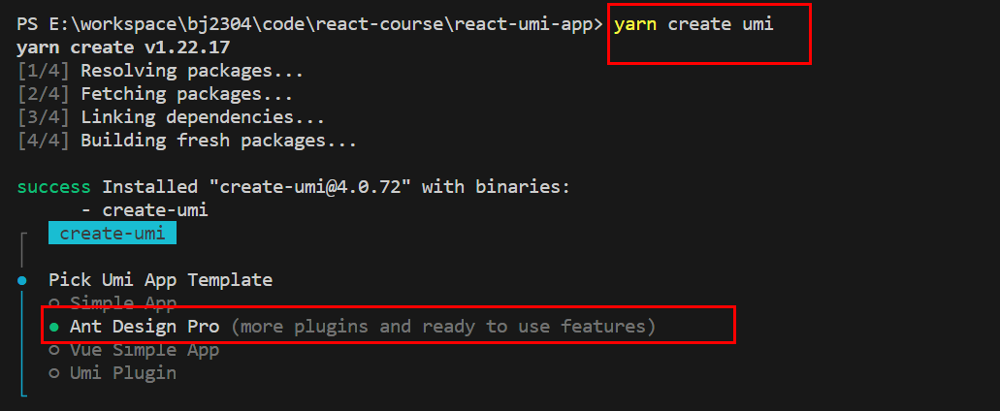
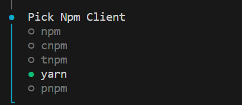
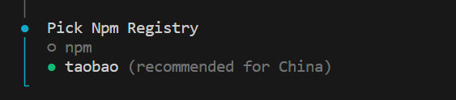
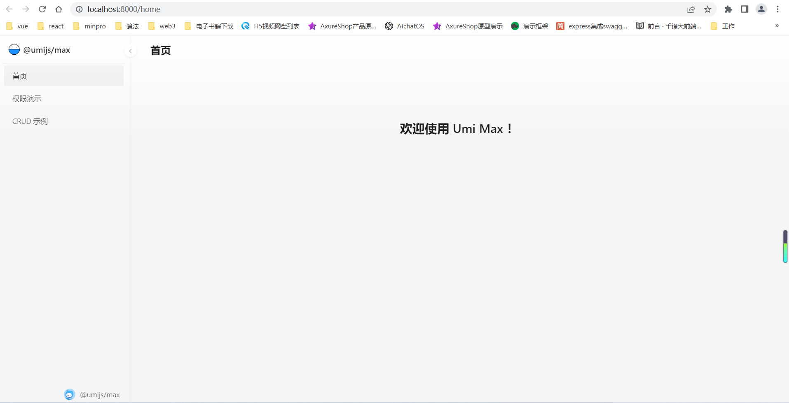

# 1.快速开始

> 确保nodejs版本在14以上

## 1.1 包管理器

pnpm cnpm npm yarn

## 1.2 创建项目

找个地方建个空目录。

```sh
$ mkdir react-umi-app && cd react-umi-app
```

通过官方工具创建项目 - 选择其一即可，本项目采用 yarn

```sh
# pnpm
$ pnpm dlx create-umi@latest
# bun
$ bunx create-umi
# npm 
$ npx create-umi@latest
# yarn 
$ yarn create umi
```







**代码格式化**`.prettierrc`

```json
{
  "printWidth": 80, // 超过最大值换行
  "singleQuote": true, // 使用单引号代替双引号
  "trailingComma": "all", // 在对象或数组最后一个元素后面是否加逗号（在ES5中加尾逗号）
  "proseWrap": "never", // 默认值。因为使用了一些折行敏感型的渲染器（如GitHub comment）而按照markdown文本样式进行折行
  "overrides": [{ "files": ".prettierrc", "options": { "parser": "json" } }],
  "plugins": ["prettier-plugin-organize-imports", "prettier-plugin-packagejson"]
}

```

## 1.3 项目目录

```sh
.
├── .husky # husky 是一个 Git Hooks 工具，借助 husky 我们可以在 git 流程的不同生命周期进行一些自动化操作。 https://blog.csdn.net/huangpb123/article/details/102690412
├── dist # 执行 umi build 后产物的默认输出文件夹。可通过 outputPath 配置修改产物输出文件夹
├── mock # 存放 mock 文件，此目录下所有 .ts / .js 文件会被 mock 服务加载，从而提供模拟数据
│   └── app.ts｜tsx
├── src
│   ├── .umi # dev 时的临时文件目录，比如入口文件、路由等，都会被临时生成到这里。
│   ├── assets
│   ├── components # 组件
│   ├── constants # 常量
│   ├── layouts # 全局布局，默认会在所有路由下生效
│   │   ├── BasicLayout.tsx
│   │   ├── index.less
│   ├── models # 状态管理器
│   │   ├── global.ts
│   │   └── index.ts
│   ├── pages # 页面
│   │   ├── index.less
│   │   └── index.tsx
│   ├── utils // 推荐目录
│   │   └── index.ts
│   ├── services // 推荐目录
│   │   └── api.ts
│   ├── app.(ts|tsx)
│   ├── access.ts # 权限配置
├── .umirc.ts // umi配置文件
├── package.json
├── tsconfig.json
└── typings.d.ts
```

## 1.4 运行项目

```sh
$ npm run dev # 开发环境
$ npm run build # 打包
```



# 2.查看文件

## 2.1 .umirc.ts

```ts
import { defineConfig } from '@umijs/max';

export default defineConfig({
  antd: {}, // 组件库
  access: {}, // 权限
  model: {}, // 状态管理
  initialState: {}, // 初始状态
  request: {}, // 数据请求
  layout: { // 页面布局
    title: '嗨购管理系统',
  },
  routes: [ // 路由设置
    {
      path: '/',
      redirect: '/home',
    },
    {
      name: '首页',
      path: '/home',
      component: './Home',
    },
    {
      name: '权限演示',
      path: '/access',
      component: './Access',
    },
    {
      name: ' CRUD 示例',
      path: '/table',
      component: './Table',
    },
  ],
  npmClient: 'yarn',
});


```

##  2.2 src/app.ts

```ts
// src/app.ts
// 运行时配置

// 全局初始化数据配置，用于 Layout 用户信息和权限初始化
// 更多信息见文档：https://umijs.org/docs/api/runtime-config#getinitialstate
export async function getInitialState(): Promise<{ name: string }> {
  // return { name: '@umijs/max' };
  return { name: '嗨购' };
}

export const layout = () => {
  return {
    // logo: 'https://img.alicdn.com/tfs/TB1YHEpwUT1gK0jSZFhXXaAtVXa-28-27.svg',
    logo: 'https://g.csdnimg.cn/static/logo/favicon32.ico',
    menu: {
      locale: false,
    },
  };
};

```

## 2.3 系统首页

```ts
// src/pages/Home.index.tsx
import { useModel } from '@umijs/max';
// import styles from './index.less';
const HomePage: React.FC = () => {
  const { name } = useModel('global');
  return (
    <>
      系统首页 - {name}
    </>
  );
};

export default HomePage;

```

# 3.创建管理系统的页面以及配置路由

```sh
$ npx umi g page Banner/List Banner/Add

$ npx umi g page Pro/List Pro/Search
```

```ts
// .umirc.ts
import { defineConfig } from '@umijs/max';

export default defineConfig({
  antd: {},
  access: {},
  model: {},
  initialState: {},
  request: {},
  layout: {
    title: '嗨购管理系统',
  },
  routes: [
    {
      path: '/',
      redirect: '/home',
    },
    {
      name: '系统首页',
      path: '/home',
      component: './Home',
    },
    {
      name: '轮播图管理',
      path: '/banner',
      routes: [
        {
          name: '轮播图列表',
          path: '/banner/list',
          component: './Banner/List'
        },
        {
          name: '添加轮播图',
          path: '/banner/add',
          component: './Banner/Add'
        }
      ]
    },
    {
      name: '产品管理',
      path: '/pro',
      routes: [
        {
          name: '产品列表',
          path: '/pro/list',
          component: './Pro/List'
        },
        {
          name: '筛选列表',
          path: '/pro/search',
          component: './Pro/Search'
        }
      ]
    }
  ],
  npmClient: 'yarn',
});


```

# 4.左侧菜单栏不期望出现

添加轮播图不期望出现在左侧菜单

```ts
{
  name: '轮播图管理',
  path: '/banner',
  routes: [
    {
      name: '轮播图列表',
      path: '/banner/list',
      component: './Banner/List'
    },
    {
      name: '添加轮播图',
      path: '/banner/add',
      component: './Banner/Add',
      hideInMenu: true,
    }
  ]
  },
```

> * 不写`name`属性
> * 写`name`属性，添加 `hideInMenu` 属性

# 5.构建登录

参考链接：https://umijs.org/docs/max/layout-menu#%E6%89%A9%E5%B1%95%E7%9A%84%E8%B7%AF%E7%94%B1%E9%85%8D%E7%BD%AE

```
$ npx umi g page Login/Index
```

```ts
{
  path: '/login',
  component: './Login/Index',
  menuRender: false // 不展示左侧菜单
},
```

# 6.设置面包屑导航以及快捷导航

```ts
// config/routes.ts
export interface IRoute {
  [x: string]: any
  path: string
  name?: string
  redirect?: string
  component?: string
  menuRender?: boolean
  hideInMenu?: boolean
  routes?: IRoute[]
}
const routes = [
  {
    path: '/',
    redirect: '/home',
  },
  {
    path: '/pro',
    redirect: '/pro/list',
  },
  {
    path: '/banner',
    redirect: '/banner/list',
  },
  {
    path: '/login',
    component: './Login/Index',
    menuRender: false // 不展示左侧菜单
  },
  {
    name: '系统首页',
    path: '/home',
    component: './Home',
  },
  {
    name: '轮播图管理',
    path: '/banner',
    routes: [
      {
        name: '轮播图列表',
        path: '/banner/list',
        component: './Banner/List'
      },
      {
        name: '添加轮播图',
        path: '/banner/add',
        component: './Banner/Add',
        hideInMenu: true,
      }
    ]
  },
  {
    name: '产品管理',
    path: '/pro',
    routes: [
      {
        name: '产品列表',
        path: '/pro/list',
        component: './Pro/List'
      },
      {
        name: '筛选列表',
        path: '/pro/search',
        component: './Pro/Search'
      }
    ]
  }
]

export default routes
```

```ts
// umrc.ts
import { defineConfig } from '@umijs/max';
import routes from './config/routes';

export default defineConfig({
  antd: {},
  access: {},
  model: {},
  initialState: {},
  request: {},
  layout: {
    title: '嗨购管理系统',
  },
  routes: routes,
  npmClient: 'yarn',
});


```

```tsx
// src/layouts/index.tsx

import type { FC } from 'react';
import { Outlet, useLocation, Link } from 'umi'
import routes, { IRoute } from '../../config/routes'
import { Breadcrumb } from 'antd'
import AppTabs from './AppTabs';
interface BaseLayoutProps {}
let breadcrumbNameMap: Record<string, string>  = {}

function getBreadcrumbNameMap (menus: IRoute[]) {
  menus.forEach(item => {
    if (item.path !== '/home') {
      if (item.routes) {
        breadcrumbNameMap[item.path] = item.name!
        getBreadcrumbNameMap(item.routes)
      } else {
        breadcrumbNameMap[item.path] = item.name!
      }
    }
  })
}
getBreadcrumbNameMap(routes)
console.log(breadcrumbNameMap)
const BaseLayout: FC<BaseLayoutProps> = () => {
  const { pathname } = useLocation()

  const pathSnippets = pathname.split('/').filter((i) => i);
  // console.log(pathSnippets) // ['pro', 'list']

  const extraBreadcrumbItems = pathSnippets.map((_, index) => {
    // 第一次 /pro
    // 第二次 /pro/list
    const url = `/${pathSnippets.slice(0, index + 1).join('/')}`;
    // console.log(index, url)
    return {
      key: url,
      title: <Link to={url}>{breadcrumbNameMap[url]}</Link>,
    };
  });

  const breadcrumbItems = [
    {
      title: <Link to="/">系统首页</Link>,
      key: '',
    },
  ].concat(extraBreadcrumbItems);

  return (
    <>
      {
        pathname === '/login' ? 
        null : 
        <>
          <Breadcrumb items={breadcrumbItems} />
          <AppTabs />
        </>
      }
      <Outlet />
    </>
  );
}

export default BaseLayout;

```

```ts
// src/layouts/AppTabs.tsx

import menus, { IRoute } from '../../config/routes'; // ++++++
import { Tag, TagProps } from 'antd';
import  { useState, FC, useEffect } from 'react';
import { useLocation, useNavigate } from 'umi';

import { Scrollbars } from 'react-custom-scrollbars-2';


interface AppTabsProps {}

const MyTag: FC<TagProps> = (props) => {
  return (
    <Tag {...props} onClick={ props.onClick } style={{ borderRadius: 0,  height: 26, lineHeight: '26px', cursor: 'pointer' }}>{ props.children }</Tag >
  )
}

// 需要的原始的数据
const tabArr: Array<{ path: string, name: string}> = [] 
const getTabArr = (menus: IRoute[]) => { 
  menus.forEach(item => {
    if (item.routes) {
      getTabArr(item.routes)
    } else {
      if (item.name) {
        tabArr.push({ path: item.path as string, name: item.name! })
      }
    }
  })
}
getTabArr(menus) 
const AppTabs: FC<AppTabsProps> = () => {

  // 准备一份展示数据
  const [arr, setArr] = useState<Array<{path: string, name: string}>>([{ path: '/', name: '系统首页' }])
  // 标识哪一个选项是被选中的
  const [current, setCurrent] = useState(0)

  const [num, setNum] = useState(0)

  const { pathname } = useLocation()

  useEffect(() => {
    // 查找当前的路由在不在展示数据中
    const index = arr.findIndex(item => item.path === pathname) 
    if (index !== -1) { // 在展示数据中，切换选中
      setCurrent(index)
    } else { // 不在展示组件中，给展示组件添加数据
      // 从原始数据中提取当前路由对应的数据，添加给展示数据
      const item = tabArr.find(item => item.path === pathname)
      // 查找到数据，先处理数据，然后再修改状态
      item && arr.push(item)
      setArr(arr)
      setCurrent(arr.length - 1) // 选中最后一项

    }
  }, [pathname, arr, num])

  const navigate = useNavigate()
  return (
    <div style={{ display: 'flex', alignItems: 'center', height: 32, backgroundColor: '#fff', boxShadow: '0px 0px 5px #ccc', padding: '0 16px'}}>
      <Scrollbars style={{ width: '100%', height: 32, whiteSpace: 'nowrap',marginTop: 6 }}>
        {
          arr.map((item, index) => {
            return (
              <MyTag 
                closable = { index !== 0 } 
                key = { item.path }
                color = { current === index ? '#42b983': '#ccc'}
                onClick={ () => {
                  // console.log('click')
                  navigate(item.path)
                } }
                onClose={ (event) => {
                  event.preventDefault()
                  // console.log('delete')
                  if (current === index) { // 需要删除当前的选中项
                    console.log(1)
                    if (current === arr.length - 1) { // 当前需要删除的项是 最后一项
                      console.log('最后')
                      navigate(arr[index - 1].path) // 跳转路由到前一项
                      setCurrent(index - 1) // 选中项为前一项
                      // // 删除了数据
                      // const newArr = arr
                      // newArr.splice(index, 1)
                      // setArr(newArr)
                    } else {
                      console.log('中间')
                      // navigate(arr[arr.length  - 1].key) // 跳转到了最后一项
                      // setCurrent(arr.length  - 1) // 最后一项被选中
                      // 按照chrome标签 删除中间的项，后一个被选中
                      navigate(arr[index + 1].path) 
                      setCurrent(index + 1 ) 
                      // // 删除了数据
                      // const newArr = arr
                      // newArr.splice(index, 1)
                      // setArr(newArr)
                    }
                  } else {
                    console.log(2)
                    if (index < current) {
                      setCurrent(current  - 1)
                      // // 删除了数据
                      // const newArr = arr
                      // newArr.splice(index, 1)
                      // setArr(newArr)
                    } else {
                      console.log(6666)
                      setNum(Math.random())
                      // navigate(pathname)
                      // // 删除了数据
                      // const newArr = arr
                      // newArr.splice(index, 1)
                      // setArr(newArr)
                    }
                  }
                  // 删除了数据
                  const newArr = arr
                  newArr.splice(index, 1)
                  setArr(newArr)
                } }
              >{ item.name }</MyTag>
            )
          })
        }
      </Scrollbars>
      {/* <MyTag>系统首页</MyTag >
      <MyTag closable >
        Tag 2
      </MyTag>
      <MyTag closable color="#42b983">
        Tag 3
      </MyTag> */}
    </div>
  );
}

export default AppTabs;

```

# 7.构建登录页面

```less
// src/global.less
#root, .ant-pro-layout, .ant-layout, .ant-pro-layout-container {
  height: 100%;
}
:where(.css-dev-only-do-not-override-ox4id5).ant-pro-layout .ant-pro-layout-content {
  display: flex;
  flex-direction: column;
  width: 100%;
  background-color: transparent;
  position: relative;
  padding-block: 0; 
  padding-inline: 0; 
}
```

```ts
// src/app.ts
// 运行时配置

import './global.less'

// 全局初始化数据配置，用于 Layout 用户信息和权限初始化
// 更多信息见文档：https://umijs.org/docs/api/runtime-config#getinitialstate
export async function getInitialState(): Promise<{ name: string }> {
  // return { name: '@umijs/max' };
  return { name: '嗨购' };
}

export const layout = () => {
  return {
    // logo: 'https://img.alicdn.com/tfs/TB1YHEpwUT1gK0jSZFhXXaAtVXa-28-27.svg',
    logo: 'https://g.csdnimg.cn/static/logo/favicon32.ico',
    menu: {
      locale: false,
    },
  };
};

```

```tsx
// src/pages/login/Index.tsx
import React from 'react';
import { Button, Form, Input, message } from 'antd';
import styles from './Index.less'

import { useNavigate } from 'umi';


const App: React.FC = () => {
  const [messageApi, contextHolder] = message.useMessage();

  const navigate = useNavigate()

  const onFinish = (values: { adminname: string, password: string }) => {
    console.log('Success:', values);
    
  };
  
  const onFinishFailed = (errorInfo: any) => {
    console.log('Failed:', errorInfo);
  };
  
  return (
    <div className={ styles.login_form_box}>
      {contextHolder}
      <h1 className={ styles.login_form_title }>嗨购后台管理系统</h1>
      <Form
        className={ styles.login_form }
        name="basic"
        wrapperCol={{ span: 24 }}
        onFinish={onFinish}
        onFinishFailed={onFinishFailed}
        autoComplete="off"
      >
        <Form.Item
          name="adminname"
          rules={[{ required: true, message: '请输入管理员账户!' }]}
        >
          <Input placeholder='管理员账户'/>
        </Form.Item>
    
        <Form.Item
          name="password"
          rules={[{ required: true, message: '请输入管理员密码!' }]}
        >
          <Input.Password placeholder='密码'/>
        </Form.Item>
    
        <Form.Item >
          <Button type="primary" htmlType="submit" block>
            登录
          </Button>
        </Form.Item>
      </Form>
    </div>
  )
}

export default App;

```

# 8.数据请求的封装

可以继续延用 cra 项目中封装的接口，前提条件安装 `cnpm i axios store2 -S`

```ts
// src/utils/request.ts
// 自定义axios
import axios, { AxiosRequestConfig } from 'axios'
import store2 from 'store2'

// 环境：开发环境 生产环境
// npm run start 开发环境  ===》 开发服务器 http://121.89.205.189:3000/admin/admin/login
// npm run build 生产环境  ===》 生产服务器 http://121.89.205.189:3000/admin/admin/login
// npm run test  测试环境  ===》 测试服务器 http://121.89.205.189:3000/admin/admin/login

// npm run start ===> process.env.NODE_ENV = 'development'
// npm run build ===> process.env.NODE_ENV = 'production'
const isDev = process.env.NODE_ENV === 'development'

const ins = axios.create({
  // http://121.89.205.189:3000/admin/admin/login ==> /admin/login
  baseURL: isDev ? 'http://121.89.205.189:3000/admin' : 'http://121.89.205.189:3000/admin'
})
// 覆写库的超时默认值
// 现在，在超时前，所有请求都会等待 6 秒
ins.defaults.timeout = 60000;

// 请求拦截器
ins.interceptors.request.use((config) => {
  // 所有的请求之前做些什么：头信息传递token

  config.headers!.token = store2.get('token') || ''

  return config
}, (error) => {
  return Promise.reject(error) // throw new Error(error)
})

// 响应拦截器
ins.interceptors.response.use((response) => {
  // 拿到服务器数据之前做些什么： 验证token，验证通过，继续，验证不通过，跳转到登录页面
  if (response.data.code === '10119') { // 需要登录 -- 登录时保存了adminname token
    store2.remove('adminname')
    store2.remove('token')

    window.location.href = '/login' // BrowserRouter '/login'
  }
  return response
}, (error) => {
  return Promise.reject(error)
})


/**
 * export default ins
 * 
 * // api/admin.ts
 * import request from '@/utils/request'
 * 
 * export function adminLogin (data: { adminname: string, password: string}) {
 *  return request.post('/admin/login', data)
 * }
 * 
 */

// 自定义各种常用的restful api的请求
export default function request( config: AxiosRequestConfig<any> ) {
  // 接口请求 必须参数  url method  data  headers
  const { url = '', method = 'GET', data = {}, headers = {} } = config

  // 区分不同的数据请求 为了执行时传入的数据请求方式统一性 GEt GeT get GET
  switch (method.toUpperCase()) {
    case 'GET':
      return ins.get(url, { params: data })

    case 'POST': 
      // 可能数据请求方式 表单提交  文件提交   默认json
      // 表单提交
      if (headers['content-type'] === 'application/x-www-form-url-encoded') {
        // 转换参数  URLSearchParams  / 第三方库 qs
        const p = new URLSearchParams()
        for (const key in data) {
          p.append(key, data[key])
        }
        return ins.post(url, p, { headers })
      }

      // 文件提交
      if (headers['content-type'] === 'multipart/form-data') {
        const p = new FormData()
        for (const key in data) {
          p.append(key, data[key])
        }
        return ins.post(url, p, { headers })
      }

      // 默认 application/json
      return ins.post(url, data)
    
    // 修改数据 - 所有的数据的更新
    case 'PUT':
      return ins.put(url, data)

    // 删除数据
    case 'DELETE': 
      return ins.delete(url, { data })  

    // 修改数据 - 部分的数据的更新
    case 'PATCH':
      return ins.patch(url, data)

    default:
      return ins(config)
  }
}
```

```ts
// src/api/admin.ts
import request from "@/utils/request"; 

// 登录接口封装
export function loginAdmin (data: { adminname: string, password: string}) {
  return request({
    url: '/admin/login',
    method: 'POST',
    data
  })
}

interface IAddAdminData {
  adminname: string
  password: string
  role: number
  checkedKeys: any[]
}
// 添加管理员
export  function addAdmin (data: IAddAdminData) {
  return request({
    url: '/admin/add',
    method: 'POST',
    data
  })
}

interface IUpdateAdminData {
  adminname: string
  role: number
  checkedKeys: any[]
}
// 编辑管理员 --- 密码参数不需要
export  function updateAdmin (data: IUpdateAdminData) {
  return request({
    url: '/admin/update',
    method: 'POST',
    data
  })
}

// 删除管理员
export  function deleteAdmin (data: { adminid: string }) {
  return request({
    url: '/admin/delete',
    method: 'POST',
    data
  })
}

// 获取管理员详细信息
export  function getAdminDetail (data: { adminname: string }) {
  return request({
    url: '/admin/detail',
    data
  })
}
// 获取管理员列表
export  function getAdminList () {
  return request({
    url: '/admin/list'
  })
}
```

```tsx
// src/pages/login/Index.tsx
import React from 'react';
import { Button, Form, Input, message } from 'antd';
import styles from './Index.less'
import { loginAdmin } from '@/api/admin'
import { useNavigate } from 'umi';


const App: React.FC = () => {
  const [messageApi, contextHolder] = message.useMessage();

  const navigate = useNavigate()

  const onFinish = (values: { adminname: string, password: string }) => {
    console.log('Success:', values);
    loginAdmin(values).then(res => {
      if (res.data.code === '10005') {
        // 没有该账号
        messageApi.open({
          type: 'error',
          content: '账号未注册',
        });
      } else if (res.data.code === '10003'){
        // 密码错误
        messageApi.open({
          type: 'warning',
          content: '密码错误',
        });
      } else {
        // 登录成功
        messageApi.open({
          type: 'success',
          content: '登录成功',
        });
      }
    })
  };
  
  const onFinishFailed = (errorInfo: any) => {
    console.log('Failed:', errorInfo);
  };
  
  return (
    <div className={ styles.login_form_box}>
      {contextHolder}
      <h1 className={ styles.login_form_title }>嗨购后台管理系统</h1>
      <Form
        className={ styles.login_form }
        name="basic"
        wrapperCol={{ span: 24 }}
        onFinish={onFinish}
        onFinishFailed={onFinishFailed}
        autoComplete="off"
      >
        <Form.Item
          name="adminname"
          rules={[{ required: true, message: '请输入管理员账户!' }]}
        >
          <Input placeholder='管理员账户'/>
        </Form.Item>
    
        <Form.Item
          name="password"
          rules={[{ required: true, message: '请输入管理员密码!' }]}
        >
          <Input.Password placeholder='密码'/>
        </Form.Item>
    
        <Form.Item >
          <Button type="primary" htmlType="submit" block>
            登录
          </Button>
        </Form.Item>
      </Form>
    </div>
  )
}

export default App;

```

> 如果想要使用 umi 提供的数据请求方案
>
> ```tsx
> // src/pages/Home.index.tsx
> import { useModel } from '@umijs/max';
> import { useRequest } from 'umi'
> import { request } from '@umijs/max';
> // import styles from './index.less';
> const HomePage: React.FC = () => {
>   const { name } = useModel('global');
>   const { data, error, loading } = useRequest(() => {
>     return request('http://121.89.205.189:3000/api/pro/list', { 
>       method: 'GET',
>       params: {
>         limitNum: 3
>       }
>     })
>   });
>   console.log('data', data)
>   if (loading) {
>     return <div>loading...</div>;
>   }
>   if (error) {
>     return <div>{error.message}</div>;
>   }
>   return (
>     <>
>       系统首页 - {name}
>     </>
>   );
> };
> 
> export default HomePage;
> 
> ```
>
> 

# 9.状态管理器管理状态

```ts
// src/models/admin.ts
import { useState } from 'react';
import store2 from 'store2';

const useAdmin = () => {
  const [adminname, setAdminname] = useState<string>(store2.get('adminname') || '');
  const [token, setToken] = useState<string>(store2.get('token') || '');
  return {
    adminname,
    setAdminname,
    token,
    setToken
  };
};

export default useAdmin;
```

```tsx
// src/pages/login/Index.tsx
import React from 'react';
import { Button, Form, Input, message } from 'antd';
import styles from './Index.less'
import { loginAdmin } from '@/api/admin'
import { useNavigate, useModel } from 'umi';
import store2 from 'store2';


const App: React.FC = () => {
  const [messageApi, contextHolder] = message.useMessage();
  const { setAdminname, setToken } = useModel('admin')
  const navigate = useNavigate()

  const onFinish = (values: { adminname: string, password: string }) => {
    console.log('Success:', values);
    loginAdmin(values).then((res: any) => {
      if (res.data.code === '10005') {
        // 没有该账号
        messageApi.open({
          type: 'error',
          content: '账号未注册',
        });
      } else if (res.data.code === '10003'){
        // 密码错误
        messageApi.open({
          type: 'warning',
          content: '密码错误',
        });
      } else {
        // 登录成功
        messageApi.open({
          type: 'success',
          content: '登录成功',
        });
        setAdminname(res.data.data.adminname) // +++++
        setToken(res.data.data.token)// +++++
        store2.set('adminname', res.data.data.adminname)// +++++
        store2.set('token', res.data.data.token)// +++++
        navigate('/home')// +++++
      }
    })
  };
  
  const onFinishFailed = (errorInfo: any) => {
    console.log('Failed:', errorInfo);
  };
  
  return (
    <div className={ styles.login_form_box}>
      {contextHolder}
      <h1 className={ styles.login_form_title }>嗨购后台管理系统</h1>
      <Form
        className={ styles.login_form }
        name="basic"
        wrapperCol={{ span: 24 }}
        onFinish={onFinish}
        onFinishFailed={onFinishFailed}
        autoComplete="off"
      >
        <Form.Item
          name="adminname"
          rules={[{ required: true, message: '请输入管理员账户!' }]}
        >
          <Input placeholder='管理员账户'/>
        </Form.Item>
    
        <Form.Item
          name="password"
          rules={[{ required: true, message: '请输入管理员密码!' }]}
        >
          <Input.Password placeholder='密码'/>
        </Form.Item>
    
        <Form.Item >
          <Button type="primary" htmlType="submit" block>
            登录
          </Button>
        </Form.Item>
      </Form>
    </div>
  )
}

export default App;

```

```tsx
// src/pages/Home.index.tsx
import { useModel } from '@umijs/max';
import { useRequest } from 'umi'
import { request } from '@umijs/max';
// import styles from './index.less';
const HomePage: React.FC = () => {
  const { name } = useModel('global');
  const { adminname } = useModel('admin');
  // const { data, error, loading } = useRequest(() => {
  //   return request('http://121.89.205.189:3000/api/pro/list', { 
  //     params: {
  //       limitNum: 3
  //     }
  //   })
  // });
  // console.log('data', data)
  // if (loading) {
  //   return <div>loading...</div>;
  // }
  // if (error) {
  //   return <div>{error.message}</div>;
  // }
  return (
    <>
      系统首页 - {name} - { adminname }
    </>
  );
};

export default HomePage;

```

# 10.首页渲染数据

```tsx
// src/pages/Home.index.tsx
import { useModel } from '@umijs/max';
import { Card, Col, Row, Statistic } from 'antd';
import {useEffect, useState, FC } from 'react';
import { getUserTotalNum, getShopTotalNum } from '@/api/home'
// import styles from './index.less';
const HomePage: React.FC = () => {
  const { name } = useModel('global');
  const { adminname } = useModel('admin');
  // const { data, error, loading } = useRequest(() => {
  //   return request('http://121.89.205.189:3000/api/pro/list', { 
  //     params: {
  //       limitNum: 3
  //     }
  //   })
  // });
  // console.log('data', data)
  // if (loading) {
  //   return <div>loading...</div>;
  // }
  // if (error) {
  //   return <div>{error.message}</div>;
  // }

  const [userNum, setUserNum] = useState(0)
  const [shopNum, setShopNum] = useState(0)
  useEffect(() => {
    getUserTotalNum().then(res => {
      setUserNum(res.data.data)
    })
    getShopTotalNum().then(res => {
      setShopNum(res.data.data)
    })
  }, [])
  return (
    <div style={{ padding: '10px 16px'}}>
      系统首页 - {name} - { adminname } -
      <Row gutter={16}>
        <Col span={6}>
          <Card bordered={false}>
            <Statistic
              title="用户总数"
              value={userNum}
              valueStyle={{ color: '#3f8600' }}
            />
          </Card>
        </Col>
        <Col span={6}>
          <Card bordered={false}>
            <Statistic
              title="商品总数"
              value={shopNum}
              valueStyle={{ color: '#cf1322' }}
            />
          </Card>
        </Col>
      </Row>
    </div>
  );
};

export default HomePage;

```

# 11.登录状态判定

如果在管理系统页面，如果登录，不动，如果未登录，跳转到登录页面

如果在管理系统登录页面，如果登录，跳转到首页，如果未登录，继续登录

```tsx
// src/wrappers/auth.tsx 验证后台页面
import store2 from 'store2';
import { Navigate, Outlet } from 'umi'
 
const useAuth = () => {
  return {
    isLogin: store2.get('adminname') !== ''
  }
}
export default () => {
  console.log('1111')
  const { isLogin } = useAuth();
  if (isLogin) {
    return <Outlet />;
  } else{
    return <Navigate to="/login" />;
  }
}
```

```tsx
// src/wrappers/loginAuth.tsx  验证登录页面
import store2 from 'store2';
import { Navigate, Outlet } from 'umi'
 
const useAuth = () => {
  return {
    isLogin: store2.get('adminname') !== ''
  }
}
export default () => {
  console.log('222')
  const { isLogin } = useAuth();
  if (isLogin) {
    return <Navigate to="/" />;
  } else{
    return <Outlet />;
  }
}
```

```ts
// config/routes.ts
export interface IRoute {
  [x: string]: any
  path: string
  name?: string
  icon?: string,
  redirect?: string
  component?: string
  menuRender?: boolean
  hideInMenu?: boolean
  routes?: IRoute[]
}
const routes = [
  {
    path: '/',
    redirect: '/home',
  },
  {
    path: '/pro',
    redirect: '/pro/list',
  },
  {
    path: '/banner',
    redirect: '/banner/list',
  },
  {
    path: '/login',
    component: './Login/Index',
    menuRender: false, // 不展示左侧菜单
    wrappers: [ // ++++
      '@/wrappers/loginAuth.tsx',
    ],
  },
  {
    name: '系统首页',
    path: '/home',
    component: './Home',
    wrappers: [ // ++++
      '@/wrappers/auth.tsx',
    ],
  },
  {
    name: '轮播图管理',
    path: '/banner',
    routes: [
      {
        name: '轮播图列表',
        path: '/banner/list',
        component: './Banner/List',
        wrappers: [ // ++++
          '@/wrappers/auth.tsx',
        ],
      },
      {
        name: '添加轮播图',
        path: '/banner/add',
        component: './Banner/Add',
        hideInMenu: true,
        wrappers: [ // ++++
          '@/wrappers/auth.tsx',
        ],
      }
    ]
  },
  {
    name: '产品管理',
    path: '/pro',
    routes: [
      {
        name: '产品列表',
        path: '/pro/list',
        component: './Pro/List',
        wrappers: [ // ++++
          '@/wrappers/auth.tsx',
        ],
      },
      {
        name: '筛选列表',
        path: '/pro/search',
        component: './Pro/Search',
        wrappers: [ // ++++
          '@/wrappers/auth.tsx',
        ],
      }
    ]
  }
]

export default routes
```

# 12.权限操作

```ts
// src/access.ts
export default (initialState: API.UserInfo) => {
  // 在这里按照初始化数据定义项目中的权限，统一管理
  // 参考文档 https://umijs.org/docs/max/access
  // ['/', '/pro/list', '/banner', '/banner/list', '/banner/add']
  // 正常从接口请求服务器
  const checkedKeys = ['/', '/pro/list', '/banner', '/banner/list', '/banner/add']
  const canSeeAdmin = !!(
    initialState && initialState.name !== 'dontHaveAccess'
  );
  return {
    canSeeAdmin,
    canReadHome: checkedKeys.includes('/'),
    canReadProSearch: checkedKeys.includes('/pro/search'),
    canReadProList: checkedKeys.includes('/pro/list'),
    canReadBannerList: checkedKeys.includes('/banner/list'),
    canReadBannerAdd: checkedKeys.includes('/banner/add')
  };
};

```

```ts
// config/routes.ts
export interface IRoute {
  [x: string]: any
  path: string
  name?: string
  icon?: string,
  redirect?: string
  component?: string
  menuRender?: boolean
  hideInMenu?: boolean
  routes?: IRoute[]
}
const routes = [
  {
    path: '/',
    redirect: '/home',
  },
  {
    path: '/pro',
    redirect: '/pro/list',
  },
  {
    path: '/banner',
    redirect: '/banner/list',
  },
  {
    path: '/login',
    component: './Login/Index',
    menuRender: false, // 不展示左侧菜单
    wrappers: [
      '@/wrappers/loginAuth.tsx',
    ],
  },
  {
    name: '系统首页',
    path: '/home',
    component: './Home',
    wrappers: [
      '@/wrappers/auth.tsx',
    ],
    access: 'canReadHome' // +++++
  },
  {
    name: '轮播图管理',
    path: '/banner',
    routes: [
      {
        name: '轮播图列表',
        path: '/banner/list',
        component: './Banner/List',
        wrappers: [
          '@/wrappers/auth.tsx',
        ],
        access: 'canReadBannerList' // +++++
      },
      {
        name: '添加轮播图',
        path: '/banner/add',
        component: './Banner/Add',
        hideInMenu: true,
        wrappers: [
          '@/wrappers/auth.tsx',
        ],
        access: 'canReadBannerAdd' // +++++
      }
    ]
  },
  {
    name: '产品管理',
    path: '/pro',
    routes: [
      {
        name: '产品列表',
        path: '/pro/list',
        component: './Pro/List',
        wrappers: [
          '@/wrappers/auth.tsx',
        ],
        access: 'canReadProList' // +++++
      },
      {
        name: '筛选列表',
        path: '/pro/search',
        component: './Pro/Search',
        wrappers: [
          '@/wrappers/auth.tsx',
        ],
        access: 'canReadProSearch' // +++++
      }
    ]
  }
]

export default routes
```

> 以上包含了左侧菜单权限以及页面权限，如何使用按钮权限呢？

```tsx
// src/pages/Banner/List.tsx
import React from 'react';
import styles from './List.less';
import { Button, message } from 'antd';
import { useAccess, useNavigate } from '@umijs/max';

export default function Page() {
  const access = useAccess()
  const navigate = useNavigate()
  return (
    <div>
      <h1 className={styles.title}>Page List</h1>
      <Button onClick={ () => {
        if (access.canReadBannerAdd) {
          navigate('/banner/add')
        } else {
          message.warning('没有权限')
        }
      }}>添加轮播图</Button>
    </div>
  );
}

```

