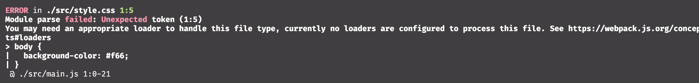
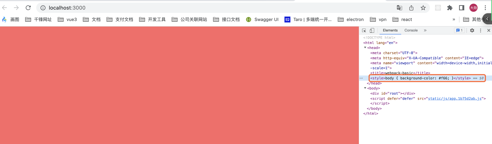
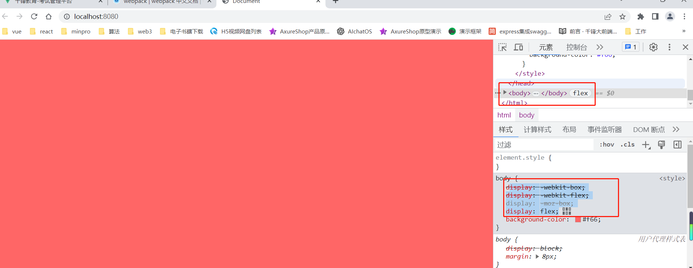
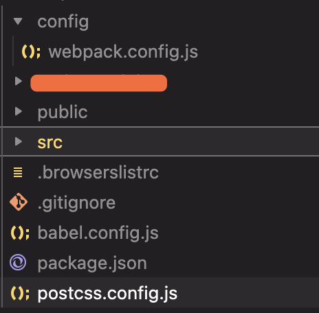

# *目标*

vue脚手架 `vue-cli`底层就是webpack

react脚手架 `create-react-app`底层就是webpack

```
Vite和Webpack都是现代化的前端构建工具，用于打包、转换和优化前端资源。以下是它们的主要差异：

构建速度
Vite相比于Webpack在构建速度方面有优势。它采用了“按需编译”的方式，只编译修改过的文件，而其他未修改的文件则基本可以被复用，避免了不必要的重复构建过程，大大提升了开发体验和构建速度。

开发体验
Vite提供了快速的HMR（Hot Module Replacement）功能，可以使开发者在修改代码后，实时更新页面。相比之下，Webpack的HMR功能需要额外的配置和插件支持。

配置
Vite配置起来相对简单，不需要额外的配置文件，大多数配置可以通过Vite的内置配置完成，比如自定义别名、模块引入方式、热更新等。而Webpack则需要更复杂的配置文件。

生态支持
Webpack的生态非常丰富，有大量的插件和loader可供选择，可以满足各种需求。相比之下，Vite还比较年轻，虽然也有相应的插件可用，但是相对较少。

兼容性
Webpack支持更广泛的浏览器和Node.js版本，而Vite则只支持最新版本的Chrome和Node.js环境。

结论：Vite适用于开发体验优先、性能需求高的项目，包括中大型应用和复杂的组件库；而Webpack则适用于需要更多自定义配置、生态支持更全面的项目，适用于大型应用或定制化项目。
```


Ø 安装webpack打包工具到本机

Ø 熟知webpack的核心配置

Ø 配置好开发环境devServer

Ø 配置好相关的loader和plugin

# **一、webpack**

官网：https://webpack.js.org

https://www.webpackjs.com/

## 1.1、webpack是什么

webpack是一种前端资源构建工具，一个静态模块打包器.在webpack看来，前端的所有资源文件(js/json/css/image/less/sass...)都会作为模块处理。它将根据模块的**依赖关系**进行静态分析，打包生成对应的静态资源。webpack可以解决当前web开发中所面临的困境，webpack提供了：

Ø 友好的模块化支持

Ø 代码压缩混淆

Ø 处理js/css兼容问题

Ø 性能优化（模块删减）-- tree-shaking(树摆)

> 注：webpack默认只能针对于js来进行打包处理

目前绝大多数企业中的前端项目，都是基于webpack进行打包构建的(vue/react)。

>从 v4.0.0 开始之后，webpack默认可以不用进行任何的配置就可以进行打包工作，然而默认的打包方式不能够满足实际的生产需要，所以还需要进行对应的手动配置。

> 默认配置文件:  webpack.config.js 或  webpackfile.js.
>
> webpack4.0之后，在使用webpack时安装两个包 webpack webpack-cli

## 1.2 webpack五个核心配置

### 1.2.1 entry入口

`字符串，数组，对象`

本项目应该使用哪个模块，来作为构建其内部依赖图的开始（指定打包入口文件）

> vue: src/main.js
>
> react: src/index.js

### 1.2.2 output输出

`对象`

在哪里输出它所创建的 bundle，以及如何命名这些文件，默认值为 ./dist

> vue: dist
>
> react: build

### 1.2.3mode 模式

`字符串`

通过选择 development(开发) 或 production(生产) 之中的一个，来设置 mode 参数，你可以启用相应模式下的 webpack 内置的优化

> development: 代码不压缩
>
> production： 代码压缩

### 1.2.4  **loader** **加载器（modules）**

`对象，里面写数组`

loader让webpack能够去处理那些非js文件(webpack自身只理解js)

### 1.2.5 plugins 插件

`数组`

插件则可以用于执行范围更广的任务。插件的范围包括，从打包优化和压缩，一直到重新定义环境中的变量。插件接口功能极其强大，可以用来处理各种各样的任务。

## 1.3 安装webpack

**安装方式2种**

Ø 全局安装

`cnpm i -g webpack webpack-cli`

Ø **局部安装 **

webpack是运行在node环境中的，Node >= 8.10 和 npm >= 5.6

```sh
$ cnpm init -y

$ cnpm i -D webpack webpack-cli
#打包使用的核心代码 webpack

#打包使用时的命令 webpack-cli
```

安装好后可以通过先前检查webpack的版本以确定是否安装成功：

`webpack --version`

在package.json文件中配置webpack运行脚本命令

 ```json
 "scripts": {
   "build": "webpack"
  },
 ```

```
- webpack-basic
	- config
		webpack.config.js
	- src
		main.js
	.gitignore
	package.json
	
```


##  1.4webpack基本使用

> webpack默认情况下，会在./src目录下面去找index.js入口文件，默认是不需要任何的webpack配置。
>
> 默认入口  src/index.js
>
> 默认出口  dist/main.js

在项目根目录下面创建一个`config/webpack.config.js`文件，此文件是webpack的默认配置文件名称，后续就可以在此目录下面对webpack进行运行打包配置

修改`package.json`中的运行命令

```json
{
  "name": "webpack-basic",
  "version": "1.0.0",
  "description": "",
  "main": "index.js",
  "scripts": {
    "build": "webpack --config config/webpack.config.js"
  },
  "keywords": [],
  "author": "",
  "license": "ISC",
  "devDependencies": {
    "webpack": "^5.88.1",
    "webpack-cli": "^5.1.4"
  }
}

```

> 如果 配置文件在项目的根目录，则不需要 通过 --config 设置配置文件

假如设定 `src/main.js`作为项目的入口文件，则创建 `webpack-basic/src/main.js`

```js
// config/webpack.config.js
const path = require('path')
module.exports = function () {
  return {
    // mode: 'development', // development
    mode: 'production', // production
    // 入口说明， 可以理解为从 package.json所以在的目录开始计算路径
    // entry: './src/main.js',
    // entrt: ['./src/main.js']
    entry: {
      app: './src/main.js'
    },
    output: {
      // 确定打包文件的路径为 build
      path: path.resolve(__dirname, '../build'),
      // 设置打包文件的名称
      // 打包出来的文件在 build/static/js
      // name标识输出的文件名
      // contenthash： 8 生成8位随机数，也可以直接写为 hash:8
      filename: 'static/js/[name].[contenthash:8].js'
    }
  }
}
```

> 如果多次打包，发现 dist 文件夹下出现更多打包的文件，并没有删除之前的，需要手动删除

```sh
# 删除打包的dist目录
$ cnpm i -D clean-webpack-plugin
```

```js
// config/webpack.config.js
const path = require('path')
// 引入清除以前打包的文件的插件
const { CleanWebpackPlugin } = require('clean-webpack-plugin')
module.exports = function () {
  return {
    // mode: 'development', // development
    mode: 'production', // production
    // 入口说明， 可以理解为从 package.json所以在的目录开始计算路径
    // entry: './src/main.js',
    // entrt: ['./src/main.js']
    entry: {
      app: './src/main.js'
    },
    output: {
      // 确定打包文件的路径为 build
      path: path.resolve(__dirname, '../build'),
      // 设置打包文件的名称
      // 打包出来的文件在 build/static/js
      // name标识输出的文件名
      // contenthash： 8 生成8位随机数，也可以直接写为 hash:8
      filename: 'static/js/[name].[contenthash:8].js'
    },
    // webpack的插件，书写形式为一个数组
    plugins: [
      // 避免每次打包都会出现新的文件
      new CleanWebpackPlugin()
    ]
  }
}
```

## 1.5 配置访问入口模板文件

在项目根目录下面创建一个public目录，并在此目录中创建一个index.html文件，

```html
<!-- public/index.html -->
<!DOCTYPE html>
<html lang="en">
<head>
  <meta charset="UTF-8">
  <meta name="viewport" content="width=device-width, initial-scale=1.0">
  <title>Document</title>
</head>
<body>
  <div id="root"></div> 
</body>
</html>
```

使用`webpack`的 `html-webpack-plugin`插件，可以将此文件用于项目web入口文件模块

```sh
# 安装
$ cnpm i -D html-webpack-plugin
```


```js
// config/webpack.config.js
const path = require('path')
// 引入清除以前打包的文件的插件
const { CleanWebpackPlugin } = require('clean-webpack-plugin')
const HtmlWebpackPlugin = require('html-webpack-plugin')
module.exports = function () {
  return {
    // mode: 'development', // development
    mode: 'production', // production
    // 入口说明， 可以理解为从 package.json所以在的目录开始计算路径
    // entry: './src/main.js',
    // entrt: ['./src/main.js']
    entry: {
      app: './src/main.js'
    },
    output: {
      // 确定打包文件的路径为 build
      path: path.resolve(__dirname, '../build'),
      // 设置打包文件的名称
      // 打包出来的文件在 build/static/js
      // name标识输出的文件名
      // contenthash： 8 生成8位随机数，也可以直接写为 hash:8
      filename: 'static/js/[name].[contenthash:8].js'
    },
    // webpack的插件，书写形式为一个数组
    plugins: [
      // 避免每次打包都会出现新的文件
      new CleanWebpackPlugin(),
      new HtmlWebpackPlugin({
        // 将public/index.html文件作为模版文件
        // 打包时这个文件会被自动打包到 build目录下，并且还自动引入了js的文件
        template: './public/index.html',
        // 默认引入js在head内，可以修改为body
        inject: 'body',
        // 这个一般在生产环境下使用
        minify: {
        // 删除html模版中的注释语句
        removeComments: true,
        // 压缩HTML代码
        collapseWhitespace: true,
        // 删除属性的引号
        removeAttributeQuotes: true
        // https://www.npmjs.com/package/html-webpack-plugin
        }
      })
    ]
  }
}
```

## 1.6 devServer创建

我们已经可以使用打包工具去将写好的代码进行打包了，但是在操作的过程中大家可能会发现有一个比较麻烦的地方：修改一次代码就得重新打包一次，那么有没有在开发阶段，编写代码后自动进行编译看效果并且最好还能提供web服务的功能呢?答案是有的，它就是`webpack-dev-server`自动化打包工具。

```sh
# 安装 webpack-dev-server
$ cnpm i -D webpack-dev-server
```

给 package.json 添加启动命令

```json
"scripts": {
    "start": "webpack serve --config config/webpack.config.js",
    "dev": "npm run start",
    "build": "webpack --config config/webpack.config.js"
  },
```

```sh
$ cnpm run start
```

> 发现在启动项目的过程中，会提示给你 可以通过 `http://localhost:8080` 访问项目
>
> 那么 如果想要修改 端口号呢？如果想要和react一样自动打开默认浏览器呢？如果项目请求遇到了跨域问题呢？

```js
// config/webpack.config.js
const path = require('path')
// 引入清除以前打包的文件的插件
const { CleanWebpackPlugin } = require('clean-webpack-plugin')
const HtmlWebpackPlugin = require('html-webpack-plugin')

module.exports = function () {
  return {
    // mode: 'development', // development
    mode: 'production', // production
    // 入口说明， 可以理解为从 package.json所以在的目录开始计算路径
    // entry: './src/main.js',
    // entrt: ['./src/main.js']
    entry: {
      app: './src/main.js'
    },
    output: {
      // 确定打包文件的路径为 build
      path: path.resolve(__dirname, '../build'),
      // 设置打包文件的名称
      // 打包出来的文件在 build/static/js
      // name标识输出的文件名
      // contenthash： 8 生成8位随机数，也可以直接写为 hash:8
      filename: 'static/js/[name].[contenthash:8].js'
    },
    // webpack的插件，书写形式为一个数组
    plugins: [
      // 避免每次打包都会出现新的文件
      new CleanWebpackPlugin(),
      new HtmlWebpackPlugin({
        // 将public/index.html文件作为模版文件
        // 打包时这个文件会被自动打包到 build目录下，并且还自动引入了js的文件
        template: './public/index.html',
        // 默认引入js在head内，可以修改为body
        inject: 'body',
        // 这个一般在生产环境下使用
        minify: {
        // 删除html模版中的注释语句
        removeComments: true,
        // 压缩HTML代码
        collapseWhitespace: true,
        // 删除属性的引号
        removeAttributeQuotes: true
        // https://www.npmjs.com/package/html-webpack-plugin
        }
      })
    ],
    // 开发服务器的配置 https://www.webpackjs.com/configuration/dev-server#root
    devServer: {
      // 开启开发服务器的端口号
      port: 'auto', // 也可以写固定值
      // 开发服务器准备就绪，自动打开默认浏览器运行
      open: true,
      // history 路由模式刷新页面404页面处理
      historyApiFallback: true,
      // 资源压缩
      compress: true,
      // 如果遇到代理问题
      proxy: {
        '/myapi': {
          target: 'http://121.89.205.189:3000/api',
          changeOrigin: true,
          pathRewrite: {
            '^/myapi': ''
          }
        }
      }
    }
  }
}
```

```js
// src/main.js
const a = 1;

fetch('/myapi/pro/list').then(res => res.json()).then(res => {
  console.log(res.data)
})
```

> 数据打印成功说明代理设置没有问题

## 1.7 加载器

### 1.7.1 加载器概述

在实际开发中，webpack只能打包处理以.js为后缀的模块，其他非.js后缀的模块webpack默认处理不了，而需要调用loader加载器才能正常打包，否则会报错！

loader加载器可以协助webpack打包处理特定的文件模块了，例如：

Ø sass-loader可以打包处理.scss相关的文件

Ø css-loader可以处理css样关的文件

Ø babel可以处理js兼容模块

Ø 配置图片处理 …


### 1.7.2 打包处理css文件

正如前面所说，webpack默认不能打包css文件，如果在没有安装css加载器的时候打包，包含css文件的项目则会报错：

```
/* src/style.css */
body {
  background-color: #f66;
}
```

```js
import './style.css'
console.log(1)
console.log(2)
console.log(3)

fetch('/myapi/pro/list').then(res => res.json()).then(res => console.log(res.data))
```



我们需要安装一个CSS的加载器才能让webpack帮助我们打包css文件。

所以要想打包css文件，则需要安装css加载器，该加载器的安装命令为：

```sh
$ cnpm i -D style-loader css-loader
```

安装好需要的加载器后需要对webpack进行配置，告诉webpack当遇到css后缀的文件应该交由哪个加载器去处理。在webpack打包命令对应的module的rules数组中添加css-loader规则：

```js
// config/webpack.config.js
const path = require('path')
// 引入清除以前打包的文件的插件
const { CleanWebpackPlugin } = require('clean-webpack-plugin')
const HtmlWebpackPlugin = require('html-webpack-plugin')

module.exports = function () {
  return {
    // mode: 'development', // development
    mode: 'production', // production
    // 入口说明， 可以理解为从 package.json所以在的目录开始计算路径
    // entry: './src/main.js',
    // entrt: ['./src/main.js']
    entry: {
      app: './src/main.js'
    },
    output: {
      // 确定打包文件的路径为 build
      path: path.resolve(__dirname, '../build'),
      // 设置打包文件的名称
      // 打包出来的文件在 build/static/js
      // name标识输出的文件名
      // contenthash： 8 生成8位随机数，也可以直接写为 hash:8
      filename: 'static/js/[name].[contenthash:8].js'
    },
    // webpack的插件，书写形式为一个数组
    plugins: [
      // 避免每次打包都会出现新的文件
      new CleanWebpackPlugin(),
      new HtmlWebpackPlugin({
        // 将public/index.html文件作为模版文件
        // 打包时这个文件会被自动打包到 build目录下，并且还自动引入了js的文件
        template: './public/index.html',
        // 默认引入js在head内，可以修改为body
        inject: 'body',
        // 这个一般在生产环境下使用
        minify: {
        // 删除html模版中的注释语句
        removeComments: true,
        // 压缩HTML代码
        collapseWhitespace: true,
        // 删除属性的引号
        removeAttributeQuotes: true
        // https://www.npmjs.com/package/html-webpack-plugin
        }
      })
    ],
    // 开发服务器的配置 https://www.webpackjs.com/configuration/dev-server#root
    devServer: {
      // 开启开发服务器的端口号
      port: 'auto', // 也可以写固定值
      // 开发服务器准备就绪，自动打开默认浏览器运行
      open: false,
      // history 路由模式刷新页面404页面处理
      historyApiFallback: true,
      // 资源压缩
      compress: true,
      // 如果遇到代理问题
      proxy: {
        '/myapi': {
          target: 'http://121.89.205.189:3000/api',
          changeOrigin: true,
          pathRewrite: {
            '^/myapi': ''
          }
        }
      }
    },
    // 解析器loader的配置
    module: {
      rules: [ // 各中加载器 - 处理非js模块 以及 js 的高级语法
        {
          test: /\.css$/, // 正则， 以.css为结尾的文件
          // style-loader 将css代码放置 head 标签内部
          use: ['style-loader', 'css-loader'] // 使用的加载器 - 解读顺序从后到前
        }
      ]
    }
  }
}
```



> 在写加载器use的时候，需要注意：
>
> \- use数组中指定的加载器顺序是固定的
>
> \- 多个加载器调用的顺序是：从右向左、从下往上调用（倒序执行）
>
> 在配置好对应的css加载器后，webpack才能打包对应的css文件

思考？如果做到css的自动兼容处理

使用postcss对样式兼容处理

```sh
$ cnpm i -D postcss postcss-loader postcss-preset-env
```

在项目根目录下面创建两个文件 `postcss.config.js`和 `.browserslistrc`

```js
// postcss.config.js
module.exports = {
  plugins: [
    require('postcss-preset-env')
  ]
}
```

```
// .browserslistrc
>0.01%
last 100 version
not dead
```

```js
// config/webpack.config.js
const path = require('path')
// 引入清除以前打包的文件的插件
const { CleanWebpackPlugin } = require('clean-webpack-plugin')
const HtmlWebpackPlugin = require('html-webpack-plugin')

module.exports = function () {
  return {
    // mode: 'development', // development
    mode: 'production', // production
    // 入口说明， 可以理解为从 package.json所以在的目录开始计算路径
    // entry: './src/main.js',
    // entrt: ['./src/main.js']
    entry: {
      app: './src/main.js'
    },
    output: {
      // 确定打包文件的路径为 build
      path: path.resolve(__dirname, '../build'),
      // 设置打包文件的名称
      // 打包出来的文件在 build/static/js
      // name标识输出的文件名
      // contenthash： 8 生成8位随机数，也可以直接写为 hash:8
      filename: 'static/js/[name].[contenthash:8].js'
    },
    // webpack的插件，书写形式为一个数组
    plugins: [
      // 避免每次打包都会出现新的文件
      new CleanWebpackPlugin(),
      new HtmlWebpackPlugin({
        // 将public/index.html文件作为模版文件
        // 打包时这个文件会被自动打包到 build目录下，并且还自动引入了js的文件
        template: './public/index.html',
        // 默认引入js在head内，可以修改为body
        inject: 'body',
        // 这个一般在生产环境下使用
        minify: {
        // 删除html模版中的注释语句
        removeComments: true,
        // 压缩HTML代码
        collapseWhitespace: true,
        // 删除属性的引号
        removeAttributeQuotes: true
        // https://www.npmjs.com/package/html-webpack-plugin
        }
      })
    ],
    // 开发服务器的配置 https://www.webpackjs.com/configuration/dev-server#root
    devServer: {
      // 开启开发服务器的端口号
      port: 'auto', // 也可以写固定值
      // 开发服务器准备就绪，自动打开默认浏览器运行
      open: false,
      // history 路由模式刷新页面404页面处理
      historyApiFallback: true,
      // 资源压缩
      compress: true,
      // 如果遇到代理问题
      proxy: {
        '/myapi': {
          target: 'http://121.89.205.189:3000/api',
          changeOrigin: true,
          pathRewrite: {
            '^/myapi': ''
          }
        }
      }
    },
    // 解析器loader的配置
    module: {
      rules: [ // 各中加载器 - 处理非js模块 以及 js 的高级语法
        {
          test: /\.css$/, // 正则， 以.css为结尾的文件
          // style-loader 将css代码放置 head 标签内部
          // use: ['style-loader', 'css-loader'] // 使用的加载器 - 解读顺序从后到前
          use: ['style-loader', 'css-loader', 'postcss-loader'] // 使用的加载器 - 解读顺序从后到前
        }
      ]
    }
  }
}
```

```css
/* src/style.css */
body {
  display: flex;
  background-color: #f66;
}
```



### 1.7.3 打包处理scss\less\stylus文件

 安装css预处理loader

```
$ cnpm i -D sass sass-loader dart-sass 
$ cnpm i -D less less-loader 
$ cnpm i -D stylus stylus-loader
```

```js
// config/webpack.config.js
const path = require('path')
// 引入清除以前打包的文件的插件
const { CleanWebpackPlugin } = require('clean-webpack-plugin')
const HtmlWebpackPlugin = require('html-webpack-plugin')

module.exports = function () {
  return {
    // mode: 'development', // development
    mode: 'production', // production
    // 入口说明， 可以理解为从 package.json所以在的目录开始计算路径
    // entry: './src/main.js',
    // entrt: ['./src/main.js']
    entry: {
      app: './src/main.js'
    },
    output: {
      // 确定打包文件的路径为 build
      path: path.resolve(__dirname, '../build'),
      // publicPath: './', // /表示绝对路径
      // 设置打包文件的名称
      // 打包出来的文件在 build/static/js
      // name标识输出的文件名
      // contenthash： 8 生成8位随机数，也可以直接写为 hash:8
      filename: 'static/js/[name].[contenthash:8].js'
    },
    // webpack的插件，书写形式为一个数组
    plugins: [
      // 避免每次打包都会出现新的文件
      new CleanWebpackPlugin(),
      new HtmlWebpackPlugin({
        // 将public/index.html文件作为模版文件
        // 打包时这个文件会被自动打包到 build目录下，并且还自动引入了js的文件
        template: './public/index.html',
        // 默认引入js在head内，可以修改为body
        inject: 'body',
        // 这个一般在生产环境下使用
        minify: {
          // 删除html模版中的注释语句
          removeComments: true,
          // 压缩HTML代码
          collapseWhitespace: true,
          // 删除属性的引号
          removeAttributeQuotes: true
          // https://www.npmjs.com/package/html-webpack-plugin
        }
      })
    ],
    // 开发服务器的配置 https://www.webpackjs.com/configuration/dev-server#root
    devServer: {
      // 开启开发服务器的端口号
      port: 'auto', // 也可以写固定值
      // 开发服务器准备就绪，自动打开默认浏览器运行
      open: true,
      // history 路由模式刷新页面404页面处理
      historyApiFallback: true,
      // 资源压缩
      compress: true,
      // 如果遇到代理问题
      proxy: {
        '/myapi': {
          target: 'http://121.89.205.189:3000/api',
          changeOrigin: true,
          pathRewrite: {
            '^/myapi': ''
          }
        }
      }
    },
    // 解析器loader的配置
    module: {
      rules: [ // 各中加载器 - 处理非js模块 以及 js 的高级语法
        {
          test: /\.css$/, // 正则， 以.css为结尾的文件
          // style-loader 将css代码放置 head 标签内部
          // use: ['style-loader', 'css-loader'] // 使用的加载器 - 解读顺序从后到前
          use: ['style-loader', 'css-loader', 'postcss-loader'] // 使用的加载器 - 解读顺序从后到前
        },
        {
          test: /\.(scss|sass)$/, 
          use: ['style-loader', 'css-loader', 'postcss-loader', 'sass-loader']
        },
        {
          test: /\.less$/, 
          use: ['style-loader', 'css-loader', 'postcss-loader', 'less-loader']
        },
        {
          test: /\.(styl|stylus)$/, 
          use: ['style-loader', 'css-loader', 'postcss-loader', 'stylus-loader']
        }
      ]
    }
  }
}
```

### 1.7.4 抽取单个css文件

> 开发环境下  使用 style-loader  生产环境下抽离css文件

安装插件

```sh
$ cnpm i -D mini-css-extract-plugin
```

```js
// config/webpack.config.js
const path = require('path')
// 引入清除以前打包的文件的插件
const { CleanWebpackPlugin } = require('clean-webpack-plugin')
const HtmlWebpackPlugin = require('html-webpack-plugin')
// 抽离css插件
const MiniCssExractPlugin = require('mini-css-extract-plugin')  // ++++++++++

module.exports = function (webpackEnv) {
  console.log('666', webpackEnv)
  // npm run start  { WEBPACK_SERVE: true }
  // npm run build { WEBPACK_BUNDLE: true, WEBPACK_BUILD: true }
  const isDev = webpackEnv.WEBPACK_SERVE   // ++++++++++
  const isProd = webpackEnv.WEBPACK_BUNDLE   // ++++++++++
  return {
    // mode: 'development', // development
    // mode: 'production', // production
    mode: isProd ? 'production' : isDev && 'development',  // ++++++++++
    // 入口说明， 可以理解为从 package.json所以在的目录开始计算路径
    // entry: './src/main.js',
    // entrt: ['./src/main.js']
    entry: {
      app: './src/main.js'
    },
    output: {
      // 确定打包文件的路径为 build
      path: path.resolve(__dirname, '../build'),
      // publicPath: './', // /表示绝对路径
      // 设置打包文件的名称
      // 打包出来的文件在 build/static/js
      // name标识输出的文件名
      // contenthash： 8 生成8位随机数，也可以直接写为 hash:8
      filename: isProd ? 'static/js/[name].[contenthash:8].js': isDev && 'static/js/bundle.js'  // ++++++++++
    },
    // webpack的插件，书写形式为一个数组
    plugins: [
      // 避免每次打包都会出现新的文件
      new CleanWebpackPlugin(),
      new HtmlWebpackPlugin( // ++++++++++
        Object.assign({}, 
          { 
            // 将public/index.html文件作为模版文件
            // 打包时这个文件会被自动打包到 build目录下，并且还自动引入了js的文件
            template: './public/index.html',
            // 默认引入js在head内，可以修改为body
            inject: 'body',
          },
          isProd ? 
          {
            // 这个一般在生产环境下使用
            minify: {
              // 删除html模版中的注释语句
              removeComments: true,
              // 压缩HTML代码
              collapseWhitespace: true,
              // 删除属性的引号
              removeAttributeQuotes: true
              // https://www.npmjs.com/package/html-webpack-plugin
            }
          }: undefined
        ) 
      ),
      // 声明到时候css存放的位置
      new MiniCssExractPlugin({
        filename: 'static/css/[name].[contenthash:8].css'
      })
    ],
    // 开发服务器的配置 https://www.webpackjs.com/configuration/dev-server#root
    devServer: {
      // 开启开发服务器的端口号
      port: 'auto', // 也可以写固定值
      // 开发服务器准备就绪，自动打开默认浏览器运行
      open: true,
      // history 路由模式刷新页面404页面处理
      historyApiFallback: true,
      // 资源压缩
      compress: true,
      // 如果遇到代理问题
      proxy: {
        '/myapi': {
          target: 'http://121.89.205.189:3000/api',
          changeOrigin: true,
          pathRewrite: {
            '^/myapi': ''
          }
        }
      }
    },
    // 解析器loader的配置
    module: {
      rules: [ // 各中加载器 - 处理非js模块 以及 js 的高级语法
        {
          test: /\.css$/, // 正则， 以.css为结尾的文件
          // style-loader 将css代码放置 head 标签内部
          // use: ['style-loader', 'css-loader'] // 使用的加载器 - 解读顺序从后到前
          use: [isProd ? MiniCssExractPlugin.loader : isDev && 'style-loader', 'css-loader', 'postcss-loader'] // 使用的加载器 - 解读顺序从后到前
        },
        {
          test: /\.(scss|sass)$/, 
          use: [isProd ? MiniCssExractPlugin.loader : isDev && 'style-loader', 'css-loader', 'postcss-loader', 'sass-loader']  // ++++++++++
        },
        {
          test: /\.less$/, 
          use: [isProd ? MiniCssExractPlugin.loader : isDev && 'style-loader', 'css-loader', 'postcss-loader', 'less-loader']  // ++++++++++
        },
        {
          test: /\.(styl|stylus)$/, 
          use: [isProd ? MiniCssExractPlugin.loader : isDev && 'style-loader', 'css-loader', 'postcss-loader', 'stylus-loader']  // ++++++++++
        }
      ]
    }
  }
}
```

## 1.8 图片处理

webpack5以前处理，webpack5也可用

```sh
$ cnpm i -D file-loader url-loader
```

```js
// src/main.js
// import './style.css'
// import './style.less'
// import './style.scss'
// import './style.styl'

import logo from './logo.svg' // 3KB
import banner from './banner1.jpg' // 93KB
console.log(logo)
console.log(banner)
console.log(1)
console.log(2)
console.log(3)

fetch('/myapi/pro/list').then(res => res.json()).then(res => console.log(res.data))
```


```js
// config/webpack.config.js
const path = require('path')
// 引入清除以前打包的文件的插件
const { CleanWebpackPlugin } = require('clean-webpack-plugin')
const HtmlWebpackPlugin = require('html-webpack-plugin')
// 抽离css插件
const MiniCssExractPlugin = require('mini-css-extract-plugin')

module.exports = function (webpackEnv) {
  console.log('666', webpackEnv)
  // npm run start  { WEBPACK_SERVE: true }
  // npm run build { WEBPACK_BUNDLE: true, WEBPACK_BUILD: true }
  const isDev = webpackEnv.WEBPACK_SERVE 
  const isProd = webpackEnv.WEBPACK_BUNDLE 
  return {
    // mode: 'development', // development
    // mode: 'production', // production
    mode: isProd ? 'production' : isDev && 'development',
    // 入口说明， 可以理解为从 package.json所以在的目录开始计算路径
    // entry: './src/main.js',
    // entrt: ['./src/main.js']
    entry: {
      app: './src/main.js'
    },
    output: {
      // 确定打包文件的路径为 build
      path: path.resolve(__dirname, '../build'),
      // publicPath: './', // /表示绝对路径
      // 设置打包文件的名称
      // 打包出来的文件在 build/static/js
      // name标识输出的文件名
      // contenthash： 8 生成8位随机数，也可以直接写为 hash:8
      filename: isProd ? 'static/js/[name].[contenthash:8].js': isDev && 'static/js/bundle.js'
    },
    // webpack的插件，书写形式为一个数组
    plugins: [
      // 避免每次打包都会出现新的文件
      new CleanWebpackPlugin(),
      new HtmlWebpackPlugin(
        Object.assign({}, 
          { 
            // 将public/index.html文件作为模版文件
            // 打包时这个文件会被自动打包到 build目录下，并且还自动引入了js的文件
            template: './public/index.html',
            // 默认引入js在head内，可以修改为body
            inject: 'body',
          },
          isProd ? 
          {
            // 这个一般在生产环境下使用
            minify: {
              // 删除html模版中的注释语句
              removeComments: true,
              // 压缩HTML代码
              collapseWhitespace: true,
              // 删除属性的引号
              removeAttributeQuotes: true
              // https://www.npmjs.com/package/html-webpack-plugin
            }
          }: undefined
        ) 
      ),
      // 声明到时候css存放的位置
      new MiniCssExractPlugin({
        filename: 'static/css/[name].[contenthash:8].css'
      })
    ],
    // 开发服务器的配置 https://www.webpackjs.com/configuration/dev-server#root
    devServer: {
      // 开启开发服务器的端口号
      port: 'auto', // 也可以写固定值
      // 开发服务器准备就绪，自动打开默认浏览器运行
      open: true,
      // history 路由模式刷新页面404页面处理
      historyApiFallback: true,
      // 资源压缩
      compress: true,
      // 如果遇到代理问题
      proxy: {
        '/myapi': {
          target: 'http://121.89.205.189:3000/api',
          changeOrigin: true,
          pathRewrite: {
            '^/myapi': ''
          }
        }
      }
    },
    // 解析器loader的配置
    module: {
      rules: [ // 各中加载器 - 处理非js模块 以及 js 的高级语法
        {
          test: /\.css$/, // 正则， 以.css为结尾的文件
          // style-loader 将css代码放置 head 标签内部
          // use: ['style-loader', 'css-loader'] // 使用的加载器 - 解读顺序从后到前
          use: [isProd ? MiniCssExractPlugin.loader : isDev && 'style-loader', 'css-loader', 'postcss-loader'] // 使用的加载器 - 解读顺序从后到前
        },
        {
          test: /\.(scss|sass)$/, 
          use: [isProd ? MiniCssExractPlugin.loader : isDev && 'style-loader', 'css-loader', 'postcss-loader', 'sass-loader']
        },
        {
          test: /\.less$/, 
          use: [isProd ? MiniCssExractPlugin.loader : isDev && 'style-loader', 'css-loader', 'postcss-loader', 'less-loader']
        },
        {
          test: /\.(styl|stylus)$/, 
          use: [isProd ? MiniCssExractPlugin.loader : isDev && 'style-loader', 'css-loader', 'postcss-loader', 'stylus-loader']
        },
        { // ++++++++++++++++
          test: /\.(gif|jpe?g|png|svg)$/i,
          use: [
            {
              // file-loader 属于 url-loader的基础模块
              loader: 'url-loader',
              options: {
                // limit 属于允许用户使用的图片大小的限制
                // 如果用户使用图片目前大于10KB，就会在build文件夹下出现在img文件夹内
                // 如果使用图片小于10KB，图片以base64形式展示
                limit: 10 * 1024, // 10KB
                name: '[name].[hash:8].[ext]',
                outputPath: 'static/img'
              }
            }
          ]
        }
      ]
    }
  }
}
```

> webpack5内置了资源模块

```js
// config/webpack.config.js
const path = require('path')
// 引入清除以前打包的文件的插件
const { CleanWebpackPlugin } = require('clean-webpack-plugin')
const HtmlWebpackPlugin = require('html-webpack-plugin')
// 抽离css插件
const MiniCssExractPlugin = require('mini-css-extract-plugin')

module.exports = function (webpackEnv) {
  console.log('666', webpackEnv)
  // npm run start  { WEBPACK_SERVE: true }
  // npm run build { WEBPACK_BUNDLE: true, WEBPACK_BUILD: true }
  const isDev = webpackEnv.WEBPACK_SERVE 
  const isProd = webpackEnv.WEBPACK_BUNDLE 
  return {
    // mode: 'development', // development
    // mode: 'production', // production
    mode: isProd ? 'production' : isDev && 'development',
    // 入口说明， 可以理解为从 package.json所以在的目录开始计算路径
    // entry: './src/main.js',
    // entrt: ['./src/main.js']
    entry: {
      app: './src/main.js'
    },
    output: {
      // 确定打包文件的路径为 build
      path: path.resolve(__dirname, '../build'),
      // publicPath: './', // /表示绝对路径
      // 设置打包文件的名称
      // 打包出来的文件在 build/static/js
      // name标识输出的文件名
      // contenthash： 8 生成8位随机数，也可以直接写为 hash:8
      filename: isProd ? 'static/js/[name].[contenthash:8].js': isDev && 'static/js/bundle.js'
    },
    // webpack的插件，书写形式为一个数组
    plugins: [
      // 避免每次打包都会出现新的文件
      new CleanWebpackPlugin(),
      new HtmlWebpackPlugin(
        Object.assign({}, 
          { 
            // 将public/index.html文件作为模版文件
            // 打包时这个文件会被自动打包到 build目录下，并且还自动引入了js的文件
            template: './public/index.html',
            // 默认引入js在head内，可以修改为body
            inject: 'body',
          },
          isProd ? 
          {
            // 这个一般在生产环境下使用
            minify: {
              // 删除html模版中的注释语句
              removeComments: true,
              // 压缩HTML代码
              collapseWhitespace: true,
              // 删除属性的引号
              removeAttributeQuotes: true
              // https://www.npmjs.com/package/html-webpack-plugin
            }
          }: undefined
        ) 
      ),
      // 声明到时候css存放的位置
      new MiniCssExractPlugin({
        filename: 'static/css/[name].[contenthash:8].css'
      })
    ],
    // 开发服务器的配置 https://www.webpackjs.com/configuration/dev-server#root
    devServer: {
      // 开启开发服务器的端口号
      port: 'auto', // 也可以写固定值
      // 开发服务器准备就绪，自动打开默认浏览器运行
      open: true,
      // history 路由模式刷新页面404页面处理
      historyApiFallback: true,
      // 资源压缩
      compress: true,
      // 如果遇到代理问题
      proxy: {
        '/myapi': {
          target: 'http://121.89.205.189:3000/api',
          changeOrigin: true,
          pathRewrite: {
            '^/myapi': ''
          }
        }
      }
    },
    // 解析器loader的配置
    module: {
      rules: [ // 各中加载器 - 处理非js模块 以及 js 的高级语法
        {
          test: /\.css$/, // 正则， 以.css为结尾的文件
          // style-loader 将css代码放置 head 标签内部
          // use: ['style-loader', 'css-loader'] // 使用的加载器 - 解读顺序从后到前
          use: [isProd ? MiniCssExractPlugin.loader : isDev && 'style-loader', 'css-loader', 'postcss-loader'] // 使用的加载器 - 解读顺序从后到前
        },
        {
          test: /\.(scss|sass)$/, 
          use: [isProd ? MiniCssExractPlugin.loader : isDev && 'style-loader', 'css-loader', 'postcss-loader', 'sass-loader']
        },
        {
          test: /\.less$/, 
          use: [isProd ? MiniCssExractPlugin.loader : isDev && 'style-loader', 'css-loader', 'postcss-loader', 'less-loader']
        },
        {
          test: /\.(styl|stylus)$/, 
          use: [isProd ? MiniCssExractPlugin.loader : isDev && 'style-loader', 'css-loader', 'postcss-loader', 'stylus-loader']
        },
        // {
        //   test: /\.(gif|jpe?g|png|svg)$/i,
        //   use: [
        //     {
        //       // file-loader 属于 url-loader的基础模块
        //       loader: 'url-loader',
        //       options: {
        //         // limit 属于允许用户使用的图片大小的限制
        //         // 如果用户使用图片目前大于10KB，就会在build文件夹下出现在img文件夹内
        //         // 如果使用图片小于10KB，图片以base64形式展示
        //         limit: 10 * 1024, // 10KB
        //         name: '[name].[hash:8].[ext]',
        //         outputPath: 'static/img'
        //       }
        //     }
        //   ]
        // }
        // webpack5新增的
        { // +++++ 
          test: /\.(gif|jpe?g|png|svg)$/i,
          type: 'asset',
          generator: {
            filename: 'static/img/[name].[hash:8].[ext]'
          },
          parser: {
            dataUrlCondition: {
              // 小于10KB base64 大于10KB 文件
              maxSize: 10 * 1024
            }
          }
        }
      ]
    }
  }
}
```

## 1.9 复制资源

像项目中字体资源是不需要进行打包处理的，可以直接的通过复制方式给打包到目标目录中

```sh
$ cnpm i -D copy-webpack-plugin
```

```js
// config/webpack.config.js
const path = require('path')
// 引入清除以前打包的文件的插件
const { CleanWebpackPlugin } = require('clean-webpack-plugin')
const HtmlWebpackPlugin = require('html-webpack-plugin')
// 抽离css插件
const MiniCssExractPlugin = require('mini-css-extract-plugin')

const CopyWebpackPlugin = require('copy-webpack-plugin')  // ++++++

module.exports = function (webpackEnv) {
  console.log('666', webpackEnv)
  // npm run start  { WEBPACK_SERVE: true }
  // npm run build { WEBPACK_BUNDLE: true, WEBPACK_BUILD: true }
  const isDev = webpackEnv.WEBPACK_SERVE 
  const isProd = webpackEnv.WEBPACK_BUNDLE 
  return {
    // mode: 'development', // development
    // mode: 'production', // production
    mode: isProd ? 'production' : isDev && 'development',
    // 入口说明， 可以理解为从 package.json所以在的目录开始计算路径
    // entry: './src/main.js',
    // entrt: ['./src/main.js']
    entry: {
      app: './src/main.js'
    },
    output: {
      // 确定打包文件的路径为 build
      path: path.resolve(__dirname, '../build'),
      // publicPath: './', // /表示绝对路径
      // 设置打包文件的名称
      // 打包出来的文件在 build/static/js
      // name标识输出的文件名
      // contenthash： 8 生成8位随机数，也可以直接写为 hash:8
      filename: isProd ? 'static/js/[name].[contenthash:8].js': isDev && 'static/js/bundle.js'
    },
    // webpack的插件，书写形式为一个数组
    plugins: [
      // 避免每次打包都会出现新的文件
      new CleanWebpackPlugin(),
      new HtmlWebpackPlugin(
        Object.assign({}, 
          { 
            // 将public/index.html文件作为模版文件
            // 打包时这个文件会被自动打包到 build目录下，并且还自动引入了js的文件
            template: './public/index.html',
            // 默认引入js在head内，可以修改为body
            inject: 'body',
          },
          isProd ? 
          {
            // 这个一般在生产环境下使用
            minify: {
              // 删除html模版中的注释语句
              removeComments: true,
              // 压缩HTML代码
              collapseWhitespace: true,
              // 删除属性的引号
              removeAttributeQuotes: true
              // https://www.npmjs.com/package/html-webpack-plugin
            }
          }: undefined
        ) 
      ),
      // 声明到时候css存放的位置
      new MiniCssExractPlugin({
        filename: 'static/css/[name].[contenthash:8].css'
      }),
      new CopyWebpackPlugin({ // ++++++
        patterns: [
          {
            from: path.resolve('./public/favicon.ico'),
            to: path.resolve('./build')
          },
          // 继续拷贝别的资源
          {
            from: path.resolve('./public/logo192.png'),
            to: path.resolve('./build')
          },
          {
            from: path.resolve('./public/logo512.png'),
            to: path.resolve('./build')
          },
          {
            from: path.resolve('./public/manifest.json'),
            to: path.resolve('./build')
          },
          {
            from: path.resolve('./public/robots.txt'),
            to: path.resolve('./build')
          },
        ]
      })
    ],
    // 开发服务器的配置 https://www.webpackjs.com/configuration/dev-server#root
    devServer: {
      // 开启开发服务器的端口号
      port: 'auto', // 也可以写固定值
      // 开发服务器准备就绪，自动打开默认浏览器运行
      open: true,
      // history 路由模式刷新页面404页面处理
      historyApiFallback: true,
      // 资源压缩
      compress: true,
      // 如果遇到代理问题
      proxy: {
        '/myapi': {
          target: 'http://121.89.205.189:3000/api',
          changeOrigin: true,
          pathRewrite: {
            '^/myapi': ''
          }
        }
      }
    },
    // 解析器loader的配置
    module: {
      rules: [ // 各中加载器 - 处理非js模块 以及 js 的高级语法
        {
          test: /\.css$/, // 正则， 以.css为结尾的文件
          // style-loader 将css代码放置 head 标签内部
          // use: ['style-loader', 'css-loader'] // 使用的加载器 - 解读顺序从后到前
          use: [isProd ? MiniCssExractPlugin.loader : isDev && 'style-loader', 'css-loader', 'postcss-loader'] // 使用的加载器 - 解读顺序从后到前
        },
        {
          test: /\.(scss|sass)$/, 
          use: [isProd ? MiniCssExractPlugin.loader : isDev && 'style-loader', 'css-loader', 'postcss-loader', 'sass-loader']
        },
        {
          test: /\.less$/, 
          use: [isProd ? MiniCssExractPlugin.loader : isDev && 'style-loader', 'css-loader', 'postcss-loader', 'less-loader']
        },
        {
          test: /\.(styl|stylus)$/, 
          use: [isProd ? MiniCssExractPlugin.loader : isDev && 'style-loader', 'css-loader', 'postcss-loader', 'stylus-loader']
        },
        // {
        //   test: /\.(gif|jpe?g|png|svg)$/i,
        //   use: [
        //     {
        //       // file-loader 属于 url-loader的基础模块
        //       loader: 'url-loader',
        //       options: {
        //         // limit 属于允许用户使用的图片大小的限制
        //         // 如果用户使用图片目前大于10KB，就会在build文件夹下出现在img文件夹内
        //         // 如果使用图片小于10KB，图片以base64形式展示
        //         limit: 10 * 1024, // 10KB
        //         name: '[name].[hash:8].[ext]',
        //         outputPath: 'static/img'
        //       }
        //     }
        //   ]
        // }
        // webpack5新增的
        {
          test: /\.(gif|jpe?g|png|svg)$/i,
          type: 'asset',
          generator: {
            filename: 'static/img/[name].[hash:8].[ext]'
          },
          parser: {
            dataUrlCondition: {
              // 小于10KB base64 大于10KB 文件
              maxSize: 10 * 1024
            }
          }
        }
      ]
    }
  }
}
```

## 1.10 js兼容处理

webpack在不需要引入任何loader可以对于js进行打包处理，但是它不会对于js兼容性进行任何的处理，而我们编写的项目是需要在不同的浏览器中运行的，此时就需要对于js的兼容性在打包过程中进行对应的处理。使用babel来完成对应的js兼容处理

```sh
$ cnpm i -D babel-loader @babel/core @babel/preset-env core-js
```

```js
// config/webpack.config.js
const path = require('path')
// 引入清除以前打包的文件的插件
const { CleanWebpackPlugin } = require('clean-webpack-plugin')
const HtmlWebpackPlugin = require('html-webpack-plugin')
// 抽离css插件
const MiniCssExractPlugin = require('mini-css-extract-plugin')

const CopyWebpackPlugin = require('copy-webpack-plugin')

module.exports = function (webpackEnv) {
  console.log('666', webpackEnv)
  // npm run start  { WEBPACK_SERVE: true }
  // npm run build { WEBPACK_BUNDLE: true, WEBPACK_BUILD: true }
  const isDev = webpackEnv.WEBPACK_SERVE 
  const isProd = webpackEnv.WEBPACK_BUNDLE 
  return {
    // mode: 'development', // development
    // mode: 'production', // production
    mode: isProd ? 'production' : isDev && 'development',
    // 入口说明， 可以理解为从 package.json所以在的目录开始计算路径
    // entry: './src/main.js',
    // entrt: ['./src/main.js']
    entry: {
      app: './src/main.js'
    },
    output: {
      // 确定打包文件的路径为 build
      path: path.resolve(__dirname, '../build'),
      // publicPath: './', // /表示绝对路径
      // 设置打包文件的名称
      // 打包出来的文件在 build/static/js
      // name标识输出的文件名
      // contenthash： 8 生成8位随机数，也可以直接写为 hash:8
      filename: isProd ? 'static/js/[name].[contenthash:8].js': isDev && 'static/js/bundle.js'
    },
    // webpack的插件，书写形式为一个数组
    plugins: [
      // 避免每次打包都会出现新的文件
      new CleanWebpackPlugin(),
      new HtmlWebpackPlugin(
        Object.assign({}, 
          { 
            // 将public/index.html文件作为模版文件
            // 打包时这个文件会被自动打包到 build目录下，并且还自动引入了js的文件
            template: './public/index.html',
            // 默认引入js在head内，可以修改为body
            inject: 'body',
          },
          isProd ? 
          {
            // 这个一般在生产环境下使用
            minify: {
              // 删除html模版中的注释语句
              removeComments: true,
              // 压缩HTML代码
              collapseWhitespace: true,
              // 删除属性的引号
              removeAttributeQuotes: true
              // https://www.npmjs.com/package/html-webpack-plugin
            }
          }: undefined
        ) 
      ),
      // 声明到时候css存放的位置
      new MiniCssExractPlugin({
        filename: 'static/css/[name].[contenthash:8].css'
      }),
      new CopyWebpackPlugin({
        patterns: [
          {
            from: path.resolve('./public/favicon.ico'),
            to: path.resolve('./build')
          },
          // 继续拷贝别的资源
          {
            from: path.resolve('./public/logo192.png'),
            to: path.resolve('./build')
          },
          {
            from: path.resolve('./public/logo512.png'),
            to: path.resolve('./build')
          },
          {
            from: path.resolve('./public/manifest.json'),
            to: path.resolve('./build')
          },
          {
            from: path.resolve('./public/robots.txt'),
            to: path.resolve('./build')
          },
        ]
      })
    ],
    // 开发服务器的配置 https://www.webpackjs.com/configuration/dev-server#root
    devServer: {
      // 开启开发服务器的端口号
      port: 'auto', // 也可以写固定值
      // 开发服务器准备就绪，自动打开默认浏览器运行
      open: true,
      // history 路由模式刷新页面404页面处理
      historyApiFallback: true,
      // 资源压缩
      compress: true,
      // 如果遇到代理问题
      proxy: {
        '/myapi': {
          target: 'http://121.89.205.189:3000/api',
          changeOrigin: true,
          pathRewrite: {
            '^/myapi': ''
          }
        }
      }
    },
    // 解析器loader的配置
    module: {
      rules: [ // 各中加载器 - 处理非js模块 以及 js 的高级语法
        {
          test: /\.js$/,
          exclude: /node_modules/, // 不解析的文件
          use: [
            { // +++++++++++++++++++
              loader: 'babel-loader',
              // 也可以不写optins，项目跟目录下用babel.config.js 代替
              options: {
                presets: [
                  [
                    '@babel/preset-env',
                    {
                      // 按需加载
                      useBuiltIns: 'usage',
                      // 指定core-js版本
                      corejs: 3,
                      // 兼容性做到哪个版本的浏览器
                      targets: {
                        chrome: '75'
                      }
                    }
                  ]
                ]
              }
            }
          ]
        },
        {
          test: /\.css$/, // 正则， 以.css为结尾的文件
          // style-loader 将css代码放置 head 标签内部
          // use: ['style-loader', 'css-loader'] // 使用的加载器 - 解读顺序从后到前
          use: [isProd ? MiniCssExractPlugin.loader : isDev && 'style-loader', 'css-loader', 'postcss-loader'] // 使用的加载器 - 解读顺序从后到前
        },
        {
          test: /\.(scss|sass)$/, 
          use: [isProd ? MiniCssExractPlugin.loader : isDev && 'style-loader', 'css-loader', 'postcss-loader', 'sass-loader']
        },
        {
          test: /\.less$/, 
          use: [isProd ? MiniCssExractPlugin.loader : isDev && 'style-loader', 'css-loader', 'postcss-loader', 'less-loader']
        },
        {
          test: /\.(styl|stylus)$/, 
          use: [isProd ? MiniCssExractPlugin.loader : isDev && 'style-loader', 'css-loader', 'postcss-loader', 'stylus-loader']
        },
        // {
        //   test: /\.(gif|jpe?g|png|svg)$/i,
        //   use: [
        //     {
        //       // file-loader 属于 url-loader的基础模块
        //       loader: 'url-loader',
        //       options: {
        //         // limit 属于允许用户使用的图片大小的限制
        //         // 如果用户使用图片目前大于10KB，就会在build文件夹下出现在img文件夹内
        //         // 如果使用图片小于10KB，图片以base64形式展示
        //         limit: 10 * 1024, // 10KB
        //         name: '[name].[hash:8].[ext]',
        //         outputPath: 'static/img'
        //       }
        //     }
        //   ]
        // }
        // webpack5新增的
        {
          test: /\.(gif|jpe?g|png|svg)$/i,
          type: 'asset',
          generator: {
            filename: 'static/img/[name].[hash:8].[ext]'
          },
          parser: {
            dataUrlCondition: {
              // 小于10KB base64 大于10KB 文件
              maxSize: 10 * 1024
            }
          }
        }
      ]
    }
  }
}
```

// 如果不做 options的说明，需要在项目的根目录下设置 babel.config.js 或者 .babelrc

```js
const path = require('path')
const { CleanWebpackPlugin } = require('clean-webpack-plugin')
const HTMLWebpackPlugin = require('html-webpack-plugin')
const MiniCssExractPlugin = require('mini-css-extract-plugin')
const CopyWebpackPlugin = require('copy-webpack-plugin')

module.exports = function (webpackEnv) {

  const isDev = webpackEnv.WEBPACK_SERVE
  console.log('6666', webpackEnv)

  return {
    mode: isDev ? 'development': 'production',

    entry: {
      app: './src/main.js'
    },

    output: {
      path: path.resolve(__dirname, '../build'),
      filename: 'static/js/[name].[contenthash:8].js'
    },

    plugins: [
      new CleanWebpackPlugin(),
      new HTMLWebpackPlugin(
        Object.assign({}, {
          template: './public/index.html',
          inject: 'body', 
        }, isDev ? { minify: {} } : {
          minify: {
            removeComments: true,
            collapseWhitespace: true,
            removeAttributeQuotes: true
            // https://www.npmjs.com/package/html-webpack-plugin
          }
        }
      )),
      new MiniCssExractPlugin({
        filename: 'static/css/[name].[contenthash:8].css'
      }),
      new CopyWebpackPlugin({
        patterns: [
          {
            from: path.resolve('./public/favicon.ico'),
            to: path.resolve('./build')
          },
        ]
      })
    ],

    module: {
      rules: [
        {
          test: /\.js$/,
          exclude: /node_modules/, // 不解析的文件
          use: [
            {
              loader: 'babel-loader',
              // 也可以不写optins，项目跟目录下用babel.config.js 代替
              // options: {
              //   presets: [
              //     [
              //       '@babel/preset-env',
              //       {
              //         // 按需加载
              //         useBuiltIns: 'usage',
              //         // 指定core-js版本
              //         corejs: 3,
              //         // 兼容性做到哪个版本的浏览器
              //         targets: {
              //           chrome: '75'
              //         }
              //       }
              //     ]
              //   ]
              // }
            }
          ]
        },
        {
          test: /\.css$/,
          use: [ isDev ? 'style-loader' : MiniCssExractPlugin.loader, 'css-loader', 'postcss-loader']
        },
        {
          test: /\.(sass|scss)$/,
          use: [isDev ? 'style-loader' : MiniCssExractPlugin.loader, 'css-loader', 'postcss-loader', 'sass-loader']
        },
        {
          test: /\.less$/,
          use: [isDev ? 'style-loader' : MiniCssExractPlugin.loader, 'css-loader', 'postcss-loader', 'less-loader']
        },
        {
          test: /\.stylus$/,
          use: [isDev ? 'style-loader' : MiniCssExractPlugin.loader, 'css-loader', 'postcss-loader', 'stylus-loader']
        },
        {
          test: /\.(gif|jpe?g|png|svg)$/i,
          type: 'asset',
          generator: {
            filename: 'static/img/[name].[hash:8].[ext]'
          },
          parser: {
            dataUrlCondition: {
              maxSize: 10 * 1024
            }
          }
        }
      ]
    },

    devServer: {
      port: 3000,
      open: true,
      historyApiFallback: true,
      compress: true,
      proxy: {
        '/myapi': {
          target: 'http://121.89.205.189:3000/api',
          changeOrigin: true,
          pathRewrite: {
            '^/myapi': ''
          }
        }
      }
    }

  }
}
```


```js
// babel.config.js
module.exports = {
  presets: [
    [
      '@babel/preset-env',
      {
        // 按需加载
        useBuiltIns: 'usage',
        // 指定core-js版本
        corejs: 3,
        // 兼容性做到哪个版本的浏览器
        targets: {
          chrome: '75'
        }
      }
    ]
  ],
  // 加载UI库时用的居多
  plugins: []
}
```

## 1.11 路径别名与导入后缀省略

```js
// config/webpack.config.js
const path = require('path')
// 引入清除以前打包的文件的插件
const { CleanWebpackPlugin } = require('clean-webpack-plugin')
const HtmlWebpackPlugin = require('html-webpack-plugin')
// 抽离css插件
const MiniCssExractPlugin = require('mini-css-extract-plugin')

const CopyWebpackPlugin = require('copy-webpack-plugin')

module.exports = function (webpackEnv) {
  console.log('666', webpackEnv)
  // npm run start  { WEBPACK_SERVE: true }
  // npm run build { WEBPACK_BUNDLE: true, WEBPACK_BUILD: true }
  const isDev = webpackEnv.WEBPACK_SERVE 
  const isProd = webpackEnv.WEBPACK_BUNDLE 
  return {
    // mode: 'development', // development
    // mode: 'production', // production
    mode: isProd ? 'production' : isDev && 'development',
    // 入口说明， 可以理解为从 package.json所以在的目录开始计算路径
    // entry: './src/main.js',
    // entrt: ['./src/main.js']
    entry: {
      app: './src/main.js'
    },
    output: {
      // 确定打包文件的路径为 build
      path: path.resolve(__dirname, '../build'),
      // publicPath: './', // /表示绝对路径
      // 设置打包文件的名称
      // 打包出来的文件在 build/static/js
      // name标识输出的文件名
      // contenthash： 8 生成8位随机数，也可以直接写为 hash:8
      filename: isProd ? 'static/js/[name].[contenthash:8].js': isDev && 'static/js/bundle.js'
    },
    // webpack的插件，书写形式为一个数组
    plugins: [
      // 避免每次打包都会出现新的文件
      new CleanWebpackPlugin(),
      new HtmlWebpackPlugin(
        Object.assign({}, 
          { 
            // 将public/index.html文件作为模版文件
            // 打包时这个文件会被自动打包到 build目录下，并且还自动引入了js的文件
            template: './public/index.html',
            // 默认引入js在head内，可以修改为body
            inject: 'body',
          },
          isProd ? 
          {
            // 这个一般在生产环境下使用
            minify: {
              // 删除html模版中的注释语句
              removeComments: true,
              // 压缩HTML代码
              collapseWhitespace: true,
              // 删除属性的引号
              removeAttributeQuotes: true
              // https://www.npmjs.com/package/html-webpack-plugin
            }
          }: undefined
        ) 
      ),
      // 声明到时候css存放的位置
      new MiniCssExractPlugin({
        filename: 'static/css/[name].[contenthash:8].css'
      }),
      new CopyWebpackPlugin({
        patterns: [
          {
            from: path.resolve('./public/favicon.ico'),
            to: path.resolve('./build')
          },
          // 继续拷贝别的资源
          {
            from: path.resolve('./public/logo192.png'),
            to: path.resolve('./build')
          },
          {
            from: path.resolve('./public/logo512.png'),
            to: path.resolve('./build')
          },
          {
            from: path.resolve('./public/manifest.json'),
            to: path.resolve('./build')
          },
          {
            from: path.resolve('./public/robots.txt'),
            to: path.resolve('./build')
          },
        ]
      })
    ],
    // 开发服务器的配置 https://www.webpackjs.com/configuration/dev-server#root
    devServer: {
      // 开启开发服务器的端口号
      port: 'auto', // 也可以写固定值
      // 开发服务器准备就绪，自动打开默认浏览器运行
      open: true,
      // history 路由模式刷新页面404页面处理
      historyApiFallback: true,
      // 资源压缩
      compress: true,
      // 如果遇到代理问题
      proxy: {
        '/myapi': {
          target: 'http://121.89.205.189:3000/api',
          changeOrigin: true,
          pathRewrite: {
            '^/myapi': ''
          }
        }
      }
    },
    // 解析器loader的配置
    module: {
      rules: [ // 各中加载器 - 处理非js模块 以及 js 的高级语法
        {
          test: /\.js$/,
          exclude: /node_modules/, // 不解析的文件
          use: [
            {
              loader: 'babel-loader',
              // 也可以不写optins，项目跟目录下用babel.config.js 代替
              options: {
                presets: [
                  [
                    '@babel/preset-env',
                    {
                      // 按需加载
                      useBuiltIns: 'usage',
                      // 指定core-js版本
                      corejs: 3,
                      // 兼容性做到哪个版本的浏览器
                      targets: {
                        chrome: '75'
                      }
                    }
                  ]
                ]
              }
            }
          ]
        },
        {
          test: /\.css$/, // 正则， 以.css为结尾的文件
          // style-loader 将css代码放置 head 标签内部
          // use: ['style-loader', 'css-loader'] // 使用的加载器 - 解读顺序从后到前
          use: [isProd ? MiniCssExractPlugin.loader : isDev && 'style-loader', 'css-loader', 'postcss-loader'] // 使用的加载器 - 解读顺序从后到前
        },
        {
          test: /\.(scss|sass)$/, 
          use: [isProd ? MiniCssExractPlugin.loader : isDev && 'style-loader', 'css-loader', 'postcss-loader', 'sass-loader']
        },
        {
          test: /\.less$/, 
          use: [isProd ? MiniCssExractPlugin.loader : isDev && 'style-loader', 'css-loader', 'postcss-loader', 'less-loader']
        },
        {
          test: /\.(styl|stylus)$/, 
          use: [isProd ? MiniCssExractPlugin.loader : isDev && 'style-loader', 'css-loader', 'postcss-loader', 'stylus-loader']
        },
        // {
        //   test: /\.(gif|jpe?g|png|svg)$/i,
        //   use: [
        //     {
        //       // file-loader 属于 url-loader的基础模块
        //       loader: 'url-loader',
        //       options: {
        //         // limit 属于允许用户使用的图片大小的限制
        //         // 如果用户使用图片目前大于10KB，就会在build文件夹下出现在img文件夹内
        //         // 如果使用图片小于10KB，图片以base64形式展示
        //         limit: 10 * 1024, // 10KB
        //         name: '[name].[hash:8].[ext]',
        //         outputPath: 'static/img'
        //       }
        //     }
        //   ]
        // }
        // webpack5新增的
        {
          test: /\.(gif|jpe?g|png|svg)$/i,
          type: 'asset',
          generator: {
            filename: 'static/img/[name].[hash:8].[ext]'
          },
          parser: {
            dataUrlCondition: {
              // 小于10KB base64 大于10KB 文件
              maxSize: 10 * 1024
            }
          }
        }
      ]
    },
    resolve: {// ++++++++++++++++++++++++++
      // 配置别名
      alias: {
        '@': path.resolve('./src')
      },
      // 缺省的后缀名
      extensions: [
        '.js', '.json', '.jsx', '.ts', '.tsx', '.css', '.scss', '.less', '.vue', '.svg', '.png', '.jpg'
      ]
    }
  }
}
```

```js
// src/main.js
// import './style.css'
// import './style.less'
// import './style.scss'
// import './style.styl'

import logo from '@/logo' // 3KB // ++++++
import banner from './banner1.jpg' // 93KB
console.log(logo)
console.log(banner)
console.log(1)
console.log(2)
console.log(3)

fetch('/myapi/pro/list').then(res => res.json()).then(res => console.log(res.data))
```

## 1.12 tree-shaking

tree-shaking是webpack中自带的功能，其作用是去除项目中无用代码(一般指的都是自己所写代码)，减少代码体积(涉及到第三方类库,往往不一定有效。)

前提：

Ø 必须使用es6模块化

Ø 开启production环境

在package.json文件中添加了 **"sideEffects": false** 表示所有代码都没有副作用(所有代码都可以进行tree shaking)

```
问题：可能会把 css的@babel/polyfill (副作用)文件删除掉
解决：package.json文件中添加"sideEffects":["*.css"]
```

> 不考虑使用 低版本浏览器，建议直接设置为`false` 即可

## 1.13 externals忽略不打入的包

例如项目中使用从 CDN 引入 jQuery，而不是把它打包进来使用

```sh
$  cnpm i jquery -S
```

`src/main.js`

```
import $ from 'jquery'
```

> 不添加 externals 属性 -出现jquery 12次，添加了 出现1次 ,也可以查看打包的文件的大小
>
> // 记得把mode的选项设置为 development

```js
// config/webpack.config.js
const path = require('path')
// 引入清除以前打包的文件的插件
const { CleanWebpackPlugin } = require('clean-webpack-plugin')
const HtmlWebpackPlugin = require('html-webpack-plugin')
// 抽离css插件
const MiniCssExractPlugin = require('mini-css-extract-plugin')

const CopyWebpackPlugin = require('copy-webpack-plugin')

module.exports = function (webpackEnv) {
  console.log('666', webpackEnv)
  // npm run start  { WEBPACK_SERVE: true }
  // npm run build { WEBPACK_BUNDLE: true, WEBPACK_BUILD: true }
  const isDev = webpackEnv.WEBPACK_SERVE 
  const isProd = webpackEnv.WEBPACK_BUNDLE 
  return {
    // mode: 'development', // development
    // mode: 'production', // production
    mode: isProd ? 'production' : isDev && 'development',
    // 入口说明， 可以理解为从 package.json所以在的目录开始计算路径
    // entry: './src/main.js',
    // entrt: ['./src/main.js']
    entry: {
      app: './src/main.js'
    },
    output: {
      // 确定打包文件的路径为 build
      path: path.resolve(__dirname, '../build'),
      // publicPath: './', // /表示绝对路径
      // 设置打包文件的名称
      // 打包出来的文件在 build/static/js
      // name标识输出的文件名
      // contenthash： 8 生成8位随机数，也可以直接写为 hash:8
      filename: isProd ? 'static/js/[name].[contenthash:8].js': isDev && 'static/js/bundle.js'
    },
    // webpack的插件，书写形式为一个数组
    plugins: [
      // 避免每次打包都会出现新的文件
      new CleanWebpackPlugin(),
      new HtmlWebpackPlugin(
        Object.assign({}, 
          { 
            // 将public/index.html文件作为模版文件
            // 打包时这个文件会被自动打包到 build目录下，并且还自动引入了js的文件
            template: './public/index.html',
            // 默认引入js在head内，可以修改为body
            inject: 'body',
          },
          isProd ? 
          {
            // 这个一般在生产环境下使用
            minify: {
              // 删除html模版中的注释语句
              removeComments: true,
              // 压缩HTML代码
              collapseWhitespace: true,
              // 删除属性的引号
              removeAttributeQuotes: true
              // https://www.npmjs.com/package/html-webpack-plugin
            }
          }: undefined
        ) 
      ),
      // 声明到时候css存放的位置
      new MiniCssExractPlugin({
        filename: 'static/css/[name].[contenthash:8].css'
      }),
      new CopyWebpackPlugin({
        patterns: [
          {
            from: path.resolve('./public/favicon.ico'),
            to: path.resolve('./build')
          },
          // 继续拷贝别的资源
          {
            from: path.resolve('./public/logo192.png'),
            to: path.resolve('./build')
          },
          {
            from: path.resolve('./public/logo512.png'),
            to: path.resolve('./build')
          },
          {
            from: path.resolve('./public/manifest.json'),
            to: path.resolve('./build')
          },
          {
            from: path.resolve('./public/robots.txt'),
            to: path.resolve('./build')
          },
        ]
      })
    ],
    // 开发服务器的配置 https://www.webpackjs.com/configuration/dev-server#root
    devServer: {
      // 开启开发服务器的端口号
      port: 'auto', // 也可以写固定值
      // 开发服务器准备就绪，自动打开默认浏览器运行
      open: true,
      // history 路由模式刷新页面404页面处理
      historyApiFallback: true,
      // 资源压缩
      compress: true,
      // 如果遇到代理问题
      proxy: {
        '/myapi': {
          target: 'http://121.89.205.189:3000/api',
          changeOrigin: true,
          pathRewrite: {
            '^/myapi': ''
          }
        }
      }
    },
    // 解析器loader的配置
    module: {
      rules: [ // 各中加载器 - 处理非js模块 以及 js 的高级语法
        {
          test: /\.js$/,
          exclude: /node_modules/, // 不解析的文件
          use: [
            {
              loader: 'babel-loader',
              // 也可以不写optins，项目跟目录下用babel.config.js 代替
              options: {
                presets: [
                  [
                    '@babel/preset-env',
                    {
                      // 按需加载
                      useBuiltIns: 'usage',
                      // 指定core-js版本
                      corejs: 3,
                      // 兼容性做到哪个版本的浏览器
                      targets: {
                        chrome: '75'
                      }
                    }
                  ]
                ]
              }
            }
          ]
        },
        {
          test: /\.css$/, // 正则， 以.css为结尾的文件
          // style-loader 将css代码放置 head 标签内部
          // use: ['style-loader', 'css-loader'] // 使用的加载器 - 解读顺序从后到前
          use: [isProd ? MiniCssExractPlugin.loader : isDev && 'style-loader', 'css-loader', 'postcss-loader'] // 使用的加载器 - 解读顺序从后到前
        },
        {
          test: /\.(scss|sass)$/, 
          use: [isProd ? MiniCssExractPlugin.loader : isDev && 'style-loader', 'css-loader', 'postcss-loader', 'sass-loader']
        },
        {
          test: /\.less$/, 
          use: [isProd ? MiniCssExractPlugin.loader : isDev && 'style-loader', 'css-loader', 'postcss-loader', 'less-loader']
        },
        {
          test: /\.(styl|stylus)$/, 
          use: [isProd ? MiniCssExractPlugin.loader : isDev && 'style-loader', 'css-loader', 'postcss-loader', 'stylus-loader']
        },
        // {
        //   test: /\.(gif|jpe?g|png|svg)$/i,
        //   use: [
        //     {
        //       // file-loader 属于 url-loader的基础模块
        //       loader: 'url-loader',
        //       options: {
        //         // limit 属于允许用户使用的图片大小的限制
        //         // 如果用户使用图片目前大于10KB，就会在build文件夹下出现在img文件夹内
        //         // 如果使用图片小于10KB，图片以base64形式展示
        //         limit: 10 * 1024, // 10KB
        //         name: '[name].[hash:8].[ext]',
        //         outputPath: 'static/img'
        //       }
        //     }
        //   ]
        // }
        // webpack5新增的
        {
          test: /\.(gif|jpe?g|png|svg)$/i,
          type: 'asset',
          generator: {
            filename: 'static/img/[name].[hash:8].[ext]'
          },
          parser: {
            dataUrlCondition: {
              // 小于10KB base64 大于10KB 文件
              maxSize: 10 * 1024
            }
          }
        }
      ]
    },
    resolve: {
      // 配置别名
      alias: {
        '@': path.resolve('./src')
      },
      // 缺省的后缀名
      extensions: [
        '.js', '.json', '.jsx', '.ts', '.tsx', '.css', '.scss', '.less', '.vue', '.svg', '.png', '.jpg'
      ]
    },
    externals: { // 忽略不打入的包 // +++++++++
      jquery: 'jQuery'
    }, 
  }
}
```


## 1.14 搭建React

拷贝相关文件至 webpack-react 文件夹



```sh
$ cnpm i
$ cnpm i -D @babel/preset-react
$ cnpm i -S react react-dom
$ cnpm i antd -S
```

```js
{
  test: /\.(js|jsx)$/, // ++++++++
    exclude: /node_modules/, // 不解析的文件
      use: [
        {
          loader: 'babel-loader',
          // 也可以不写optins，项目跟目录下用babel.config.js 代替
          options: {
            presets: [
              [
                '@babel/preset-env',
                {
                  // 按需加载
                  useBuiltIns: 'usage',
                  // 指定core-js版本
                  corejs: 3,
                  // 兼容性做到哪个版本的浏览器
                  targets: {
                    chrome: '75'
                  }
                }
              ],
              [ // ++++++++
                '@babel/preset-react'
              ]
            ]
          }
        }
      ]
},
```


在打包入口文件中引入React并进行单页面应用的渲染

`src/main.js`

```js
// src/main.js
import React from 'react'
import ReactDOM from 'react-dom/client'

import App from '@/App'

const root = ReactDOM.createRoot(document.getElementById('root'))

root.render(<App />)
```

`src/App.jsx`

```jsx
// src/App.jsx
import React, { Component, useContext } from 'react';
const MyContext = React.createContext()
import { Button } from 'antd'
const Child = () => {
  const val = useContext(MyContext)
  return (
    <div>
      child - { val } - <Button type='primary'> 测试按钮 </Button>
    </div>
  )
}

class App extends Component {
  render() {
    return (
      <div>
        webpack-react
        <MyContext.Provider value = 'val'>
          <Child />
        </MyContext.Provider>
      </div>
    );
  }
}

export default App;
```

## 1.15 搭建Vue2

拷贝相关文件至 webpack-vue2文件夹

安装解析vue的相关loader和插件

```sh
$ cnpm i
$ cnpm i -D vue-loader@15 vue-template-compiler@2   // 切记一定要注意vue开发配置版本
$ cnpm i -S vue@2 element-ui
```

在webpack.config.js中配置

```js
// config/webpack.config.js
const path = require('path')
// 引入清除以前打包的文件的插件
const { CleanWebpackPlugin } = require('clean-webpack-plugin')
const HtmlWebpackPlugin = require('html-webpack-plugin')
// 抽离css插件
const MiniCssExractPlugin = require('mini-css-extract-plugin')

const CopyWebpackPlugin = require('copy-webpack-plugin')

const { VueLoaderPlugin } = require('vue-loader')

module.exports = function (webpackEnv) {
  console.log('666', webpackEnv)
  // npm run start  { WEBPACK_SERVE: true }
  // npm run build { WEBPACK_BUNDLE: true, WEBPACK_BUILD: true }
  const isDev = webpackEnv.WEBPACK_SERVE 
  const isProd = webpackEnv.WEBPACK_BUNDLE 
  return {
    // mode: 'development', // development
    // mode: 'production', // production
    mode: isProd ? 'production' : isDev && 'development',
    // 入口说明， 可以理解为从 package.json所以在的目录开始计算路径
    // entry: './src/main.js',
    // entrt: ['./src/main.js']
    entry: {
      app: './src/main.js'
    },
    output: {
      // 确定打包文件的路径为 build
      path: path.resolve(__dirname, '../build'),
      // publicPath: './', // /表示绝对路径
      // 设置打包文件的名称
      // 打包出来的文件在 build/static/js
      // name标识输出的文件名
      // contenthash： 8 生成8位随机数，也可以直接写为 hash:8
      filename: isProd ? 'static/js/[name].[contenthash:8].js': isDev && 'static/js/bundle.js'
    },
    // webpack的插件，书写形式为一个数组
    plugins: [
      // 避免每次打包都会出现新的文件
      new CleanWebpackPlugin(),
      new HtmlWebpackPlugin(
        Object.assign({}, 
          { 
            // 将public/index.html文件作为模版文件
            // 打包时这个文件会被自动打包到 build目录下，并且还自动引入了js的文件
            template: './public/index.html',
            // 默认引入js在head内，可以修改为body
            inject: 'body',
          },
          isProd ? 
          {
            // 这个一般在生产环境下使用
            minify: {
              // 删除html模版中的注释语句
              removeComments: true,
              // 压缩HTML代码
              collapseWhitespace: true,
              // 删除属性的引号
              removeAttributeQuotes: true
              // https://www.npmjs.com/package/html-webpack-plugin
            }
          }: undefined
        ) 
      ),
      // 声明到时候css存放的位置
      new MiniCssExractPlugin({
        filename: 'static/css/[name].[contenthash:8].css'
      }),
      new CopyWebpackPlugin({
        patterns: [
          {
            from: path.resolve('./public/favicon.ico'),
            to: path.resolve('./build')
          },
          // 继续拷贝别的资源
          {
            from: path.resolve('./public/logo192.png'),
            to: path.resolve('./build')
          },
          {
            from: path.resolve('./public/logo512.png'),
            to: path.resolve('./build')
          },
          {
            from: path.resolve('./public/manifest.json'),
            to: path.resolve('./build')
          },
          {
            from: path.resolve('./public/robots.txt'),
            to: path.resolve('./build')
          },
        ]
      }),
      new VueLoaderPlugin()
    ],
    // 开发服务器的配置 https://www.webpackjs.com/configuration/dev-server#root
    devServer: {
      // 开启开发服务器的端口号
      port: 'auto', // 也可以写固定值
      // 开发服务器准备就绪，自动打开默认浏览器运行
      open: true,
      // history 路由模式刷新页面404页面处理
      historyApiFallback: true,
      // 资源压缩
      compress: true,
      // 如果遇到代理问题
      proxy: {
        '/myapi': {
          target: 'http://121.89.205.189:3000/api',
          changeOrigin: true,
          pathRewrite: {
            '^/myapi': ''
          }
        }
      }
    },
    // 解析器loader的配置
    module: {
      rules: [ // 各中加载器 - 处理非js模块 以及 js 的高级语法
        {
          test: /\.vue$/,
          use: [ 'vue-loader' ]
        },
        {
          test: /\.js$/,
          exclude: /node_modules/, // 不解析的文件
          use: [
            {
              loader: 'babel-loader',
              // 也可以不写optins，项目跟目录下用babel.config.js 代替
              options: {
                presets: [
                  [
                    '@babel/preset-env',
                    {
                      // 按需加载
                      useBuiltIns: 'usage',
                      // 指定core-js版本
                      corejs: 3,
                      // 兼容性做到哪个版本的浏览器
                      targets: {
                        chrome: '75'
                      }
                    }
                  ]
                ]
              }
            }
          ]
        },
        {
          test: /\.css$/, // 正则， 以.css为结尾的文件
          // style-loader 将css代码放置 head 标签内部
          // use: ['style-loader', 'css-loader'] // 使用的加载器 - 解读顺序从后到前
          use: [isProd ? MiniCssExractPlugin.loader : isDev && 'style-loader', 'css-loader', 'postcss-loader'] // 使用的加载器 - 解读顺序从后到前
        },
        {
          test: /\.(scss|sass)$/, 
          use: [isProd ? MiniCssExractPlugin.loader : isDev && 'style-loader', 'css-loader', 'postcss-loader', 'sass-loader']
        },
        {
          test: /\.less$/, 
          use: [isProd ? MiniCssExractPlugin.loader : isDev && 'style-loader', 'css-loader', 'postcss-loader', 'less-loader']
        },
        {
          test: /\.(styl|stylus)$/, 
          use: [isProd ? MiniCssExractPlugin.loader : isDev && 'style-loader', 'css-loader', 'postcss-loader', 'stylus-loader']
        },
        // {
        //   test: /\.(gif|jpe?g|png|svg)$/i,
        //   use: [
        //     {
        //       // file-loader 属于 url-loader的基础模块
        //       loader: 'url-loader',
        //       options: {
        //         // limit 属于允许用户使用的图片大小的限制
        //         // 如果用户使用图片目前大于10KB，就会在build文件夹下出现在img文件夹内
        //         // 如果使用图片小于10KB，图片以base64形式展示
        //         limit: 10 * 1024, // 10KB
        //         name: '[name].[hash:8].[ext]',
        //         outputPath: 'static/img'
        //       }
        //     }
        //   ]
        // }
        // webpack5新增的
        {
          test: /\.(gif|jpe?g|png|svg)$/i,
          type: 'asset',
          generator: {
            filename: 'static/img/[name].[hash:8].[ext]'
          },
          parser: {
            dataUrlCondition: {
              // 小于10KB base64 大于10KB 文件
              maxSize: 10 * 1024
            }
          }
        }
      ]
    },
    resolve: {
      // 配置别名
      alias: {
        '@': path.resolve('./src')
      },
      // 缺省的后缀名
      extensions: [
        '.js', '.json', '.jsx', '.ts', '.tsx', '.css', '.scss', '.less', '.vue', '.svg', '.png', '.jpg'
      ]
    },
    externals: { // 忽略不打入的包
      jquery: 'jQuery'
    }, 
  }
}
```

`src/main.js`

```js
// src/main.js
import Vue from 'vue'
import ElementUI from 'element-ui';
import 'element-ui/lib/theme-chalk/index.css';
import App from '@/App'
Vue.use(ElementUI);
new Vue({
  render: h => h(App)
}).$mount('#root')
```

`src/App.vue`

```vue
<template>
  <div>
    webpack-vue2
    <el-button type="primary">主要按钮</el-button>
    <el-button type="success">成功按钮</el-button>
    <el-button type="info">信息按钮</el-button>
    <el-button type="warning">警告按钮</el-button>
    <el-button type="danger">危险按钮</el-button>
  </div>
</template>

<script>
  export default {

  }
</script>
```

## 1.16 搭建vue3

```sh
$ cnpm i vue -S
$ cnpm i vue-loader -D
```

```js
// config/webpack.config.js
const path = require('path')
// 引入清除以前打包的文件的插件
const { CleanWebpackPlugin } = require('clean-webpack-plugin')
const HtmlWebpackPlugin = require('html-webpack-plugin')
// 抽离css插件
const MiniCssExractPlugin = require('mini-css-extract-plugin')

const CopyWebpackPlugin = require('copy-webpack-plugin')

const { VueLoaderPlugin } = require('vue-loader') // 解析vue3的
module.exports = function (webpackEnv) {
  console.log('666', webpackEnv)
  // npm run start  { WEBPACK_SERVE: true }
  // npm run build { WEBPACK_BUNDLE: true, WEBPACK_BUILD: true }
  const isDev = webpackEnv.WEBPACK_SERVE 
  const isProd = webpackEnv.WEBPACK_BUNDLE 
  return {
    // mode: 'development', // development
    // mode: 'production', // production
    mode: isProd ? 'production' : isDev && 'development',
    // 入口说明， 可以理解为从 package.json所以在的目录开始计算路径
    // entry: './src/main.js',
    // entrt: ['./src/main.js']
    entry: {
      app: './src/main.js'
    },
    output: {
      // 确定打包文件的路径为 build
      path: path.resolve(__dirname, '../build'),
      // publicPath: './', // /表示绝对路径
      // 设置打包文件的名称
      // 打包出来的文件在 build/static/js
      // name标识输出的文件名
      // contenthash： 8 生成8位随机数，也可以直接写为 hash:8
      filename: isProd ? 'static/js/[name].[contenthash:8].js': isDev && 'static/js/bundle.js'
    },
    // webpack的插件，书写形式为一个数组
    plugins: [
      // 避免每次打包都会出现新的文件
      new CleanWebpackPlugin(),
      new HtmlWebpackPlugin(
        Object.assign({}, 
          { 
            // 将public/index.html文件作为模版文件
            // 打包时这个文件会被自动打包到 build目录下，并且还自动引入了js的文件
            template: './public/index.html',
            // 默认引入js在head内，可以修改为body
            inject: 'body',
          },
          isProd ? 
          {
            // 这个一般在生产环境下使用
            minify: {
              // 删除html模版中的注释语句
              removeComments: true,
              // 压缩HTML代码
              collapseWhitespace: true,
              // 删除属性的引号
              removeAttributeQuotes: true
              // https://www.npmjs.com/package/html-webpack-plugin
            }
          }: undefined
        ) 
      ),
      // 声明到时候css存放的位置
      new MiniCssExractPlugin({
        filename: 'static/css/[name].[contenthash:8].css'
      }),
      new CopyWebpackPlugin({
        patterns: [
          {
            from: path.resolve('./public/favicon.ico'),
            to: path.resolve('./build')
          },
          // 继续拷贝别的资源
          {
            from: path.resolve('./public/logo192.png'),
            to: path.resolve('./build')
          },
          {
            from: path.resolve('./public/logo512.png'),
            to: path.resolve('./build')
          },
          {
            from: path.resolve('./public/manifest.json'),
            to: path.resolve('./build')
          },
          {
            from: path.resolve('./public/robots.txt'),
            to: path.resolve('./build')
          },
        ]
      }),
      new VueLoaderPlugin()
    ],
    // 开发服务器的配置 https://www.webpackjs.com/configuration/dev-server#root
    devServer: {
      // 开启开发服务器的端口号
      port: 'auto', // 也可以写固定值
      // 开发服务器准备就绪，自动打开默认浏览器运行
      open: true,
      // history 路由模式刷新页面404页面处理
      historyApiFallback: true,
      // 资源压缩
      compress: true,
      // 如果遇到代理问题
      proxy: {
        '/myapi': {
          target: 'http://121.89.205.189:3000/api',
          changeOrigin: true,
          pathRewrite: {
            '^/myapi': ''
          }
        }
      }
    },
    // 解析器loader的配置
    module: {
      rules: [ // 各中加载器 - 处理非js模块 以及 js 的高级语法
        {
          test: /\.vue$/,
          use: ['vue-loader']
        },
        {
          test: /\.js$/,
          exclude: /node_modules/, // 不解析的文件
          use: [
            {
              loader: 'babel-loader',
              // 也可以不写optins，项目跟目录下用babel.config.js 代替
              options: {
                presets: [
                  [
                    '@babel/preset-env',
                    {
                      // 按需加载
                      useBuiltIns: 'usage',
                      // 指定core-js版本
                      corejs: 3,
                      // 兼容性做到哪个版本的浏览器
                      targets: {
                        chrome: '75'
                      }
                    }
                  ]
                ]
              }
            }
          ]
        },
        {
          test: /\.css$/, // 正则， 以.css为结尾的文件
          // style-loader 将css代码放置 head 标签内部
          // use: ['style-loader', 'css-loader'] // 使用的加载器 - 解读顺序从后到前
          use: [isProd ? MiniCssExractPlugin.loader : isDev && 'style-loader', 'css-loader', 'postcss-loader'] // 使用的加载器 - 解读顺序从后到前
        },
        {
          test: /\.(scss|sass)$/, 
          use: [isProd ? MiniCssExractPlugin.loader : isDev && 'style-loader', 'css-loader', 'postcss-loader', 'sass-loader']
        },
        {
          test: /\.less$/, 
          use: [isProd ? MiniCssExractPlugin.loader : isDev && 'style-loader', 'css-loader', 'postcss-loader', 'less-loader']
        },
        {
          test: /\.(styl|stylus)$/, 
          use: [isProd ? MiniCssExractPlugin.loader : isDev && 'style-loader', 'css-loader', 'postcss-loader', 'stylus-loader']
        },
        // {
        //   test: /\.(gif|jpe?g|png|svg)$/i,
        //   use: [
        //     {
        //       // file-loader 属于 url-loader的基础模块
        //       loader: 'url-loader',
        //       options: {
        //         // limit 属于允许用户使用的图片大小的限制
        //         // 如果用户使用图片目前大于10KB，就会在build文件夹下出现在img文件夹内
        //         // 如果使用图片小于10KB，图片以base64形式展示
        //         limit: 10 * 1024, // 10KB
        //         name: '[name].[hash:8].[ext]',
        //         outputPath: 'static/img'
        //       }
        //     }
        //   ]
        // }
        // webpack5新增的
        {
          test: /\.(gif|jpe?g|png|svg)$/i,
          type: 'asset',
          generator: {
            filename: 'static/img/[name].[hash:8].[ext]'
          },
          parser: {
            dataUrlCondition: {
              // 小于10KB base64 大于10KB 文件
              maxSize: 10 * 1024
            }
          }
        }
      ]
    },
    resolve: {
      // 配置别名
      alias: {
        '@': path.resolve('./src')
      },
      // 缺省的后缀名
      extensions: [
        '.js', '.json', '.jsx', '.ts', '.tsx', '.css', '.scss', '.less', '.vue', '.svg', '.png', '.jpg'
      ]
    },
    externals: { // 忽略不打入的包
      jquery: 'jQuery'
    }, 
  }
}
```

`src/main.js`

```
// src/main.js
import { createApp } from 'vue'

import App from '@/App'

createApp(App).mount('#root')
```

`src/App.vue`

```vue
<template>
  <div>
    webpack-vue3
  </div>
</template>

<script>
  export default {
    
  }
</script>
```

webpack 加深

https://www.bilibili.com/video/BV1YU4y1g745?spm_id_from=333.337.search-card.all.click

