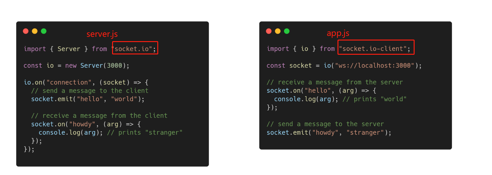
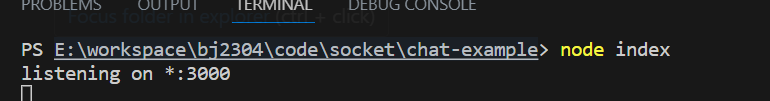
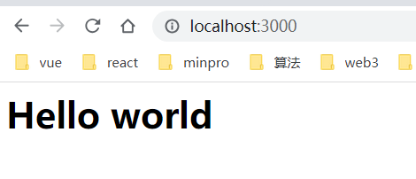
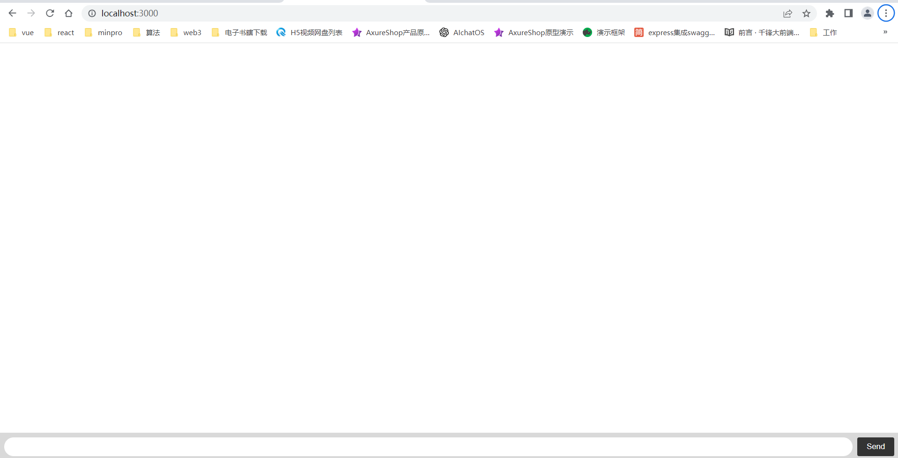
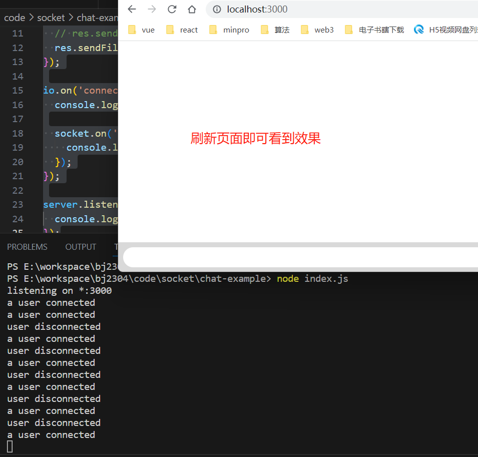
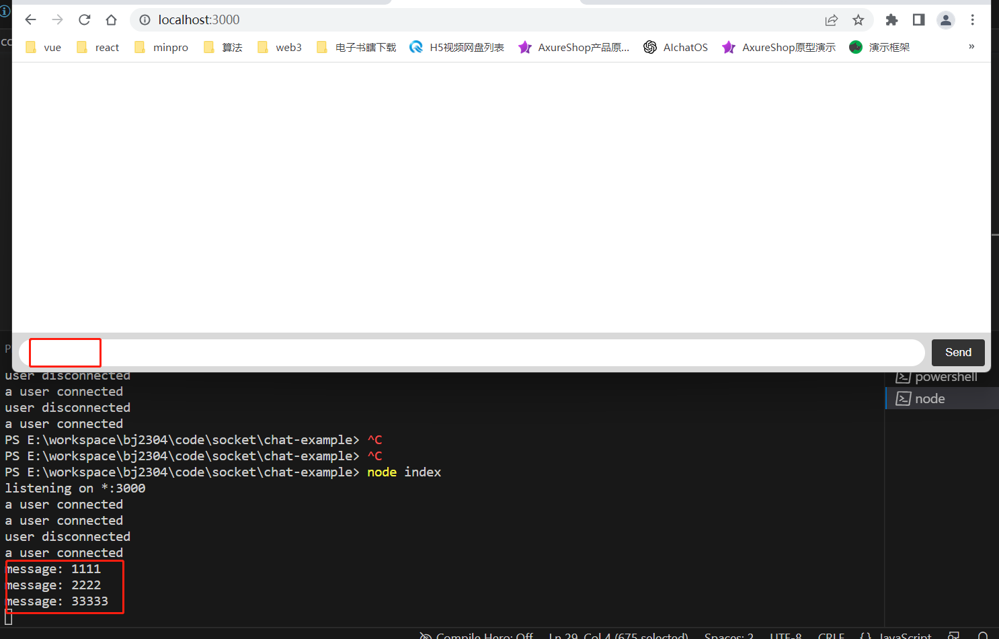
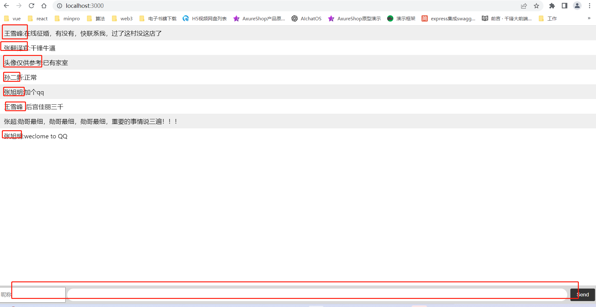
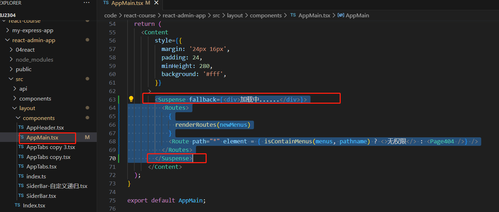

# 1.vue中动态组件

```sh
$ cnpm i element-plus -S
```

```js
// src/main.js
import { createApp } from 'vue'
import ElementPlus from 'element-plus'
import 'element-plus/dist/index.css'
import App from '@/App'

createApp(App).use(ElementPlus).mount('#root')
```

## 1.1 单纯的动态组件

```vue
<!-- src/App.vue -->
<template>
  <div>
    <el-button type="primary" @click="com='Home'">首页</el-button>
    <el-button type="primary" @click="com='Kind'">分类</el-button>
    <el-button type="primary" @click="com='Cart'">购物车</el-button>
    <el-button type="primary" @click="com='User'">我的</el-button>

    <!-- 动态组件 -->
    <component :is="com"></component>
  </div>
</template>

<script>
  import Home from './components/Home.vue'
  import Kind from './components/Kind.vue'
  import Cart from './components/Cart.vue'
  import User from './components/User.vue'
  export default {
    components: {
      Home, Kind, Cart, User
    },
    data () {
      return {
        com: 'Home'
      }
    }
  }
</script>
```

```vue
<!-- src/components/Home.vue -->
<template>
  <div>这里是首页</div>
</template>
```

```vue
<!-- src/components/Kind.vue -->
<template>
  <div>这里分类</div>
</template>
```

```vue
<!-- src/components/Cart.vue -->
<template>
  <div>这里是购物车</div>
</template>
```

```vue
<!-- src/components/User.vue -->
<template>
  <div>这里是个人中心</div>
</template>
```

## 1.2 页面添加表单查看效果

```vue
<!-- src/components/Home.vue -->
<template>
  <div>
    这里是首页
    <input type="text" placeholder="home">
  </div>
</template>
```

```vue
<!-- src/components/Kind.vue -->
<template>
  <div>这里分类 <input type="text" placeholder="kind"></div>
</template>
```

```vue
<!-- src/components/Cart.vue -->
<template>
  <div>这里是购物车<input type="text" placeholder="cart"></div>
</template>
```

```vue
<!-- src/components/User.vue -->
<template>
  <div>这里是个人中心<input type="text" placeholder="user"></div>
</template>
```

> 每一个页面添加了内容，切换之后再回到原来的位置，发现输入框内容缺失
>
> * 此处涉及到了组件的销毁和重建

## 1.3 保留组件的状态，避免再次重新渲染

```vue
<!-- src/App.vue -->
<template>
  <div>
    <el-button type="primary" @click="com='Home'">首页</el-button>
    <el-button type="primary" @click="com='Kind'">分类</el-button>
    <el-button type="primary" @click="com='Cart'">购物车</el-button>
    <el-button type="primary" @click="com='User'">我的</el-button>

    <!-- 动态组件 -->
    <KeepAlive>
      <component :is="com"></component>
    </KeepAlive>
  </div>
</template>

<script>
  import Home from './components/Home.vue'
  import Kind from './components/Kind.vue'
  import Cart from './components/Cart.vue'
  import User from './components/User.vue'
  export default {
    components: {
      Home, Kind, Cart, User
    },
    data () {
      return {
        com: 'Home'
      }
    }
  }
</script>
```

> 每一个页面添加了内容，切换之后再回到原来的位置，发现输入框内容还保持了原来的状态
>
> * 此处没有涉及到组件的销毁和重建
> * 其实就是页面的显示和隐藏
> * 此时触发两个钩子函数 activated deactivated

```vue
<!-- src/components/Home.vue -->
<template>
  <div>
    这里是首页
    <input type="text" placeholder="home">
  </div>
</template>

<script>
  export default {
    mounted () {
      console.log('home mounted')
    },
    activated () {
      console.log('home activated')
    },
    deactivated () {
      console.log('home deactivated')
    },
    unmounted () {
      console.log('home unmounted')
    },
  }
</script>
```

```vue
<!-- src/components/Kind.vue -->
<template>
  <div>这里分类 <input type="text" placeholder="kind"></div>
</template>
<script>
  export default {
    mounted () {
      console.log('kind mounted')
    },
    activated () {
      console.log('kind activated')
    },
    deactivated () {
      console.log('kind deactivated')
    },
    unmounted () {
      console.log('kind unmounted')
    },
  }
</script>
```

```vue
<!-- src/components/Cart.vue -->
<template>
  <div>这里是购物车<input type="text" placeholder="cart"></div>
</template>
<script>
  export default {
    mounted () {
      console.log('cart mounted')
    },
    activated () {
      console.log('cart activated')
    },
    deactivated () {
      console.log('cart deactivated')
    },
    unmounted () {
      console.log('cart unmounted')
    },
  }
</script>
```

```vue
<!-- src/components/User.vue -->
<template>
  <div>这里是个人中心<input type="text" placeholder="user"></div>
</template>
<script>
  export default {
    mounted () {
      console.log('user mounted')
    },
    activated () {
      console.log('user activated')
    },
    deactivated () {
      console.log('user deactivated')
    },
    unmounted () {
      console.log('user unmounted')
    },
  }
</script>
```

> 要不都不缓存，要不就都缓存，不符合实际的需求

## 1.4 选择缓存组件

组件内添加name属性

```vue
	<!-- src/components/Home.vue -->
<template>
  <div>
    这里是首页
    <input type="text" placeholder="home">
  </div>
</template>

<script>
  export default {
    name: 'Home',
    mounted () {
      console.log('home mounted')
    },
    activated () {
      console.log('home activated')
    },
    deactivated () {
      console.log('home deactivated')
    },
    unmounted () {
      console.log('home unmounted')
    },
  }
</script>
```

```vue
<!-- src/components/Kind.vue -->
<template>
  <div>这里分类 <input type="text" placeholder="kind"></div>
</template>
<script>
  export default {
    name: 'Kind',
    mounted () {
      console.log('kind mounted')
    },
    activated () {
      console.log('kind activated')
    },
    deactivated () {
      console.log('kind deactivated')
    },
    unmounted () {
      console.log('kind unmounted')
    },
  }
</script>
```

```vue
<!-- src/components/Cart.vue -->
<template>
  <div>这里是购物车<input type="text" placeholder="cart"></div>
</template>
<script>
  export default {
    name: 'Cart',
    mounted () {
      console.log('cart mounted')
    },
    activated () {
      console.log('cart activated')
    },
    deactivated () {
      console.log('cart deactivated')
    },
    unmounted () {
      console.log('cart unmounted')
    },
  }
</script>
```

```vue
<!-- src/components/User.vue -->
<template>
  <div>这里是个人中心<input type="text" placeholder="user"></div>
</template>
<script>
  export default {
    name: 'User',
    mounted () {
      console.log('user mounted')
    },
    activated () {
      console.log('user activated')
    },
    deactivated () {
      console.log('user deactivated')
    },
    unmounted () {
      console.log('user unmounted')
    },
  }
</script>
```

```vue
<!-- src/App.vue -->
<template>
  <div>
    <el-button type="primary" @click="com='Home'">首页</el-button>
    <el-button type="primary" @click="com='Kind'">分类</el-button>
    <el-button type="primary" @click="com='Cart'">购物车</el-button>
    <el-button type="primary" @click="com='User'">我的</el-button>

    <!-- 动态组件 -->
    <!-- include 缓存哪些组件 -->
    <!-- exclude 不缓存哪些组件 -->
    <!-- max 缓存组件数量最大数 -->
    <!-- <KeepAlive include="Home,Kind"> -->
    <!-- <KeepAlive :include="/Home|Kind/"> -->
    <KeepAlive :include="['Home', 'Kind']">
      <component :is="com"></component>
    </KeepAlive>
  </div>
</template>

<script>
  import Home from './components/Home.vue'
  import Kind from './components/Kind.vue'
  import Cart from './components/Cart.vue'
  import User from './components/User.vue'
  export default {
    components: {
      Home, Kind, Cart, User
    },
    data () {
      return {
        com: 'Home'
      }
    }
  }
</script>
```

# 2.过渡

建议使用vue-cli 以及vite创建的脚手架

```vue
<!-- src/App.vue -->
<template>
  <div>
    <!-- 过渡效果 -->
    <button @click="show=!show">显示/隐藏</button>
    <Transition>
      <div v-if="show">过渡动画测试</div>
    </Transition>

    <Transition name="fade">
      <div v-if="show">过渡动画测试</div>
    </Transition>
  </div>
</template>

<script>
  export default {
    data () {
      return {
        show: false
      }
    }
  }
</script>

<style>
.v-enter-from { opacity: 0; }
.v-enter-active { transition: opacity 5s; }
.v-enter-to { opacity: 1;}

.v-leave-from { opacity: 1;}
.v-leave-active { transition: opacity 5s; }
.v-leave-to { opacity: 0;}

.fade-enter-from { opacity: 0; }
.fade-enter-active { transition: opacity 5s; }
.fade-enter-to { opacity: 1;}

.fade-leave-from { opacity: 1;}
.fade-leave-active { transition: opacity 5s; }
.fade-leave-to { opacity: 0;}
</style>
```

# 3.服务端渲染

vue：nuxt.js https://www.nuxtjs.cn/  vue2       vue3https://nuxt.com/

react: next.js https://www.nextjs.cn/

什么是服务端渲染？https://cn.vuejs.org/guide/scaling-up/ssr.html#server-side-rendering-ssr

这主要取决于首屏加载速度对应用的重要程度

在内容展示速度极其重要的场景下，SSR 可以尽可能地帮你实现最优的初始加载性能。

SSR： **服务端渲染**

SSG： **静态站点生成**

## 3.1 nuxt.js

使用nuxt2版本

### 3.1.1 创建项目

```sh
$ yarn create nuxt-app my-nuxt-app
$ npx create-nuxt-app my-nuxt-app
```

### 3.1.2 熟悉目录结构

* components 组件
* layouts 布局文件，可以写多个，页面可以控制显示哪一个（后期自行添加的，名字不可以更改）
* pages 页面路径，根据页面的命名可以自动生成了路由表
* plugins 插件，可以配置多个UI组件库

### 3.1.3 创建基本的页面

* pages/index.vue 系统首页   / 
* pages/banner/list.vue 轮播图列表  /banner/list
* pages/banner/add.vue 添加轮播图 / banner/add
* pages/pro/list.vue 产品列表  /pro/list
* pages/pro/search.vue 筛选列表 /pro/search
* pages/login/index.vue 登录页面 /login    /login/index
* pages/user/_id.vue 用户页面 - 动态路由 /login/:id

### 3.1.4 设置主布局页面

layouts/default.vue

```vue
<template>
  <el-container style="height: 500px; border: 1px solid #eee">
    <el-aside width="200px" style="background-color: rgb(238, 241, 246)">
      <el-menu :default-active="$route.path" :router="true" unique-opened	>
        <el-menu-item index="/" >系统首页</el-menu-item>
        <el-submenu index="/banner">
          <template slot="title"><i class="el-icon-message"></i>轮播图管理</template>
          <el-menu-item-group>
            <el-menu-item index="/banner/list">轮播图列表</el-menu-item>
            <el-menu-item index="/banner/add">添加轮播图</el-menu-item>
          </el-menu-item-group>
          
        </el-submenu>
        <el-submenu index="/pro">
          <template slot="title"><i class="el-icon-message"></i>产品管理</template>
          <el-menu-item-group>
            <el-menu-item index="/pro/list">产品列表</el-menu-item>
            <el-menu-item index="/pro/search">筛选列表</el-menu-item>
          </el-menu-item-group>
          
        </el-submenu>
      </el-menu>
    </el-aside>

    <el-container>
      <el-header style="text-align: right; font-size: 12px">
        <el-dropdown>
          <i class="el-icon-setting" style="margin-right: 15px"></i>
          <el-dropdown-menu slot="dropdown">
            <el-dropdown-item >
              <nuxt-link to="/login">退出</nuxt-link>
            </el-dropdown-item>
          </el-dropdown-menu>
        </el-dropdown>
        <span>王小虎</span>
      </el-header>

      <el-main>
        <!-- 路由 -->
        <nuxt />
      </el-main>
    </el-container>
  </el-container>
</template>

<script>
export default {
  data() {
    const item = {
      date: '2016-05-02',
      name: '王小虎',
      address: '上海市普陀区金沙江路 1518 弄'
    };
    return {
      tableData: Array(20).fill(item)
    }
  }
}
</script>

<style>
.el-header {
  background-color: #B3C0D1;
  color: #333;
  line-height: 60px;
}

.el-aside {
  color: #333;
}
</style>
```

### 3.1.5 设置其他布局页面

layouts/other.vue

```vue
<template>
  <nuxt />
</template>
```

### 3.1.6 登录使用其他布局

pages/login/index.vue

```vue
<template>
  <div>登录页面</div>
</template>

<script>
export default {
  layout: 'other'
}
</script>
```

### 3.1.7 如何使用其他UI组件库

```sh
$ cnpm i ant-design-vue@1 -S
```

```js
// plugins/ant-design-vue.js
import Vue from 'vue';
import Antd from 'ant-design-vue';

Vue.use(Antd);
```

```js
// nuxt.config.js
export default {
  // Global page headers: https://go.nuxtjs.dev/config-head
  head: {
    title: 'my-nuxt-app',
    meta: [
      { charset: 'utf-8' },
      { name: 'viewport', content: 'width=device-width, initial-scale=1' },
      { hid: 'description', name: 'description', content: '' },
      { name: 'format-detection', content: 'telephone=no' }
    ],
    link: [
      { rel: 'icon', type: 'image/x-icon', href: '/favicon.ico' }
    ]
  },

  // Global CSS: https://go.nuxtjs.dev/config-css
  css: [
    'element-ui/lib/theme-chalk/index.css',
    'ant-design-vue/dist/antd.css' // ++++++++
  ],

  // Plugins to run before rendering page: https://go.nuxtjs.dev/config-plugins
  plugins: [
    '@/plugins/element-ui',
    '@/plugins/ant-design-vue' // ++++++++
  ],

  // Auto import components: https://go.nuxtjs.dev/config-components
  components: true,

  // Modules for dev and build (recommended): https://go.nuxtjs.dev/config-modules
  buildModules: [
    // https://go.nuxtjs.dev/eslint
    '@nuxtjs/eslint-module',
    // https://go.nuxtjs.dev/stylelint
    // '@nuxtjs/stylelint-module',
  ],

  // Modules: https://go.nuxtjs.dev/config-modules
  modules: [
    // https://go.nuxtjs.dev/axios
    '@nuxtjs/axios',
    // https://go.nuxtjs.dev/pwa
    '@nuxtjs/pwa',
    // https://go.nuxtjs.dev/content
    '@nuxt/content',
  ],

  // Axios module configuration: https://go.nuxtjs.dev/config-axios
  axios: {
    // Workaround to avoid enforcing hard-coded localhost:3000: https://github.com/nuxt-community/axios-module/issues/308
    baseURL: '/',
  },

  // PWA module configuration: https://go.nuxtjs.dev/pwa
  pwa: {
    manifest: {
      lang: 'en'
    }
  },

  // Content module configuration: https://go.nuxtjs.dev/config-content
  content: {},

  // Build Configuration: https://go.nuxtjs.dev/config-build
  build: {
    transpile: [/^element-ui/],
  }
}

```

## 3.2 next.js

### 3.2.1 创建项目

```sh
$ npx create-next-app nextjs-blog
```

### 3.2.2 熟悉目录结构

* components/layout.js 主界面布局  自己定义
* components/other.js 其他界面布局 自己定义
* pages/index.js系统首页   / 

```js
import Head from 'next/head'
import Layout from '../components/layout'

export default function Test() {
  return (
    <Layout>
      <Head>
        <title>系统首页</title>
      </Head>
      <h1>系统首页</h1>
    </Layout>
  )
}

```

* pages/banner/list.js轮播图列表  /banner/list

* pages/banner/add.js添加轮播图 / banner/add

* pages/pro/list.js 产品列表  /pro/list

* pages/pro/search.js筛选列表 /pro/search

* pages/login/index.js登录页面 /login    /login/index

  ```js
  // import Head from 'next/head'
  import OtherLayout from '../../components/other'
  
  export default function Test() {
    return (
      <OtherLayout>
        <h1>登录</h1>
      </OtherLayout>
    )
  }
  
  ```

  ```js
  // 声明式跳转
  import Link from 'next/link'
  <Link href=""></Link>
  // 编程式跳转
  import { useRouter } from 'next/router'
  const router = useRouter()
  router.push() router.replace() router.back()
  ```

# 4.Socket

## 4.1 socket.io

  https://socket.io/zh-CN/

  支持及时、双向与基于事件的交流。它可以在每个平台、每个浏览器和每个设备上工作，可靠性和速度同样稳定。

  

### 4.1.1 创建项目 chat-example

```sh
$ npm init -y
$ cnpm i express@4 -S
$ cnpm i socket.io -S
```

```js
// index.js
const express = require('express');
const app = express();
const http = require('http');
const server = http.createServer(app);

app.get('/', (req, res) => {
  res.send('<h1>Hello world</h1>');
});

server.listen(3000, () => {
  console.log('listening on *:3000');
});
```

```
$ node index.js
```





```html
<!-- index.html -->
<!DOCTYPE html>
<html>
  <head>
    <title>Socket.IO chat</title>
    <style>
      body { margin: 0; padding-bottom: 3rem; font-family: -apple-system, BlinkMacSystemFont, "Segoe UI", Roboto, Helvetica, Arial, sans-serif; }

      #form { background: rgba(0, 0, 0, 0.15); padding: 0.25rem; position: fixed; bottom: 0; left: 0; right: 0; display: flex; height: 3rem; box-sizing: border-box; backdrop-filter: blur(10px); }
      #input { border: none; padding: 0 1rem; flex-grow: 1; border-radius: 2rem; margin: 0.25rem; }
      #input:focus { outline: none; }
      #form > button { background: #333; border: none; padding: 0 1rem; margin: 0.25rem; border-radius: 3px; outline: none; color: #fff; }

      #messages { list-style-type: none; margin: 0; padding: 0; }
      #messages > li { padding: 0.5rem 1rem; }
      #messages > li:nth-child(odd) { background: #efefef; }
    </style>
  </head>
  <body>
    <ul id="messages"></ul>
    <form id="form" action="">
      <input id="input" autocomplete="off" /><button>Send</button>
    </form>
  </body>
</html>
```

```js
// index.js
const express = require('express');
const app = express();
const http = require('http');
const server = http.createServer(app);

app.get('/', (req, res) => {
  // res.send('<h1>Hello world</h1>');
  res.sendFile(__dirname + '/index.html');
});

server.listen(3000, () => {
  console.log('listening on *:3000');
});
```



```js
// index.js
const express = require('express');
const app = express();
const http = require('http');
const server = http.createServer(app);
// 构建socket服务
const { Server } = require("socket.io");
const io = new Server(server);

app.get('/', (req, res) => {
  // res.send('<h1>Hello world</h1>');
  res.sendFile(__dirname + '/index.html');
});

io.on('connection', (socket) => {
  console.log('a user connected');
});

server.listen(3000, () => {
  console.log('listening on *:3000');
});
```

```html
<!-- index.html -->
<!DOCTYPE html>
<html>
  <head>
    <title>Socket.IO chat</title>
    <style>
      body { margin: 0; padding-bottom: 3rem; font-family: -apple-system, BlinkMacSystemFont, "Segoe UI", Roboto, Helvetica, Arial, sans-serif; }

      #form { background: rgba(0, 0, 0, 0.15); padding: 0.25rem; position: fixed; bottom: 0; left: 0; right: 0; display: flex; height: 3rem; box-sizing: border-box; backdrop-filter: blur(10px); }
      #input { border: none; padding: 0 1rem; flex-grow: 1; border-radius: 2rem; margin: 0.25rem; }
      #input:focus { outline: none; }
      #form > button { background: #333; border: none; padding: 0 1rem; margin: 0.25rem; border-radius: 3px; outline: none; color: #fff; }

      #messages { list-style-type: none; margin: 0; padding: 0; }
      #messages > li { padding: 0.5rem 1rem; }
      #messages > li:nth-child(odd) { background: #efefef; }
    </style>
  </head>
  <body>
    <ul id="messages"></ul>
    <form id="form" action="">
      <input id="input" autocomplete="off" /><button>Send</button>
    </form>
  </body>
  <script src="/socket.io/socket.io.js"></script>
  <script>
    var socket = io();
  </script>
</html>
```

```js
// index.js
const express = require('express');
const app = express();
const http = require('http');
const server = http.createServer(app);
// 构建socket服务
const { Server } = require("socket.io");
const io = new Server(server);

app.get('/', (req, res) => {
  // res.send('<h1>Hello world</h1>');
  res.sendFile(__dirname + '/index.html');
});

io.on('connection', (socket) => {
  console.log('a user connected');

  socket.on('disconnect', () => {
    console.log('user disconnected');
  });
});

server.listen(3000, () => {
  console.log('listening on *:3000');
});
```



```html
<!-- index.html -->
<!DOCTYPE html>
<html>
  <head>
    <title>Socket.IO chat</title>
    <style>
      body { margin: 0; padding-bottom: 3rem; font-family: -apple-system, BlinkMacSystemFont, "Segoe UI", Roboto, Helvetica, Arial, sans-serif; }

      #form { background: rgba(0, 0, 0, 0.15); padding: 0.25rem; position: fixed; bottom: 0; left: 0; right: 0; display: flex; height: 3rem; box-sizing: border-box; backdrop-filter: blur(10px); }
      #input { border: none; padding: 0 1rem; flex-grow: 1; border-radius: 2rem; margin: 0.25rem; }
      #input:focus { outline: none; }
      #form > button { background: #333; border: none; padding: 0 1rem; margin: 0.25rem; border-radius: 3px; outline: none; color: #fff; }

      #messages { list-style-type: none; margin: 0; padding: 0; }
      #messages > li { padding: 0.5rem 1rem; }
      #messages > li:nth-child(odd) { background: #efefef; }
    </style>
  </head>
  <body>
    <ul id="messages"></ul>
    <form id="form" action="">
      <input id="input" autocomplete="off" /><button>Send</button>
    </form>
  </body>
  <script src="/socket.io/socket.io.js"></script>
  <script>
    var socket = io();


    var form = document.getElementById('form');
    var input = document.getElementById('input');
    // 点击发送，向服务器发送了一个名为 chat message的事件
    form.addEventListener('submit', function(e) {
      e.preventDefault();
      if (input.value) {
        socket.emit('chat message', input.value);
        input.value = '';
      }
    });
  </script>
</html>
```

```js
// index.js
const express = require('express');
const app = express();
const http = require('http');
const server = http.createServer(app);
// 构建socket服务
const { Server } = require("socket.io");
const io = new Server(server);

app.get('/', (req, res) => {
  // res.send('<h1>Hello world</h1>');
  res.sendFile(__dirname + '/index.html');
});

io.on('connection', (socket) => {
  console.log('a user connected');

  socket.on('chat message', (msg) => {
    console.log('message: ' + msg);
  });

  socket.on('disconnect', () => {
    console.log('user disconnected');
  });
});

server.listen(3000, () => {
  console.log('listening on *:3000');
});
```



```js
// index.js
const express = require('express');
const app = express();
const http = require('http');
const server = http.createServer(app);
// 构建socket服务
const { Server } = require("socket.io");
const io = new Server(server);

app.get('/', (req, res) => {
  // res.send('<h1>Hello world</h1>');
  res.sendFile(__dirname + '/index.html');
});

io.on('connection', (socket) => {
  console.log('a user connected');

  socket.on('chat message', (msg) => {
    console.log('message: ' + msg);
    io.emit('chat message', msg); // 给前端广播接收到的消息
  });

  socket.on('disconnect', () => {
    console.log('user disconnected');
  });
});

server.listen(3000, () => {
  console.log('listening on *:3000');
});
```

```html
<!-- index.html -->
<!DOCTYPE html>
<html>
  <head>
    <title>Socket.IO chat</title>
    <style>
      body { margin: 0; padding-bottom: 3rem; font-family: -apple-system, BlinkMacSystemFont, "Segoe UI", Roboto, Helvetica, Arial, sans-serif; }

      #form { background: rgba(0, 0, 0, 0.15); padding: 0.25rem; position: fixed; bottom: 0; left: 0; right: 0; display: flex; height: 3rem; box-sizing: border-box; backdrop-filter: blur(10px); }
      #input { border: none; padding: 0 1rem; flex-grow: 1; border-radius: 2rem; margin: 0.25rem; }
      #input:focus { outline: none; }
      #form > button { background: #333; border: none; padding: 0 1rem; margin: 0.25rem; border-radius: 3px; outline: none; color: #fff; }

      #messages { list-style-type: none; margin: 0; padding: 0; }
      #messages > li { padding: 0.5rem 1rem; }
      #messages > li:nth-child(odd) { background: #efefef; }
    </style>
  </head>
  <body>
    <ul id="messages"></ul>
    <form id="form" action="">
      <input id="input" autocomplete="off" /><button>Send</button>
    </form>
  </body>
  <script src="/socket.io/socket.io.js"></script>
  <script>
    var socket = io();


    var form = document.getElementById('form');
    var input = document.getElementById('input');
    // 点击发送，向服务器发送了一个名为 chat message的事件
    form.addEventListener('submit', function(e) {
      e.preventDefault();
      if (input.value) {
        socket.emit('chat message', input.value);
        input.value = '';
      }
    });

    socket.on('chat message', function(msg) {
      var item = document.createElement('li');
      item.textContent = msg;
      messages.appendChild(item);
      window.scrollTo(0, document.body.scrollHeight);
    });
  </script>
</html>
```

如果想要加入昵称 - 传对象

```html
<!-- index.html -->
<!DOCTYPE html>
<html>
  <head>
    <title>Socket.IO chat</title>
    <style>
      body { margin: 0; padding-bottom: 3rem; font-family: -apple-system, BlinkMacSystemFont, "Segoe UI", Roboto, Helvetica, Arial, sans-serif; }

      #form { background: rgba(0, 0, 0, 0.15); padding: 0.25rem; position: fixed; bottom: 0; left: 0; right: 0; display: flex; height: 3rem; box-sizing: border-box; backdrop-filter: blur(10px); }
      #input { border: none; padding: 0 1rem; flex-grow: 1; border-radius: 2rem; margin: 0.25rem; }
      #input:focus { outline: none; }
      #form > button { background: #333; border: none; padding: 0 1rem; margin: 0.25rem; border-radius: 3px; outline: none; color: #fff; }

      #messages { list-style-type: none; margin: 0; padding: 0; }
      #messages > li { padding: 0.5rem 1rem; }
      #messages > li:nth-child(odd) { background: #efefef; }
    </style>
  </head>
  <body>
    <ul id="messages"></ul>
    <form id="form" action="">
      <input id="nickname" placeholder="昵称" />
      <input id="input" autocomplete="off" /><button>Send</button>
    </form>
  </body>
  <script src="/socket.io/socket.io.js"></script>
  <script>
    var socket = io();


    var form = document.getElementById('form');
    var input = document.getElementById('input');
    var nickname = document.getElementById('nickname');
    // 点击发送，向服务器发送了一个名为 chat message的事件
    form.addEventListener('submit', function(e) {
      e.preventDefault();
      if (input.value) {
        socket.emit('chat message', {
          name: nickname.value,
          value: input.value
        });
        input.value = '';
      }
    });

    socket.on('chat message', function(msg) {
      var item = document.createElement('li');
      item.textContent = msg.name + ':' + msg.value;
      messages.appendChild(item);
      window.scrollTo(0, document.body.scrollHeight);
    });
  </script>
</html>
```




## 4.2 使用第三方美洽实现客服

参照美洽官方文档

https://meiqia.com/help/article/javascript/?_gl=1%2Au81i4j%2A_ga%2AODYyNDI0ODkzLjE2ODk3MzU0OTg.%2A_ga_5LJSE1G1G3%2AMTY4OTczNTQ5OC4xLjEuMTY4OTczNjE0Ny4wLjAuMA..#e9809ae8bf87e9858de7bdaee68c87e5ae9ae58886e9858de5aea2e69c8de68896e5aea2e69c8de7bb84

# 5.vue2的非父子组件传值

## 5.1 中央事件总线传值

```html
<!DOCTYPE html>
<html lang="en">
<head>
  <meta charset="UTF-8">
  <meta name="viewport" content="width=device-width, initial-scale=1.0">
  <title>vue2中非父子组件传值</title>
  <script src="lib/vue.min.js"></script>
</head>
<body>
  <div id="app">
    <my-header></my-header>
    <my-content></my-content>
  </div>
</body>
<template id="header">
  <ul>
    <li @click="sendData('首页')">首页</li>
    <li @click="sendData('分类')">分类</li>
    <li @click="sendData('购物车')">购物车</li>
    <li @click="sendData('我的')">我的</li>
  </ul>
</template>
<template id="content">
  <div>{{ content }}</div>
</template>
<script>

  const bus = new Vue()

  const MyHeader = {
    template: '#header',
    methods: {
      sendData (str) {
        bus.$emit('test-event', str)
      }
    }
  }
  const MyContent = {
    template: '#content',
    data () {
      return {
        content: '首页'
      }
    },
    mounted () {
      bus.$on('test-event', (val) => {
        this.content = val
      })
    }
  }

  new Vue({
    el: '#app',
    components: {
      MyHeader,
      MyContent
    }
  })
</script>
</html>
```

## 5.2 状态提升

```html
<!DOCTYPE html>
<html lang="en">
<head>
  <meta charset="UTF-8">
  <meta name="viewport" content="width=device-width, initial-scale=1.0">
  <title>vue2中非父子组件传值</title>
  <script src="lib/vue.min.js"></script>
</head>
<body>
  <div id="app">
    <my-header @my-event="getData"></my-header>
    <my-content :content="content"></my-content>
  </div>
</body>
<template id="header">
  <ul>
    <li @click="sendData('首页')">首页1</li>
    <li @click="sendData('分类')">分类1</li>
    <li @click="sendData('购物车')">购物车1</li>
    <li @click="sendData('我的')">我的1</li>
  </ul>
</template>
<template id="content">
  <div>{{ content }}</div>
</template>
<script>

  const MyHeader = {
    template: '#header',
    methods: {
      sendData (str) {
        this.$emit('my-event', str)
      }
    }
  }
  const MyContent = {
    template: '#content',
    props: {
      content: String
    }
  }

  new Vue({
    el: '#app',
    data : {
      content: '首页'
    },
    methods: {
      getData (val) {
        this.content = val
      }
    },
    components: {
      MyHeader,
      MyContent
    }
  })
</script>
</html>
```

# 6.vue3兄弟组件传值

```html
<!DOCTYPE html>
<html lang="en">
<head>
  <meta charset="UTF-8">
  <meta name="viewport" content="width=device-width, initial-scale=1.0">
  <title>vue3中非父子组件传值</title>
  <script src="lib/vue.global.js"></script>
</head>
<body>
  <div id="app">
    <my-header @my-event="getData"></my-header>
    <my-content :content="content"></my-content>
  </div>
</body>
<template id="header">
  <ul>
    <li @click="sendData('首页')">首页2</li>
    <li @click="sendData('分类')">分类2</li>
    <li @click="sendData('购物车')">购物车2</li>
    <li @click="sendData('我的')">我的2</li>
  </ul>
</template>
<template id="content">
  <div>{{ content }}</div>
</template>
<script>

  const MyHeader = {
    template: '#header',
    methods: {
      sendData (str) {
        this.$emit('my-event', str)
      }
    }
  }
  const MyContent = {
    template: '#content',
    props: {
      content: String
    }
  }

  const { createApp } = Vue

  createApp({
    data () {
      return {
        content: '首页'
      }
    },
    methods: {
      getData (val) {
        this.content = val
      }
    },
    components: {
      MyHeader,
      MyContent
    }
  }).mount('#app')

</script>
</html>
```

# 7.teleport

类似于 React 中的 portals 

> 普通的组件，子组件的元素将挂载到父组件的DOM节点中。
>
> 有时需要将元素渲染到DOM中的不同位置上去，这是就用到的portal的方法。

典型用例是当父组件有 `overflow: hidden` 或 `z-index` 样式时，但你需要子组件能够在视觉上“跳出”其容器。例如，对话框、悬浮卡以及提示框

```js
// router/index.js
import { createRouter, createWebHistory } from 'vue-router'
import HomeView from '../views/HomeView.vue'

const router = createRouter({
  history: createWebHistory(import.meta.env.BASE_URL),
  routes: [
    {
      path: '/',
      name: 'home',
      component: HomeView
    },
    {
      path: '/about',
      name: 'about',
      // route level code-splitting
      // this generates a separate chunk (About.[hash].js) for this route
      // which is lazy-loaded when the route is visited.
      component: () => import('../views/AboutView.vue')
    },
    {
      path: '/chat',
      name: 'chat',
      component: () => import('../views/chat/index.vue')
    },
    {
      path: '/teleport',
      name: 'teleport',
      component: () => import('../views/teleport/index.vue')
    }
  ]
})

export default router

```

```vue
<!-- views/telepost/index.vue -->
<template>
  <h1>teleport</h1>
  <button @click="open = true">打开模态框</button>
  <!-- <div v-if="open" class="modal">
    <p>Hello from the modal!</p>
    <button @click="open = false">Close</button>
  </div> -->
  <Teleport to="body">
    <div v-if="open" class="modal">
      <p>Hello from the modal!</p>
      <button @click="open = false">Close</button>
    </div>
  </Teleport>
  
</template>

<script setup>
  import {ref} from 'vue'

  const open = ref(false)
</script>

<style>
.modal {
  position: fixed;
  z-index: 999;
  top: 20%;
  left: 50%;
  width: 300px;
  margin-left: -150px;
}
</style>
```

# 8.nextTick

数据更新之后获取DOM的最新的值

src/views/nextTick/index.vue

```vue
<template>
  <h1>nextTick</h1>
  <div id="num">{{ count }}</div>
  <button @click="add">加1</button>
</template>

<script>
// 数据改变之后获取DOM的最新的数据
// 场景：
//  数据改变之后获取DOM的最新的数据
//  瀑布流布局（两列）动态的计算最新的每一列的实时的高度，
//  滚动条滚动
import { nextTick } from 'vue'
// export default {
//   data () {
//     return {
//       count: 1,
//       list: []
//     }
//   },
 
//   methods: {
//     // add () {
//     //   // 当你在 Vue 中更改响应式状态时，最终的 DOM 更新并不是同步生效的，
//     //   // 而是由 Vue 将它们缓存在一个队列中，直到下一个“tick”才一起执行。
//     //   // 这样是为了确保每个组件无论发生多少状态改变，都仅执行一次更新。
//     //   console.log('front', document.getElementById('num').innerHTML) // 1
//     //   this.count++
//     //   console.log('after', document.getElementById('num').innerHTML) // 1
//     // }
//     // add () {
//     //   console.log('front', document.getElementById('num').innerHTML) // 1
//     //   this.count++
//     //   setTimeout(() => {
//     //     console.log('after', document.getElementById('num').innerHTML) // 2
//     //   }, 0)
//     // }
//     // add () {
//     //   console.log('front', document.getElementById('num').innerHTML) // 1
//     //   this.count++
//     //   this.$nextTick(() => {
//     //     console.log('after', document.getElementById('num').innerHTML) // 2
//     //   })
//     // }
//     async add () {
//       this.count++
//       console.log('front', document.getElementById('num').innerHTML) // 1
//       await nextTick()
//       console.log('after', document.getElementById('num').innerHTML) // 2
//     }
//   }
// }
// </script>

<script setup>
  import { ref, nextTick } from 'vue'
  const count = ref(1)
  {/* const add = () => {
    console.log('front', document.getElementById('num').innerHTML) // 1
    count.value += 1
    console.log('after', document.getElementById('num').innerHTML) // 1
  } */}

  {/* const add = () => {
    console.log('front', document.getElementById('num').innerHTML) // 1
    count.value += 1
    nextTick(() => {
      console.log('after', document.getElementById('num').innerHTML) // 2

    })
  } */}

  const add = async() => {
    console.log('front', document.getElementById('num').innerHTML) // 1
    count.value += 1
    await nextTick()
    console.log('after', document.getElementById('num').innerHTML) // 2
  }
</script>
```

# 9.mixins

mixins 决定了vue将采用的是选项式API，提升组件的复用性（如果采用了组合式API，提升组件的复用性 - 自定义函数实现 - 自定义Hook）

复用的是组件的逻辑部分

// src/views/mixins/myMixins.js

```js
export default {
  data () {
    return {
      count: 100
    }
  },
  mounted () {
    console.log('mixins')
    this.count = 110
  },
  methods: {

    add10 () {
      this.count += 100
    }
  }
}
```

// src/views/mixins/index.vue

```vue
<template>
  <h1>mixins</h1>
  {{  count  }}
  <button @click="add10">加10</button>
</template>

<script>
import myMixins from './myMinxins'
// 组件中的逻辑和混入中的逻辑，一般以组件中的为主
export default {
  mixins: [myMixins],
  data () {
    return {
      count: 0
    }
  },
  mounted () {
    console.log('com')
    this.count = 10
  },  
  methods: {

    add10 () {
      this.count += 10
    }
  }
}
</script>
```

# 10.expose

```vue
<!-- src/views/expose/index.vue -->
<template>
  <h1>expose</h1>
  <button @click="addNum">加</button>
  <button @click="reduceNum">减</button>
  <Child ref="child"/>
</template>

<script>
import Child from './Child.vue'
export default {
  components: {
    Child
  },
  methods: {
    addNum () {
      this.$refs.child.add()
    },
    reduceNum () {
      this.$refs.child.reduce()
    }
  }
}
</script>
```

```vue
<!-- src/views/expose/Child.vue -->
<template>
  <h2>child</h2>
</template>
<!-- <script>
export default {
  // 不添加 expose，相当于父组件可以默认访问所有的 子组件的数据和方法
  // 添加之后，只能使用 expose 出去的方法
  expose: ['add' ],
  data () {
    return {
      count: 10
    }
  },
  methods: {
    add () {
      this.count += 10
      console.log('add', this.count)
    },

    reduce () {
      this.count -= 1
      console.log('reduce', this.count)
    }
  }
}
</script> -->

<script>
import { ref } from 'vue'
export default {
  setup (props, context) {
    const count = ref(10)

    const add = () => {
      count.value += 10
      console.log('add', count.value)
    }

    const reduce = () => {
      count.value -= 1
      console.log('reduce', count.value)
    }

    context.expose({ // 父组件只可以使用 reduce 的函数
      reduce
    })

    return {
      count, add, reduce
    }
  }
}
</script>
```

# 11.生成二维码

```sh
$ cnpm i qrcode -S
```

```vue
<!-- src/views/qrcode/index.vue -->
<template>
  <h1>生成二维码</h1>
  <button @click="getQrCode">生成二维码</button>
  
</template>

<script setup>
  import { ref } from 'vue'
  import QRCode from 'qrcode'

  const img = ref('')
  const getQrCode = () => {
    QRCode.toDataURL('https://www.baidu.com', function (err, url) {
      console.log(url)
      img.value = url
    })
  }
</script>
```

# 12.递归组件

https://cn.vuejs.org/api/sfc-script-setup.html#recursive-components

## 12.1 选项式

组件是可以在它们自己的模板中调用自身的。不过它们只能通过 `name` 选项来做这件事：

```vue
<!-- src/views/recursive/ChildOptions.vue -->
<template>
  <ul>
    <li v-for="item of list" :key="item.path">
      <div v-if="item.children">
        <h3>{{  item.label }}</h3>
        <ChildOptions :list="item.children" />
      </div>
      <div v-else><h3>{{  item.label }}</h3></div>
    </li>
  </ul>
</template>

<script>
export default {
  // vue3可以省略 name 属性，但是vue2必须写
  // 一般name属性和组件的名字相同的
  // name: 'ChildOptions',
  props: {
    list: Array
  }
}
</script>
```

```vue
<!-- src/views/recursive/options.vue -->
<template>
  <h1>选项式组件的递归</h1>
  <ChildOptions :list="list" />
</template>

<script>
import ChildOptions from './ChildOptions.vue';
export default {
  data () {
    return {
      list: [
        {
          label: '首页',
          path: '/'
        },
        {
          label: '轮播图管理',
          path: '/banner',
          children: [
            {
              label: '轮播图列表',
              path: '/banner/list'
            },
            {
              label: '添加轮播图',
              path: '/banner/add'
            }
          ]
        },
        {
          label: '产品管理',
          path: '/pro',
          children: [
            {
              label: '产品列表',
              path: '/pro/list'
            },
            {
              label: '筛选列表',
              path: '/pro/search'
            }
          ]
        }
      ]
    }
  },  
  components: {
    ChildOptions
  }
}
</script>
```

## 12.2 组合式

```vue
<!-- src/views/recursive/composition.vue -->
<template>
  <h1>组合式组件的递归</h1>
  <ChildComposition :list="list" />
</template>

<script setup>
import { ref } from 'vue'
import ChildComposition from './ChildComposition.vue';
const list = ref([
        {
          label: '首页',
          path: '/'
        },
        {
          label: '轮播图管理',
          path: '/banner',
          children: [
            {
              label: '轮播图列表',
              path: '/banner/list',
              children: [
                {
                  label: '首页轮播图',
                  path: '/banner/list/home'
                },
                {
                  label: '分类轮播图',
                  path: '/banner/list/kind'
                },
              ]
            },
            {
              label: '添加轮播图',
              path: '/banner/add'
            }
          ]
        },
        {
          label: '产品管理',
          path: '/pro',
          children: [
            {
              label: '产品列表',
              path: '/pro/list'
            },
            {
              label: '筛选列表',
              path: '/pro/search'
            }
          ]
        },
        {
          label: '账户管理',
          path: '/account',
          children: [
            {
              label: '管理员列表',
              path: '/account/admin'
            },
            {
              label: '用户列表',
              path: '/account/user'
            }
          ]
        }
      ])
</script>
```

```vue
<!-- src/views/recursive/ChildComposition.vue -->
<template>
  <ul>
    <li v-for="item of list" :key="item.path">
      <div v-if="item.children">
        <h3>{{  item.label }}</h3>
        <ChildComposition :list="item.children" />
      </div>
      <div v-else><h3>{{  item.label }}</h3></div>
    </li>
  </ul>
</template>

<script setup>

defineProps({
  list: Array
})
</script>
```

# 13.Suspense - vue

用于协调对组件树中嵌套的异步依赖的处理

```vue
<!-- src/views/suspense/Child.vue -->
<template>
  <div>11111</div>
  <ul>
    <li v-for="item of list" :key="item.proid">{{  item.proname  }}</li>
  </ul>
</template>

<script setup>
  import { ref, onMounted } from 'vue'

const list = ref([])

onMounted(() => {
  fetch('http://121.89.205.189:3000/api/pro/list')
    .then(res => res.json())
    .then(res => {
      list.value = res.data
    })
})
</script>
```

```vue
<!-- src/views/suspense/index.vue -->
<template>
  <h1>suspense</h1>
  <Suspense>
    <template #fallback>
      加载中..........
    </template>
    <MyChild/>
  </Suspense>
</template>

<script setup>
  import { defineAsyncComponent } from 'vue';
  // 异步组件
  const MyChild = defineAsyncComponent(() => {
    return import('./Child.vue')
  })

  // import { defineAsyncComponent } from 'vue'
  // const MyChild = defineAsyncComponent(() => {
  //   return new Promise((resolve, reject) => {
  //     // ...从服务器获取组件
  //     resolve(/* 获取到的组件 */)
  //   })
  // })
</script>
```

# 14.Suspense -react



# 15.扫码登录

要实现扫码登录微信的流程，你可以按照以下步骤进行操作：

1. 在你的网页中嵌入微信登录插件或者使用微信开放平台的相关API。这些插件和API可以帮助你快速集成微信登录功能。
2. 用户访问你的网页后，显示一个生成的二维码供用户扫描。
3. 使用微信开放平台提供的接口，向微信服务器发送登录请求，并获取一个唯一的临时凭证码（code）。
4. 微信服务器验证临时凭证码的有效性，并返回一个访问令牌（access token）和用户唯一标识openid。
5. 使用访问令牌和用户标识，你可以通过微信开放平台的接口获取用户的基本信息，如昵称、头像等。
6. 将用户的基本信息展示在你的网页上，完成登录流程。
