# class-transformer 介绍

## 1. 什么是 class-transformer

> 文档：https://github.com/typestack/class-transformer

class-transformer 是一个为 Typescript 设计的轻量级库，用于实现 JS 普通对象和类对象之间的**转换**。它基于**装饰器**模式，使得开发者能够定义如何将对象属性从一个形式映射到另一个形式，以及在转换过程中如何处理复杂的类型和嵌套的对象结构。有助于维护类型安全并提高开发效率。

## 2. 为什么需要 class-transformer

举个 🌰：
假设我们定义了一个 User 类

```typescript
export class User {
  firstName: string;
  lastName: string;
  constructor(firstName: string, lastName: string) {
    this.firstName = firstName;
    this.lastName = lastName;
  }
  getName() {
    return this.firstName + " " + this.lastName;
  }
}
```

我们通过接口获取到一个 user 对象

```json
{
  "firstName": "John",
  "lastName": "Cage"
}
```

```typescript
fetch("user.json")
  .then((response) => response.json())
  .then((user: User) => {
    console.log(user.getName()); // 报错，不能使用 ❌
  });
```

注意：可以使用 User 定义类型获取到的 user 对象，且类型提示也可以使用；但是 user 只是普通对象，并不是 User 类的实例，所以不能使用 User 类中的方法

---

**_解决方案_**：

1. 为了使用 User 类中的方法，我们可以自己这样处理：

   ```typescript
   fetch("user.json")
     .then((response) => response.json())
     .then((user: User) => {
       // 使用得到的数据直接构建 User 类实例
       const userInstance = new User(user.firstName, user.lastName);
       // 以使用 User 类中定义的方法
       console.log(userInstance.getName());
     });
   ```

2. 使用已有工具 class-transformer 进行处理

   ```typescript
   import { plainToInstance } from "class-transformer";

   fetch("user.json")
     .then((response) => response.json())
     .then((user: User) => {
       // 使自动将普通对象转换为 User 类实例
       const userInstance = plainToInstance(User, user);
       console.log(userInstance.getName());
     });
   ```

   userInstance 打印结果：
   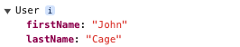

## 3. 常用方法

### 3.1 plainToInstance（~~plainToClass~~）

> 将一个普通 js 对象转换为指定类的实例；第一个参数为要转换成的类定义；第二个参数是一个普通对象或者是对象数组；第三个参数为可选的转换选项

默认情况下，如果对象的属性和类的属性不匹配：

- 对象中有额外的属性（即类定义中没有的属性），转换的结果会包含这些属性
- 对象中缺少类定义中的属性，这些属性将被默认设置为 undefined
- 如果对象中属性和类定义的类型不匹配，会保留对象属性的值

### 3.2 instanceToPlain（~~classToPlain~~）

> 将一个类的实例转换为普通的 js 对象；第一个参数为类的实例；第二个参数为可选的转换选项

举例：

```typescript
import { instanceToPlain } from "class-transformer";

class User {
  firstName: string;
  lastName: string;
  constructor(firstName: string, lastName: string) {
    this.firstName = firstName;
    this.lastName = lastName;
  }
  getName() {
    return this.firstName + " " + this.lastName;
  }
}

const userInstance = new User("John", "Cage");
const userObj = instanceToPlain(userInstance);
console.log(userObj);
```

userObj 打印结果：只包含属性，不包含方法
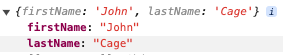

### 3.3 instanceToInstance（~~classToClass~~）

> 将一个类实例转换为一个新的类实例；第一个参数为类的实例；第二个参数为可选的转换选项

举例：

```typescript
import { instanceToInstance } from "class-transformer";

class User {
  firstName: string;
  lastName: string;
  constructor(firstName: string, lastName: string) {
    this.firstName = firstName;
    this.lastName = lastName;
  }
  getName() {
    return this.firstName + " " + this.lastName;
  }
}

const userInstance = new User("John", "Cage");
const userInstanceNew = instanceToInstance(userInstance);
console.log(userInstanceNew);
```

userInstanceNew 打印结果：拥有和 userInstance 相同的属性和方法（用于拷贝）
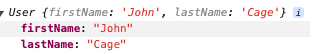

### 3.4 serialize

> 将类实例转换为 JSON 字符串；第一个参数为类的实例；第二个参数为可选的转换选项

即将废弃，不推荐使用，同 `JSON.stringify`

### 3.5 deserialize

> 将 JSON 字符串转换为类实例；第一个参数为要转换成的类定义；第二个参数为一个 JSON 字符串；第三个参数为可选的转换选项

即将废弃，不推荐使用，同 `plainToInstance(cls, JSON.parse(jsonStr))`

### 3.6 转换方法整理

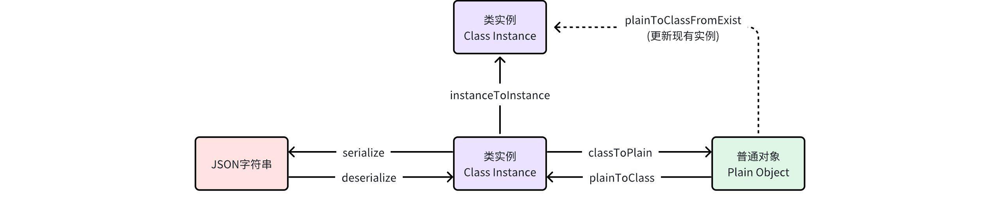

## 4. 装饰器及选项配置

- **装饰器**：
  - 用于自定义控制转换过程中的行为，比如哪些属性需要被包含、应该如何转换等等
- **选项配置**：
  - 转换方法的最后一个参数，允许你定制操作的具体行为。通常与装饰器配合使用

### 4.1 @Expose()

> 控制类的属性是否应该被包含在转换过程中

```typescript
import { Expose, plainToInstance } from "class-transformer";

class User {
  // 没有被 Expose 标记
  id: number;
  // 无参数，标记该属性在转换过程中被包含
  @Expose()
  firstName: string;
  // 只有当指定 groups 中包含“admin”时才会包含该属性
  @Expose({ groups: ["admin"] })
  lastName: string;
  constructor(id: number, firstName: string, lastName: string) {
    this.id = id;
    this.firstName = firstName;
    this.lastName = lastName;
  }
}

const userObj = {
  id: 123,
  firstName: "John",
  lastName: "Cage",
  extraProperty: 123,
};

// excludeExtraneousValues 表示只包含 Expose 标识的属性，会过滤掉对象中 extraProperty 属性
// groups 与 lastName 中定义的相同，返回的类中会包含 password 属性
const userInstance = plainToInstance(User, userObj, {
  excludeExtraneousValues: true,
  groups: ["admin"],
});
```

userInstance 返回结果：
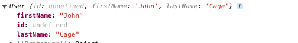

### 4.2 @Exclude()

> 用于标记属性来在转换后排除它们

```typescript
import { Exclude, plainToInstance } from "class-transformer";

class User {
  id: number;
  @Exclude()
  firstName: string;
  // 只有转换为对象时会排除
  @Exclude({ toPlainOnly: true })
  lastName: string;
  constructor(id: number, firstName: string, lastName: string) {
    this.id = id;
    this.firstName = firstName;
    this.lastName = lastName;
  }
}

const userObj = {
  id: 123,
  firstName: "John",
  lastName: "Cage",
};

const userInstance = plainToInstance(User, userObj);
```

userInstance 输出结果：
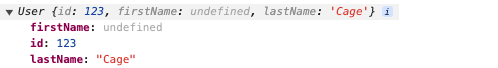

### 4.3 @Transform()

> 自定义一个函数来转换值，用来指定如何处理这个属性的值

```typescript
import { Transfrom, plainToInstance } from "class-transformer";

class User {
  firstName: string;
  @Transform((obj) => {
    return obj.value + "123";
  })
  lastName: string;

  constructor(firstName: string, lastName: string) {
    this.firstName = firstName;
    this.lastName = lastName;
  }
}
const userObj = {
  firstName: "John",
  lastName: "Cage",
};
const userInstance = plainToInstance(User, userObj);
```

userInstance 输出结果：
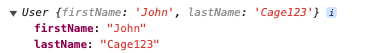

@Transform 中转换函数接收的对象参数，包括以下属性：

- key：当前属性的名称
- obj：包含当前属性的整个对象
- options：当前操作的选项配置
- type： 转换操作类型
- value：当前属性的值

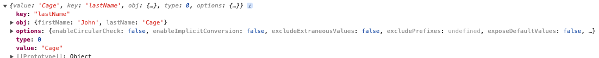

### 4.4 @Type()

> 指定类的属性在转换时应该的目标类型，主要用于复杂类型的转换场景

```typescript
import { Transfrom, Type, plainToInstance } from "class-transformer";

class Address {
  street: string;
  @Transform(({ value }) => {
    return value.toUpperCase();
  })
  city: string;
  constructor(street: string, city: string) {
    this.street = street;
    this.city = city;
  }
}

// 用户类，包含几个类型化的属性
class User {
  id: number;
  @Type(() => Address) // 用于自定义 Address 类的属性
  address: Address;
  constructor(id: number, address: any) {
    this.id = id;
    this.address = address;
  }
}

const userObj = {
  id: 1,
  address: {
    street: "123 Main St",
    city: "shanghai",
  },
};

const userInstance = plainToInstance(User, userObj);
```

userInstane 输出结果：
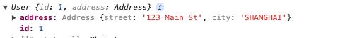
如果不增加 `@Type` 装饰器则会输出：
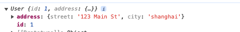

## 5. nest 项目中使用 class-transformer

- 场景 1：
  - service 中使用，处理接口返回的数据，比如枚举映射、时间格式处理等
  - class 的定义放到 entity 中
- 场景 2：
  - service 中使用，处理接口需要的参数，比如补充参数默认值等
  - class 的定义放到 dto 中

## 6. 配合 class-validator

### 6.1 什么是 class-validator

> 文档：https://github.com/typestack/class-validator

class-validator 可以为类的属性添加校验，确保类实例的属性值满足特定约束。一般配合 class-transformer 使用

### 6.2 使用场景

Controller 层，定义 Dto，代表这个 post 请求传入的数据结构。虽然 User 类定义了每个属性的类型，但其实是可以传入任意类型的，比如 id 传入 String 类型也是不会有任何报错

```typescript
import { Body, Controller, Post } from "@nestjs/common";

class UserDto {
  id: number;
  email: string;
  constructor(id: number, email: string) {
    this.id = id;
    this.email = email;
  }
}

@Controller("/query")
export class UserController {
  @Post("/userInfo")
  queryUserInfo(@Body() userDto: UserDto): string {
    const response = `User Info - ID: ${userDto.id}, Email: ${userDto.email}`;
    return response;
  }
}
```

通过 class-validator 对数据类型进行校验

```typescript
import { Body, Controller, Post } from "@nestjs/common";
import { plainToInstance } from "class-transformer";
import { IsNumber, IsEmail, validate } from "class-validator";

class UserDto {
  @IsNumber()
  id: number;
  @IsEmail()
  email: string;
  constructor(id: number, email: string) {
    this.id = id;
    this.email = email;
  }
}

@Controller("/query")
export class UserController {
  @Post("/userInfo")
  async queryUserInfo(@Body() userDto: UserDto): string {
    const userInstance = plainToInstance(UserDto, userDto);
    const errors = await validate(userInstance);
    if (errors.length > 0) {
      // 如果有验证错误，抛出 HttpException 异常
      throw new HttpException(
        {
          status: HttpStatus.BAD_REQUEST,
          error: "Validation failed",
          message: errors.map((error) => error.constraints),
        },
        HttpStatus.BAD_REQUEST
      );
    }

    // 如果验证成功，继续处理请求
    const response = `User Info - ID: ${userDto.id}, Email: ${userDto.email}`;
    return response;
  }
}
```

errros 返回内容：
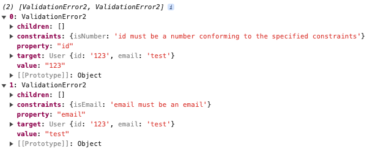

### 6.3 结合 ValidationPipe 管道

ValidationPipie 是@nestjs/common 提供的，能够利用 class-validator 提供的装饰器进行自动验证，并且使用 class-transformer 来转换请求体中的普通对象为 DTO 的类实例。使得在 Nest 中处理和验证传入数据变得简单且一致
使用 ValidationPipe 改写 queryUserInfo 方法：

```typescript
import {
  Body,
  ValidationPipe,
  Controller,
  Post,
  UsePipes,
} from "@nestjs/common";
import { IsNumber, IsEmail } from "class-validator";

class UserDto {
  @IsNumber()
  id: number;
  @IsEmail()
  email: string;
  constructor(id: number, email: string) {
    this.id = id;
    this.email = email;
  }
}

@Controller("/query")
export class UserController {
  @Post("/userInfo")
  @UsePipes(new ValidationPipe())
  async queryUserInfo(@Body() userDto: UserDto): string {
    // 如果验证成功，继续处理请求
    const response = `User Info - ID: ${userDto.id}, Email: ${userDto.email}`;
    return response;
  }
}
```

### 6.4 常用装饰器

> 更多：https://github.com/typestack/class-validator

<table border="solid" cellspacing="0">
    <thead>
    <tr>
        <th>类型</th>
        <th>装饰器</th>
        <th>含义</th>
    </tr>
    </thead>
    <tbody>
    <tr>
        <td rowspan="3">通用验证</td>
        <td>@IsEmpty()</td>
        <td>检查给定值是否为空(=== ‘’, === null, === undefined)</td>
    </tr>
    <tr>
        <td>@Equals(comparison: any)</td>
        <td>检查值是否相等（“===”）</td>
    </tr>
    <tr>
        <td>@IsIn(values: any[])</td>
        <td>检查值是否在允许值的数组中</td>
    </tr>
    <tr>
        <td rowspan="3">类型验证</td>
        <td>@IsInt()</td>
        <td>是否为整数</td>
    </tr>
    <tr>
        <td>@IsDate()</td>
        <td>是否为日期</td>
    </tr>
    <tr>
        <td>@IsString()</td>
        <td>是否为字符串</td>
    </tr>
    <tr>
        <td rowspan="2">数字验证</td>
        <td>@IsPositive()</td>
        <td>是否是大于 0 的整数</td>
    </tr>
    <tr>
        <td>@Min(min: number)td></td>
        <td>是否大于等于给定的数字</td>
    </tr>
    <tr>
        <td rowspan="2">字符串验证</td>
        <td>@Contains(seed: string)</td>
        <td>是否包含指定的子字符串</td>
    </tr>
    <tr>
        <td>@IsBase64()</td>
        <td>是否是 base64 编码</td>
    </tr>
    </tbody>
</table>
