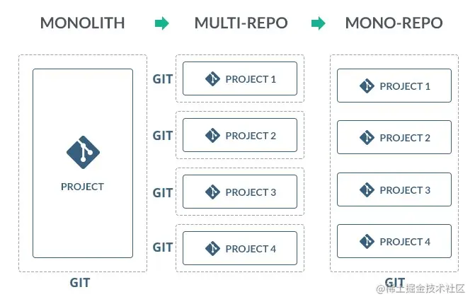
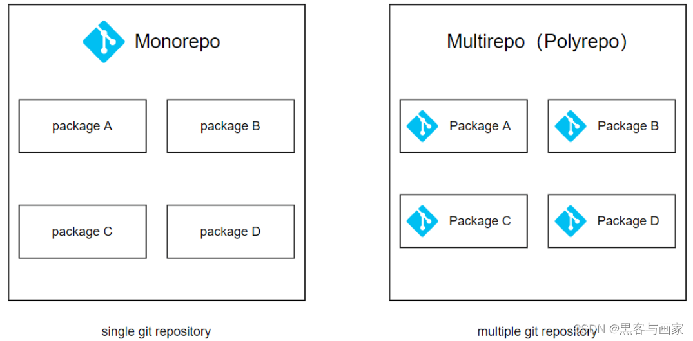
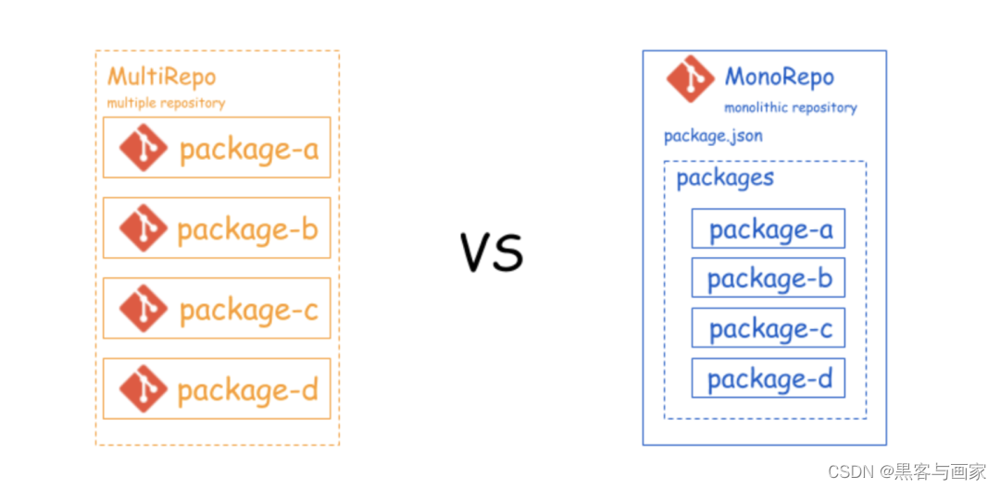

# pnpm+monorepo 项目

## 引言

在我有限的开发经历中，并接触过 monorepo 管理项目，从未听说。然而，近期公司项目结构改造，monorepo 得到一致好评。如今许多开源项目都采纳了 Monorepo 方式，对于不熟悉它的开发者来说，阅读和理解这些项目的源码可能会相对困难。所以，我近期简单研究了一下使用 pnpm 搭建 Monorepo 项目的方法。

## 简介

### pnpm

pnpm 是一个快速、节省磁盘空间的包管理工具。它通过硬链接在 node_modules 中共享依赖,避免了重复安装同一个包的多个版本,这大大节省了磁盘空间。

### monorepo

Monorepo 是将多个包(package)统一放置在一个仓库(repo)进行管理的方式。这种方式可以更好地管理包之间的依赖与兼容,统一的提交日志也更容易追踪问题。许多大公司如 Google、Facebook 都采用 Monorepo 方式管理的多个前端包。

## 仓库架构

### Monolithic

单体应用架构 。初期业务系统不复杂时，通常只用一个仓库来管理项目，这时我们会以合理划分目录，提取公共组件的方式来解决问题。由文件的层级划分和引入，来进行页面、组件和工具方法等的管理。此时其整个依赖和工作流都是统一的、单向的。当业务复杂度的提升，项目的复杂性增长，由此就会导致一系列的问题：比如项目编译速度变慢（调试成本变大）、部署效率/频率低（非业务开发耗时增加）、单场景下加载内容冗余等等，技术债务会越积越多。

### MultiRepo

多仓多模块管理

### Monorepo

单仓多模块管理，是一种将多个项目代码存储在一个仓库里（单仓多包）的软件开发策略，也就是单个仓库可包含许多相关但独立的项目，可以由同一个团队或多个团队管理。

- 子项目间可独立运行、共享代码，但没有强依赖，剥离出来照样能运行，只是引入方式从 workspace 转变成 Npm，遵循高内聚，低耦合理念







### Multirepo 和 Monorepo 特点

- Muitirepo

  1. 简单明朗
  2. 灵活
  3. 缺点：
     项目之间难以建立联系
     将模块打包为 npm 包，发布到 npm 上
     挂载到全局变量 window
     直接 copy 一份代码

- Monorepo

  1. 良好的代码共享
  2. 新建项目方便
  3. 开发便利
  4. 缺点：
     巨石项目下载、
     编译慢；
     对项目打包构建难度较大

## 缘起

### 为什么需要 Monorepo？

每件新事物的出现必然是为了补充旧事物的不足。当我们用 MultiRepo 架构不断迭代时，达到一定数据量级时会出现以下问题：
大型项目被割裂成多个 Git 仓库：

- 需要 git clone 多个仓库，并运行不同的命令来共同跑起完整的服务（典型：前端+后端+ SDK 项目分离）。

代码复用率严重下降：

- 公共函数或组件只能通过 duplicate 或 npm 方式共享。
- 当某个公用组件（对应 npm 包）修改时，需要人为确认该 NPM 包所依赖的各个项目升级情况

相同类型项目却有着千奇百怪的开发工具和周边库：

- jest、java 的版本不一致，导致 API 写法不一
- React 组件库以及状态管理库不一致，新人接手学习成本提高
- ESlint 、CommitLint、prettier 配置 和 Changelogs 生成规则不一致

新建项目时有额外心智负担：

- 如果有需要，可能要复制多套 CI 文件
- 出于好奇，可能会找更符合当下的 cli 来新建项目（耗时且可能有坑）
- 完美主义的人可能会配置更多的 eslint、prettier（耗时）
- 需要在其他项目中 Readme 中添加新项目的 git 地址，在表面上报保持 Connection

公司前端项目大大小小也有数十个了，每个项目都是独立的一个仓库地址，典型的 Mutiplerepo
随着项目增多，发现每次起新项目都要重新创建模板然后定义一些项目框架然后在着手开发。
痛点：
每次新项目都需要重新搭建工程
解决：
用 cli 做了一键生成项目脚手架解放了一部分劳动力，这个是基于仓库的 template 模板工程
又来一个痛点：
很多开发过程中的关于基础建设的 idea 都被封存在各自的项目里，导致 template 工程没有人持续维护，基本维持刚开始的样子，导致脚手架逐渐落后。
解决：
Monorepo 管理方案，可以很大程度改善以上的问题
也方便做很多代码风格质量以及 ci 相关流程的统一管理，决定也搭建一套自己的 Monorepo 工程模板

#### Monorepo 的优势

优点：

1. 所有源码在一个仓库内，分支管理与单体应用一样简单
2. 公共依赖显示更清晰，更方便统一公共模块版本
3. 统一的配置方案，统一的构建策略
4. 并行构建，执行效率提升
5. 保留 multirepo 的主要优势

- 代码复用
- 模块独立管理
- 分工明确，业务场景独立
- 代码耦合度降低
- 项目引入时，除去非必要组件代码

6. CR、MR 由一个仓库发布，阅读和处理十分方便

缺点：

1. git 服务根据目录进行访问权限划分，仓库内全部代码开发给所有开发成员
2. 当代码规模大到一定程度时，git 的操作速度达到瓶颈，影响 git 操作体验

#### 使用者

据不完全统计，现 Github 上有很多项目都是类 Monorepo：

- Vue3
- Vite
- Sentry
- Pnpm
- Rushstack
- Rxjs
- React
- ...etc

#### 什么时候用 Monorepo

> 当你意识你的仓库现存在打包、发版缺陷或需要某些硬编码脚本时，可能你就需要 Monorepo 来工程化管理所有子项目。

### 为什么使用 pnpm？

pnpm 的特点：快速、高效利用磁盘空间。
它将 workspace 的所有依赖都下载到`.pnpm`目录下，然后再根据各个 package 的情况，在其目录下通过软连接方式将依赖添加进来，这样所有的依赖只需要下载一次，那么不仅快，而且磁盘体积也小
而且它原生 cli 支持基本的 workspace 管理，这也是我对比下来选择 pnpm 的原因
学习成本低、简单好用

## 如何从零构建 Monorepo

pnpm + workspace

### 安装 pnpm

```bash
npm install -g pnpm

# 查看对应的版本
pnpm -v
```

### 初始化项目

```sh
pnpm init
```

### 配置 monorepo

在根目录下创建`pnpm-workspace.yaml`文件，内容如下：
pnpm 工作区包含/排除的目录
放在根目录下

```json
packages:
  # all packages in direct subdirs of packages/
   # 公用依赖
  - "pl-core/**"
  # 各个项目
  - "projects/**"

  # exclude packages that are inside test directories
  - '!**/A/**'
```

### 结构目录

依赖独自分开暴露

```js
├── libs
│   ├── core
│   │   ├── src  // 含有一些apis
│   │   └── package.json
│   │   └── index.js // 对外暴露
│   ├── ui
│   │   ├── src // 一些ui组件
│   │   ├── package.json
│   │   └── index.js // 对外暴露
│   ├── util
│   │   ├── src // 一些工具类
│   │   ├── package.json
│   │   └── index.js // 对外暴露
├── projects
│   ├── p1  //实际的项目
│   │   ├── src
│   │   └── package.json
│   ├── p2  //实际的项目
│   │   ├── src
│   │   └── package.json
├── package.json //全局第三方公用包管理，如 axios element-ui
├── pnpm-lock.yaml
└── pnpm-workspace.yaml // 配置 项目+依赖的公用模块
```

依赖集中式对外暴露

```js
├── pl-core
│   ├── src // 含有一些 apis utils components
│   ├── package.json  // 默认暴露出口 index.js
│   ├── index.js  // 对外暴露
├── projects  //实际的项目
│   ├── p1
│   │   ├── src
│   │   └── package.json
│   ├── p2
│   │   ├── src
│   │   └── package.json
├── package.json //全局第三方公用包管理，如axios element-ui
├── pnpm-lock.yaml
└── pnpm-workspace.yaml // 配置 项目+依赖的公用模块
```

### pnpm 常用指令

```sh
# 初始化项目 生成 package.json
pnpm init
# 添加依赖包
pnpm add [package.json的name]
# pnpm 查看源
pnpm config get registry
# 切换淘宝源
pnpm config set registry https://registry.npmmirror.com
# 全局依赖(供全局使用)
pnpm i element-plus -w
# 移除依赖
pnpm uninstall @libs/ui
```

```bash
# 安装依赖
pnpm i  /  pnpm install

# 单独安装
pnpm add xxx

# 删除依赖
pnpm remove xxx

# 运行项目
pnpm dev  / pnpm run dev

# 安装依赖到根目录
pnpm add xxx -w

# 安装依赖到packages中的包
pnpm add xxx -r

# 安装到某个包
pnpm add xxx --filter A
```

## 安装依赖

```sh
pnpm install
```

1、尽量不要在根目录 package.json 中的 dependencies 安装依赖，在各自的包里面安装，根目录主要是提供给工程配置用的！
2、packages 中包的依赖尽量保持一致

### 添加依赖

使用 pnpm 的 pnpm add 命令在子项目中添加依赖：

```sh
cd packages/project-a
pnpm add lodash
```

### 跨项目依赖

- 方法 1：

  如果 `project-a` 依赖于 `project-b`，可以直接执行命令操作：

  ```sh
  cd packages/project-a
  pnpm add project-b
  ```

- 方法二：

  或者直接编辑 `project-a` 项目的 `package.json`

  ```json
  {
    "name": "project-a",
    // ...
    "dependencies": {
      // 添加 project-b , 指定为 `workspace:*`
      "project-b": "workspace:*",
      "project-c": "workspace:*"
    }
  }
  ```

  添加好后，执行 `pnpm install` 即可。

  ```sh
  pnpm i
  ```

### 根目录

技术选型后全局安装公用依赖

```sh
# 技术选型如 vue3 + vite + element-plus
# 根目录执行指令
pnpm i element-plus axios  -w
```

### 子目录

`cd libs/core && pnpm i`?
**No No No!**
pnpm 早就帮我们考虑到了，直接根目录就可以指定安装子包的依赖
`-F, --filter <package_name>` 可以指定目标 package 执行任务

```sh
pnpm i -F core
```

那问题来了，如果多个包都配置好了依赖，想要一键安装怎么办，一个一个包去这样做吗？
还是说`pnpm i -F core ui util`
三个还好说，三十个呢？
这个时候我们需要了解一下 `-r, --recursive` 命令可以做到一键递归安装

```sh
pnpm i -r
```

## 核心依赖

### project 关联 libs

安装好依赖之后，我们可以简单写一点代码到 core 包里面，比如：

```ts
// index.ts
export function add(a: number, b: number) {
  return a + b;
}
```

然后我们在 demo 工程里执行 `pnpm i @libs/core -F demo`
我们会发现 demo 的 pkg.json 多了这个

```json
{
  "dependencies": {
    "@libs/core": "workspace:*" // * 代表默认同步最新版本，正常安装完应该是 ^1.0.0
  }
}
```

我们尝试在文件中导入 core 中 add 方法

```js
import { add } from "@libs/core";

console.log(add(1, 2));
```

我们就已经成功在项目中引入 libs/core 了

#### 创建 pl-core 核心模块

- 创建以及初始化

  ```bash
  npm init vue@latest
  npm i
  npm run dev
  ```

- 在 src 编写 apis utils components

  ```js
  // /src/components/Count/index.vue
  <template>
  <p>count:{{ count }}</p>
  <button @click="count++">点击我++</button>
  </template>
  <script setup>
  import { ref } from "vue";
  const count = ref(0);
  </script>

  // /src/utils/sum.js
  export const sum = (...rest) => rest.reduce((pre, cur) => pre + cur, 0)
  ```

- 新建 index.js 对外暴露 apis utils components

  ```js
  // pl-core/index.js

  import Count from "./src/components/Count/index.vue";
  export { sum } from "./src/utils/sum";
  export { Count };
  ```

#### 新建 projects 目录，用来存放各个项目

1. 创建项目（项目技术选型最好跟 pl-core 目录下的选型一样，譬如 axios 版本 vue 版本 element 版本）

   ```sh
   npm init vue@latest
   npm i
   npm run dev
   ```

2. 切换到 projects 对应的项目目录下，添加并安装 pl-core 重要

   ```sh
   # pnpm add [pl-core/package.json 的 name]

   # 譬如
   pnpm add pl-core
   ```

3. 安装成功后，使用依赖

   ```vue
   <template>
     <div>
       <h3>p1</h3>
       <Count />
     </div>
   </template>

   <script setup>
   import { Count, sum } from "pl-core";
   console.log("sum", sum(1, 2, 3));
   </script>
   ```

4. 针对 pl-core 导出组件时第三方样式丢失的问题,可以在引入的项目里添加对应的样式

## 根目录执行命令

除了一些全局生效的命令之外，像我们可以按需求配置执行 project 的启动和打包

```js
// root pkg.json
"script": {
    "dev:demo": "pnpm -F demo dev",
    "build:demo": "pnpm -F demo build"
}

// demo pkg.json
"scripts": {
    "dev": "vite",
    "build": "vue-tsc --noEmit && vite build",
    "preview": "vite preview"
}
```

```js
"scripts": {
    "run:p1": "pnpm -F \"p1\" -r dev", //运行 projects/p1 项目中的package.json 对应的 dev 指令
    "run:p2": "pnpm -F \"p2\" -r dev",
    "build:p1": "pnpm -F \"p1\" -r build",
    "build:p2": "pnpm -F \"p2\" -r build"
  },
```

```json
  "scripts": {
    "dev": "pnpm -r --filter @project/* run dev",
    "dev:pro1": "pnpm -r --filter @project/pro1 run dev",
    "dev:pro2": "pnpm -r --filter @project/pro2 run dev",
    "dev:pro3": "pnpm -r --filter @project/pro3 run dev",
    "build:test": "pnpm -r --filter @project/* run build:test",
    "build:test-pro1": "pnpm -r --filter @project/pro1 run build:test",
    "build:test-pro2": "pnpm -r --filter @project/pro2 run build:test",
    "build:test-pro3": "pnpm -r --filter @project/pro3 run build:test",
    "build": "pnpm -r --filter @project/* run build",
    "build:pro1": "pnpm -r --filter @project/pro1 run build",
    "build:pro2": "pnpm -r --filter @project/pro2 run build",
    "build:pro3": "pnpm -r --filter @project/pro3 run build",
    "format": "prettier --write --cache .",
    "lint": "eslint --cache --fix",
    "lintcss": "stylelint --cache --fix --custom-syntax postcss-scss",
    "preinstall": "npx only-allow pnpm",
    "prepare": "husky install",
    "docs:dev": "vitepress dev docs",
    "docs:build": "vitepress build docs",
    "docs:preview": "vitepress preview docs"
  }
```

### 运行项目

```sh
pnpm run dev
```

### 发布项目

```sh
pnpm run build
```

## 参考文档

- [pnpm](https://pnpm.io/)
- [pnpm-workspace](https://pnpm.io/zh/pnpm-workspace)
- [monorepo](https://pnpm.io/zh/workspaces)
